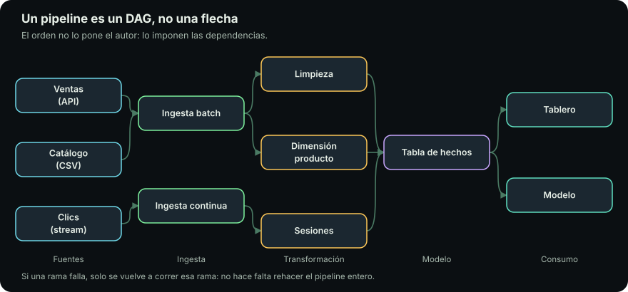
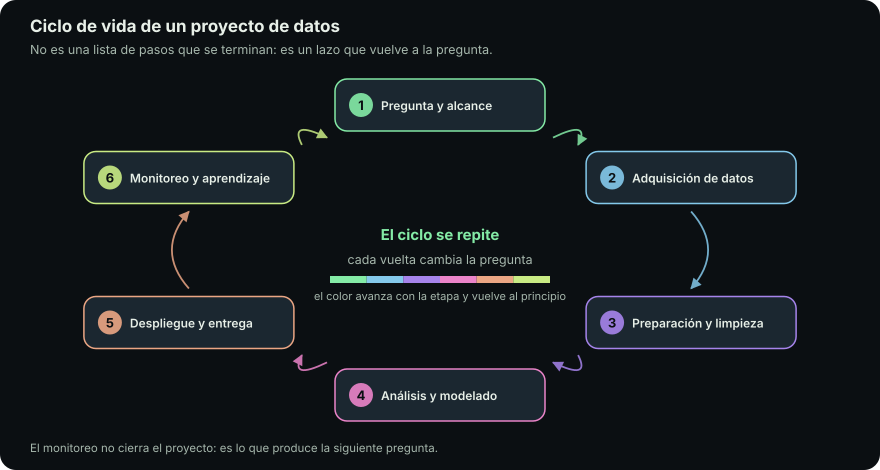

# Pipeline de datos

::: figure {#ilus-portada title="Un pipeline es lo que vuelve a correr mañana"}

:::

## En corto

- **Un pipeline vuelve a correr mañana, sin ti**, y da el mismo resultado o falla de forma que se note.
- Su forma no es una flecha: es un **DAG**, un grafo que se bifurca y reconverge.
- Las cuatro etapas —ETL, EDA, análisis, producción— **no son una secuencia lineal**.
- El **sitio de este curso es un pipeline** real, y lo puedes inspeccionar entero.
- Cada módulo del semestre existe porque alguna parte del pipeline lo exige.

## El notebook del viernes

Un viernes alguien lee tres archivos, los cruza y produce un número. Es correcto. Lo pega en una presentación y se va a casa.

El lunes le piden el mismo número con datos nuevos, y ahí empieza el problema:

- el archivo de esta semana trae **un dato más**;
- la ruta apuntaba **al Escritorio de una laptop concreta**;
- en la celda 14 hay un **filtro a mano** que nadie recuerda por qué está.

El notebook no estaba mal. Simplemente no era un pipeline.

> [!NOTE]
> La diferencia no es de tamaño ni de herramientas: **un pipeline vuelve a correr mañana, sin ti, y da el mismo resultado o falla de forma que se note.** Etapas, formatos, contratos y orquestación existen para sostener esa frase.

## Vocabulario mínimo

Cuatro palabras que el resto de la unidad da por sabidas.

::: definition {#def-tabla title="Tabla, fila, columna"}
Una tabla guarda datos en una rejilla: cada **fila** es una cosa registrada —una
venta, un cliente— y cada **columna** es un dato de esa cosa —la fecha, el monto—.

Si una columna guarda dos datos distintos, o una fila mezcla dos cosas, todo lo
que venga después tiene que adivinar.
:::

::: definition {#def-llave title="Llave"}
Una llave es la columna —o el conjunto de columnas— cuyo valor identifica sin
ambigüedad a una fila: el número de pedido, la matrícula.

Sin una llave de verdad única no se puede saber si dos filas son la misma cosa
registrada dos veces o dos cosas distintas.
:::

::: definition {#def-join title="Join"}
Un `join` pega dos tablas emparejando las filas que comparten el mismo valor de
llave: los pedidos con los datos del cliente que los hizo.

Sin `join`, cada tabla queda aislada: cruzar los pedidos con sus clientes a
mano, fila por fila, es lo único que queda.
:::

::: definition {#def-corrida title="Corrida"}
Una corrida es una ejecución completa del proceso, de principio a fin, sobre un
período de datos: la corrida del martes.

Sin distinguir una corrida de otra, no se puede saber cuál produjo qué
resultado, ni repetir solo la que falló.
:::

## El caso de esta unidad

Toda la unidad usa el mismo ejemplo: **las ventas de una cafetería con tres
sucursales**, que llegan cada noche en `ventas.csv`.

| pedido | fecha | sucursal | producto | monto |
|---|---|---|---|---|
| 1001 | 2026-08-04 | CDMX | Capuchino | 62 |
| 1002 | 04/08/2026 | D.F. | Latte | 68 |
| 1003 | 2026-08-04 | Santa Fe | Americano | 0 |
| 1004 | 2026-08-05 | CDMX | Capuchino | 62 |
| 1005 | 05/08/2026 | Polanco | Té | 45 |

Se ven tres problemas: **la fecha viene en dos formatos**,
**«CDMX» y «D.F.» son la misma sucursal escrita de dos maneras**, y **hay un
pedido de monto cero**. Cada página siguiente se hace cargo de uno.

La llave es `pedido` — ver @def-llave.

## No es una flecha, es un grafo

::: figure {#dag title="El pipeline como grafo de dependencias"}

:::

Casi todo diagrama de pipeline es una fila de cajas con flechas de izquierda a derecha. Es una **mentira cómoda**.

Un pipeline real **se bifurca** —de una extracción salen tres transformaciones independientes— y **vuelve a converger**: el reporte final necesita las tres.

Esa forma es un **DAG**, *directed acyclic graph*. **Dirigido**, porque las flechas tienen sentido: la carga depende de la transformación, no al revés. **Acíclico**, porque si A depende de B y B de A, nada puede empezar.

### Qué se deriva de la forma

| La forma te dice | Por qué importa |
|---|---|
| Qué corre en paralelo | Dos ramas independientes se ejecutan a la vez: la diferencia entre veinte minutos y tres horas |
| Qué se cae cuando algo se cae | Lo que está aguas abajo del nodo caído queda inválido; lo de otra rama, no |
| Por dónde volver a empezar | Al corregir un error se recorre solo el subgrafo afectado |

Cuando digamos «pipeline», la imagen mental correcta es @dag, no una tubería.

## El sitio de este curso es un pipeline

No es una metáfora. El sitio que lees se produce con un pipeline que puedes inspeccionar entero en [https://github.com/raya-lucaria/fdd_o26](https://github.com/raya-lucaria/fdd_o26).

La **fuente** son archivos de texto —Markdown para las páginas, YAML para tareas y calendario— y pasa por tres etapas:

```bash
raya validate .   # el contrato: ¿la fuente cumple las reglas?
raya build .      # la transformación: fuente -> artifact/
raya preview .    # el consumo: ver el producto antes de publicarlo
```

### Contrato, transformación, orquestación

**`raya validate` es un contrato de datos.** Exige un `id` en kebab-case y único, enlaces internos que resuelvan, índice en cada directorio. Si algo no cumple, no hay sitio a medias: falla y dice dónde.

**`raya build` es la transformación, y es repetible.** Misma fuente, mismo
`artifact/`, hoy y en tres meses. Por eso `artifact/` no se versiona: es
regenerable.

**El despliegue lo orquesta GitHub Actions**, un DAG donde la publicación declara `needs: checks`. Esa línea convierte una prueba en compuerta real; sin ella el sitio se publica aunque la suite falle.

## Las cuatro etapas, y la advertencia

::: figure {#ciclo title="El ciclo de vida de un proyecto de datos"}

:::

| Etapa | Qué produce | Pregunta que responde |
|---|---|---|
| ETL / ELT | Datos disponibles y en forma utilizable | ¿Dónde están los datos y cómo los muevo? |
| EDA | Entendimiento de los datos y del negocio | ¿El proyecto es siquiera viable? |
| Entrenamiento o análisis | Un modelo, un reporte, una respuesta | ¿Qué se puede concluir o predecir? |
| Producción | Un proceso que corre solo | ¿Cómo sobrevive esto sin mí? |

### La advertencia importa más que la tabla

**Esto no es una secuencia lineal.** El EDA descubre columnas que faltan y devuelve a la extracción. Producción detecta degradación y devuelve al principio.

Las flechas de retorno de @ciclo son **el modo normal de operación**, no signos de mal trabajo. Tratar un proceso cíclico como lineal tiene un costo predecible: se estima sumando etapas y se llega tarde, porque nadie contó las vueltas.

> [!TIP]
> Desconfía de toda taxonomía nítida, incluida esta. La pregunta útil no es «¿esto es EDA o transformación?», sino **«¿qué falla estoy tratando de evitar aquí?»**.

## Por qué esta unidad es el mapa del semestre

Cada módulo del curso existe porque alguna parte del pipeline lo exige: la
terminal porque los datos llegan como archivos en máquinas ajenas, Git porque
las transformaciones son código que hay que auditar, Docker porque tiene que
correr igual aquí y allá. El reparto completo está en [[el-curso|El curso]].

Si te preguntas por qué estamos aprendiendo algo, la respuesta casi siempre
está en esta página.

## Recorrido

| Página | De qué trata |
|---|---|
| [[el-viaje-de-los-datos]] | Dónde viven los datos: lake, base de datos, warehouse o lakehouse |
| [[etl-y-elt]] | Por qué el orden de las letras se invirtió |
| [[eda]] | El exploratorio como control de viabilidad, y las seis dimensiones de calidad |
| [[cuando-se-rompe]] | Idempotencia, contratos, tiempo, orquestación, linaje y costo |
| [[posiciones]] | Quién es responsable de qué |
| [[presentacion-pipeline]] | El material histórico que esta unidad reemplaza |
| [[glosario]] | Las catorce palabras que la unidad define, en un solo lugar |

## Qué te llevas

- Un pipeline se define por **volver a correr mañana sin ti**, no por su tamaño.
- Su forma es un **grafo**: de ahí salen el paralelismo, la propagación de fallas y el punto de reinicio.
- El proceso es **cíclico**; planearlo como lineal es la forma más común de llegar tarde.

**Una acción:** abre el repositorio del curso, busca el flujo de despliegue y localiza la línea `needs:`. Ahí está el DAG.
