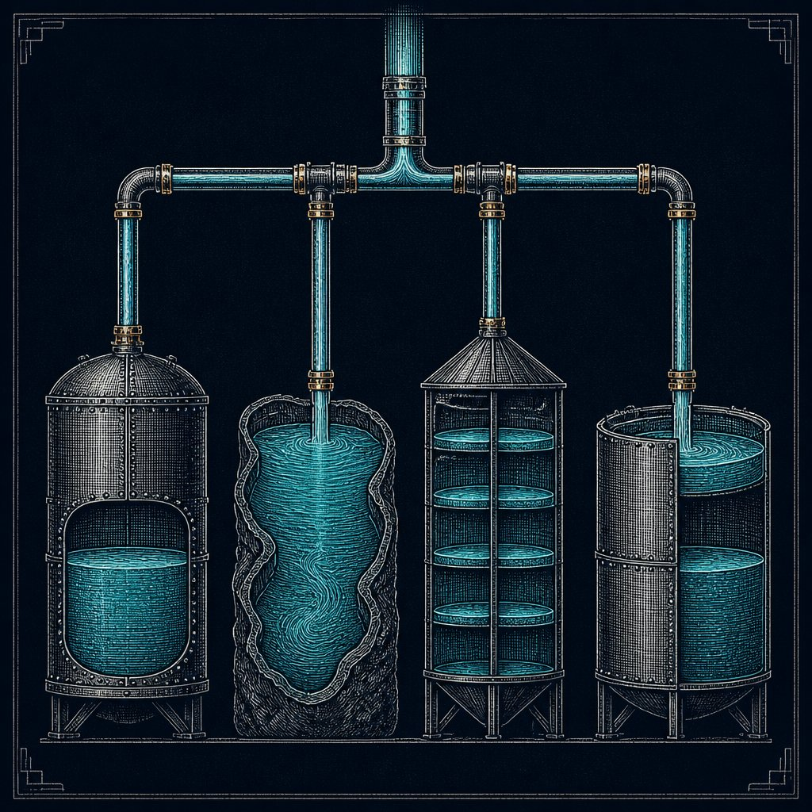
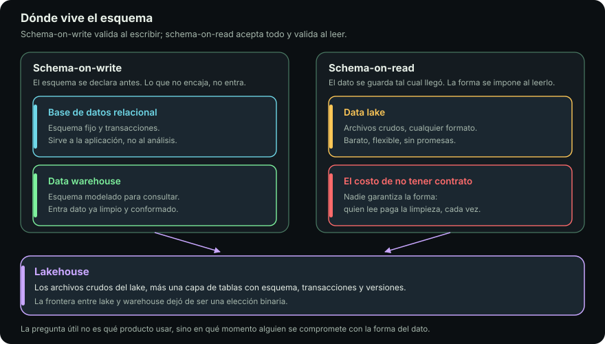

# El viaje de los datos

::: figure {#ilus-viaje title="Cada escala guarda el mismo caudal de otra manera"}

:::

## En corto

- Toda la decisión cabe en una pregunta: **¿se le exige forma al dato al escribirlo o al leerlo?**
- **Schema-on-write** falla temprano. **Schema-on-read** falla tarde, con años de datos heterogéneos ya dentro.
- Cuatro escalas: base de datos operacional, data lake, data warehouse y **lakehouse**.
- El lakehouse borra la elección binaria: esquema como **metadatos versionados sobre archivos**.
- Dos distinciones que ahorran discusiones: **pre-procesamiento contra procesamiento**, **algoritmo contra modelo**.

## La falla que abre el tema

Llega un archivo nuevo de un proveedor. Trae una columna extra y una fecha en otro formato. Hay dos comportamientos posibles, y ambos existen.

**El sistema lo rechaza.** «La columna `region_code` no está declarada, la carga falla.» Nada entra roto, pero el dato de hoy no existe hasta que alguien arregle el esquema, y ese alguien quizá esté de vacaciones.

**El sistema lo acepta tal cual.** El problema aparece tres semanas después, cuando una consulta promedia una columna donde conviven `"2026-01-05"` y `"05/01/2026"`.

Ninguno es correcto en abstracto. Son dos ubicaciones del mismo costo: **schema-on-write** paga por adelantado; **schema-on-read** difiere el pago.

> [!NOTE]
> Casi todas las decisiones de arquitectura de datos son alguna versión de esta.

## Las cuatro escalas

::: figure {#schema title="Schema-on-write contra schema-on-read: base de datos, lake, warehouse y lakehouse"}

:::

| | Base de datos | Data lake | Data warehouse | Lakehouse |
|---|---|---|---|---|
| Esquema | Al escribir | Al leer | Al escribir | Al escribir, versionado |
| Qué guarda | Estado actual | Crudo, cualquier formato | Estructurado e histórico | Crudo y curado en el mismo lugar |
| Optimizado para | Muchas operaciones pequeñas | Guardar barato | Consultas analíticas | Ambas cosas |
| Falla típica | Se satura con consultas analíticas | Se vuelve un pantano | Duplica el dato y se atrasa | Complejidad operativa mayor |
| Ejemplos | PostgreSQL, MySQL | S3, Google Cloud Storage | Snowflake, BigQuery, Redshift | Delta Lake, Iceberg, Hudi |

### Base de datos operacional

Sostiene una aplicación mientras corre: el carrito, el inventario, el registro de usuarios.

Su límite aparece con el primer análisis: una consulta que recorre tres años de pedidos **compite por recursos con la aplicación** que atiende clientes. No está mal diseñada; está diseñada para otra cosa.

### Data lake

Guarda el dato **en bruto y en su formato original**: CSV, JSON, Parquet, imágenes, logs sin parsear. Su virtud es no obligar a decidir de antemano qué se hará con él. Cuando la pregunta de negocio todavía no existe, **imponer esquema es apostar a ciegas**.

Su riesgo tiene nombre: el **data swamp**. Un lake sin catálogo, metadatos ni gobierno es un disco duro gigante donde nadie sabe qué hay ni si sigue siendo válido.

### Data warehouse

Es una base de datos especializada en análisis: datos limpios, modelados y con historia.

Impone esquema al escribir, pero por otra razón que la base operacional: no para garantizar una transacción, sino para que las consultas sean rápidas y para que **toda la empresa mida lo mismo** al decir «ingreso mensual».

### Lakehouse

Tratar lake y warehouse como elección binaria describe la arquitectura de hace una década. Tener los dos costaba **duplicación**: los mismos datos crudos en el lake y modelados en el warehouse, con una copia en medio que se atrasaba y producía discrepancias entre números que deberían ser el mismo.

El **lakehouse** colapsa la distinción: conserva el almacenamiento barato y abierto del lake, y encima añade lo que hacía útil al warehouse —transacciones, evolución controlada de esquema, viajes en el tiempo—.

La idea central es simple: el esquema deja de ser propiedad del sistema de almacenamiento y pasa a ser **metadatos versionados encima de archivos**.

## Dos distinciones que ahorran discusiones

### Pre-procesamiento contra procesamiento

| | Pre-procesamiento | Procesamiento |
|---|---|---|
| Qué hace | No altera decisiones ni supuestos estadísticos | Sí los altera |
| Ejemplos | Fecha a ISO, normalizar mayúsculas, unir por llave, renombrar columna | Imputar faltantes con la media, quitar atípicos, agregar por semana, recortar una cola |

La regla que se deriva: **si el proceso está diseñado para guardar datos crudos, no metas decisiones estadísticas en él.**

Cuando alguien decide, dentro de la extracción, que los pedidos mayores a cien mil pesos «son errores» y los filtra, el dato deja de ser crudo y **nadie aguas abajo se entera**. Tres meses después, cuando fraude pregunte por los pedidos grandes, no van a existir.

Toda decisión estadística se deja escrita: en el código, en la documentación y en los metadatos. [[cuando-se-rompe|Cuando se rompe]] retoma esto como linaje.

### Algoritmo contra modelo

Un **algoritmo** es el proceso abstracto que se aplicará: una regresión logística, un árbol de decisión, un mecanismo de atención. Existe antes de ver un solo dato. Un **modelo** es ese algoritmo **ya entrenado**, con los parámetros ajustados y congelados. El algoritmo es la receta; el modelo es el pan que salió de esta harina.

La consecuencia práctica: el algoritmo se elige, pero el modelo **se versiona**. Dos modelos del mismo algoritmo entrenados en meses distintos son objetos distintos, y no saber cuál responde en producción es una de las formas más comunes de dar un número inexplicable.

## Hacia adelante

Los datos llegan como **archivos**, en máquinas que no son la tuya. Moverlos e inspeccionarlos sin abrirlos enteros es para lo que existen la terminal y el shell.

La siguiente página, [[etl-y-elt|ETL y ELT]], cuenta cómo se mueven los datos entre estas escalas, y por qué el orden cambió cuando cambió el precio de guardar un terabyte.

## Qué te llevas

- El eje real no es «lake o warehouse», sino **cuándo se le exige forma al dato**.
- El **lakehouse** disuelve esa elección: esquema como metadatos versionados sobre archivos baratos.
- **Un proceso que guarda crudo no toma decisiones estadísticas.** Si las toma, se documentan.
