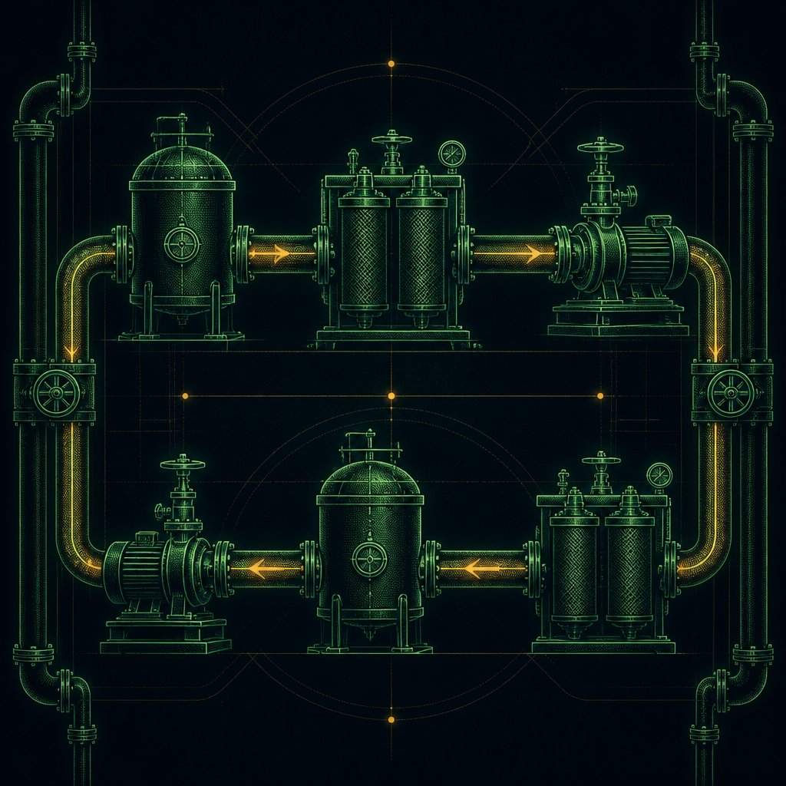
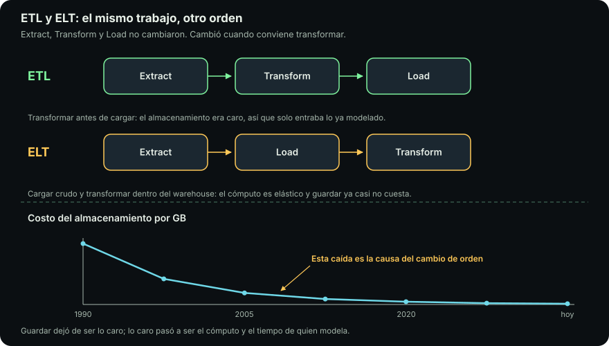
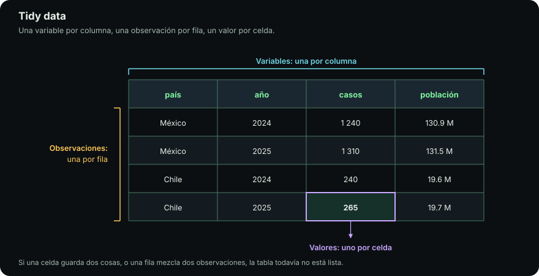

# ETL y ELT

::: figure {#ilus-etl-elt title="Las mismas estaciones, recorridas en orden invertido"}

:::

Tres letras: **E** de *extract*, **T** de *transform*, **L** de *load*. Extraer
los datos de donde estén, transformarlos para que sirvan, cargarlos donde se van
a consumir. Es el proceso más común de toda la ingeniería de datos y el que casi
cualquier curso presenta como *la* forma de hacer las cosas.

Lo interesante no son las tres letras. Es que **su orden cambió**, y que cambió
por razones económicas, no técnicas. Esa historia es lo más útil de esta página,
así que va primero.

## La historia económica del orden

::: figure {#etl-elt title="ETL contra ELT: el mismo trabajo en distinto orden"}

:::

Durante décadas, el almacenamiento fue caro y el cómputo del warehouse fue fijo:
una empresa compraba un servidor con una capacidad determinada y esa capacidad
era la que tenía, de noche y de día, en el pico y en el valle. Bajo esas dos
restricciones, el orden **ETL** era el único razonable. Se extraía el dato, se
transformaba en una máquina intermedia —un servidor de *staging*, más barato— y
se cargaba al warehouse **solo lo que se iba a usar, ya agregado y limpio**.
Nadie iba a pagar por guardar en el sistema caro un dato en bruto que quizá
nunca se consultara, y nadie iba a gastar el cómputo escaso del warehouse en
limpiar cadenas de texto.

Dos cosas cambiaron. El costo por gigabyte de almacenamiento cayó de forma
sostenida durante años, hasta volverse una línea casi despreciable en el
presupuesto de la mayoría de los proyectos. Y el warehouse dejó de ser una
máquina y pasó a ser un servicio **elástico**: se paga por consulta o por
segundo de cómputo, se escala hacia arriba cuando hace falta y a cero cuando no.
Con esas dos condiciones invertidas, el cálculo se invirtió con ellas. Guardar
el crudo dejó de ser caro. Transformar dentro del warehouse dejó de ser un lujo
y pasó a ser lo más barato y lo más rápido disponible, porque ese motor está
optimizado precisamente para recorrer millones de filas.

Así nació **ELT**: extraer, cargar el crudo tal cual, y transformar después,
dentro del destino, con SQL.

| | ETL | ELT |
|---|---|---|
| Dónde ocurre la transformación | En un sistema intermedio | Dentro del destino |
| Qué se guarda | Solo lo transformado | El crudo y lo transformado |
| Cuándo se decide la forma | Antes de cargar | Después, y se puede cambiar |
| Rehacer una transformación | Exige volver a extraer del origen | Se rehace sobre el crudo ya cargado |
| Supone que | Guardar es caro, el cómputo es fijo | Guardar es barato, el cómputo es elástico |

La fila que más cuesta entender antes de sufrirla es la penúltima. En ETL, un
error en la lógica de transformación descubierto seis meses después es
irreparable: el dato crudo que lo habría permitido corregir nunca se guardó, y
el sistema origen ya no tiene ese histórico. En ELT, el crudo sigue ahí y se
vuelve a transformar. Esa capacidad de **rehacer el pasado** es la ventaja
estructural del orden nuevo, y reaparece en [[cuando-se-rompe|Cuando se rompe]]
con el nombre de *backfill*.

Nada de esto significa que ETL esté muerto. Sigue siendo lo correcto cuando el
dato no puede cruzar un límite sin transformarse antes —información personal que
hay que anonimizar o cifrar antes de que toque el destino, requisitos
regulatorios sobre dónde puede residir un dato—, o cuando el volumen en bruto es
tan grande que cargarlo entero no compensa. La pregunta no es cuál es mejor sino
**qué es caro en tu caso**: si es guardar, transforma antes; si es el tiempo de
la gente que rehace pipelines, guarda el crudo.

## Extract

Extraer es obtener los datos de donde vivan: bases de datos relacionales,
archivos CSV, JSON o XML, APIs de terceros, colas de eventos, scrapers, hojas de
cálculo que alguien mantiene a mano. Es la etapa más aburrida de explicar y la
que más falla en producción, porque depende de sistemas que no controlas.

Tres cosas hay que resolver siempre.

**Conectividad y credenciales.** Cada origen exige un mecanismo de acceso:
usuario y contraseña, una llave de API, un token que expira, un certificado. La
regla, que el curso repite en el módulo de configuración, es que **nada de eso se
escribe en el código**. Las credenciales viven en variables de entorno o en un
gestor de secretos; un token en un repositorio es un incidente de seguridad
esperando su turno.

**Extracción completa contra incremental.** Traer toda la tabla en cada corrida
es simple y no escala. Traer solo lo nuevo desde la última corrida escala y
obliga a responder una pregunta difícil: ¿qué significa «nuevo»? ¿Las filas con
`fecha_creacion` posterior al último corte? ¿Y las filas viejas que alguien
modificó ayer? Esa pregunta es la que acaba llevando a CDC, que se explica en
[[cuando-se-rompe|Cuando se rompe]].

**Metadatos.** Cada extracción debe registrar de dónde vino, cuándo se hizo, con
qué método y cuántas filas trajo. Suena burocrático hasta el día en que un número
sale raro y la única forma de saber si el problema es del origen o de tu código
es mirar si esa corrida trajo la mitad de filas que la anterior.

## Transform

Transformar es aplicar reglas a los datos extraídos para limpiarlos,
combinarlos, filtrarlos y cambiar su estructura. El objetivo declarado suele ser
«estandarizar», que es una palabra demasiado vaga para ser útil. Lo que se busca
en concreto es esto: que dos filas que representan lo mismo se vean igual, que
una columna signifique una sola cosa, y que el resultado se pueda unir con otras
tablas sin adivinar.

El trabajo real, casi siempre, es alguna combinación de: unificar formatos de
fecha y de número; resolver que «CDMX», «Ciudad de México» y «D.F.» son la misma
entidad; deduplicar registros que llegaron dos veces; unir tablas por su llave y
descubrir que el diez por ciento no casa; decidir qué hacer con los nulos.

Esa última es donde la distinción de la página anterior muerde. Rellenar los
nulos con la media es procesamiento, no pre-procesamiento: cambia la
distribución, reduce la varianza y altera cualquier prueba estadística
posterior. Se puede hacer, pero se hace **explícito, documentado y aguas abajo
del crudo**, nunca escondido en la extracción.

## Load: la letra que nadie explica

El material que esta unidad reemplaza salta de la transformación a *tidy data* y
nunca dice qué es cargar. Es una omisión rara, porque la carga es donde ocurren
los errores más caros: los que duplican dinero.

Cargar es escribir el resultado en el destino, y hay que decidir **cómo** se
escribe:

- **Append** — se añaden las filas nuevas al final. Es lo más simple y lo más
  peligroso: si la corrida se repite, los datos se duplican. Un reporte de ventas
  que reporta el doble porque el pipeline corrió dos veces es un clásico.
- **Overwrite** — se borra todo y se escribe de nuevo. Elimina el problema de la
  duplicación y destruye el histórico; si la corrida falla a la mitad, la tabla
  queda vacía o incompleta.
- **Upsert** o *merge* — se actualiza la fila si la llave ya existe, se inserta
  si no. Es lo que casi siempre se quiere, y exige tener una llave de verdad
  única, cosa que muchos orígenes no ofrecen.
- **Overwrite por partición** — se reescribe solo el trozo correspondiente al
  período procesado, por ejemplo el día de hoy. Es la estrategia que hace que
  volver a correr el pipeline de un día concreto sea seguro, y la base práctica
  de la idempotencia.

Además hay que decidir **cuándo un dato es visible**. Si el consumidor puede leer
la tabla mientras se está escribiendo, va a ver estados intermedios: la mitad de
un día cargada. Por eso los destinos serios ofrecen transacciones, o se escribe
a una tabla temporal y se hace un intercambio atómico al final.

La carga es también donde ocurre la **verificación de llegada**: contar las filas
escritas, comparar contra las esperadas, confirmar que no hay llaves duplicadas.
Un pipeline que no verifica lo que cargó es un pipeline que confía.

## Tidy data: qué forma debe tener el resultado

::: figure {#tidy title="Tidy data: variables en columnas, observaciones en filas, un valor por celda"}

:::

La transformación necesita un objetivo, y el objetivo tiene nombre. Los **datos
tabulares** son información en filas y columnas, como una tabla. Que sean
tabulares no los hace utilizables: una hoja de cálculo con años como columnas,
totales intercalados entre los datos y celdas combinadas es tabular y es
inservible.

**Tidy data** es una forma concreta de tabla, con tres reglas:

1. Cada **variable** es una columna.
2. Cada **observación** es una fila.
3. Cada **valor** ocupa una sola celda, y cada tabla contiene un solo tipo de
   unidad observacional.

El caso típico de datos no tidy es la tabla con una columna por año: `2024`,
`2025`, `2026`. El año no es tres variables, es una variable con tres valores.
En forma tidy hay dos columnas —`anio` y `valor`— y tres filas.

La razón para insistir en esto no es estética. Es que **todas las herramientas
del ecosistema esperan esa forma**: una consulta SQL con `GROUP BY`, un `groupby`
de pandas o polars, una gráfica de ggplot o seaborn, la matriz de entrada de
casi cualquier algoritmo de aprendizaje. Cuando los datos están tidy, agregar por
año es una línea; cuando no lo están, es un script que hay que reescribir cada
vez que aparece un año nuevo.

## Hacia adelante

Toda la lógica de transformación de esta página es **código**: reglas escritas
que alguien va a leer, discutir y corregir. Por eso Git no es un módulo
administrativo del curso sino parte del pipeline: sin historia versionada, la
pregunta «¿qué cambió entre la corrida del lunes y la del martes?» no tiene
respuesta.

Antes de transformar conviene saber qué hay. La siguiente página,
[[eda|EDA]], trata el análisis exploratorio no como un paso decorativo sino como
el control de viabilidad que decide si el proyecto se puede hacer.
