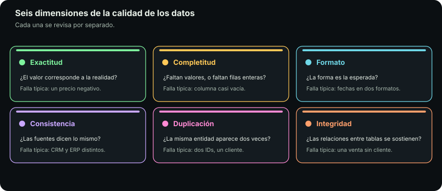

# EDA

::: figure {#ilus-eda title="Inspeccionar el material antes de confiar en él"}

:::

## En corto

- El EDA no es la parte decorativa: es **el control de viabilidad del proyecto**.
- Su trabajo es decir «esto no se puede hacer con estos datos» **mientras cancelar todavía es barato**.
- Responde cuatro preguntas, y la primera es si el proyecto es siquiera posible.
- «Los datos están sucios» no es un diagnóstico. **Seis dimensiones de calidad** sí lo son.
- Esas seis dimensiones son el borrador de un **contrato de datos** ejecutable.

## Seis semanas para descubrir once casos

Un equipo dedica seis semanas a un modelo de abandono de clientes. En la semana siete alguien pregunta cuántos clientes se dieron de baja el año pasado.

La respuesta es **once**. Con once casos positivos no hay modelo posible, y eso se podía saber el primer día con una consulta de dos líneas.

Ese es el argumento entero de esta página. El **análisis exploratorio de datos** —EDA, *exploratory data analysis*— es **el control de viabilidad del proyecto**.

## Las cuatro preguntas del EDA

La definición estándar —examinar los datos con estadística descriptiva y gráficas para hallar patrones, atípicos y problemas de calidad— es cierta y no dice lo importante: el EDA responde **cuatro preguntas, en este orden**.

### 1. ¿El proyecto es viable?

¿Existe la variable que hay que predecir? ¿Hay suficientes casos de la clase que interesa? ¿La ventana de tiempo alcanza? ¿Hay datos por cliente o solo por sucursal?

Si algo de eso es no, el proyecto **se redefine o se cancela**, y cada semana que pasa antes de descubrirlo cuesta.

### 2. ¿Qué está pasando en el negocio?

Los datos registran un proceso real con reglas que nadie escribió. Un pico de pedidos cada día 15 no es una anomalía: es la quincena. Un hueco de tres semanas en 2025 no es falla de captura: es cuando cambiaron de sistema.

### 3. ¿Cómo se ven los datos?

::: definition {#def-fuga title="Fuga de información"}
Hay fuga cuando una columna contiene, de forma disfrazada, la respuesta que se
quiere predecir: predecir si un cliente se dio de baja usando la columna «fecha
de baja».

El modelo sale con una exactitud excelente en la prueba y sirve para nada en
producción, donde esa columna todavía no existe.
:::

Aquí entran las gráficas, y su función **no es ilustrar sino detectar**: distribuciones sesgadas, colas largas, bimodalidades que delatan dos poblaciones mezcladas, correlaciones que anuncian fuga de información.

### 4. ¿Qué hay que preguntarle a quien sabe?

El producto más subestimado del EDA es **una lista de preguntas para quien conoce el dominio**. «¿Por qué el 12 % de los pedidos tiene monto cero?» no lo responde ninguna estadística, y alguien de operaciones lo contesta en treinta segundos.

## Calidad de datos: seis dimensiones

::: figure {#calidad title="Las seis dimensiones de la calidad de los datos"}

:::

«Los datos están sucios» no es accionable. Descomponer la calidad sí lo es, porque **cada dimensión se mide y se arregla distinto**.

| Dimensión | La pregunta | Dónde se pone difícil |
|---|---|---|
| **Completitud** | ¿Faltan valores, y en qué proporción? | ¿Tienen patrón? Que falte el ingreso justo en los clientes de mayor facturación es señal, no ruido |
| **Unicidad** | ¿Hay registros duplicados? | Qué cuenta como duplicado si la misma persona aparece con dos correos y dos grafías del nombre |
| **Validez** | ¿Los valores respetan las reglas de su dominio? | Nacimientos en el futuro, edades de 200 años, una categoría fuera del catálogo |
| **Consistencia** | ¿Se contradicen entre sí o entre sistemas? | Un pedido entregado sin fecha de entrega. Ventas del reporte financiero que no cuadran con el tablero: la contradicción más política |
| **Exactitud** | ¿El dato corresponde a la realidad? | No se verifica desde dentro de la tabla: un dato puede ser completo, único, válido y consistente, y estar equivocado |
| **Oportunidad** | ¿Está disponible cuando se necesita? | Un tablero perfecto con 48 horas de retraso no sirve hoy. Es la puerta a la latencia de [[cuando-se-rompe]] |

> [!TIP]
> Estas seis dimensiones son el borrador natural de un **contrato de datos**. Si las escribes como reglas verificables, corren en cada carga en vez de descubrirse leyendo una gráfica.

## Sobre el 60 % del tiempo

Hay una cifra en casi toda presentación de ciencia de datos: que se dedica alrededor del **60 % del tiempo** a limpiar y organizar datos. La fuente es una **encuesta de CrowdFlower de alrededor de 2016**, sobre una muestra autoseleccionada que respondió en línea.

- **Tiene diez años**, y en diez años cambió el ecosistema entero de herramientas que ataca ese problema.
- Se cita casi siempre sin fuente ni año: es **folklore reciclado de la industria**.
- La citamos no como dato duro, sino porque **el orden de magnitud coincide** con lo que vas a experimentar en las tareas de este curso.

El argumento no necesita el número. La preparación domina el tiempo porque es la única etapa que no se puede saltar, no se automatiza del todo y depende de contexto que no está en los datos. Si la limpieza te toma más de lo que esperabas, así es el trabajo.

Y una cita que sí describe la falla que el EDA previene. Arthur Conan Doyle, en boca de Sherlock Holmes: «Es un error capital teorizar antes de contar con los datos. Imperceptiblemente, uno comienza a torcer los hechos para que se ajusten a las teorías, en lugar de ajustar las teorías a los hechos.»

## Herramientas

No hay una herramienta de EDA; hay tres capas que se combinan.

| Capa | Con qué | El criterio |
|---|---|---|
| **Manipulación tabular** | pandas, polars, SQL | pandas es el estándar por inercia; polars es más rápido. Si no cabe en memoria, consulta en el warehouse en vez de traerlo a la laptop |
| **Visualización** | matplotlib, seaborn, plotly, ggplot, Power BI | seaborn para descriptiva rápida, plotly si hace falta interactividad, Tableau o Power BI cuando el consumidor no escribe código |
| **Estadística** | No es una biblioteca | Hace que las otras dos signifiquen algo: cuándo la media miente, cuándo una correlación alta es fuga de información |

Los generadores de reportes automáticos —`ydata-profiling` y similares— son **buen punto de partida y mala conclusión**: dan el inventario, no el juicio.

## Cuándo se hace EDA

**Siempre, y más de una vez.** Antes de transformar, para saber qué hay. Después, para verificar que la transformación hizo lo que se creía. Otra vez cuando el modelo da un resultado raro, y otra cuando el comportamiento cambia en producción. Es una de las flechas de retorno del ciclo, no una casilla que se marca una vez.

## Hacia adelante

Perfilar, verificar reglas y comparar contra lo esperado se puede escribir como código que corre en cada ejecución. Eso conecta el EDA con el módulo de testing: una prueba de datos es **una afirmación sobre la realidad que se verifica sola**.

La siguiente página, [[cuando-se-rompe|Cuando se rompe]], es la que justifica el rediseño de esta unidad: qué pasa cuando el pipeline ya está en producción y el mismo código, sobre los mismos datos, da otro número.

## Qué te llevas

- El EDA existe para **cancelar barato**: su primera pregunta es si el proyecto es siquiera posible.
- «Datos sucios» no se arregla; **seis dimensiones concretas** sí, porque cada una se mide distinto.
- Lo que hoy detectas leyendo una gráfica, **mañana debería ser una regla que corre sola**.
