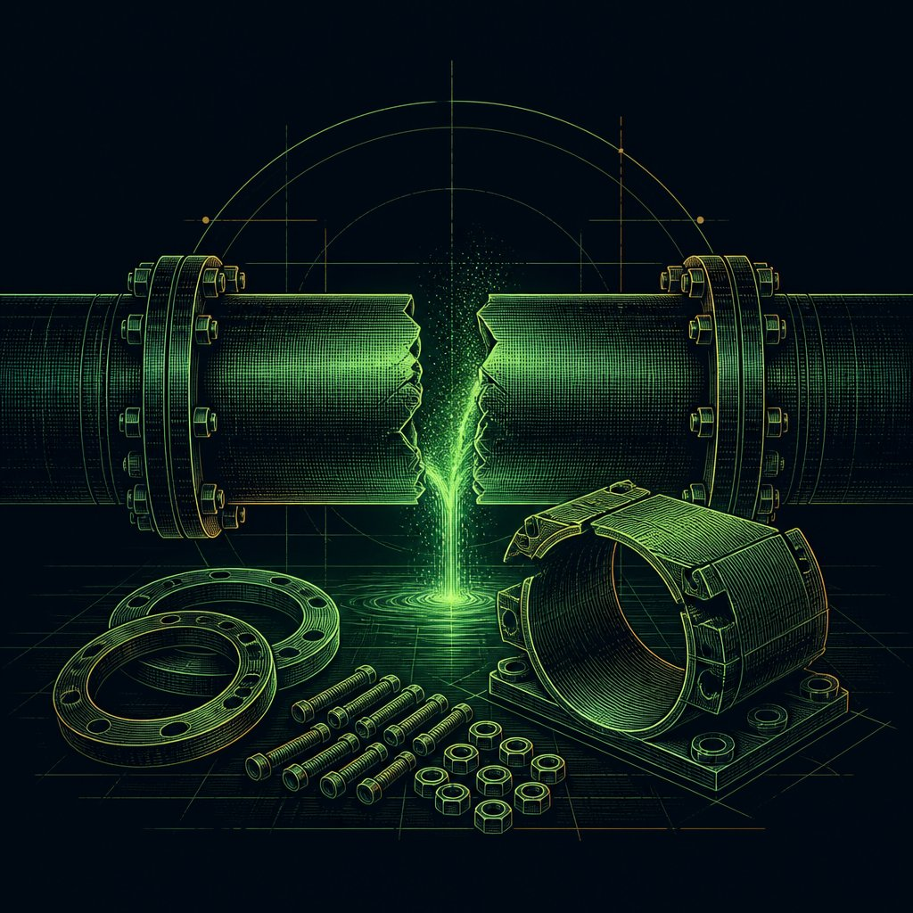
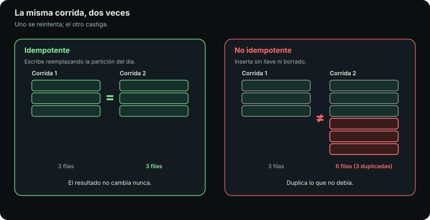
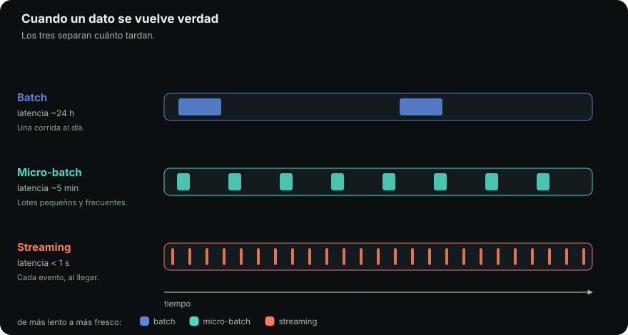

# Cuando se rompe

::: figure {#ilus-ruptura title="Toda fractura tiene su collarín de reparación"}

:::

## En corto

- Las páginas anteriores describen un pipeline que funciona. Esta, **uno que lleva ocho meses corriendo**.
- Seis fallas, en el orden en que aparecen, con el remedio que la industria le puso a cada una.
- **La idempotencia sostiene todo lo demás**: sin ella no puedes reintentar nada.
- Las fallas **silenciosas** son las peligrosas: alimentan decisiones durante semanas sin lanzar un error.
- En un warehouse elástico, **el costo es una decisión de diseño**.

## El mapa de las seis fallas

| Síntoma | Causa | Qué lo evita |
|---|---|---|
| Las ventas del martes salen duplicadas | Se relanzó una corrida que escribe con `append` | **Idempotencia** |
| El reporte dice cero y nadie ve un error | El origen renombró una columna | **Contrato de datos** ejecutable |
| «El dato de ahora» significa cosas distintas | Régimen temporal mal elegido | **Batch, micro-batch o streaming** según la decisión |
| El paso 4 falló y los pasos 5 a 9 corrieron | Nadie conoce el grafo | Un **orquestador** |
| Nadie sabe de dónde sale la cifra | No hay registro de qué produjo qué | **Linaje** y **observabilidad** |
| La factura del mes se disparó | Consultas que recorren todo, a destiempo | **Particionar y materializar** |

## 1. El mismo código dio otro número

::: figure {#idempotencia title="Idempotencia: la misma corrida dos veces"}

:::

El pipeline falló a mitad de la carga del martes. Alguien lo relanzó. El miércoles las ventas del martes aparecen duplicadas.

Faltaba la **idempotencia**.

::: definition {#def-idempotencia title="Idempotencia"}
Un paso es idempotente cuando correrlo una vez o cinco sobre la misma entrada
deja el sistema exactamente igual.

Sin idempotencia no puedes reintentar nada, y sin reintentos no hay orquestación
ni backfills que sirvan.
:::

::: definition {#def-sistema-distribuido title="Sistema distribuido"}
Es un sistema cuyas piezas corren en máquinas distintas y se hablan por la red:
tu proceso, la base origen, el almacenamiento y el orquestador.

La consecuencia práctica es que la red **se cae**, así que un error transitorio
no es un caso raro sino la operación normal.
:::

### Cómo se consigue

- **Escribir con `upsert`** en vez de `append`, para que la segunda escritura actualice.
- **Particionar por período** y sobrescribir la partición entera: reprocesar el 5 de agosto reemplaza exactamente ese día.
- **Parametrizar cada corrida por su período**, no por «hoy». Un pipeline que pregunta la fecha actual no se puede reejecutar para el pasado.

### Para qué sirve: el backfill

Descubres que la conversión de moneda estaba mal desde marzo y hay que recalcular cinco meses. Con un pipeline idempotente y particionado, ese **backfill** es un bucle sobre fechas. Sin él es un proyecto de dos semanas a mano, y cada intervención manual introduce una inconsistencia nueva.

> [!NOTE]
> El sitio de este curso es idempotente por construcción: `raya build` sobre la misma fuente produce el mismo `artifact/`. Por eso `artifact/` está en el `.gitignore` y publicar no depende de que nadie recuerde qué pasos corrió.

## 2. Alguien cambió una columna

El lunes el pipeline funcionaba. El martes falla. O peor: no falla. El origen renombró `user_id` a `customer_id`, tu `join` ya no casa, y sale una tabla vacía y un reporte que dice cero.

Esto es **evolución de esquema**, y es inevitable: los sistemas origen cambian porque el negocio cambia. Lo que no es inevitable es enterarse tarde.

| Tipo de cambio | Ejemplos | Efecto |
|---|---|---|
| **Compatible hacia atrás** | Añadir columna, ampliar un tipo | Quien no la conoce sigue funcionando |
| **Incompatible** | Renombrar, borrar, cambiar el tipo | Se rompe con error visible |
| **Incompatible silencioso** | Cambiar el significado de un valor | No hay error: solo números distintos. Es la peor |

### El contrato de datos

Es un acuerdo explícito y verificable entre quien produce el dato y quien lo consume: qué campos existen, de qué tipo, qué calidad garantizan y con cuánto aviso pueden cambiar.

Lo importante no es el documento sino que sea **ejecutable**. Un contrato en una wiki es una intención; uno que corre en cada carga y detiene el pipeline es un contrato.

`raya validate` es el de este sitio: si un wikilink apunta a un `id` inexistente, el build no ocurre, en vez de publicar enlaces rotos y enterarse cuando un alumno hace clic.

## 3. Tres mentiras distintas sobre cuándo un dato es verdad

::: figure {#tiempo title="Batch, micro-batch, streaming y CDC: cuándo un dato es verdad"}

:::

«El dato de ayer» y «el dato de ahora» no son el mismo problema con distinta velocidad: **son arquitecturas distintas**. Cada régimen miente distinto sobre cuándo algo es verdad.

| Régimen | Latencia | Su mentira | Cuándo conviene |
|---|---|---|---|
| **Batch** | Horas o un día | Que el mundo se detiene a medianoche: hay devoluciones el día 5 que corrigen el 4 | Lo más simple y barato; basta casi siempre |
| **Micro-batch** | Minutos | La misma, más pequeña | Casi tiempo real con casi la simplicidad del batch |
| **Streaming** | Segundos | Que los eventos llegan en orden. No lo hacen | Cuando la decisión ocurre en el momento |

### Streaming y CDC, con más detalle

En **streaming**, el desorden obliga a distinguir el **tiempo del evento** —cuándo ocurrió— del **tiempo de procesamiento** —cuándo lo vimos—. Un evento generado a las 10:00 en un teléfono sin señal llega a las 14:00. Hay que decidir cuánto esperar a los rezagados antes de cerrar una ventana: un compromiso entre exactitud y latencia sin solución correcta, solo elegida a conciencia.

**CDC no es un cuarto régimen: es una forma de *capturar* los cambios**, y lo
capturado se entrega por batch o por streaming, según convenga. En vez de
consultar la base origen, lee su registro de transacciones. Así detecta la fila
vieja que alguien editó ayer, que no tiene fecha de creación nueva pero sí
aparece en el log. A cambio, **acopla tu pipeline a los detalles internos del
origen**.

> [!TIP]
> Elige el régimen por **el tiempo de la decisión**, no por la tecnología. Si nadie actúa sobre ese número hasta la junta del lunes, streaming es costo sin beneficio. Si el sistema decide en tiempo real si algo es fraude, batch no es opción.

## 4. Quién corre qué, y qué pasa si falla

Un pipeline de un paso se resuelve con una tarea programada. Con veinte pasos que dependen entre sí, no.

Aquí vuelve el DAG con consecuencias operativas. Un **orquestador** —Airflow, Dagster, Prefect, o GitHub Actions para casos pequeños— conoce el grafo y responde lo que a mano no se sostiene: qué orden, qué va en paralelo, qué se reintenta, qué queda bloqueado aguas abajo y a quién se le avisa.

La pregunta que revela si está orquestado no es «¿corre solo?», sino **«¿qué pasa si el paso 4 de 9 falla a las 3 de la mañana?»**.

Respuestas malas: nadie se entera hasta el lunes; los pasos 5 a 9 corren sobre datos incompletos; alguien tiene que recordar qué terminó. Las buenas dependen todas de la idempotencia del punto 1. El despliegue de este sitio es el mismo principio que Airflow, con tres nodos en vez de doscientos.

## 5. De dónde salió este número

Alguien señala una cifra en un tablero y pregunta de dónde sale. En muchas organizaciones nadie lo sabe sin dedicarle medio día.

**Linaje** es el mapa de qué tabla salió de qué tablas, con qué transformación y en qué corrida. Sirve hacia atrás, para **auditar** un número, y hacia adelante, para el **análisis de impacto**: si cambio esta columna, ¿qué se rompe? Sin linaje eso se responde con una búsqueda de texto y con esperanza.

### Observabilidad y las dos formas de fallar

Un pipeline **observable** registra en cada corrida cuánto tardó, cuántas filas procesó y cuántas rechazó, y **compara esos números con las corridas anteriores**. Esa comparación detecta lo invisible: el pipeline que carga cien mil filas y hoy cargó ochocientas no lanzó ningún error, y aun así algo se rompió.

| Forma de fallar | Ejemplos | Por qué |
|---|---|---|
| **Ruidosa** | Una excepción, un proceso que muere | Incómoda y benigna: se nota |
| **Silenciosa** | El `join` vacío, la columna que llega en nulos, el filtro que descarta de más | Peligrosa: alimenta decisiones durante semanas |

Casi toda la observabilidad existe para **convertir fallas silenciosas en ruidosas**.

## 6. Por qué la consulta bonita costó 400 dólares

En un warehouse elástico el cómputo se paga por uso, y el uso lo genera cualquiera con una consola. Un `SELECT *` sobre varios terabytes «para echarle un ojo» aparece en la factura. Un tablero que refresca cada cinco minutos una consulta sobre todo el histórico corre 288 veces al día para responderle a nadie de madrugada.

### Cuatro palancas

- **Particionar** por fecha y **filtrar por partición**, para tocar solo el trozo relevante.
- **Seleccionar columnas** en vez de `SELECT *`: un formato columnar solo lee
  las columnas que pediste, y las demás ni se tocan.
- **Materializar** los resultados intermedios que se consultan muchas veces.
- **Ajustar la frecuencia a la decisión**: un tablero diario no se refresca cada cinco minutos.

::: definition {#def-materializar title="Materializar"}
Materializar es guardar el resultado de una consulta como una tabla, en vez de
recalcularlo cada vez que alguien pregunta.

Sin materializar, un tablero que se consulta cien veces al día recorre cien
veces el mismo histórico y lo cobra cien veces.
:::

Hay una consecuencia cultural. Cuando el cómputo era fijo, una consulta ineficiente era lenta y el castigo era esperar. Ahora es rápida, y el castigo llega treinta días después en una factura que nadie asocia con quién la escribió. Por eso **el costo pasó de problema de finanzas a criterio de ingeniería**.

## Hacia adelante

Reproducibilidad y «corre igual aquí que allá» son la razón por la que **Docker** aparece en este curso. Un pipeline idempotente cuyo entorno cambia entre tu laptop y el servidor no es idempotente: tiene una variable oculta más.

La siguiente página, [[posiciones|Posiciones]], reparte todo lo anterior entre las personas responsables de cada trozo.

## Qué te llevas

- **La idempotencia sostiene todo lo demás**: sin ella no hay reintentos, ni backfills, ni orquestación que valga.
- Un contrato que no se ejecuta es una intención; **el que detiene el pipeline es el contrato**.
- Lo que hay que cazar es **la falla silenciosa**, comparando cada corrida con las anteriores.

**Una acción:** toma un proceso tuyo que escriba datos y pregúntate qué pasa si lo corres dos veces seguidas. Si la respuesta es «se duplica», ya sabes qué arreglar primero.
