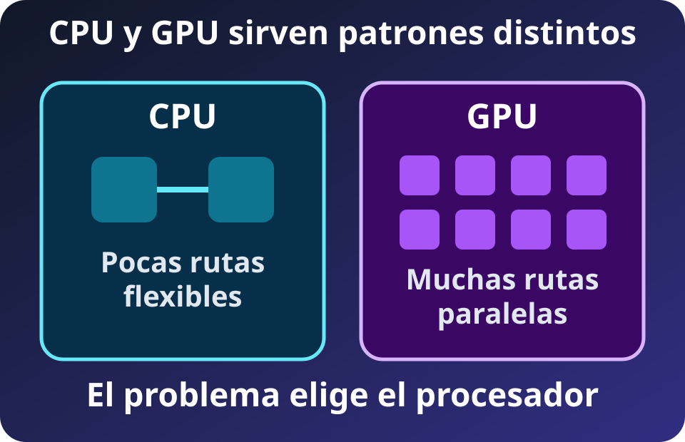
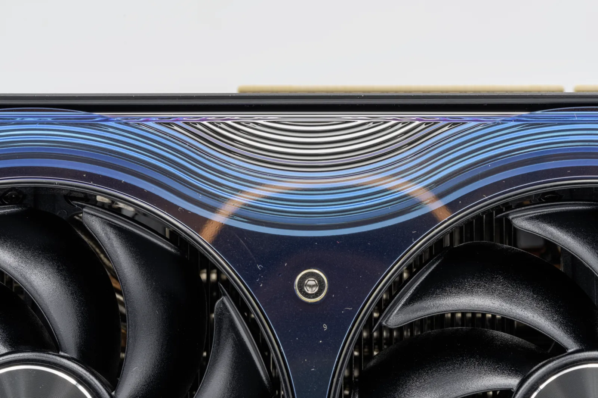
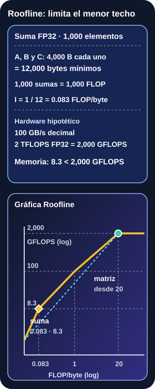
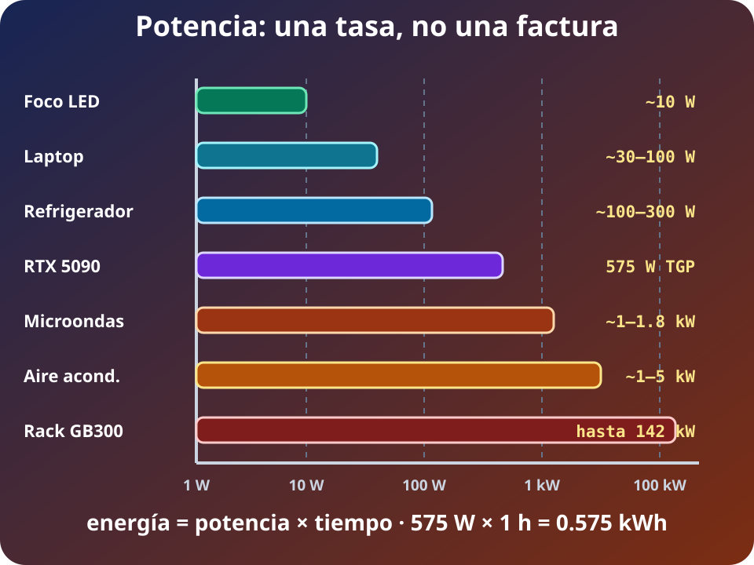

CPU, GPU y aceleradores organizan el paralelismo de maneras distintas. **El procesador se elige por forma y límite**. El pico es un techo.

## CPU y GPU intercambian flexibilidad por amplitud

*Diagrama propio del curso, SVG accesible, 2026.*

**Lectura visual:** la CPU dedica más recursos a pocos flujos con decisiones y baja latencia. La GPU reúne muchas unidades para aplicar operaciones parecidas a numerosos datos. Ninguna forma sirve para todo problema.

Una CPU favorece control irregular, trabajo secuencial y solicitudes pequeñas. Una GPU favorece **throughput** si hay trabajo independiente. Ramas o accesos divergentes dejan unidades esperando; lanzar kernels, copiar y sincronizar también cuesta. A menudo la CPU coordina y la GPU procesa lotes, por lo que se mide el flujo completo.

**FACT (objeto fotografiado):** Palit RTX 5090 GameRock. Foto de [PantheraLeo1359531, Wikimedia Commons](https://commons.wikimedia.org/wiki/File:Palit_GeForce_RTX_5090_Gamerock_20250530_HOF3973-HDR_RAW-Export.png), [CC BY 4.0](https://creativecommons.org/licenses/by/4.0); redimensionada a WebP.

**FACT (especificación NVIDIA de referencia):** la RTX 5090 publica **575 W TGP** para la tarjeta, no para el equipo. El diseño Palit fotografiado puede variar.

## Los aceleradores especializan el trabajo

Un **acelerador** optimiza hardware para un dominio, con recursos propios, compartidos o unificados.

**NPU** es una etiqueta industrial para operadores neuronales, no una arquitectura única. Un operador no soportado puede volver a CPU o GPU.

**TPU** nombra una familia de ASIC de Google, no una categoría genérica. **FACT (pico, no benchmark):** cada TPU7x Ironwood publica **2,307 TFLOPS BF16**, **4,614 TFLOPS FP8**, **192 GiB HBM** y **7,380 GB/s** HBM. La precisión cambia tasa, memoria, tráfico y comportamiento numérico; los picos no forman un ranking entre precisiones o sistemas.

Especializar intercambia flexibilidad por eficiencia; importan operadores, compilador, memoria, lote, transferencias y disponibilidad.

## FLOP es trabajo; FLOPS es tasa

Un **FLOP** es una operación de punto flotante. **FLOPS** significa operaciones de punto flotante por segundo. **FACT (convención SI decimal):** GFLOPS, TFLOPS y PFLOPS multiplican esa tasa por $10^9$, $10^{12}$ y $10^{15}$. Un total de FLOP describe trabajo; FLOPS describe ritmo.

La precisión es parte de la unidad de comparación:

- **FP64** conserva más precisión para ciertos cálculos científicos.
- **FP32** ofrece precisión y soporte general.
- **FP16 y BF16** reducen bytes y aprovechan unidades matriciales.
- **FP8 e INT8** reducen más tráfico, con técnicas numéricas apropiadas.

Menos bits no garantiza calidad. Un pico *sparse* supone ceros aprovechables y no equivale al pico *dense*. TOPS enteros y FLOPS flotantes tampoco son intercambiables.

## Roofline conecta cómputo y memoria

### Ejemplo de juguete: la cocina también necesita ingredientes

Una cocina puede preparar 100 platos por hora, pero el montacargas sólo entrega ingredientes para 20. Contratar cocineros no supera 20 platos por hora. Si cada entrega se reutiliza en cinco platos, el mismo montacargas ya alimenta 100. **Roofline pregunta si faltan manos para calcular o datos para alimentarlas.**

En una computadora, un **FLOP** es una operación de punto flotante, como una suma. Los **FLOPS** expresan cuántas de esas operaciones se completan por segundo. Los bytes describen ingredientes movidos, no cálculo.

| Trabajo de juguete | Bytes mínimos por resultado | FLOP | Reutilización | Límite probable |
|---|---:|---:|---|---|
| `C[i] = A[i] + B[i]` en FP32 | 12: leer 8, escribir 4 | 1 | Cada entrada se usa una vez | Memoria |
| Bloque matricial mantenido cerca | El bloque se carga una vez | Muchas por dato | Cada número participa repetidamente | Cómputo, si el bloque cabe |

**Intensidad aritmética** significa “cuánto cálculo útil obtenemos por cada byte que viaja desde memoria”. Reutilizar un dato aumenta esa intensidad sin hacer más rápida la memoria.

*Diagrama propio del curso, SVG accesible, 2026.*

**Lectura visual:** el eje horizontal representa operaciones por byte y el vertical, rendimiento. Con poca reutilización manda el ancho de banda; con mucha se alcanza el techo de cómputo. La ejecución real queda debajo de ambos.

Después de la intuición aparece la unidad formal. La intensidad es trabajo dividido entre tráfico:

$$I = \frac{\text{FLOP}}{\text{bytes movidos}}$$

El modelo Roofline-lite expresa un límite:

$$P \leq \min(P_{pico},\ B_{memoria}\times I)$$

**DERIVED (modelo simplificado):** sumar dos vectores FP32 para producir un tercero mueve al menos 12 bytes por elemento, dos lecturas y una escritura, y realiza 1 FLOP. Su intensidad es aproximadamente **0.083 FLOP/byte**, sin contar tráfico adicional. Reutilizar bloques de una multiplicación de matrices puede elevar mucho la intensidad.

**Cómo leer la fórmula, paso a paso:** $B_{memoria}\times I$ convierte bytes/s por FLOP/byte en FLOP/s. Ese es el máximo que la memoria puede alimentar. $P_{pico}$ es el máximo que las unidades pueden ejecutar. `min` elige el techo más bajo; un programa real queda debajo por latencia, ramas y coordinación.

En la pendiente conviene mover menos bytes, mejorar localidad o ancho de banda. En la meseta conviene usar mejor las unidades, aumentar paralelismo o elegir otra precisión compatible.

Roofline no predice una solicitud pequeña: latencia, arranque, dependencias, ramas y sincronización pueden alejarla del techo. Ancho de banda es volumen por tiempo; latencia es espera. Ambos se miden.

## Pico, benchmark y aplicación son capas distintas

El **pico teórico** combina unidades, operaciones por ciclo y frecuencia bajo supuestos de precisión, instrucciones y densidad. Puede omitir entrada, copias y coordinación.

En MLPerf, una comparación válida usa el mismo benchmark: la misma tarea o modelo, el mismo dataset y el mismo objetivo de calidad. También alinea escenario, métrica y división; la división *Closed* exige el modelo de referencia, mientras *Open* permite cambios que deben interpretarse como tales.

Precisión, lote, software y disponibilidad dan contexto. Cuando una entrega incluye potencia, MLPerf mide el sistema completo mediante AC en la pared durante ese benchmark; TDP y potencia nominal de la fuente no equivalen.

La **aplicación observada** incluye el pipeline; sus métricas deben compartir contexto.

## Potencia y energía responden cosas distintas

*Diagrama propio del curso, SVG accesible, 2026.*

**Lectura visual:** watts por horas producen watt-hora. Un dispositivo suele expresarse en W, un rack en kW, un centro de datos en MW y la generación agregada puede llegar a GW. Al integrar tiempo aparecen Wh, kWh, MWh, GWh o TWh.

El **watt** mide potencia, una tasa instantánea. El **watt-hora** mide energía acumulada. **FACT (convención SI decimal):** $1\ \mathrm{kW}=10^3\ \mathrm{W}$, $1\ \mathrm{MW}=10^6\ \mathrm{W}$ y $1\ \mathrm{GW}=10^9\ \mathrm{W}$. Mantener 1 kW durante una hora consume 1 kWh.

TGP referencia una tarjeta; TDP guía diseño térmico y varía por fabricante. La potencia **AC en la pared** añade componentes y pérdidas. No son equivalentes.

**DERIVED (escenario, no consumo medido):** 575 W sostenidos durante una hora equivalen a **0.575 kWh** para la tarjeta. El host y las pérdidas quedan fuera. La duración transforma una tasa en energía.

| Término | Responde | Ejemplo correcto | No significa |
|---|---|---|---|
| W | Potencia en un instante | Una tarjeta opera cerca de 575 W | Energía anual |
| Wh o kWh | Potencia integrada en tiempo | 100 W × 10 h = 1 kWh | Potencia máxima |
| TDP | Referencia térmica del fabricante | Dimensionar enfriamiento de un chip | Consumo exacto de pared |
| TGP | Potencia de la tarjeta gráfica | RTX 5090 de referencia: 575 W | Consumo del servidor |
| Pared AC | Sistema completo y pérdidas | Medidor del enchufe durante una tarea | Potencia exclusiva del chip |

### Escalas conocidas para construir intuición

| Equipo o aparato | Potencia orientativa | Duración de ejemplo | Energía derivada |
|---|---:|---:|---:|
| Foco LED | 8–12 W | 5 h | 0.04–0.06 kWh |
| SoC/CPU móvil | 5–30 W | 8 h | 0.04–0.24 kWh |
| Laptop completa | 30–100 W | 8 h | 0.24–0.80 kWh |
| Refrigerador, mientras comprime | 100–300 W | Ciclos, no 24 h continuas | Depende del ciclo |
| CPU de escritorio | 65–250 W | 2 h | 0.13–0.50 kWh |
| RTX 5090, TGP | hasta 575 W | 1 h | hasta 0.575 kWh |
| Microondas | 1–1.8 kW | 10 min | 0.17–0.30 kWh |
| Aire acondicionado | 1–5 kW | 6 h | 6–30 kWh |
| Rack GB300 NVL72 | hasta 142 kW | 1 día | hasta 3.408 MWh |
| Centro de datos | MW–GW | 1 año | potencia × 8,760 h |

**FACT** identifica especificaciones publicadas de RTX 5090 y GB300. **ESTIMATE (confianza media)** identifica rangos ilustrativos de aparatos: modelo, clima, ciclo y carga cambian el consumo. **DERIVED** identifica las multiplicaciones de potencia por tiempo. Un refrigerador es el recordatorio importante: su potencia activa no permanece constante todo el día.

La comparación incluye un foco LED, un microondas y un aire acondicionado para anclar las escalas; no implica que sus perfiles de uso sean iguales a los de un chip.

## El power wall cambió la estrategia

**FACT (síntesis histórica):** durante décadas, reducir el tamaño de los transistores permitió elevar frecuencia sin aumentar igual la densidad de potencia. Al fallar ese escalamiento de voltaje, cerca de 2005, calor y potencia limitaron la frecuencia. La respuesta combinó multicore, SIMD, aceleradores y eficiencia.

El **power wall** cambió el progreso: más transistores no implican activarlos todos al máximo. Software, paralelismo y especialización deciden cuánto hardware resulta útil.

**FACT (objeto fotografiado):** nodo de TSUBAME 4.0 con cuatro GPU NVIDIA H100. La foto ilustra un nodo multi-GPU, no un sistema GB300 actual. Foto de [Fukumoto en Wikimedia Commons](https://commons.wikimedia.org/wiki/File:TSUBAME4.0_P5160984.jpg), [CC BY-SA 4.0](https://creativecommons.org/licenses/by-sa/4.0); redimensionada y convertida a WebP para el curso.

## Del dispositivo a la generación

La escala encadena dispositivo en W, rack en kW y centro de datos en MW. Cada nivel añade red, almacenamiento, enfriamiento, conversión y redundancia.

**FACT (capacidad máxima, no consumo observado):** NVIDIA documenta que un rack GB300 NVL72 integra 72 GPU y 36 CPU, usa refrigeración líquida y requiere hasta **142 kW**. **DERIVED (escenario de placa):** 142 kW constantes durante 24 horas serían **3.408 MWh**; durante 8,760 horas serían **1.244 GWh**. El cálculo supone carga constante y excluye infraestructura exterior al rack.

En el nivel global se acumula energía, no sólo potencia. **ESTIMATE (IEA 2026, proyección central):** el consumo eléctrico de centros de datos pasa de **485 TWh en 2025** a alrededor de **950 TWh en 2030**; dentro de esa proyección, el consumo de centros enfocados en IA se triplica. Son estimaciones con incertidumbre, no lecturas de medidor ni potencia instantánea.

Escalar amplifica movimiento, refrigeración y energía. Sigue [[ia-escala-decision|IA, escala y selección de hardware]].

## Qué debes recordar

- Roofline compara dos techos: datos que memoria puede entregar y operaciones que el chip puede ejecutar.
- FLOP es trabajo; FLOPS es tasa; FLOP/byte mide reutilización.
- Pico teórico, benchmark y aplicación observada son evidencias distintas.
- W mide potencia; Wh y kWh miden energía acumulada. Siempre declara frontera y duración.

## Fuentes

- [Berkeley Lab — Roofline Performance Model](https://amcr.lbl.gov/departments/computer-science-department/ppan/roofline-performance-model/): intensidad, ancho de banda y techo de cómputo.
- [NVIDIA — RTX Blackwell GPU Architecture](https://images.nvidia.com/aem-dam/Solutions/geforce/blackwell/nvidia-rtx-blackwell-gpu-architecture.pdf): TGP, precisión y calificadores dense/sparse de la RTX 5090.
- [Google Cloud — TPU7x Ironwood](https://docs.cloud.google.com/tpu/docs/tpu7x): picos por precisión y HBM oficiales.
- [MLCommons — MLPerf Inference: Datacenter](https://mlcommons.org/benchmarks/inference-datacenter/): escenarios, calidad y medición AC del sistema completo.
- [BIPM — The International System of Units](https://www.bipm.org/en/publications/si-brochure): watt, prefijos SI y relación entre potencia y energía.
- [Microsoft Research — Dark silicon and the end of multicore scaling](https://www.microsoft.com/en-us/research/publication/dark-silicon-and-the-end-of-multicore-scaling/): escalamiento de Dennard y límite de potencia.
- [NVIDIA — NVL72 AI Factory, System Hardware and Components](https://docs.nvidia.com/enterprise-reference-architectures/nvl72-ai-factory/latest/components.html): composición, refrigeración y potencia máxima del rack GB300 NVL72.
- [IEA — Key Questions on Energy and AI, executive summary (2026)](https://www.iea.org/reports/key-questions-on-energy-and-ai/executive-summary): proyección central 2025–2030 para electricidad de centros de datos y centros enfocados en IA, CC BY 4.0.
- [Wikimedia Commons — Palit GeForce RTX 5090 GameRock](https://commons.wikimedia.org/wiki/File:Palit_GeForce_RTX_5090_Gamerock_20250530_HOF3973-HDR_RAW-Export.png): fotografía de PantheraLeo1359531, CC BY 4.0.
- [Wikimedia Commons — TSUBAME 4.0](https://commons.wikimedia.org/wiki/File:TSUBAME4.0_P5160984.jpg): fotografía de Fukumoto, CC BY-SA 4.0.
