Un modelo de IA transforma entradas con parámetros. El hardware aloja y mueve su estado para cumplir latencia, throughput, energía y costo. **Los parámetros inician el presupuesto, no lo completan.**

**Glosario breve.** **HBM** es memoria de alto ancho de banda junto al acelerador. **TDP** es una envolvente térmica de diseño; **TGP**, la potencia total de una tarjeta gráfica. **CAPEX** es gasto de adquisición. **MFU** mide la fracción de FLOP del modelo frente a un pico declarado. **SLA** es un compromiso de nivel de servicio; **OOM**, un fallo por memoria insuficiente. **TP**, **PP** y **DP** son paralelismo tensorial, de pipeline y de datos: parten tensores, etapas o réplicas y cambian comunicación y memoria local. **TTFT** es el tiempo hasta el primer token.

La ruta principal ocupa 50–55 minutos; la consulta de evidencia y los ejercicios de extensión son opcionales dentro de una sesión total de 90 minutos.

## Ejemplo de juguete: diez parámetros

Un **parámetro** es un número aprendido. Imagina este modelo diminuto:

`[0.2, -0.7, 1.1, 0.0, 0.4, -0.3, 0.8, 0.5, -0.1, 0.9]`

Hay diez parámetros. Un **bit** puede valer 0 o 1; ocho bits forman un **byte**. Si cada número se guarda con 32 bits, ocupa 4 bytes porque $32\div8=4$. Los diez pesan $10\times4=40$ bytes. Con 16 bits pesan 20 bytes; con 8 bits, 10 bytes; con 4 bits, 5 bytes.

*Diagrama propio del curso, SVG accesible, 2026.*

**Lectura visual:** reducir bits reduce el almacenamiento de los pesos. No garantiza la misma calidad ni reduce automáticamente cachés, activaciones o temporales.

| Unidad | Cantidad exacta usada aquí | Intuición |
|---|---:|---|
| bit | 0 o 1 | La unidad mínima |
| byte | 8 bits | La unidad habitual de almacenamiento |
| GB | $10^9$ bytes | Convención decimal de fichas comerciales |
| GiB | $2^{30}$ bytes | Convención binaria frecuente en software |

**DERIVED:** 14 GB decimales equivalen a unos 13.04 GiB. No desapareció memoria; cambió la unidad.

## Inferencia y entrenamiento ocupan memoria distinta

*Diagrama propio del curso, SVG accesible, 2026. Los bloques nombran componentes; sus tamaños no están a escala.*

**Lectura visual:** inferencia necesita pesos, caché KV y temporales. Entrenamiento añade activaciones, gradientes y estados del optimizador. El runtime reserva otros buffers.

En **inferencia**, *prefill* procesa el prompt y *decode* produce tokens reutilizando la **caché KV**. Evita recalcular la historia, pero ocupa memoria.

*Diagrama propio del curso, SVG accesible, 2026.*

| Fase | Entrada por paso | Trabajo dominante | Sensible a |
|---|---|---|---|
| Prefill | Muchos tokens del prompt | Cálculo matricial y creación de KV | Longitud del prompt, FLOP/s |
| Decode | Un token nuevo por secuencia | Leer pesos y KV repetidamente | Ancho de banda, batch, contexto |

**Ejemplo de juguete:** cuatro personas envían 1,000 tokens y piden 100 nuevos. Prefill absorbe 4,000 tokens de entrada; decode realiza 100 pasos por solicitud. Agruparlas puede aprovechar el chip, pero mantiene cuatro cachés KV y puede hacer esperar a la primera persona.

Más **contexto** aumenta caché KV y atención; suele empeorar latencia y throughput por solicitud. El máximo admitido no indica cuántas peticiones caben.

El **batching** agrupa secuencias: puede elevar throughput, pero consume memoria y suma espera. Contexto y batch se ajustan por separado con solicitudes reales.

En **entrenamiento**, *forward* crea activaciones, *backward* gradientes y el optimizador actualiza parámetros. *Recomputation* cambia memoria por cálculo. Partir estados reduce memoria local, pero obliga a comunicarlos.

## La cuenta mínima de los pesos

Primero definimos cada símbolo:

| Símbolo | Significado | Unidad |
|---|---|---|
| $N_p$ | número de parámetros del modelo | parámetros |
| $b$ | bits usados por cada parámetro | bits/parámetro |
| $M_{pesos}$ | memoria total ocupada sólo por los pesos | bytes |

### Por qué dividimos entre ocho

La precisión suele expresarse en **bits**, pero la memoria se cuenta en **bytes**. La conversión es:

`8 bits = 1 byte`

Por eso dividimos los bits entre ocho:

| Precisión | Bits por parámetro | Cuenta | Bytes por parámetro |
|---|---:|---:|---:|
| FP32 | 32 bits | `32 ÷ 8 = 4 bytes` | 4 bytes |
| BF16 | 16 bits | `16 ÷ 8 = 2 bytes` | 2 bytes |
| INT8 | 8 bits | `8 ÷ 8 = 1 byte` | 1 byte |
| INT4 | 4 bits | `4 ÷ 8 = 0.5 byte` | 0.5 byte en promedio |

Ahora usemos diez parámetros FP32:

`10 parámetros × 4 bytes = 40 bytes`

La fórmula general sólo abrevia esa misma cuenta. Primero convierte $b$ bits a bytes con $b\div8$; después multiplica por los $N_p$ parámetros:

$$M_{pesos}=N_p\times\frac{b}{8}$$

Se lee así: **memoria de los pesos = cantidad de parámetros × bytes por parámetro**.

> [!IMPORTANT]
> **Cuatro bytes describen el contenido numérico FP32, no el tamaño total de cualquier objeto que contenga ese número.** La fórmula calcula un mínimo lógico de los pesos. La representación usada por el lenguaje, el contenedor y el runtime puede añadir memoria.

| Representación | Contenido numérico | Memoria adicional |
|---|---|---|
| Valor FP32 almacenado directamente | 4 bytes | Depende del formato o contenedor |
| Un objeto `float` de Python | Python no exige FP32; en CPython guarda un `double` de C | Cabecera del objeto, tipo, referencias y alineación |
| Arreglo NumPy `float32` | 4 bytes por elemento en el buffer | Objeto del arreglo, dimensiones, *strides*, tipo y posible alineación |
| Tensor `float32` | 4 bytes por elemento en su almacenamiento | Cabecera y metadatos, asignador, alineación y buffers del runtime o dispositivo |

Por eso `10 × 4 = 40 bytes` responde cuánto pesa el **payload** FP32 de diez parámetros, no cuánto ocupa una lista de diez objetos Python. En Python, `sys.getsizeof` aplicado a `1.0` informa el tamaño directo de ese objeto en esa implementación; no convierte al objeto en FP32 ni suma automáticamente objetos referenciados. Para NumPy, `array.nbytes` cuenta los bytes consumidos por los elementos, no toda la cabecera del arreglo.

**FACT (convención decimal):** en nombres como 7B, B representa $10^9$ parámetros y T representa $10^{12}$. En tamaños de almacenamiento, GB y TB también se usan aquí en escala decimal.

**DERIVED (GB decimales, sólo pesos):**

- **7B:** BF16 = $7\times10^9\times2$ bytes = **14 GB**; INT8 = **7 GB**; INT4 = **3.5 GB**.
- **70B:** BF16 = **140 GB**; INT8 = **70 GB**; INT4 = **35 GB**.
- **1T:** BF16 = **2 TB**; INT8 = **1 TB**; INT4 = **0.5 TB**.

Son capacidades lógicas. GiB, escalas, *padding*, buffers y particionado cambian la memoria física.

| Escala | Pesos por precisión |
|---:|---|
| 10 parámetros | BF16: 20 B · INT8: 10 B · INT4: 5 B. Juguete visible. |
| 7B | BF16: 14 GB · INT8: 7 GB · INT4: 3.5 GB. Puede caber en una GPU, según overhead. |
| 70B | BF16: 140 GB · INT8: 70 GB · INT4: 35 GB. Exige más capacidad o particionado. |
| 1T | BF16: 2 TB · INT8: 1 TB · INT4: 0.5 TB. Escala de servidor o cluster. |

**DERIVED (presupuesto base de esta receta):** *mixed precision* con Adam clásico suma **~18 bytes por parámetro**: 2 de pesos BF16/FP16 + 4 de copia FP32 + 4 de gradiente FP32 + 8 de estados Adam FP32. Para 7B, 70B y 1T son **126 GB**, **1.26 TB** y **18 TB** de estado agregado del modelo, antes de activaciones y temporales.

No obliga a guardar 18 bytes completos en cada GPU. El **sharding** reparte estado y reduce memoria local a cambio de comunicación y buffers. Precisión, activaciones, temporales e implementación cambian el máximo real.

## Cuantizar cambia más que capacidad

**Lectura visual:** cada reducción a la mitad de bits reduce a la mitad el piso de pesos. Las barras no incluyen KV, runtime ni calidad numérica.

Cuantizar pesos reduce bytes y tráfico, pero exige soporte y validación numérica; INT4 no duplica necesariamente la velocidad de INT8.

Cuantizar pesos no reduce automáticamente caché KV ni activaciones. Valida precisión, contexto, batch y calidad en el hardware real.

## Denso y MoE no cuentan lo mismo

Un modelo **denso** usa todos sus parámetros en cada token. Un **Mixture of Experts**, o **MoE**, contiene varios bloques expertos y un router selecciona algunos para cada token. Por eso se reportan dos cantidades:

- **Parámetros totales:** capacidad que debe almacenarse o repartirse.
- **Parámetros activos:** parte aproximada usada para procesar un token.

*Diagrama propio del curso, SVG accesible, 2026.*

**Lectura visual:** el modelo MoE conserva todos los expertos en memoria, mientras la ruta resaltada atraviesa sólo los elegidos para ese token.

**Ejemplo de juguete:** ocho expertos de 10 parámetros suman 80 almacenados. Si el router usa dos, activa 20 por token. Eso reduce cálculo frente a usar 80, pero no reduce el almacenamiento a 20; además añade ruteo y comunicación.

## Distribuir crea una segunda carga

Distribuir añade una segunda carga:

- **Paralelismo de datos:** replica el modelo y divide batches. En entrenamiento, **all-reduce** combina y redistribuye gradientes; en inferencia, réplicas atienden solicitudes distintas.
- El **paralelismo de modelo** es el paraguas para dividir un modelo entre dispositivos. Sus formas incluyen tensor y pipeline.
- **Paralelismo tensorial:** parte tensores de cada capa; colectivas como all-reduce o all-gather exigen enlaces rápidos.
- **Paralelismo de pipeline:** reparte grupos de capas; envía activaciones y puede crear burbujas.

Bandwidth, latencia y topología determinan el resultado. **Más dispositivos no prometen speedup lineal.**

## Del chip al centro de datos

*Diagrama propio del curso, SVG accesible, 2026.*

**Lectura visual:** primero se mide memoria, cómputo y comunicación; después se escala. Cada salto añade capacidad, coordinación, fallas y energía.

La cadena es **chip → board → servidor → rack → cluster → centro de datos**. Cada nivel añade memoria, red, potencia, refrigeración y operación.

| Escala | Lo que agrega | Nuevo límite posible |
|---|---|---|
| Chip | Unidades y memoria local | Capacidad o bandwidth local |
| Servidor | Varios chips y enlaces | PCIe/NVLink, CPU, alimentación |
| Rack | Decenas de aceleradores | Red interna y refrigeración |
| Cluster | Muchos racks | Colectivas, fallas y almacenamiento |
| Centro de datos | Energía e infraestructura | Red eléctrica, agua, operación |

**Sharding** reparte un tensor o estado entre dispositivos. Permite que algo grande quepa, pero cada capa puede necesitar intercambios. Si duplicar chips reduce a la mitad el cálculo local y duplica la espera de red, el tiempo total no se reduce a la mitad.

## Cuatro ejemplos representativos, no un ranking

- **FACT (límite de producto):** M5 Max admite hasta **128 GB unificados** y **614 GB/s**; no son benchmark ni TDP.
- **FACT (referencia NVIDIA):** RTX 5090 tiene **32 GB GDDR7**, **1,792 GB/s de ancho de banda pico de memoria** y **575 W TGP**. Pesos, cachés y temporales comparten capacidad; tarjetas de ensambladores pueden variar.
- **FACT (picos por chip):** TPU7x ofrece **192 GiB HBM**, **7,380 GB/s**, **2,307 TFLOP/s BF16** y **4,614 TFLOP/s FP8**; un pod llega a **9,216 chips**. No es desempeño observado.
- **FACT (sistema oficial, máximos agregados):** DGX GB300 integra **72 GPU Blackwell Ultra**, **36 CPU Grace**, **20 TB de memoria GPU**, hasta **576 TB/s** HBM y **130 TB/s NVLink**. El rack usa refrigeración líquida y admite hasta **142 kW**; es capacidad máxima, no consumo medido.

No son un ranking: la aplicación y la medición completa deciden.

## Dashboard: modelos, hardware y costo

### En 30 segundos

- Los modelos crecieron, pero la evidencia física no creció al mismo ritmo: en modelos cerrados es normal encontrar **no publicado**.
- Entrenar pregunta cuánto trabajo y cuántos aceleradores participaron. Inferir localmente pregunta primero si los pesos caben.
- Un punto alto o barato no gana por sí solo: cada gráfica responde una pregunta distinta y conserva su incertidumbre.

### Cómo leer el dashboard

La leyenda: **FACT** publicado; **DERIVED** calculado; **ESTIMATE** rango; **SCENARIO** supuesto docente; gris, ausencia. La confianza alta/media/baja califica evidencia, no calidad. En un escenario es “no aplica”: se verifica la cuenta, no la premisa.

El eje X siempre es el año de publicación. Cuando Y dice “log”, subir la misma distancia significa multiplicar, no sumar. **FLOP es trabajo** realizado; **FLOP/s es una tasa** de trabajo por segundo.

#### Los 39 modelos, por ficha

Cada ficha separa año, acceso a pesos, arquitectura y evidencia física. **No publicado** no significa cero. `E` es entrenamiento; `I`, inferencia.

##### Google

| Modelo · año | Ficha física |
|---|---|
| **BERT-Large · 2018** | abierto · dense · E: no publicado · I: artefacto |
| **T5-11B · 2019** | abierto · dense · E: cifra · I: artefacto |
| **Gopher 280B · 2021** | cerrado · dense · E: cifra · I: no identificable |
| **LaMDA 137B · 2022** | cerrado · dense · E: no publicado · I: no identificable |
| **Chinchilla 70B · 2022** | cerrado · dense · E: cifra · I: no identificable |
| **PaLM 540B · 2022** | cerrado · dense · E: cifra · I: no identificable |
| **Gemma 7B · 2024** | abierto · dense · E: cifra · I: artefacto |
| **Gemma 2 27B · 2024** | abierto · dense · E: cifra · I: artefacto |
| **Gemma 3 27B · 2025** | abierto · dense · E: cifra · I: artefacto |
| **Gemini 3.1 Pro · 2026** | cerrado · no publicado · E: no publicado · I: no identificable |

##### OpenAI y Anthropic

| Modelo · año | Ficha física |
|---|---|
| **GPT-3 175B · 2020** | cerrado · dense · E: cifra · I: no identificable |
| **GPT-5.6 Sol · 2026** | cerrado · no publicado · E: no publicado · I: no identificable |
| **Claude Sonnet 5 · 2026** | cerrado · no publicado · E: no publicado · I: no identificable |

##### Meta y BigScience

| Modelo · año | Ficha física |
|---|---|
| **OPT-175B · 2022** | abierto · dense · E: cifra · I: piso BF16 |
| **BLOOM 176B · 2022** | abierto · dense · E: cifra · I: artefacto |
| **Llama 1 65B · 2023** | abierto · dense · E: cifra · I: piso BF16 |
| **Llama 2 70B · 2023** | abierto · dense · E: cifra · I: artefacto |
| **Llama 3.1-8B · 2024** | abierto · dense · E: cifra · I: artefacto |
| **Llama 3.1-70B · 2024** | abierto · dense · E: cifra · I: artefacto |
| **Llama 3.1-405B · 2024** | abierto · dense · E: cifra · I: artefacto |
| **Llama 4 Scout · 2025** | abierto · MoE · E: no publicado · I: artefacto |

##### Qwen

| Modelo · año | Ficha física |
|---|---|
| **Qwen-72B · 2023** | abierto · dense · E: cifra · I: artefacto |
| **Qwen2-72B · 2024** | abierto · dense · E: cifra · I: artefacto |
| **Qwen2.5-72B · 2024** | abierto · dense · E: cifra · I: artefacto |
| **Qwen3-30B-A3B · 2025** | abierto · MoE · E: cifra · I: artefacto |
| **Qwen3-235B-A22B · 2025** | abierto · MoE · E: cifra · I: artefacto |
| **Qwen3.8-Max · 2026** | cerrado · MoE · E: no publicado · I: no identificable |
| **Qwen3.8-2.4T-A95B · 2026** | abierto · MoE · E: no publicado · I: piso BF16 |

##### DeepSeek y Mistral

| Modelo · año | Ficha física |
|---|---|
| **DeepSeek LLM 67B · 2023** | abierto · dense · E: cifra · I: artefacto |
| **Mistral 7B v0.1 · 2023** | abierto · dense · E: no publicado · I: artefacto |
| **Mixtral 8x7B · 2023** | abierto · MoE · E: no publicado · I: artefacto |
| **DeepSeek-V2 · 2024** | abierto · MoE · E: cifra · I: artefacto |
| **Mistral Large 2 · 2024** | abierto · dense · E: no publicado · I: artefacto |
| **DeepSeek-V3 · 2024** | abierto · MoE · E: cifra · I: artefacto |
| **DeepSeek-R1 · 2025** | abierto · MoE · E: no publicado · I: artefacto |

##### xAI y Moonshot

| Modelo · año | Ficha física |
|---|---|
| **Grok-1 · 2024** | abierto · MoE · E: no publicado · I: piso BF16 |
| **Kimi K2 · 2025** | abierto · MoE · E: cifra · I: artefacto |
| **Kimi K3 · 2026** | abierto · MoE · E: no publicado · I: artefacto |
| **Grok 4.5 · 2026** | cerrado · no publicado · E: no publicado · I: no identificable |

### Entrenamiento a través del tiempo

[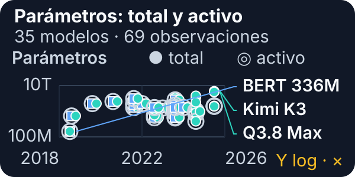](../_assets/ai-training-parameters.svg)

[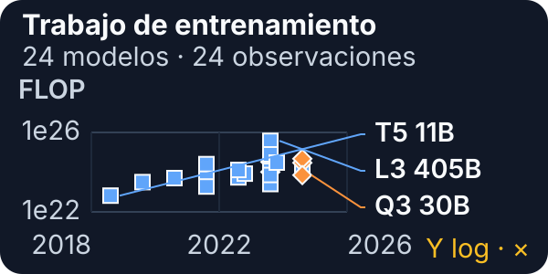](../_assets/ai-training-flop.svg)

Los **parámetros totales** deben almacenarse; los **parámetros activos** son la parte aproximada que un MoE usa por token. La serie va de 336 millones en BERT-Large a 2.8 billones en Kimi K3; el trabajo documentado va de 6.6e22 FLOP en T5-11B a 3.7908e25 en Llama 3.1-405B. Son escala y trabajo, no tiempo ni FLOP/s sostenidos.

[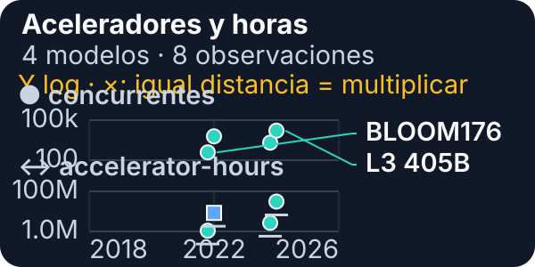](../_assets/ai-training-accelerators.svg)

[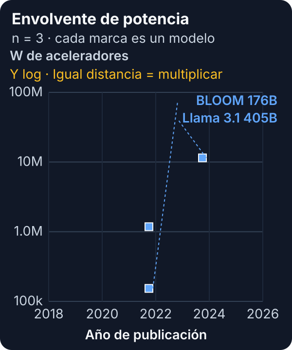](../_assets/ai-training-power.svg)

BLOOM publica 384 aceleradores; PaLM, 6,144; Llama 3.1-405B, 16,384 y 30.84 millones de GPU-h. Sólo tres modelos permiten una envolvente de potencia comparable. **TDP no es potencia de pared**: la suma térmica no es lectura del medidor.

[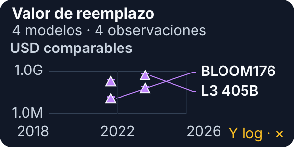](../_assets/ai-training-replacement-value.svg)

Para las cuatro flotas con conteo publicado: `aceleradores × USD 20,000–40,000` al 18 de agosto de 2026. Conserva el tipo nativo, pero es un **SCENARIO**, no costo histórico ni equivalencia de rendimiento. Excluye servidores, red, almacenamiento, energía y personal.

### Inferencia local a través del tiempo

[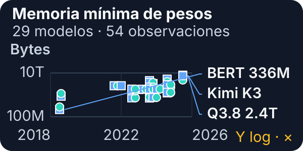](../_assets/ai-inference-memory.svg)

[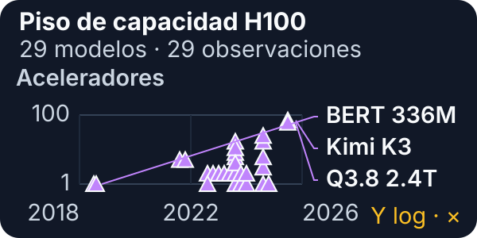](../_assets/ai-inference-accelerators.svg)

El artefacto es el archivo real; el piso BF16 usa `parámetros × 16 ÷ 8`. La capacidad va de una H100 para BERT-Large hasta 70 para el piso de Kimi K3. Es sólo “¿cabe?”: **no es un servidor**, topología recomendada ni garantía del runtime.

[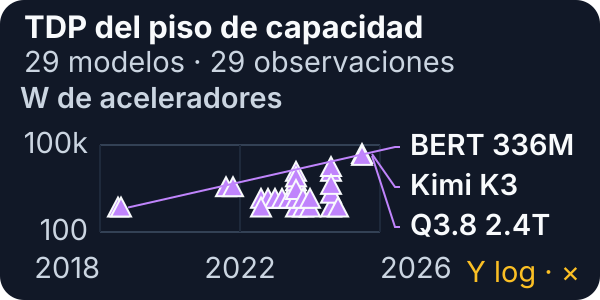](../_assets/ai-inference-power.svg)

[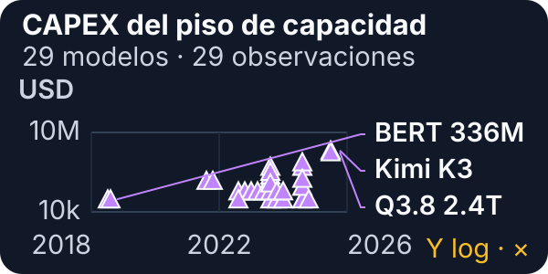](../_assets/ai-inference-capex.svg)

Ambos paneles reutilizan el mismo entero: `H100 × 700 W` y `H100 × USD 30,000`. Por eso el rango va de 700 W/USD 30,000 a 49 kW/USD 2.1 millones. No incluye CPU, RAM, chasis, red, KV, reserva, pared o nivel de servicio.

Esta última vista devuelve la comparación al tamaño del modelo. Un MoE puede activar menos parámetros por token, pero todavía necesita alojar o repartir todos sus expertos.

### Pareto: mejorar una cosa sin empeorar la otra

[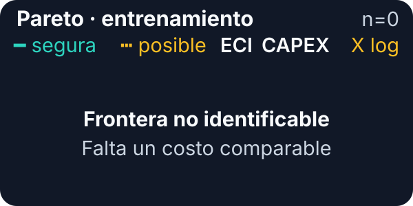](../_assets/ai-pareto-training.svg)

[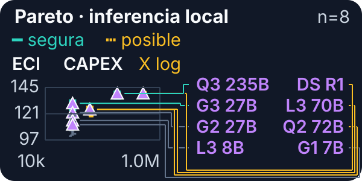](../_assets/ai-pareto-inference.svg)

Entrenamiento queda sin frontera: ninguna de las cuatro flotas coincide con una variante ECI exacta. Inferencia cruza ECI con el piso de capacidad local. Dominar significa costar no más y lograr ECI no menor. **ECI no es IQ** y ninguna frontera decide por sí sola qué modelo conviene.

### Qué sí y qué no puedes concluir

| Sí puedes decir | No puedes decir |
|---|---|
| “Este valor es publicado, derivado o escenario.” | “Un número faltante vale cero.” |
| “Este artefacto exige al menos esta capacidad.” | “Esta cantidad garantiza throughput o latencia.” |
| “Este punto no está dominado bajo estos ejes.” | “Es el mejor modelo para cualquier tarea.” |
| “La tendencia abarca varios órdenes de magnitud.” | “Parámetros, FLOP, watts y dólares miden calidad.” |

Para auditar fórmulas, rangos, variantes, fuentes, resultados negativos y el snapshot de ECI, abre [[evidencia-dashboard-ia]]. Ahí vive el expediente completo; esta página conserva sólo la ruta para explicar.

### Recapitulación del dashboard

1. Primero identifica el eje, la unidad y el estado del dato.
2. En entrenamiento, separa trabajo, tasa, flota, tiempo y potencia.
3. En inferencia, un piso de pesos responde “¿cabe?”, no “¿sirve bien?”.
4. CAPEX comparable es una frontera declarada, no costo total real.
5. Una frontera de Pareto ayuda a descartar opciones dominadas; no reemplaza la decisión de uso.

## Guía de decisión

1. **Define la carga:** inferencia o entrenamiento, precisión, contexto, concurrencia, latencia y volumen.
2. **Presupuesta memoria:** pesos más caché KV o activaciones, gradientes, optimizador, temporales y margen del runtime.
3. **Mide:** utilización, memoria máxima, bytes, latencia, throughput, potencia de pared y calidad.
4. **Ataca el límite:** capacidad para OOM; localidad o bandwidth para datos; compute para unidades saturadas; interconexión para comunicación.
5. **Escala el tramo útil:** batching, cuantización validada y cluster sólo cuando capacidad o servicio lo exige.
6. **Incluye operación:** software, disponibilidad, confiabilidad, seguridad, costo total y energía.

## Antes de practicar

La decisión no comienza con una marca o una ficha técnica. Comienza con una carga concreta y una medición comparable. Primero se separa capacidad de velocidad: si el trabajo no cabe, la ejecución falla o descarga estado a una capa más lenta. Si cabe, todavía puede esperar datos, coordinación o unidades de cómputo. Esa separación evita comprar FLOP/s para un problema de memoria o añadir memoria a un problema dominado por comunicación.

Después se identifica la escala donde aparece el límite. Dentro de un core importan instrucciones, pipeline y caché. Entre CPU y acelerador importan copias, sincronización y tamaño de lote. Entre dispositivos o racks importan las colectivas, la red y el trabajo que queda disponible entre sincronizaciones. El mismo síntoma —GPU con baja utilización— puede venir de causas distintas en cada escala.

Por último se conserva el contexto de la cifra. Un máximo de producto es **FACT**, una cuenta explícita es **DERIVED** y una configuración hipotética es **SCENARIO**. Un rango construido con supuestos declarados es **ESTIMATE**. Ninguna etiqueta convierte el número en rendimiento observado.

La práctica oficial aparece a continuación, al final de la unidad. Incluye seis preguntas conceptuales, tres escenarios de decisión y quince flashcards. Los escenarios se resuelven en tres grupos pequeños, en paralelo, durante siete minutos; las tarjetas quedan como recuperación postclase y no añaden tiempo al bloque presencial.

## Qué debes recordar

- Divide bits entre ocho para obtener bytes; declara siempre si usas GB o GiB.
- Pesos son sólo el piso: inferencia añade KV y temporales; entrenamiento añade activaciones, gradientes y optimizador.
- Parámetros totales determinan almacenamiento; activos aproximan trabajo por token en MoE.
- Más contexto, batch o chips cambian memoria, espera y comunicación; no garantizan aceleración lineal.
- FACT, DERIVED, ESTIMATE y SCENARIO responden preguntas distintas. “No divulgado” evita convertir rumores en hechos.
- Potencia es una tasa con base declarada; energía integra esa potencia durante un tiempo. TDP, TGP y máximos medidos no son equivalentes.
- CAPEX sólo se compara con la misma frontera: aceleradores solos o sistema completo, con inclusiones, fecha y canal visibles.
- HBM física no es HBM utilizable; que un presupuesto quepa tampoco demuestra ausencia de OOM ni cumplimiento de SLA.
- **NOT_FOUND** significa que el corpus revisado no contiene el observable; **ESTIMATION_NOT_IDENTIFIABLE** significa que, por faltar observables, el resultado no puede calcularse defendiblemente.

## Fuentes

- [Python C API — objetos de punto flotante](https://docs.python.org/3/c-api/float.html) y [`sys.getsizeof`](https://docs.python.org/3/library/sys.html#sys.getsizeof): `float` de CPython, `double` de C y alcance de la medición directa del objeto.
- [NumPy — `ndarray.nbytes`](https://numpy.org/doc/stable/reference/generated/numpy.ndarray.nbytes.html): bytes consumidos por los elementos frente a atributos no incluidos.
- [Hugging Face Transformers — GPU memory usage](https://huggingface.co/docs/transformers/model_memory_anatomy): pesos mixed precision, gradientes, estados Adam, activaciones y temporales.
- [NVIDIA NIM — Troubleshooting GPU Memory OOM](https://docs.nvidia.com/nim/large-language-models/latest/troubleshooting/memory.html): fórmula de pesos, KV cache, contexto y overhead de inferencia.
- [NVIDIA Megatron Bridge — Parallelisms Guide](https://docs.nvidia.com/nemo/megatron-bridge/latest/parallelisms.html): paralelismo de datos/modelo y comunicación colectiva.
- [Apple Newsroom — MacBook Pro con M5 Pro y M5 Max](https://www.apple.com/newsroom/2026/03/apple-introduces-macbook-pro-with-all-new-m5-pro-and-m5-max/): memoria unificada y bandwidth del M5 Max.
- [NVIDIA — GeForce RTX 5090](https://www.nvidia.com/en-us/geforce/graphics-cards/50-series/rtx-5090/): capacidad y TGP; [arquitectura RTX Blackwell](https://images.nvidia.com/aem-dam/Solutions/geforce/blackwell/nvidia-rtx-blackwell-gpu-architecture.pdf): bandwidth.
- [Google Cloud — TPU7x Ironwood](https://docs.cloud.google.com/tpu/docs/tpu7x): HBM, picos por precisión, interconexión y tamaño de pod.
- [NVIDIA — DGX GB300](https://www.nvidia.com/en-us/data-center/dgx-gb300/): composición, memoria y bandwidth; [NVL72 System Components](https://docs.nvidia.com/enterprise-reference-architectures/nvl72-ai-factory/latest/components.html): NVLink, refrigeración y potencia máxima.
- [NVIDIA H100](https://www.nvidia.com/es-la/data-center/h100/) y [A100 datasheet](https://www.nvidia.com/content/dam/en-zz/Solutions/Data-Center/a100/pdf/nvidia-a100-datasheet-nvidia-us-2188504-web.pdf): HBM, tasas pico por precisión y potencia del módulo; [Cloud TPU v4](https://docs.cloud.google.com/tpu/docs/v4): HBM, tasa BF16 y potencia medida por chip.
