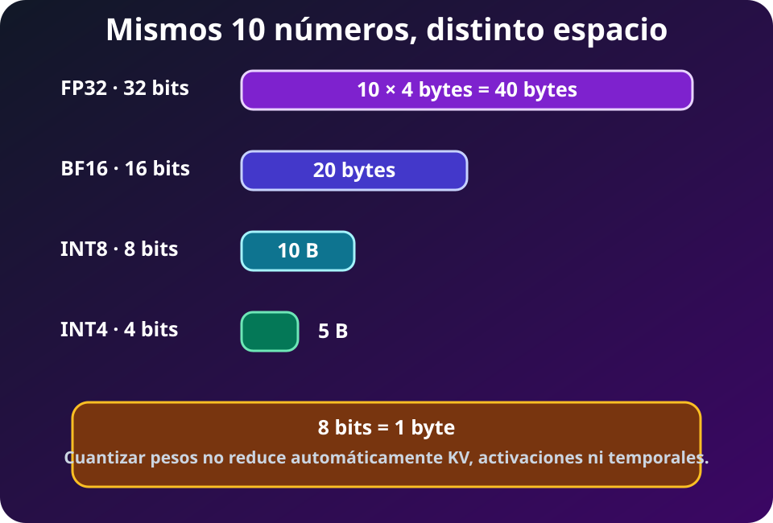
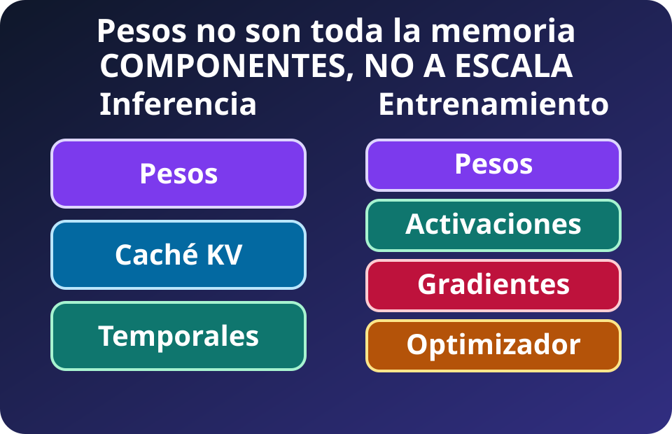
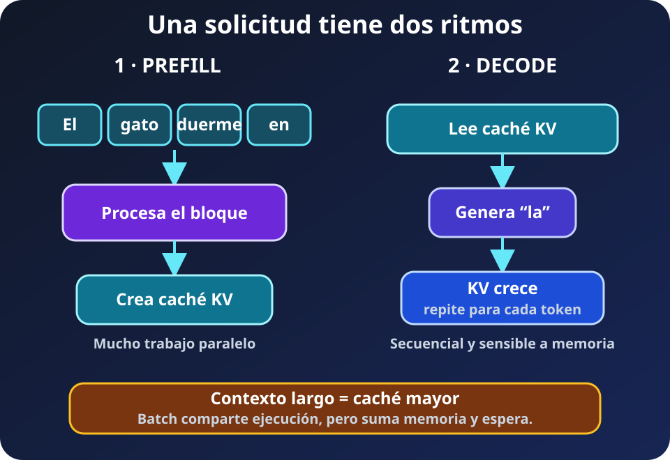
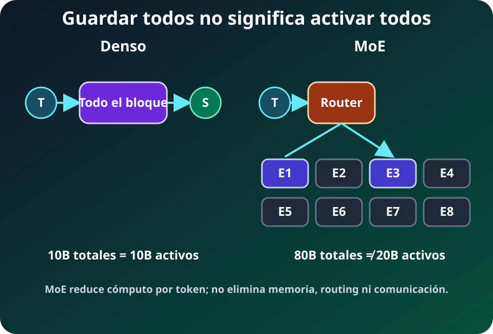
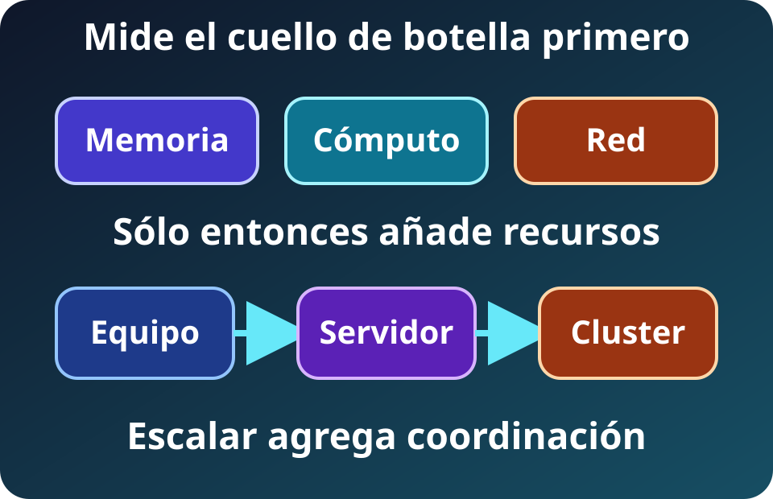

Un modelo de IA transforma entradas con parámetros. El hardware aloja y mueve su estado para cumplir latencia, throughput, energía y costo. **Los parámetros inician el presupuesto, no lo completan.**

## Ejemplo de juguete: diez parámetros

Un **parámetro** es un número aprendido. Imagina este modelo diminuto:

`[0.2, -0.7, 1.1, 0.0, 0.4, -0.3, 0.8, 0.5, -0.1, 0.9]`

Hay diez parámetros. Un **bit** puede valer 0 o 1; ocho bits forman un **byte**. Si cada número se guarda con 32 bits, ocupa 4 bytes porque $32\div8=4$. Los diez pesan $10\times4=40$ bytes. Con 16 bits pesan 20 bytes; con 8 bits, 10 bytes; con 4 bits, 5 bytes.

*Diagrama propio del curso, SVG accesible, 2026.*

**Lectura visual:** reducir bits reduce el almacenamiento de los pesos. No garantiza la misma calidad ni reduce automáticamente cachés, activaciones o temporales.

| Unidad | Cantidad exacta usada aquí | Intuición |
|---|---:|---|
| bit | 0 o 1 | La unidad mínima |
| byte | 8 bits | La unidad habitual de almacenamiento |
| GB | $10^9$ bytes | Convención decimal de fichas comerciales |
| GiB | $2^{30}$ bytes | Convención binaria frecuente en software |

**DERIVED:** 14 GB decimales equivalen a unos 13.04 GiB. No desapareció memoria; cambió la unidad.

## Inferencia y entrenamiento ocupan memoria distinta

*Diagrama propio del curso, SVG accesible, 2026. Los bloques nombran componentes; sus tamaños no están a escala.*

**Lectura visual:** inferencia necesita pesos, caché KV y temporales. Entrenamiento añade activaciones, gradientes y estados del optimizador. El runtime reserva otros buffers.

En **inferencia**, *prefill* procesa el prompt y *decode* produce tokens reutilizando la **caché KV**. Evita recalcular la historia, pero ocupa memoria.

*Diagrama propio del curso, SVG accesible, 2026.*

| Fase | Entrada por paso | Trabajo dominante | Sensible a |
|---|---|---|---|
| Prefill | Muchos tokens del prompt | Cálculo matricial y creación de KV | Longitud del prompt, FLOPS |
| Decode | Un token nuevo por secuencia | Leer pesos y KV repetidamente | Ancho de banda, batch, contexto |

**Ejemplo de juguete:** cuatro personas envían 1,000 tokens y piden 100 nuevos. Prefill absorbe 4,000 tokens de entrada; decode realiza 100 pasos por solicitud. Agruparlas puede aprovechar el chip, pero mantiene cuatro cachés KV y puede hacer esperar a la primera persona.

Más **contexto** aumenta caché KV y atención; suele empeorar latencia y throughput por solicitud. El máximo admitido no indica cuántas peticiones caben.

El **batching** agrupa secuencias: puede elevar throughput, pero consume memoria y suma espera. Contexto y batch se ajustan por separado con solicitudes reales.

En **entrenamiento**, *forward* crea activaciones, *backward* gradientes y el optimizador actualiza parámetros. *Recomputation* cambia memoria por cálculo. Partir estados reduce memoria local, pero obliga a comunicarlos.

## La cuenta mínima de los pesos

Primero definimos cada símbolo:

| Símbolo | Significado | Unidad |
|---|---|---|
| $N_p$ | número de parámetros del modelo | parámetros |
| $b$ | bits usados por cada parámetro | bits/parámetro |
| $M_{pesos}$ | memoria total ocupada sólo por los pesos | bytes |

### Por qué dividimos entre ocho

La precisión suele expresarse en **bits**, pero la memoria se cuenta en **bytes**. La conversión es:

`8 bits = 1 byte`

Por eso dividimos los bits entre ocho:

| Precisión | Bits por parámetro | Cuenta | Bytes por parámetro |
|---|---:|---:|---:|
| FP32 | 32 bits | `32 ÷ 8 = 4 bytes` | 4 bytes |
| BF16 | 16 bits | `16 ÷ 8 = 2 bytes` | 2 bytes |
| INT8 | 8 bits | `8 ÷ 8 = 1 byte` | 1 byte |
| INT4 | 4 bits | `4 ÷ 8 = 0.5 byte` | 0.5 byte en promedio |

Ahora usemos diez parámetros FP32:

`10 parámetros × 4 bytes = 40 bytes`

La fórmula general sólo abrevia esa misma cuenta. Primero convierte $b$ bits a bytes con $b\div8$; después multiplica por los $N_p$ parámetros:

$$M_{pesos}=N_p\times\frac{b}{8}$$

Se lee así: **memoria de los pesos = cantidad de parámetros × bytes por parámetro**.

**FACT (convención decimal):** en nombres como 7B, B representa $10^9$ parámetros y T representa $10^{12}$. En tamaños de almacenamiento, GB y TB también se usan aquí en escala decimal.

**DERIVED (GB decimales, sólo pesos):**

- **7B:** BF16 = $7\times10^9\times2$ bytes = **14 GB**; INT8 = **7 GB**; INT4 = **3.5 GB**.
- **70B:** BF16 = **140 GB**; INT8 = **70 GB**; INT4 = **35 GB**.
- **1T:** BF16 = **2 TB**; INT8 = **1 TB**; INT4 = **0.5 TB**.

Son capacidades lógicas. GiB, escalas, *padding*, buffers y particionado cambian la memoria física.

| Escala | BF16, 2 bytes | INT8, 1 byte | INT4, 0.5 byte | Intuición |
|---:|---:|---:|---:|---|
| 10 parámetros | 20 B | 10 B | 5 B | Juguete visible |
| 7B | 14 GB | 7 GB | 3.5 GB | Puede caber en una GPU, según overhead |
| 70B | 140 GB | 70 GB | 35 GB | Exige más capacidad o particionado |
| 1T | 2 TB | 1 TB | 0.5 TB | Escala de servidor o cluster |

**DERIVED (presupuesto base de esta receta):** *mixed precision* con Adam clásico suma **~18 bytes por parámetro**: 2 de pesos BF16/FP16 + 4 de copia FP32 + 4 de gradiente FP32 + 8 de estados Adam FP32. Para 7B, 70B y 1T son **126 GB**, **1.26 TB** y **18 TB** de estado agregado del modelo, antes de activaciones y temporales.

No obliga a guardar 18 bytes completos en cada GPU. El **sharding** reparte estado y reduce memoria local a cambio de comunicación y buffers. Precisión, activaciones, temporales e implementación cambian el máximo real.

## Cuantizar cambia más que capacidad

**Lectura visual:** cada reducción a la mitad de bits reduce a la mitad el piso de pesos. Las barras no incluyen KV, runtime ni calidad numérica.

Cuantizar pesos reduce bytes y tráfico, pero exige soporte y validación numérica; INT4 no duplica necesariamente la velocidad de INT8.

Cuantizar pesos no reduce automáticamente caché KV ni activaciones. Valida precisión, contexto, batch y calidad en el hardware real.

## Denso y MoE no cuentan lo mismo

Un modelo **denso** usa todos sus parámetros en cada token. Un **Mixture of Experts**, o **MoE**, contiene varios bloques expertos y un router selecciona algunos para cada token. Por eso se reportan dos cantidades:

- **Parámetros totales:** capacidad que debe almacenarse o repartirse.
- **Parámetros activos:** parte aproximada usada para procesar un token.

*Diagrama propio del curso, SVG accesible, 2026.*

**Lectura visual:** el modelo MoE conserva todos los expertos en memoria, mientras la ruta resaltada atraviesa sólo los elegidos para ese token.

**Ejemplo de juguete:** ocho expertos de 10 parámetros suman 80 almacenados. Si el router usa dos, activa 20 por token. Eso reduce cálculo frente a usar 80, pero no reduce el almacenamiento a 20; además añade ruteo y comunicación.

## Distribuir crea una segunda carga

Distribuir añade una segunda carga:

- **Paralelismo de datos:** replica el modelo y divide batches. En entrenamiento, **all-reduce** combina y redistribuye gradientes; en inferencia, réplicas atienden solicitudes distintas.
- El **paralelismo de modelo** es el paraguas para dividir un modelo entre dispositivos. Sus formas incluyen tensor y pipeline.
- **Paralelismo tensorial:** parte tensores de cada capa; colectivas como all-reduce o all-gather exigen enlaces rápidos.
- **Paralelismo de pipeline:** reparte grupos de capas; envía activaciones y puede crear burbujas.

Bandwidth, latencia y topología determinan el resultado. **Más dispositivos no prometen speedup lineal.**

## Del chip al centro de datos

*Diagrama propio del curso, SVG accesible, 2026.*

**Lectura visual:** primero se mide memoria, cómputo y comunicación; después se escala. Cada salto añade capacidad, coordinación, fallas y energía.

La cadena es **chip → board → servidor → rack → cluster → centro de datos**. Cada nivel añade memoria, red, potencia, refrigeración y operación.

| Escala | Lo que agrega | Nuevo límite posible |
|---|---|---|
| Chip | Unidades y memoria local | Capacidad o bandwidth local |
| Servidor | Varios chips y enlaces | PCIe/NVLink, CPU, alimentación |
| Rack | Decenas de aceleradores | Red interna y refrigeración |
| Cluster | Muchos racks | Colectivas, fallas y almacenamiento |
| Centro de datos | Energía e infraestructura | Red eléctrica, agua, operación |

**Sharding** reparte un tensor o estado entre dispositivos. Permite que algo grande quepa, pero cada capa puede necesitar intercambios. Si duplicar chips reduce a la mitad el cálculo local y duplica la espera de red, el tiempo total no se reduce a la mitad.

## Cuatro ejemplos representativos, no un ranking

- **FACT (límite de producto):** M5 Max admite hasta **128 GB unificados** y **614 GB/s**; no son benchmark ni TDP.
- **FACT (referencia NVIDIA):** RTX 5090 tiene **32 GB GDDR7**, **1,792 GB/s de ancho de banda pico de memoria** y **575 W TGP**. Pesos, cachés y temporales comparten capacidad; tarjetas de ensambladores pueden variar.
- **FACT (picos por chip):** TPU7x ofrece **192 GiB HBM**, **7,380 GB/s**, **2,307 TFLOPS BF16** y **4,614 TFLOPS FP8**; un pod llega a **9,216 chips**. No es desempeño observado.
- **FACT (sistema oficial, máximos agregados):** DGX GB300 integra **72 GPU Blackwell Ultra**, **36 CPU Grace**, **20 TB de memoria GPU**, hasta **576 TB/s** HBM y **130 TB/s NVLink**. El rack usa refrigeración líquida y admite hasta **142 kW**; es capacidad máxima, no consumo medido.

No son un ranking: la aplicación y la medición completa deciden.

## Modelos actuales: comparar sin inventar

Una ficha pública suele revelar precio y contexto, pero no parámetros, precisión de servicio, chips ni energía. Una publicación de pesos abiertos permite calcular memoria, pero todavía no determina el costo de entrenamiento. La tabla conserva esos huecos.

| Familia vigente al 17-08-2026 | Tipo y fecha pública | Parámetros total/activos | Contexto | Precio API publicado por 1M tokens | Evidencia y confianza |
|---|---|---:|---:|---:|---|
| OpenAI GPT-5.6 Sol | Cerrado, 2026 | No divulgado | 1,050,000 | USD 5 entrada / 30 salida | **FACT**, alta para ficha y precio; tamaño no divulgado |
| Anthropic Claude Fable 5 | Cerrado, 2026 | No divulgado | Publicado en su ficha; depende de modalidad | USD 10 / 50 | **FACT**, alta para precio; tamaño no divulgado |
| Google Gemini 3.6 Flash | Cerrado, 2026 | No divulgado | 1,000,000 | USD 0.75 / 3.75 hasta 31-12-2026 | **FACT**, alta para API; chips no divulgados |
| Moonshot Kimi K3 | MoE con pesos, 16-07-2026 | 2.8T / 104B | 1,048,576 | CNY 20 entrada sin caché / 100 salida | **FACT**, alta para model card; precio por región |
| Alibaba Qwen3.7 Max | Cerrado, 2026 | No divulgado | Hasta 1,000,000 según endpoint | Desde USD 1.65 / 4.951 | **FACT**, media; región y tramo cambian precio |
| Qwen3.6-35B-A3B | MoE con pesos abiertos, 16-04-2026 | 35B / 3B | 262,144 nativo; extensible a 1,010,000 | Autoalojado; no existe un precio API universal | **FACT**, alta para model card; operación depende del sistema |

“No divulgado” es un resultado, no un dato faltante que deba rellenarse. Los nombres, límites y precios cambian; cada fila enlaza abajo a la ficha primaria y debe fecharse al enseñarla.

### Una cuenta verificable con pesos abiertos

**DERIVED (confianza alta para la aritmética):** si Qwen3.6-35B-A3B almacenara sus 35B parámetros uniformemente en BF16, el piso sería $35\times2=70$ GB decimales. En INT8 serían 35 GB. Los 3B activos indican cálculo aproximado por token, **no** que sólo deban almacenarse 3 GB.

**ESTIMATE (confianza media):** añadiendo 10–25 % para cuantización por grupos, escalas, buffers y runtime, una representación INT8 de 35 GB podría requerir aproximadamente **39–44 GB**, antes de KV cache. Supuesto: pesos uniformes y overhead multiplicativo; debe medirse con el runtime elegido.

### Chips, TFLOPS, energía y entrenamiento

| Pregunta | Lo que sí puede afirmarse | Lo que no se puede concluir |
|---|---|---|
| Qué chip sirvió una respuesta | El proveedor puede publicar familias de infraestructura | Que una solicitud usó un modelo o número exacto de chips |
| Cuántos TFLOPS entrenaron un modelo | Un chip publica picos por precisión | Pico × tiempo no equivale a trabajo útil sin utilización |
| Cuánta energía consumió entrenar | Requiere potencia de pared, tiempo y frontera | Parámetros o precio API no revelan kWh |
| Cuánto cuesta inferir | Precio API es verificable para el cliente | Precio no equivale a costo interno ni energía |

**FACT (confianza alta):** OpenAI declara que GPT-5.5 fue entrenado en Stargate Abilene con sistemas NVIDIA GB200. No publica una asignación completa por modelo de chips, horas ni kWh. **FACT:** OpenAI también anunció compromisos de infraestructura de 3 GW para inferencia y 2 GW para entrenamiento con Vera Rubin. Son capacidades agregadas futuras, no la potencia de GPT-5.6.

**ESTIMATE reproducible, no afirmación sobre esos modelos:** un entrenamiento hipotético con 4,096 aceleradores que promedian 700 W durante 60 días usa sólo en aceleradores:

$$4{,}096\times0.7\ \mathrm{kW}\times24\times60=4.13\ \mathrm{GWh}$$

Con un PUE supuesto de 1.2, la instalación consumiría cerca de **4.95 GWh** para esa frontera. Confianza alta en la multiplicación y baja en su aplicación a un modelo real: cantidad, potencia media, duración, reinicios, CPU, red y PUE pueden ser distintos.

### Ejemplo de costo de inferencia

**DERIVED:** con el precio promocional de Gemini 3.6 Flash vigente el 17-08-2026, USD 0.75 por millón de tokens de entrada y USD 3.75 por millón de salida, una solicitud de 10,000 tokens de entrada y 2,000 de salida costaría:

$$0.01\times0.75+0.002\times3.75=\$0.015$$

Ese es costo facturado bajo el supuesto indicado. No revela watts, número de chips ni latencia. Para comparar proveedores deben coincidir región, modalidad, caché, lote, calidad y fecha.

## Guía de decisión

1. **Define la carga:** inferencia o entrenamiento, precisión, contexto, concurrencia, latencia y volumen.
2. **Presupuesta memoria:** pesos más caché KV o activaciones, gradientes, optimizador, temporales y margen del runtime.
3. **Mide:** utilización, memoria máxima, bytes, latencia, throughput, potencia de pared y calidad.
4. **Ataca el límite:** capacidad para OOM; localidad o bandwidth para datos; compute para unidades saturadas; interconexión para comunicación.
5. **Escala el tramo útil:** batching, cuantización validada y cluster sólo cuando capacidad o servicio lo exige.
6. **Incluye operación:** software, disponibilidad, confiabilidad, seguridad, costo total y energía.

## Antes de practicar

La decisión no comienza con una marca o una ficha técnica. Comienza con una carga concreta y una medición comparable. Primero se separa capacidad de velocidad: si el trabajo no cabe, la ejecución falla o descarga estado a una capa más lenta. Si cabe, todavía puede esperar datos, coordinación o unidades de cómputo. Esa separación evita comprar FLOPS para un problema de memoria o añadir memoria a un problema dominado por comunicación.

Después se identifica la escala donde aparece el límite. Dentro de un core importan instrucciones, pipeline y caché. Entre CPU y acelerador importan copias, sincronización y tamaño de lote. Entre dispositivos o racks importan las colectivas, la red y el trabajo que queda disponible entre sincronizaciones. El mismo síntoma —GPU con baja utilización— puede venir de causas distintas en cada escala.

Por último se conserva el contexto de la cifra. Un máximo de producto es **FACT**, una cuenta explícita es **DERIVED** y un escenario docente es **ESTIMATE**. Ninguna de esas etiquetas convierte el número en rendimiento observado. Una comparación útil mantiene constantes tarea, precisión, calidad, lote, contexto y frontera energética; luego registra capacidad máxima, latencia, throughput, bytes movidos y potencia de pared.

La práctica oficial aparece a continuación, al final de la unidad. Incluye seis preguntas conceptuales, tres escenarios de decisión y quince flashcards. Los escenarios se resuelven en tres grupos pequeños, en paralelo, durante siete minutos; las tarjetas quedan como recuperación postclase y no añaden tiempo al bloque presencial.

## Qué debes recordar

- Divide bits entre ocho para obtener bytes; declara siempre si usas GB o GiB.
- Pesos son sólo el piso: inferencia añade KV y temporales; entrenamiento añade activaciones, gradientes y optimizador.
- Parámetros totales determinan almacenamiento; activos aproximan trabajo por token en MoE.
- Más contexto, batch o chips cambian memoria, espera y comunicación; no garantizan aceleración lineal.
- FACT, DERIVED y ESTIMATE responden preguntas distintas. “No divulgado” evita convertir rumores en hechos.

## Fuentes

- [Hugging Face Transformers — GPU memory usage](https://huggingface.co/docs/transformers/model_memory_anatomy): pesos mixed precision, gradientes, estados Adam, activaciones y temporales.
- [NVIDIA NIM — Troubleshooting GPU Memory OOM](https://docs.nvidia.com/nim/large-language-models/latest/troubleshooting/memory.html): fórmula de pesos, KV cache, contexto y overhead de inferencia.
- [NVIDIA Megatron Bridge — Parallelisms Guide](https://docs.nvidia.com/nemo/megatron-bridge/latest/parallelisms.html): paralelismo de datos/modelo y comunicación colectiva.
- [Apple Newsroom — MacBook Pro con M5 Pro y M5 Max](https://www.apple.com/newsroom/2026/03/apple-introduces-macbook-pro-with-all-new-m5-pro-and-m5-max/): memoria unificada y bandwidth del M5 Max.
- [NVIDIA — GeForce RTX 5090](https://www.nvidia.com/en-us/geforce/graphics-cards/50-series/rtx-5090/): capacidad y TGP; [arquitectura RTX Blackwell](https://images.nvidia.com/aem-dam/Solutions/geforce/blackwell/nvidia-rtx-blackwell-gpu-architecture.pdf): bandwidth.
- [Google Cloud — TPU7x Ironwood](https://docs.cloud.google.com/tpu/docs/tpu7x): HBM, picos por precisión, interconexión y tamaño de pod.
- [NVIDIA — DGX GB300](https://www.nvidia.com/en-us/data-center/dgx-gb300/): composición, memoria y bandwidth; [NVL72 System Components](https://docs.nvidia.com/enterprise-reference-architectures/nvl72-ai-factory/latest/components.html): NVLink, refrigeración y potencia máxima.
- [OpenAI — GPT-5.6](https://openai.com/index/gpt-5-6/) y [modelos API](https://developers.openai.com/api/docs/models/compare): versión, contexto y precios; [infraestructura para la era de inteligencia](https://openai.com/index/building-the-compute-infrastructure-for-the-intelligence-age/): entrenamiento en GB200; [Scaling AI for everyone](https://openai.com/index/scaling-ai-for-everyone/): compromisos agregados de infraestructura.
- [Anthropic — Claude Fable 5](https://www.anthropic.com/claude/fable) y [anuncio Fable 5](https://www.anthropic.com/news/claude-fable-5-mythos-5): ficha y precio del modelo.
- [Google AI — modelos Gemini](https://ai.google.dev/gemini-api/docs/latest-model) y [precios](https://ai.google.dev/gemini-api/docs/pricing): contexto, disponibilidad y precio de Gemini 3.6 Flash.
- [Moonshot AI — Kimi K3](https://huggingface.co/moonshotai/Kimi-K3) y [plataforma Kimi](https://platform.kimi.com/): arquitectura, parámetros, contexto y precio regional.
- [Qwen — Qwen3.6](https://github.com/QwenLM/Qwen3.6) y [Alibaba Model Studio — precios](https://www.alibabacloud.com/help/en/model-studio/model-pricing): pesos abiertos, parámetros activos y precios regionales de Qwen3.7.
