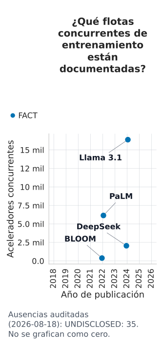
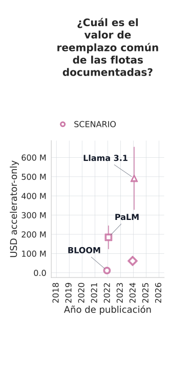
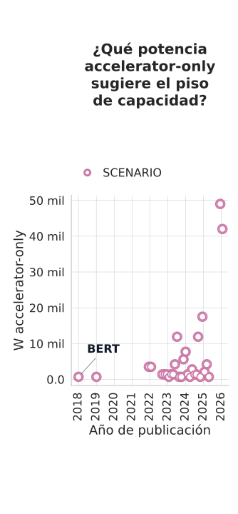
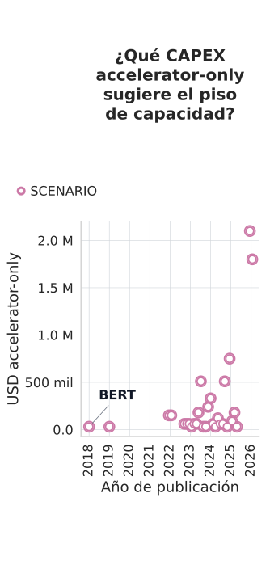

# Evidencia del dashboard de modelos de IA

**Anexo opcional.** Conserva el detalle que haría ilegible la ruta oral, pero no forma parte del recorrido principal de la clase. El corte del ledger es **2026-08-18**. Regresa a [[ia-escala-decision]] para explicar las cinco gráficas esenciales; usa esta página para auditar una celda o profundizar.

## Tabla maestra de 39 modelos

Esta tabla vive fuera de la ruta esencial. Resume acceso, arquitectura y la frontera de evidencia de entrenamiento e inferencia; los registros verticales posteriores conservan las 546 celdas completas.

##### Google

| Modelo · año | Ficha física |
|---|---|
| **BERT-Large · 2018** | abierto · dense · E: no publicado · I: artefacto |
| **T5-11B · 2019** | abierto · dense · E: cifra · I: artefacto |
| **Gopher 280B · 2021** | cerrado · dense · E: cifra · I: no identificable |
| **LaMDA 137B · 2022** | cerrado · dense · E: no publicado · I: no identificable |
| **Chinchilla 70B · 2022** | cerrado · dense · E: cifra · I: no identificable |
| **PaLM 540B · 2022** | cerrado · dense · E: cifra · I: no identificable |
| **Gemma 7B · 2024** | abierto · dense · E: cifra · I: artefacto |
| **Gemma 2 27B · 2024** | abierto · dense · E: cifra · I: artefacto |
| **Gemma 3 27B · 2025** | abierto · dense · E: cifra · I: artefacto |
| **Gemini 3.1 Pro · 2026** | cerrado · no publicado · E: no publicado · I: no identificable |

##### OpenAI y Anthropic

| Modelo · año | Ficha física |
|---|---|
| **GPT-3 175B · 2020** | cerrado · dense · E: cifra · I: no identificable |
| **GPT-5.6 Sol · 2026** | cerrado · no publicado · E: no publicado · I: no identificable |
| **Claude Sonnet 5 · 2026** | cerrado · no publicado · E: no publicado · I: no identificable |

##### Meta y BigScience

| Modelo · año | Ficha física |
|---|---|
| **OPT-175B · 2022** | abierto · dense · E: cifra · I: piso BF16 |
| **BLOOM 176B · 2022** | abierto · dense · E: cifra · I: artefacto |
| **Llama 1 65B · 2023** | abierto · dense · E: cifra · I: piso BF16 |
| **Llama 2 70B · 2023** | abierto · dense · E: cifra · I: artefacto |
| **Llama 3.1-8B · 2024** | abierto · dense · E: cifra · I: artefacto |
| **Llama 3.1-70B · 2024** | abierto · dense · E: cifra · I: artefacto |
| **Llama 3.1-405B · 2024** | abierto · dense · E: cifra · I: artefacto |
| **Llama 4 Scout · 2025** | abierto · MoE · E: no publicado · I: artefacto |

##### Qwen

| Modelo · año | Ficha física |
|---|---|
| **Qwen-72B · 2023** | abierto · dense · E: cifra · I: artefacto |
| **Qwen2-72B · 2024** | abierto · dense · E: cifra · I: artefacto |
| **Qwen2.5-72B · 2024** | abierto · dense · E: cifra · I: artefacto |
| **Qwen3-30B-A3B · 2025** | abierto · MoE · E: cifra · I: artefacto |
| **Qwen3-235B-A22B · 2025** | abierto · MoE · E: cifra · I: artefacto |
| **Qwen3.8-Max · 2026** | cerrado · MoE · E: no publicado · I: no identificable |
| **Qwen3.8-2.4T-A95B · 2026** | abierto · MoE · E: no publicado · I: piso BF16 |

##### DeepSeek y Mistral

| Modelo · año | Ficha física |
|---|---|
| **DeepSeek LLM 67B · 2023** | abierto · dense · E: cifra · I: artefacto |
| **Mistral 7B v0.1 · 2023** | abierto · dense · E: no publicado · I: artefacto |
| **Mixtral 8x7B · 2023** | abierto · MoE · E: no publicado · I: artefacto |
| **DeepSeek-V2 · 2024** | abierto · MoE · E: cifra · I: artefacto |
| **Mistral Large 2 · 2024** | abierto · dense · E: no publicado · I: artefacto |
| **DeepSeek-V3 · 2024** | abierto · MoE · E: cifra · I: artefacto |
| **DeepSeek-R1 · 2025** | abierto · MoE · E: no publicado · I: artefacto |

##### xAI y Moonshot

| Modelo · año | Ficha física |
|---|---|
| **Grok-1 · 2024** | abierto · MoE · E: no publicado · I: piso BF16 |
| **Kimi K2 · 2025** | abierto · MoE · E: cifra · I: artefacto |
| **Kimi K3 · 2026** | abierto · MoE · E: no publicado · I: artefacto |
| **Grok 4.5 · 2026** | cerrado · no publicado · E: no publicado · I: no identificable |

## Estados y frontera de la afirmación

| Estado | Lectura |
|---|---|
| `FACT` | Publicado por una fuente aplicable. |
| `DERIVED` | Cuenta reproducible desde entradas citadas. |
| `ESTIMATE` | Rango dependiente de supuestos explícitos. |
| `SCENARIO` | Comparación docente; no reconstruye historia real. |
| `UNDISCLOSED_BY_CREATOR` | El creador no divulgó el observable. |
| `NOT_FOUND` | El corpus revisado no contiene el observable. |
| `ESTIMATION_NOT_IDENTIFIABLE` | Faltan entradas para defender incluso un rango. |
| `NOT_APPLICABLE` | La métrica no corresponde a este registro. |

Una ausencia no vale cero. La **confianza** pertenece a cada celda y califica únicamente la evidencia y su reproducibilidad: no mide calidad del modelo ni vuelve probable un escenario.

| Confianza | Lectura reproducible |
|---|---|
| `high` | FACT con fuente aplicable; DERIVED cuyas entradas son `high`; o ausencia respaldada por corpus/fecha explícitos. |
| `medium` | DERIVED con trazabilidad parcial o ESTIMATE acotado, anclado en fuente y con supuestos. |
| `low` | Falta una fuente, entrada, fórmula, rango o registro de búsqueda necesario. |
| `not_applicable` | SCENARIO: la cuenta se reproduce, pero su premisa hipotética no tiene “certeza empírica”. |

Pesos abiertos no implican entrenamiento abierto; un producto alojado tampoco revela su arquitectura.

## Metodología de las series

- **Tiempo:** X es el año de publicación. Una fecha de lanzamiento no sustituye una fecha de entrenamiento.
- **Escala:** Y es logarítmica para magnitudes de varios órdenes; sólo recibe valores positivos.
- **Entrenamiento:** parámetros, FLOP, aceleradores concurrentes, accelerator-hours, potencia/energía y valor de reemplazo permanecen separados. GPU-h y TPU-chip-h no se suman.
- **Inferencia:** artefacto, piso de pesos, capacidad H100-equivalente, TDP y CAPEX son capacidad sin SLA. No se infieren throughput, TTFT ni costo por token.
- **Valor:** el precio común por acelerador es `SCENARIO`; por eso el resultado se llama valor de reemplazo o CAPEX equivalente, nunca costo real del modelo.

### Escenario de reemplazo del entrenamiento

Fecha común: **2026-08-18**. Para cada flota cuyo conteo concurrente sí fue publicado, se conserva el tipo nativo de acelerador y se calcula `conteo × USD 20,000–40,000`, con USD 30,000 como centro. Es una banda docente por plaza de acelerador: **no afirma equivalencia de rendimiento** entre A100, H100, H800 o TPU y no reconstruye contratos históricos.

El límite es `accelerator-only`. Excluye servidor, CPU, red, almacenamiento, energía, soporte, impuestos, financiamiento y trabajo. Por eso su estado y confianza son `SCENARIO · not_applicable`; lo confiable es la aritmética y el conteo citado, no que ese precio hubiese estado disponible para la compra real.

## Pisos de precisión

Para un modelo con `N` parámetros y precisión de `b` bits, el payload mínimo es `ceil(N × b ÷ 8)` bytes. BF16 usa 16 bits; FP8 e INT8 usan 8; INT4 usa 4. El resultado no incluye metadata, escalas de cuantización, KV, activaciones, workspace, alineación ni reserva.

| Precisión | Payload por parámetro |
|---|---:|
| BF16 | 2 bytes |
| FP8 | 1 byte |
| INT8 | 1 byte |
| INT4 | 0.5 bytes en promedio |

El piso H100-equivalente aplica `ceil(bytes ÷ 80,000,000,000)`. Es una unidad docente de capacidad física, **no** una GPU mínima comprable ni un servidor. Los escenarios de potencia y CAPEX multiplican ese entero por 700 W y USD 30,000 respectivamente.

### Escenario docente H100, visible y no atribuido

Ocho módulos H100 SXM durante 24 horas permiten auditar las fronteras físicas sin atribuir el supuesto a ningún modelo.

| Salida | Valor, estado y fuentes |
|---|---|
| hbm_physical | 640 GB_decimal · **DERIVED** · `S_COURSE_DESIGN`, `S_NVIDIA_H100_PAGE` |
| peak_rate | 7916 TFLOP_per_second_BF16_dense · **DERIVED** · `S_COURSE_DESIGN`, `S_NVIDIA_H100_PAGE` |
| power | 5600 W_configurable_TDP · **DERIVED** · `S_COURSE_DESIGN`, `S_NVIDIA_H100_PAGE` |
| accelerator_hours | 192 H100_accelerator_hour · **DERIVED** · `S_COURSE_DESIGN` |
| energy | 134.4 kWh_at_configurable_TDP_envelope · **SCENARIO** · `S_COURSE_DESIGN`, `S_NVIDIA_H100_PAGE` |
| capex | 240000 USD accelerator-only · **DERIVED** · `S_COURSE_DESIGN` |

## Metodología de frontera de Pareto

A domina a B cuando cuesta igual o menos y su capacidad general según ECI es igual o mayor, con al menos una desigualdad estricta. La **Frontera segura** reúne puntos no dominados incluso bajo extremos adversos; la **Frontera posible** reúne puntos no dominados para alguna realización del rango. No se decide con puntos medios.

El panel de entrenamiento exige ECI y valor de reemplazo defendible. El de inferencia admite sólo pesos abiertos con capacidad identificable. ECI no es IQ ni un ranking universal; el score corresponde a la variante exacta del snapshot.

Warning: truncated output (original token count: 37561)
Total output lines: 823

## Registros verticales por modelo

Cada registro declara identidad y scope antes de sus métricas. Todos los detalles opcionales —Fórmula, entradas, rangos y corpus negativo— se conservan en la misma celda.

### BERT-Large — `DM_BERT_LARGE`

**Identidad y scope:** Google · lanzamiento 2018-10-11 · variante uncased whole-word pretraining · `open_weights`. Arquitectura: `FACT` · dense architecture_class. Fuentes de identidad: S_DASH_GOOGLE_BERT_REPORT, S_ARTIFACT_BERT_LARGE.

- **year:** `DERIVED` · 2018 year · **confianza:** low · **source_ids:** S_DASH_GOOGLE_BERT_REPORT, S_ARTIFACT_BERT_LARGE · **formula:** year(release_date) · **input_metric_ids:** release_date
- **architecture:** `FACT` · dense architecture_class · **confianza:** high · **source_ids:** S_DASH_GOOGLE_BERT_REPORT
- **parameters_total:** `FACT` · 336000000 parameter · **confianza:** high · **source_ids:** S_DASH_GOOGLE_BERT_REPORT
- **parameters_active:** `DERIVED` · 336000000 parameter_per_token · **confianza:** high · **source_ids:** S_DASH_GOOGLE_BERT_REPORT · **formula:** parameters_active = total_parameters for a dense model · **input_metric_ids:** parameters_total
- **training_tokens:** `UNDISCLOSED_BY_CREATOR` · — · **confianza:** high · **source_ids:** S_DASH_GOOGLE_BERT_REPORT · **corpus_checked:** S_DASH_GOOGLE_BERT_REPORT · **checked_for_model_id:** DM_BERT_LARGE · **reason:** not_disclosed_in_creator_corpus
- **training_flop:** `UNDISCLOSED_BY_CREATOR` · — · **confianza:** high · **source_ids:** S_DASH_GOOGLE_BERT_REPORT · **corpus_checked:** S_DASH_GOOGLE_BERT_REPORT · **checked_for_model_id:** DM_BERT_LARGE · **reason:** exact_training_work_not_disclosed
- **accelerators_concurrent:** `UNDISCLOSED_BY_CREATOR` · — · **confianza:** high · **source_ids:** S_DASH_GOOGLE_BERT_REPORT · **corpus_checked:** S_DASH_GOOGLE_BERT_REPORT · **checked_for_model_id:** DM_BERT_LARGE · **reason:** not_disclosed_in_creator_corpus
- **accelerator_hours:** `UNDISCLOSED_BY_CREATOR` · — · **confianza:** high · **source_ids:** S_DASH_GOOGLE_BERT_REPORT · **corpus_checked:** S_DASH_GOOGLE_BERT_REPORT · **checked_for_model_id:** DM_BERT_LARGE · **reason:** not_disclosed_in_creator_corpus
- **accelerator_power_basis:** `UNDISCLOSED_BY_CREATOR` · — · **confianza:** high · **source_ids:** S_DASH_GOOGLE_BERT_REPORT · **corpus_checked:** S_DASH_GOOGLE_BERT_REPORT · **checked_for_model_id:** DM_BERT_LARGE · **reason:** applicable_accelerator_power_basis_not_identified
- **training_date:** `UNDISCLOSED_BY_CREATOR` · — · **confianza:** high · **source_ids:** S_DASH_GOOGLE_BERT_REPORT · **corpus_checked:** S_DASH_GOOGLE_BERT_REPORT · **checked_for_model_id:** DM_BERT_LARGE · **reason:** calendar_training_date_not_disclosed
- **artifact_revision:** `FACT` · bf1420893378c390773c9452c3602fcee89f9241 git_commit · **confianza:** high · **source_ids:** S_ARTIFACT_BERT_LARGE · **revision_scope:** exact_creator_repository_tree
- **artifact_bytes:** `FACT` · 1344952014 byte · **confianza:** high · **source_ids:** S_ARTIFACT_BERT_LARGE · **artifact_format:** safetensors · **manifest_id:** model_safetensors · **boundary:** selected_complete_weight_manifest_only
- **weight_floor_bf16:** `DERIVED` · 672000000 byte · **confianza:** high · **source_ids:** S_DASH_GOOGLE_BERT_REPORT · **formula:** ceil(total_parameters * precision_bits / 8) · **input_metric_ids:** parameters_total · **precision_bits:** 16 · **claim_scope:** theoretical_weight_payload_floor_not_artifact_not_runtime
- **weight_floor_fp8:** `DERIVED` · 336000000 byte · **confianza:** high · **source_ids:** S_DASH_GOOGLE_BERT_REPORT · **formula:** ceil(total_parameters * precision_bits / 8) · **input_metric_ids:** parameters_total · **precision_bits:** 8 · **claim_scope:** theoretical_weight_payload_floor_not_artifact_not_runtime
- **weight_floor_int8:** `DERIVED` · 336000000 byte · **confianza:** high · **source_ids:** S_DASH_GOOGLE_BERT_REPORT · **formula:** ceil(total_parameters * precision_bits / 8) · **input_metric_ids:** parameters_total · **precision_bits:** 8 · **claim_scope:** theoretical_weight_payload_floor_not_artifact_not_runtime
- **weight_floor_int4:** `DERIVED` · 168000000 byte · **confianza:** high · **source_ids:** S_DASH_GOOGLE_BERT_REPORT · **formula:** ceil(total_parameters * precision_bits / 8) · **input_metric_ids:** parameters_total · **precision_bits:** 4 · **claim_scope:** theoretical_weight_payload_floor_not_artifact_not_runtime
### T5-11B — `DM_T5_11B`

**Identidad y scope:** Google · lanzamiento 2019-10-23 · variante 11B base checkpoint · `open_weights`. Arquitectura: `FACT` · dense architecture_class. Fuentes de identidad: S_DASH_GOOGLE_T5_REPORT, S_ARTIFACT_T5_11B.

- **year:** `DERIVED` · 2019 year · **confianza:** low · **source_ids:** S_DASH_GOOGLE_T5_REPORT, S_ARTIFACT_T5_11B · **formula:** year(release_date) · **input_metric_ids:** release_date
- **architecture:** `FACT` · dense architecture_class · **confianza:** high · **source_ids:** S_DASH_GOOGLE_T5_REPORT
- **parameters_total:** `FACT` · 11000000000 parameter · **confianza:** high · **source_ids:** S_DASH_GOOGLE_T5_REPORT
- **parameters_active:** `DERIVED` · 11000000000 parameter_per_token · **confianza:** high · **source_ids:** S_DASH_GOOGLE_T5_REPORT · **formula:** parameters_active = total_parameters for a dense model · **input_metric_ids:** parameters_total
- **training_tokens:** `FACT` · 1000000000000 training_token · **confianza:** high · **source_ids:** S_DASH_GOOGLE_T5_REPORT
- **training_flop:** `DERIVED` · 66000000000000000000000 FLOP · **confianza:** high · **source_ids:** S_DASH_GOOGLE_T5_REPORT · **formula:** 6 * total_parameters * training_tokens · **input_metric_ids:** parameters_total, training_tokens
- **accelerators_concurrent:** `UNDISCLOSED_BY_CREATOR` · — · **confianza:** high · **source_ids:** S_DASH_GOOGLE_T5_REPORT · **corpus_checked:** S_DASH_GOOGLE_T5_REPORT · **checked_for_model_id:** DM_T5_11B · **reason:** not_disclosed_in_creator_corpus
- **accelerator_hours:** `UNDISCLOSED_BY_CREATOR` · — · **confianza:** high · **source_ids:** S_DASH_GOOGLE_T5_REPORT · **corpus_checked:** S_DASH_GOOGLE_T5_REPORT · **checked_for_model_id:** DM_T5_11B · **reason:** not_disclosed_in_creator_corpus
- **accelerator_power_basis:** `UNDISCLOSED_BY_CREATOR` · — · **confianza:** high · **source_ids:** S_DASH_GOOGLE_T5_REPORT · **corpus_checked:** S_DASH_GOOGLE_T5_REPORT · **checked_for_model_id:** DM_T5_11B · **reason:** applicable_accelerator_power_basis_not_identified
- **training_date:** `UNDISCLOSED_BY_CREATOR` · — · **confianza:** high · **source_ids:** S_DASH_GOOGLE_T5_REPORT · **corpus_checked:** S_DASH_GOOGLE_T5_REPORT · **checked_for_model_id:** DM_T5_11B · **reason:** calendar_training_date_not_disclosed
- **artifact_revision:** `FACT` · 90f37703b3334dfe9d2b009bfcbfbf1ac9d28ea3 git_commit · **confianza:** high · **source_ids:** S_ARTIFACT_T5_11B · **revision_scope:** exact_creator_repository_tree
- **artifact_bytes:** `FACT` · 45229452544 byte · **confianza:** high · **source_ids:** S_ARTIFACT_T5_11B · **artifact_format:** pytorch_bin · **boundary:** creator_repository_weight_files_only
- **weight_floor_bf16:** `DERIVED` · 22000000000 byte · **confianza:** high · **source_ids:** S_DASH_GOOGLE_T5_REPORT · **formula:** ceil(total_parameters * precision_bits / 8) · **input_metric_ids:** parameters_total · **precision_bits:** 16 · **claim_scope:** theoretical_weight_payload_floor_not_artifact_not_runtime
- **weight_floor_fp8:** `DERIVED` · 11000000000 byte · **confianza:** high · **source_ids:** S_DASH_GOOGLE_T5_REPORT · **formula:** ceil(total_parameters * precision_bits / 8) · **input_metric_ids:** parameters_total · **precision_bits:** 8 · **claim_scope:** theoretical_weight_payload_floor_not_artifact_not_runtime
- **weight_floor_int8:** `DERIVED` · 11000000000 byte · **confianza:** high · **source_ids:** S_DASH_GOOGLE_T5_REPORT · **formula:** ceil(total_parameters * precision_bits / 8) · **input_metric_ids:** parameters_total · **precision_bits:** 8 · **claim_scope:** theoretical_weight_payload_floor_not_artifact_not_runtime
- **weight_floor_int4:** `DERIVED` · 5500000000 byte · **confianza:** high · **source_ids:** S_DASH_GOOGLE_T5_REPORT · **formula:** ceil(total_parameters * precision_bits / 8) · **input_metric_ids:** parameters_total · **precision_bits:** 4 · **claim_scope:** theoretical_weight_payload_floor_not_artifact_not_runtime
### GPT-3 175B — `DM_GPT3_175B`

**Identidad y scope:** OpenAI · lanzamiento 2020-05-28 · variante davinci-scale base model · `closed_weights`. Arquitectura: `FACT` · dense architecture_class. Fuentes de identidad: S_OPENAI_GPT3_PAPER.

- **year:** `DERIVED` · 2020 year · **confianza:** low · **source_ids:** S_OPENAI_GPT3_PAPER · **formula:** year(release_date) · **input_metric_ids:** release_date
- **architecture:** `FACT` · dense architecture_class · **confianza:** high · **source_ids:** S_OPENAI_GPT3_PAPER
- **parameters_total:** `FACT` · 174600000000 parameter · **confianza:** high · **source_ids:** S_OPENAI_GPT3_PAPER
- **parameters_active:** `DERIVED` · 174600000000 parameter_per_token · **confianza:** high · **source_ids:** S_OPENAI_GPT3_PAPER · **formula:** parameters_active = total_parameters for a dense model · **input_metric_ids:** parameters_total
- **training_tokens:** `FACT` · 300000000000 training_token · **confianza:** high · **source_ids:** S_OPENAI_GPT3_PAPER
- **training_flop:** `DERIVED` · 314280000000000000000000 FLOP · **confianza:** high · **source_ids:** S_OPENAI_GPT3_PAPER · **formula:** 6 * total_parameters * training_tokens · **input_metric_ids:** parameters_total, training_tokens
- **accelerators_concurrent:** `UNDISCLOSED_BY_CREATOR` · — · **confianza:** high · **source_ids:** S_OPENAI_GPT3_PAPER · **corpus_checked:** S_OPENAI_GPT3_PAPER · **checked_for_model_id:** DM_GPT3_175B · **reason:** not_disclosed_in_creator_corpus
- **accelerator_hours:** `UNDISCLOSED_BY_CREATOR` · — · **confianza:** high · **source_ids:** S_OPENAI_GPT3_PAPER · **corpus_checked:** S_OPENAI_GPT3_PAPER · **checked_for_model_id:** DM_GPT3_175B · **reason:** not_disclosed_in_creator_corpus
- **accelerator_power_basis:** `UNDISCLOSED_BY_CREATOR` · — · **confianza:** high · **source_ids:** S_OPENAI_GPT3_PAPER · **corpus_checked:** S_OPENAI_GPT3_PAPER · **checked_for_model_id:** DM_GPT3_175B · **reason:** applicable_accelerator_power_basis_not_identified
- **training_date:** `UNDISCLOSED_BY_CREATOR` · — · **confianza:** high · **source_ids:** S_OPENAI_GPT3_PAPER · **corpus_checked:** S_OPENAI_GPT3_PAPER · **checked_for_model_id:** DM_GPT3_175B · **reason:** calendar_training_date_not_disclosed
- **artifact_revision:** `NOT_FOUND` · — · **confianza:** high · **source_ids:** S_OPENAI_GPT3_PAPER · **corpus_checked:** S_OPENAI_GPT3_PAPER · **checked_for_model_id:** DM_GPT3_175B · **reason:** immutable_weight_artifact_revision_not_found · **searched_on:** 2026-08-18
- **artifact_bytes:** `NOT_FOUND` · — · **confianza:** high · **source_ids:** S_OPENAI_GPT3_PAPER · **corpus_checked:** S_OPENAI_GPT3_PAPER · **checked_for_model_id:** DM_GPT3_175B · **reason:** versioned_weight_file_bytes_not_found · **searched_on:** 2026-08-18
- **weight_floor_bf16:** `UNDISCLOSED_BY_CREATOR` · — · **confianza:** high · **source_ids:** S_OPENAI_GPT3_PAPER · **corpus_checked:** S_OPENAI_GPT3_PAPER · **checked_for_model_id:** DM_GPT3_175B · **reason:** closed_weights_or_total_parameters_unavailable
- **weight_floor_fp8:** `UNDISCLOSED_BY_CREATOR` · — · **confianza:** high · **source_ids:** S_OPENAI_GPT3_PAPER · **corpus_checked:** S_OPENAI_GPT3_PAPER · **checked_for_model_id:** DM_GPT3_175B · **reason:** closed_weights_or_total_parameters_unavailable
- **weight_floor_int8:** `UNDISCLOSED_BY_CREATOR` · — · **confianza:** high · **source_ids:** S_OPENAI_GPT3_PAPER · **corpus_checked:** S_OPENAI_GPT3_PAPER · **checked_for_model_id:** DM_GPT3_175B · **reason:** closed_weights_or_total_parameters_unavailable
- **weight_floor_int4:** `UNDISCLOSED_BY_CREATOR` · — · **confianza:** high · **source_ids:** S_OPENAI_GPT3_PAPER · **corpus_checked:** S_OPENAI_GPT3_PAPER · **checked_for_model_id:** DM_GPT3_175B · **reason:** closed_weights_or_total_parameters_unavailable
### Gopher 280B — `DM_GOPHER_280B`

**Identidad y scope:** Google · lanzamiento 2021-12-08 · variante 280B language model · `closed_weights`. Arquitectura: `FACT` · dense architecture_class. Fuentes de identidad: S_DASH_DEEPMIND_GOPHER_REPORT.

- **year:** `DERIVED` · 2021 year · **confianza:** low · **source_ids:** S_DASH_DEEPMIND_GOPHER_REPORT · **formula:** year(release_date) · **input_metric_ids:** release_date
- **architecture:** `FACT` · dense architecture_class · **confianza:** high · **source_ids:** S_DASH_DEEPMIND_GOPHER_REPORT
- **parameters_total:** `FACT` · 280000000000 parameter · **confianza:** high · **source_ids:** S_DASH_DEEPMIND_GOPHER_REPORT
- **parameters_active:** `DERIVED` · 280000000000 parameter_per_token · **confianza:** high · **source_ids:** S_DASH_DEEPMIND_GOPHER_REPORT · **formula:** parameters_active = total_parameters for a dense model · **input_metric_ids:** parameters_total
- **training_tokens:** `FACT` · 300000000000 training_token · **confianza:** high · **source_ids:** S_DASH_DEEPMIND_GOPHER_REPORT
- **training_flop:** `DERIVED` · 504000000000000000000000 FLOP · **confianza:** high · **source_ids:** S_DASH_DEEPMIND_GOPHER_REPORT · **formula:** 6 * total_parameters * training_tokens · **input_metric_ids:** parameters_total, training_tokens
- **accelerators_concurrent:** `UNDISCLOSED_BY_CREATOR` · — · **confianza:** high · **source_ids:** S_DASH_DEEPMIND_GOPHER_REPORT · **corpus_checked:** S_DASH_DEEPMIND_GOPHER_REPORT · **checked_for_model_id:** DM_GOPHER_280B · **reason:** not_disclosed_in_creator_corpus
- **accelerator_hours:** `UNDISCLOSED_BY_CREATOR` · — · **confianza:** high · **source_ids:** S_DASH_DEEPMIND_GOPHER_REPORT · **corpus_checked:** S_DASH_DEEPMIND_GOPHER_REPORT · **checked_for_model_id:** DM_GOPHER_280B · **reason:** not_disclosed_in_creator_corpus
- **accelerator_power_basis:** `UNDISCLOSED_BY_CREATOR` · — · **confianza:** high · **source_ids:** S_DASH_DEEPMIND_GOPHER_REPORT · **corpus_checked:** S_DASH_DEEPMIND_GOPHER_REPORT · **checked_for_model_id:** DM_GOPHER_280B · **reason:** applicable_accelerator_power_basis_not_identified
- **training_date:** `UNDISCLOSED_BY_CREATOR` · — · **confianza:** high · **source_ids:** S_DASH_DEEPMIND_GOPHER_REPORT · **corpus_checked:** S_DASH_DEEPMIND_GOPHER_REPORT · **checked_for_model_id:** DM_GOPHER_280B · **reason:** calendar_training_date_not_disclosed
- **artifact_revision:** `NOT_FOUND` · — · **confianza:** high · **source_ids:** S_DASH_DEEPMIND_GOPHER_REPORT · **corpus_checked:** S_DASH_DEEPMIND_GOPHER_REPORT · **checked_for_model_id:** DM_GOPHER_280B · **reason:** immutable_weight_artifact_revision_not_found · **searched_on:** 2026-08-18
- **artifact_bytes:** `NOT_FOUND` · — · **confianza:** high · **source_ids:** S_DASH_DEEPMIND_GOPHER_REPORT · **corpus_checked:** S_DASH_DEEPMIND_GOPHER_REPORT · **checked_for_model_id:** DM_GOPHER_280B · **reason:** versioned_weight_file_bytes_not_found · **searched_on:** 2026-08-18
- **weight_floor_bf16:** `UNDISCLOSED_BY_CREATOR` · — · **confianza:** high · **source_ids:** S_DASH_DEEPMIND_GOPHER_REPORT · **corpus_checked:** S_DASH_DEEPMIND_GOPHER_REPORT · **checked_for_model_id:** DM_GOPHER_280B · **reason:** closed_weights_or_total_parameters_unavailable
- **weight_floor_fp8:** `UNDISCLOSED_BY_CREATOR` · — · **confianza:** high · **source_ids:** S_DASH_DEEPMIND_GOPHER_REPORT · **corpus_checked:** S_DASH_DEEPMIND_GOPHER_REPORT · **checked_for_model_id:** DM_GOPHER_280B · **reason:** closed_weights_or_total_parameters_unavailable
- **weight_floor_int8:** `UNDISCLOSED_BY_CREATOR` · — · **confianza:** high · **source_ids:** S_DASH_DEEPMIND_GOPHER_REPORT · **corpus_checked:** S_DASH_DEEPMIND_GOPHER_REPORT · **checked_for_model_id:** DM_GOPHER_280B · **reason:** closed_weights_or_total_parameters_unavailable
- **weight_floor_int4:** `UNDISCLOSED_BY_CREATOR` · — · **confianza:** high · **source_ids:** S_DASH_DEEPMIND_GOPHER_REPORT · **corpus_checked:** S_DASH_DEEPMIND_GOPHER_REPORT · **checked_for_model_id:** DM_GOPHER_280B · **reason:** closed_weights_or_total_parameters_unavailable
### LaMDA 137B — `DM_LAMDA_137B`

**Identidad y scope:** Google · lanzamiento 2022-01-20 · variante 137B dialogue model · `closed_weights`. Arquitectura: `FACT` · dense architecture_class. Fuentes de identidad: S_DASH_GOOGLE_LAMDA_REPORT.

- **year:** `DERIVED` · 2022 year · **confianza:** low · **source_ids:** S_DASH_GOOGLE_LAMDA_REPORT · **formula:** year(release_date) · **input_metric_ids:** release_date
- **architecture:** `FACT` · dense architecture_class · **confianza:** high · **source_ids:** S_DASH_GOOGLE_LAMDA_REPORT
- **parameters_total:** `FACT` · 137000000000 parameter · **confianza:** high · **source_ids:** S_DASH_GOOGLE_LAMDA_REPORT
- **parameters_active:** `DERIVED` · 137000000000 parameter_per_token · **confianza:** high · **source_ids:** S_DASH_GOOGLE_LAMDA_REPORT · **formula:** parameters_active = total_parameters for a dense model · **input_metric_ids:** parameters_total
- **training_tokens:** `UNDISCLOSED_BY_CREATOR` · — · **confianza:** high · **source_ids:** S_DASH_GOOGLE_LAMDA_REPORT · **corpus_checked:** S_DASH_GOOGLE_LAMDA_REPORT · **checked_for_model_id:** DM_LAMDA_137B · **reason:** not_disclosed_in_creator_corpus
- **training_flop:** `UNDISCLOSED_BY_CREATOR` · — · **confianza:** high · **source_ids:** S_DASH_GOOGLE_LAMDA_REPORT · **corpus_checked:** S_DASH_GOOGLE_LAMDA_REPORT · **checked_for_model_id:** DM_LAMDA_137B · **reason:** exact_training_work_not_disclosed
- **accelerators_concurrent:** `UNDISCLOSED_BY_CREATOR` · — · **confianza:** high · **source_ids:** S_DASH_GOOGLE_LAMDA_REPORT · **corpus_checked:** S_DASH_GOOGLE_LAMDA_REPORT · **checked_for_model_id:** DM_LAMDA_137B · **reason:** not_disclosed_in_creator_corpus
- **accelerator_hours:** `UNDISCLOSED_BY_CREATOR` · — · **confianza:** high · **source_ids:** S_DASH_GOOGLE_LAMDA_REPORT · **corpus_checked:** S_DASH_GOOGLE_LAMDA_REPORT · **checked_for_model_id:** DM_LAMDA_137B · **reason:** not_disclosed_in_creator_corpus
- **accelerator_power_basis:** `UNDISCLOSED_BY_CREATOR` · — · **confianza:** high · **source_ids:** S_DASH_GOOGLE_LAMDA_REPORT · **corpus_checked:** S_DASH_GOOGLE_LAMDA_REPORT · **checked_for_model_id:** DM_LAMDA_137B · **reason:** applicable_accelerator_power_basis_not_identified
- **training_date:** `UNDISCLOSED_BY_CREATOR` · — · **confianza:** high · **source_ids:** S_DASH_GOOGLE_LAMDA_REPORT · **corpus_checked:** S_DASH_GOOGLE_LAMDA_REPORT · **checked_for_model_id:** DM_LAMDA_137B · **reason:** calendar_training_date_not_disclosed
- **artifact_revision:** `NOT_FOUND` · — · **confianza:** high · **source_ids:** S_DASH_GOOGLE_LAMDA_REPORT · **corpus_checked:** S_DASH_GOOGLE_LAMDA_REPORT · **checked_for_model_id:** DM_LAMDA_137B · **reason:** immutable_weight_artifact_revision_not_found · **searched_on:** 2026-08-18
- **artifact_bytes:** `NOT_FOUND` · — · **confianza:** high · **source_ids:** S_DASH_GOOGLE_LAMDA_REPORT · **corpus_checked:** S_DASH_GOOGLE_LAMDA_REPORT · **checked_for_model_id:** DM_LAMDA_137B · **reason:** versioned_weight_file_bytes_not_found · **searched_on:** 2026-08-18
- **weight_floor_bf16:** `UNDISCLOSED_BY_CREATOR` · — · **confianza:** high · **source_ids:** S_DASH_GOOGLE_LAMDA_REPORT · **corpus_checked:** S_DASH_GOOGLE_LAMDA_REPORT · **checked_for_model_id:** DM_LAMDA_137B · **reason:** closed_weights_or_total_parameters_unavailable
- **weight_floor_fp8:** `UNDISCLOSED_BY_CREATOR` · — · **confianza:** high · **source_ids:** S_DASH_GOOGLE_LAMDA_REPORT · **corpus_checked:** S_DASH_GOOGLE_LAMDA_REPORT · **checked_for_model_id:** DM_LAMDA_137B · **reason:** closed_weights_or_total_parameters_unavailable
- **weight_floor_int8:** `UNDISCLOSED_BY_CREATOR` · — · **confianza:** high · **source_ids:** S_DASH_GOOGLE_LAMDA_REPORT · **corpus_checked:** S_DASH_GOOGLE_LAMDA_REPORT · **checked_for_model_id:** DM_LAMDA_137B · **reason:** closed_weights_or_total_parameters_unavailable
- **weight_floor_int4:** `UNDISCLOSED_BY_CREATOR` · — · **confianza:** high · **source_ids:** S_DASH_GOOGLE_LAMDA_REPORT · **corpus_checked:** S_DASH_GOOGLE_LAMDA_REPORT · **checked_for_model_id:** DM_LAMDA_137B · **reason:** closed_weights_or_total_parameters_unavailable
### Chinchilla 70B — `DM_CHINCHILLA_70B`

**Identidad y scope:** Google · lanzamiento 2022-03-29 · variante 70B compute-optimal model · `closed_weights`. Arquitectura: `FACT` · dense architecture_class. Fuentes de identidad: S_DASH_DEEPMIND_CHINCHILLA_REPORT.

- **year:** `DERIVED` · 2022 year · **confianza:** low · **source_ids:** S_DASH_DEEPMIND_CHINCHILLA_REPORT · **formula:** year(release_date) · **input_metric_ids:** release_date
- **architecture:** `FACT` · dense architecture_class · **confianza:** high · **source_ids:** S_DASH_DEEPMIND_CHINCHILLA_REPORT
- **parameters_total:** `FACT` · 70000000000 parameter · **confianza:** high · **source_ids:** S_DASH_DEEPMIND_CHINCHILLA_REPORT
- **parameters_active:** `DERIVED` · 70000000000 parameter_per_token · **confianza:** high · **source_ids:** S_DASH_DEEPMIND_CHINCHILLA_REPORT · **formula:** parameters_active = total_parameters for a dense model · **input_metric_ids:** parameters_total
- **training_tokens:** `FACT` · 1400000000000 training_token · **confianza:** high · **source_ids:** S_DASH_DEEPMIND_CHINCHILLA_REPORT
- **training_flop:** `DERIVED` · 588000000000000000000000 FLOP · **confianza:** high · **source_ids:** S_DASH_DEEPMIND_CHINCHILLA_REPORT · **formula:** 6 * total_parameters * training_tokens · **input_metric_ids:** parameters_total, training_tokens
- **accelerators_concurrent:** `UNDISCLOSED_BY_CREATOR` · — · **confianza:** high · **source_ids:** S_DASH_DEEPMIND_CHINCHILLA_REPORT · **corpus_checked:** S_DASH_DEEPMIND_CHINCHILLA_REPORT · **checked_for_model_id:** DM_CHINCHILLA_70B · **reason:** not_disclosed_in_creator_corpus
- **accelerator_hours:** `UNDISCLOSED_BY_CREATOR` · — · **confianza:** high · **source_ids:** S_DASH_DEEPMIND_CHINCHILLA_REPORT · **corpus_checked:** S_DASH_DEEPMIND_CHINCHILLA_REPORT · **checked_for_model_id:** DM_CHINCHILLA_70B · **reason:** not_disclosed_in_creator_corpus
- **accelerator_power_basis:** `UNDISCLOSED_BY_CREATOR` · — · **confianza:** high · **source_ids:** S_DASH_DEEPMIND_CHINCHILLA_REPORT · **corpus_checked:** S_DASH_DEEPMIND_CHINCHILLA_REPORT · **checked_for_model_id:** DM_CHINCHILLA_70B · **reason:** applicable_accelerator_power_basis_not_identified
- **training_date:** `UNDISCLOSED_BY_CREATOR` · — · **confianza:** high · **source_ids:** S_DASH_DEEPMIND_CHINCHILLA_REPORT · **corpus_checked:** S_DASH_DEEPMIND_CHINCHILLA_REPORT · **checked_for_model_id:** DM_CHINCHILLA_70B · **reason:** calendar_training_date_not_disclosed
- **artifact_revision:** `NOT_FOUND` · — · **confianza:** high · **source_ids:** S_DASH_DEEPMIND_CHINCHILLA_REPORT · **corpus_checked:** S_DASH_DEEPMIND_CHINCHILLA_REPORT · **checked_for_model_id:** DM_CHINCHILLA_70B · **reason:** immutable_weight_artifact_revision_not_found · **searched_on:** 2026-08-18
- **artifact_bytes:** `NOT_FOUND` · — · **confianza:** high · **source_ids:** S_DASH_DEEPMIND_CHINCHILLA_REPORT · **corpus_checked:** S_DASH_DEEPMIND_CHINCHILLA_REPORT · **checked_for_model_id:** DM_CHINCHILLA_70B · **reason:** versioned_weight_file_bytes_not_found · **searched_on:** 2026-08-18
- **weight_floor_bf16:** `UNDISCLOSED_BY_CREATOR` · — · **confianza:** high · **source_ids:** S_DASH_DEEPMIND_CHINCHILLA_REPORT · **corpus_checked:** S_DASH_DEEPMIND_CHINCHILLA_REPORT · **checked_for_model_id:** DM_CHINCHILLA_70B · **reason:** closed_weights_or_total_parameters_unavailable
- **weight_floor_fp8:** `UNDISCLOSED_BY_CREATOR` · — · **confianza:** high · **source_ids:** S_DASH_DEEPMIND_CHINCHILLA_REPORT · **corpus_checked:** S_DASH_DEEPMIND_CHINCHILLA_REPORT · **checked_for_model_id:** DM_CHINCHILLA_70B · **reason:** closed_weights_or_total_parameters_unavailable
- **weight_floor_int8:** `UNDISCLOSED_BY_CREATOR` · — · **confianza:** high · **source_ids:** S_DASH_DEEPMIND_CHINCHILLA_REPORT · **corpus_checked:** S_DASH_DEEPMIND_CHINCHILLA_REPORT · **checked_for_model_id:** DM_CHINCHILLA_70B · **reason:** closed_weights_or_total_parameters_unavailable
- **weight_floor_int4:** `UNDISCLOSED_BY_CREATOR` · — · **confianza:** high · **source_ids:** S_DASH_DEEPMIND_CHINCHILLA_REPORT · **corpus_checked:** S_DASH_DEEPMIND_CHINCHILLA_REPORT · **checked_for_model_id:** DM_CHINCHILLA_70B · **reason:** closed_weights_or_total_parameters_unavailable
### PaLM 540B — `DM_PALM_540B`

**Identidad y scope:** Google · lanzamiento 2022-04-05 · variante 540B dense model · `closed_weights`. Arquitectura: `FACT` · dense architecture_class. Fuentes de identidad: S_GOOGLE_PALM_PAPER.

- **year:** `DERIVED` · 2022 year · **confianza:** low · **source_ids:** S_GOOGLE_PALM_PAPER · **formula:** year(release_date) · **input_metric_ids:** release_date
- **architecture:** `FACT` · dense architecture_class · **confianza:** high · **source_ids:** S_GOOGLE_PALM_PAPER
- **parameters_total:** `FACT` · 540350000000 parameter · **confianza:** high · **source_ids:** S_GOOGLE_PALM_PAPER
- **parameters_active:** `DERIVED` · 540350000000 parameter_per_token · **confianza:** high · **source_ids:** S_GOOGLE_PALM_PAPER · **formula:** parameters_active = total_parameters for a dense model · **input_metric_ids:** parameters_total
- **training_tokens:** `FACT` · 780000000000 training_token · **confianza:** high · **source_ids:** S_GOOGLE_PALM_PAPER
- **training_flop:** `DERIVED` · 2528838000000000000000000 FLOP · **confianza:** high · **source_ids:** S_GOOGLE_PALM_PAPER · **formula:** 6 * total_parameters * training_tokens · **input_metric_ids:** parameters_total, training_tokens
- **accelerators_concurrent:** `FACT` · 6144 TPU_v4_chip_peak · **confianza:** high · **source_ids:** S_GOOGLE_PALM_PAPER
- **accelerator_hours:** `DERIVED` · 8404992 TPU_v4_chip_hour · **confianza:** medium · **source_ids:** S_GOOGLE_PALM_PAPER · **formula:** 6,144 * 1,200 + 3,072 * 336 · **input_values:** 6144, 1200, 3072, 336 · **allocation_basis:** assigned_phase_hours
- **accelerator_power_basis:** `FACT` · measured_max power_basis · **confianza:** high · **source_ids:** S_GOOGLE_PALM_PAPER, S_GOOGLE_TPU_V4_DOCS · **boundary:** accelerator_only_not_wall_power
- **training_date:** `UNDISCLOSED_BY_CREATOR` · — · **confianza:** high · **source_ids:** S_GOOGLE_PALM_PAPER · **corpus_checked:** S_GOOGLE_PALM_PAPER · **checked_for_model_id:** DM_PALM_540B · **reason:** calendar_training_date_not_disclosed
- **artifact_revision:** `NOT_FOUND` · — · **confianza:** high · **source_ids:** S_GOOGLE_PALM_PAPER · **corpus_checked:** S_GOOGLE_PALM_PAPER · **checked_for_model_id:** DM_PALM_540B · **reason:** immutable_weight_artifact_revision_not_found · **searched_on:** 2026-08-18
- **artifact_bytes:** `NOT_FOUND` · — · **confianza:** high · **source_ids:** S_GOOGLE_PALM_PAPER · **corpus_checked:** S_GOOGLE_PALM_PAPER · **checked_for_model_id:** DM_PALM_540B · **reason:** versioned_weight_file_bytes_not_found · **searched_on:** 2026-08-18
- **weight_floor_bf16:** `UNDISCLOSED_BY_CREATOR` · — · **confianza:** high · **source_ids:** S_GOOGLE_PALM_PAPER · **corpus_checked:** S_GOOGLE_PALM_PAPER · **checked_for_model_id:** DM_PALM_540B · **reason:** closed_weights_or_total_parameters_unavailable
- **weight_floor_fp8:** `UNDISCLOSED_BY_CREATOR` · — · **confianza:** high · **source_ids:** S_GOOGLE_PALM_PAPER · **corpus_checked:** S_GOOGLE_PALM_PAPER · **checked_for_model_id:** DM_PALM_540B · **reason:** closed_weights_or_total_parameters_unavailable
- **weight_floor_int8:** `UNDISCLOSED_BY_CREATOR` · — · **confianza:** high · **source_ids:** S_GOOGLE_PALM_PAPER · **corpus_checked:** S_GOOGLE_PALM_PAPER · **checked_for_model_id:** DM_PALM_540B · **reason:** closed_weights_or_total_parameters_unavailable
- **weight_floor_int4:** `UNDISCLOSED_BY_CREATOR` · — · **confianza:** high · **source_ids:** S_GOOGLE_PALM_PAPER · **corpus_checked:** S_GOOGLE_PALM_PAPER · **checked_for_model_id:** DM_PALM_540B · **reason:** closed_weights_or_total_parameters_unavailable
### OPT-175B — `DM_OPT_175B`

**Identidad y scope:** Meta · lanzamiento 2022-05-02 · variante 175B base checkpoint · `open_weights`. Arquitectura: `FACT` · dense architecture_class. Fuentes de identidad: S_DASH_META_OPT_REPORT.

- **year:** `DERIVED` · 2022 year · **confianza:** low · **source_ids:** S_DASH_META_OPT_REPORT · **formula:** year(release_date) · **input_metric_ids:** release_date
- **architecture:** `FACT` · dense architecture_class · **confianza:** high · **source_ids:** S_DASH_META_OPT_REPORT
- **parameters_total:** `FACT` · 175000000000 parameter · **confianza:** high · **source_ids:** S_DASH_META_OPT_REPORT
- **parameters_active:** `DERIVED` · 175000000000 parameter_per_token · **confianza:** high · **source_ids:** S_DASH_META_OPT_REPORT · **formula:** parameters_active = total_parameters for a dense model · **input_metric_ids:** parameters_total
- **training_tokens:** `FACT` · 180000000000 training_token · **confianza:** high · **source_ids:** S_DASH_META_OPT_REPORT
- **training_flop:** `DERIVED` · 189000000000000000000000 FLOP · **confianza:** high · **source_ids:** S_DASH_META_OPT_REPORT · **formula:** 6 * total_parameters * training_tokens · **input_metric_ids:** parameters_total, training_tokens
- **accelerators_concurrent:** `UNDISCLOSED_BY_CREATOR` · — · **confianza:** high · **source_ids:** S_DASH_META_OPT_REPORT · **corpus_checked:** S_DASH_META_OPT_REPORT · **checked_for_model_id:** DM_OPT_175B · **reason:** not_disclosed_in_creator_corpus
- **accelerator_hours:** `UNDISCLOSED_BY_CREATOR` · — · **confianza:** high · **source_ids:** S_DASH_META_OPT_REPORT · **corpus_checked:** S_DASH_META_OPT_REPORT · **checked_for_model_id:** DM_OPT_175B · **reason:** not_disclosed_in_creator_corpus
- **accelerator_power_basis:** `UNDISCLOSED_BY_CREATOR` · — · **confianza:** high · **source_ids:** S_DASH_META_OPT_REPORT · **corpus_checked:** S_DASH_META_OPT_REPORT · **checked_for_model_id:** DM_OPT_175B · **reason:** applicable_accelerator_power_basis_not_identified
- **training_date:** `UNDISCLOSED_BY_CREATOR` · — · **confianza:** high · **source_ids:** S_DASH_META_OPT_REPORT · **corpus_checked:** S_DASH_META_OPT_REPORT · **checked_for_model_id:** DM_OPT_175B · **reason:** calendar_training_date_not_disclosed
- **artifact_revision:** `NOT_FOUND` · — · **confianza:** high · **source_ids:** S_DASH_META_OPT_REPORT · **corpus_checked:** S_DASH_META_OPT_REPORT · **checked_for_model_id:** DM_OPT_175B · **reason:** immutable_weight_artifact_revision_not_found · **searched_on:** 2026-08-18
- **artifact_bytes:** `NOT_FOUND` · — · **confianza:** high · **source_ids:** S_DASH_META_OPT_REPORT · **corpus_checked:** S_DASH_META_OPT_REPORT · **checked_for_model_id:** DM_OPT_175B · **reason:** versioned_weight_file_bytes_not_found · **searched_on:** 2026-08-18
- **weight_floor_bf16:** `DERIVED` · 350000000000 byte · **confianza:** high · **source_ids:** S_DASH_META_OPT_REPORT · **formula:** ceil(total_parameters * precision_bits / 8) · **input_metric_ids:** parameters_total · **precision_bits:** 16 · **claim_scope:** theoretical_weight_payload_floor_not_artifact_not_runtime
- **weight_floor_fp8:** `DERIVED` · 175000000000 byte · **confianza:** high · **source_ids:** S_DASH_META_OPT_REPORT · **formula:** ceil(total_parameters * precision_bits / 8) · **input_metric_ids:** parameters_total · **precision_bits:** 8 · **claim_scope:** theoretical_weight_payload_floor_not_artifact_not_runtime
- **weight_floor_int8:** `DERIVED` · 175000000000 byte · **confianza:** high · **source_ids:** S_DASH_META_OPT_REPORT · **formula:** ceil(total_parameters * precision_bits / 8) · **input_metric_ids:** parameters_total · **precision_bits:** 8 · **claim_scope:** theoretical_weight_payload_floor_not_artifact_not_runtime
- **weight_floor_int4:** `DERIVED` · 87500000000 byte · **confianza:** high · **source_ids:** S_DASH_META_OPT_REPORT · **formula:** ceil(total_parameters * precision_bits / 8) · **input_metric_ids:** parameters_total · **precision_bits:** 4 · **claim_scope:** theoretical_weight_payload_floor_not_artifact_not_runtime
### BLOOM 176B — `DM_BLOOM_176B`

**Identidad y scope:** BigScience · lanzamiento 2022-07-12 · variante 176B multilingual base model · `open_weights`. Arquitectura: `FACT` · dense architecture_class. Fuentes de identidad: S_BIGSCIENCE_BLOOM_PAPER, S_ARTIFACT_BLOOM.

- **year:** `DERIVED` · 2022 year · **confianza:** low · **source_ids:** S_BIGSCIENCE_BLOOM_PAPER, S_ARTIFACT_BLOOM · **formula:** year(release_date) · **input_metric_ids:** release_date
- **architecture:** `FACT` · dense architecture_class · **confianza:** high · **source_ids:** S_BIGSCIENCE_BLOOM_PAPER
- **parameters_total:** `FACT` · 176247000000 parameter · **confianza:** high · **source_ids:** S_BIGSCIENCE_BLOOM_PAPER
- **parameters_active:** `DERIVED` · 176247000000 parameter_per_token · **confianza:** high · **source_ids:** S_BIGSCIENCE_BLOOM_PAPER · **formula:** parameters_active = total_parameters for a dense model · **input_metric_ids:** parameters_total
- **training_tokens:** `FACT` · 366000000000 training_token · **confianza:** high · **source_ids:** S_BIGSCIENCE_BLOOM_PAPER
- **training_flop:** `DERIVED` · 387038412000000000000000 FLOP · **confianza:** high · **source_ids:** S_BIGSCIENCE_BLOOM_PAPER · **formula:** 6 * total_parameters * training_tokens · **input_metric_ids:** parameters_total, training_tokens
- **accelerators_concurrent:** `FACT` · 384 A100_80GB_GPU · **confianza:** high · **source_ids:** S_BIGSCIENCE_BLOOM_PAPER
- **accelerator_hours:** `FACT` · 1082990 A100_GPU_hour · **confianza:** high · **source_ids:** S_BIGSCIENCE_BLOOM_CARBON
- **accelerator_power_basis:** `FACT` · standard_TDP power_basis · **confianza:** high · **source_ids:** S_BIGSCIENCE_BLOOM_PAPER, S_NVIDIA_A100_DATASHEET · **boundary:** accelerator_only_not_wall_power
- **training_date:** `FACT` · 2022-03-11/2022-07-06 ISO_8601_date_range · **confianza:** high · **source_ids:** S_BIGSCIENCE_BLOOM_CARBON
- **artifact_revision:** `FACT` · 7f10a99ce7c08f03c7719a586cb2cbda1433ac05 git_commit · **confianza:** high · **source_ids:** S_ARTIFACT_BLOOM · **revision_scope:** exact_creator_repository_tree
- **artifact_bytes:** `FACT` · 352494635619 byte · **confianza:** high · **source_ids:** S_ARTIFACT_BLOOM · **artifact_format:** safetensors · **boundary:** creator_repository_weight_files_only
- **weight_floor_bf16:** `DERIVED` · 352494000000 byte · **confianza:** high · **source_ids:** S_BIGSCIENCE_BLOOM_PAPER · **formula:** ceil(total_parameters * precision_bits / 8) · **input_metric_ids:** parameters_total · **precision_bits:** 16 · **claim_scope:** theoretical_weight_payload_floor_not_artifact_not_runtime
- **weight_floor_fp8:** `DERIVED` · 176247000000 byte · **confianza:** high · **source_ids:** S_BIGSCIENCE_BLOOM_PAPER · **formula:** ceil(total_parameters * precision_bits / 8) · **input_metric_ids:** parameters_total · **precision_bits:** 8 · **claim_scope:** theoretical_weight_payload_floor_not_artifact_not_runtime
- **weight_floor_int8:** `DERIVED` · 176247000000 byte · **confianza:** high · **source_ids:** S_BIGSCIENCE_BLOOM_PAPER · **formula:** ceil(total_parameters * precision_bits / 8) · **input_metric_ids:** parameters_total · **precision_bits:** 8 · **claim_scope:** theoretical_weight_payload_floor_not_artifact_not_runtime
- **weight_floor_int4:** `DERIVED` · 88123500000 byte · **confianza:** high · **source_ids:** S_BIGSCIENCE_BLOOM_PAPER · **formula:** ceil(total_parameters * precision_bits / 8) · **input_metric_ids:** parameters_total · **precision_bits:** 4 · **claim_scope:** theoretical_weight_payload_floor_not_artifact_not_runtime
### Llama 1 65B — `DM_LLAMA1_65B`

**Identidad y scope:** Meta · lanzamiento 2023-02-24 · variante 65B base model · `open_weights`. Arquitectura: `FACT` · dense architecture_class. Fuentes de identidad: S_DASH_META_LLAMA1_REPORT.

- **year:** `DERIVED` · 2023 year · **confianza:** low · **source_ids:** S_DASH_META_LLAMA1_REPORT · **formula:** year(release_date) · **input_metric_ids:** release_date
- **architecture:** `FACT` · dense architecture_class · **confianza:** high · **source_ids:** S_DASH_META_LLAMA1_REPORT
- **parameters_total:** `FACT` · 65000000000 parameter · **confianza:** high · **source_ids:** S_DASH_META_LLAMA1_REPORT
- **parameters_active:** `DERIVED` · 65000000000 parameter_per_token · **confianza:** high · **source_ids:** S_DASH_META_LLAMA1_REPORT · **formula:** parameters_active = total_parameters for a dense model · **input_metric_ids:** parameters_total
- **training_tokens:** `FACT` · 1400000000000 training_token · **confianza:** high · **source_ids:** S_DASH_META_LLAMA1_REPORT
- **training_flop:** `DERIVED` · 546000000000000000000000 FLOP · **confianza:** high · **source_ids:** S_DASH_META_LLAMA1_REPORT · **formula:** 6 * total_parameters * training_tokens · **input_metric_ids:** parameters_total, training_tokens
- **accelerators_concurrent:** `UNDISCLOSED_BY_CREATOR` · — · **confianza:** high · **source_ids:** S_DASH_META_LLAMA1_REPORT · **corpus_checked:** S_DASH_META_LLAMA1_REPORT · **checked_for_model_id:** DM_LLAMA1_65B · **reason:** not_disclosed_in_creator_corpus
- **accelerator_hours:** `UNDISCLOSED_BY_CREATOR` · — · **confianza:** high · **source_ids:** S_DASH_META_LLAMA1_REPORT · **corpus_checked:** S_DASH_META_LLAMA1_REPORT · **checked_for_model_id:** DM_LLAMA1_65B · **reason:** not_disclosed_in_creator_corpus
- **accelerator_power_basis:** `UNDISCLOSED_BY_CREATOR` · — · **confianza:** high · **source_ids:** S_DASH_META_LLAMA1_REPORT · **corpus_checked:** S_DASH_META_LLAMA1_REPORT · **checked_for_model_id:** DM_LLAMA1_65B · **reason:** applicable_accelerator_power_basis_not_identified
- **training_date:** `UNDISCLOSED_BY_CREATOR` · — · **confianza:** high · **source_ids:** S_DASH_META_LLAMA1_REPORT · **corpus_checked:** S_DASH_META_LLAMA1_REPORT · **checked_for_model_id:** DM_LLAMA1_65B · **reason:** calendar_training_date_not_disclosed
- **artifact_revision:** `NOT_FOUND` · — · **confianza:** high · **source_ids:** S_DASH_META_LLAMA1_REPORT · **corpus_checked:** S_DASH_META_LLAMA1_REPORT · **checked_for_model_id:** DM_LLAMA1_65B · **reason:** immutable_weight_artifact_revision_not_found · **searched_on:** 2026-08-18
- **artifact_bytes:** `NOT_FOUND` · — · **confianza:** high · **source_ids:** S_DASH_META_LLAMA1_REPORT · **corpus_checked:** S_DASH_META_LLAMA1_REPORT · **checked_for_model_id:** DM_LLAMA1_65B · **reason:** versioned_weight_file_bytes_not_found · **searched_on:** 2026-08-18
- **weight_floor_bf16:** `DERIVED` · 130000000000 byte · **confianza:** high · **source_ids:** S_DASH_META_LLAMA1_REPORT · **formula:** ceil(total_parameters * precision_bits / 8) · **input_metric_ids:** parameters_total · **precision_bits:** 16 · **claim_scope:** theoretical_weight_payload_floor_not_artifact_not_runtime
- **weight_floor_fp8:** `DERIVED` · 65000000000 byte · **confianza:** high · **source_ids:** S_DASH_META_LLAMA1_REPORT · **formula:** ceil(total_parameters * precision_bits / 8) · **input_metric_ids:** parameters_total · **precision_bits:** 8 · **claim_scope:** theoretical_weight_payload_floor_not_artifact_not_runtime
- **weight_floor_int8:** `DERIVED` · 65000000000 byte · **confianza:** high · **source_ids:** S_DASH_META_LLAMA1_REPORT · **formula:** ceil(total_parameters * precision_bits / 8) · **input_metric_ids:** parameters_total · **precision_bits:** 8 · **claim_scope:** theoretical_weight_payload_floor_not_artifact_not_runtime
- **weight_floor_int4:** `DERIVED` · 32500000000 byte · **confianza:** high · **source_ids:** S_DASH_META_LLAMA1_REPORT · **formula:** ceil(total_parameters * precision_bits / 8) · **input_metric_ids:** parameters_total · **precision_bits:** 4 · **claim_scope:** theoretical_weight_payload_floor_not_artifact_not_runtime
### Llama 2 70B — `DM_LLAMA2_70B`

**Identidad y scope:** Meta · lanzamiento 2023-07-18 · variante 70B base model · `open_weights`. Arquitectura: `FACT` · dense architecture_class. Fuentes de identidad: S_DASH_META_LLAMA2_REPORT, S_ARTIFACT_LLAMA2_70B.

- **year:** `DERIVED` · 2023 year · **confianza:** low · **source_ids:** S_DASH_META_LLAMA2_REPORT, S_ARTIFACT_LLAMA2_70B · **formula:** year(release_date) · **input_metric_ids:** release_date
- **architecture:** `FACT` · dense architecture_class · **confianza:** high · **source_ids:** S_DASH_META_LLAMA2_REPORT
- **parameters_total:** `FACT` · 70000000000 parameter · **confianza:** high · **source_ids:** S_DASH_META_LLAMA2_REPORT
- **parameters_active:** `DERIVED` · 70000000000 parameter_per_token · **confianza:** high · **source_ids:** S_DASH_META_LLAMA2_REPORT · **formula:** parameters_active = total_parameters for a dense model · **input_metric_ids:** parameters_total
- **training_tokens:** `FACT` · 2000000000000 training_token · **confianza:** high · **source_ids:** S_DASH_META_LLAMA2_REPORT
- **training_flop:** `DERIVED` · 840000000000000000000000 FLOP · **confianza:** high · **source_ids:** S_DASH_META_LLAMA2_REPORT · **formula:** 6 * total_parameters * training_tokens · **input_metric_ids:** parameters_total, training_tokens
- **accelerators_concurrent:** `UNDISCLOSED_BY_CREATOR` · — · **confianza:** high · **source_ids:** S_DASH_META_LLAMA2_REPORT · **corpus_checked:** S_DASH_META_LLAMA2_REPORT · **checked_for_model_id:** DM_LLAMA2_70B · **reason:** not_disclosed_in_creator_corpus
- **accelerator_hours:** `UNDISCLOSED_BY_CREATOR` · — · **confianza:** high · **source_ids:** S_DASH_META_LLAMA2_REPORT · **corpus_checked:** S_DASH_META_LLAMA2_REPORT · **checked_for_model_id:** DM_LLAMA2_70B · **reason:** not_disclosed_in_creator_corpus
- **accelerator_power_basis:** `UNDISCLOSED_BY_CREATOR` · — · **confianza:** high · **source_ids:** S_DASH_META_LLAMA2_REPORT · **corpus_checked:** S_DASH_META_LLAMA2_REPORT · **checked_for_model_id:** DM_LLAMA2_70B · **reason:** applicable_accelerator_power_basis_not_identified
- **training_date:** `UNDISCLOSED_BY_CREATOR` · — · **confianza:** high · **source_ids:** S_DASH_META_LLAMA2_REPORT · **corpus_checked:** S_DASH_META_LLAMA2_REPORT · **checked_for_model_id:** DM_LLAMA2_70B · **reason:** calendar_training_date_not_disclosed
- **artifact_revision:** `FACT` · 3aba440b59558f995867ba6e1f58f21d0336b5bb git_commit · **confianza:** high · **source_ids:** S_ARTIFACT_LLAMA2_70B · **revision_scope:** exact_creator_repository_tree
- **artifact_bytes:** `FACT` · 137953408928 byte · **confianza:** high · **source_ids:** S_ARTIFACT_LLAMA2_70B · **artifact_format:** safetensors · **manifest_id:** model_safetensors · **boundary:** selected_complete_weight_manifest_only · **access_condition:** gated_weight_download_public_repository_metadata
- **weight_floor_bf16:** `DERIVED` · 140000000000 byte · **confianza:** high · **source_ids:** S_DASH_META_LLAMA2_REPORT · **formula:** ceil(total_parameters * precision_bits / 8) · **input_metric_ids:** parameters_total · **precision_bits:** 16 · **claim_scope:** theoretical_weight_payload_floor_not_artifact_not_runtime
- **weight_floor_fp8:** `DERIVED` · 70000000000 byte · **confianza:** high · **source_ids:** S_DASH_META_LLAMA2_REPORT · **formula:** ceil(total_parameters * precision_bits / 8) · **input_metric_ids:** parameters_total · **precision_bits:** 8 · **claim_scope:** theoretical_weight_payload_floor_not_artifact_not_runtime
- **weight_floor_int8:** `DERIVED` · 70000000000 byte · **confianza:** high · **source_ids:** S_DASH_META_LLAMA2_REPORT · **formula:** ceil(total_parameters * precision_bits / 8) · **input_metric_ids:** parameters_total · **precision_bits:** 8 · **claim_scope:** theoretical_weight_payload_floor_not_artifact_not_runtime
- **weight_floor_int4:** `DERIVED` · 35000000000 byte · **confianza:** high · **source_ids:** S_DASH_META_LLAMA2_REPORT · **formula:** ceil(total_parameters * precision_bits / 8) · **input_metric_ids:** parameters_total · **precision_bits:** 4 · **claim_scope:** theoretical_weight_payload_floor_not_artifact_not_runtime
### Qwen-72B — `DM_QWEN_72B`

**Identidad y scope:** Qwen · lanzamiento 2023-11-30 · variante 72B base model · `open_weights`. Arquitectura: `FACT` · dense architecture_class. Fuentes de identidad: S_DASH_QWEN_REPORT, S_ARTIFACT_QWEN_72B.

- **year:** `DERIVED` · 2023 year · **confianza:** low · **source_ids:** S_DASH_QWEN_REPORT, S_ARTIFACT_QWEN_72B · **formula:** year(release_date) · **input_metric_ids:** release_date
- **architecture:** `FACT` · dense architecture_class · **confianza:** high · **source_ids:** S_DASH_QWEN_REPORT
- **parameters_total:** `FACT` · 72000000000 parameter · **confianza:** high · **source_ids:** S_DASH_QWEN_REPORT
- **parameters_active:** `DERIVED` · 72000000000 parameter_per_token · **confianza:** high · **source_ids:** S_DASH_QWEN_REPORT · **formula:** parameters_active = total_parameters for a dense model · **input_metric_ids:** parameters_total
- **training_tokens:** `FACT` · 3000000000000 training_token · **confianza:** high · **source_ids:** S_DASH_QWEN_REPORT
- **training_flop:** `DERIVED` · 1296000000000000000000000 FLOP · **confianza:** high · **source_ids:** S_DASH_QWEN_REPORT · **formula:** 6 * total_parameters * training_tokens · **input_metric_ids:** parameters_total, training_tokens
- **accelerators_concurrent:** `UNDISCLOSED_BY_CREATOR` · — · **confianza:** high · **source_ids:** S_DASH_QWEN_REPORT · **corpus_checked:** S_DASH_QWEN_REPORT · **checked_for_model_id:** DM_QWEN_72B · **reason:** not_disclosed_in_creator_corpus
- **accelerator_hours:** `UNDISCLOSED_BY_CREATOR` · — · **confianza:** high · **source_ids:** S_DASH_QWEN_REPORT · **corpus_checked:** S_DASH_QWEN_REPORT · **checked_for_model_id:** DM_QWEN_72B · **reason:** not_disclosed_in_creator_corpus
- **accelerator_power_basis:** `UNDISCLOSED_BY_CREATOR` · — · **confianza:** high · **source_ids:** S_DASH_QWEN_REPORT · **corpus_checked:** S_DASH_QWEN_REPORT · **checked_for_model_id:** DM_QWEN_72B · **reason:** applicable_accelerator_power_basis_not_identified
- **training_date:** `UNDISCLOSED_BY_CREATOR` · — · **confianza:** high · **source_ids:** S_DASH_QWEN_REPORT · **corpus_checked:** S_DASH_QWEN_REPORT · **checked_for_model_id:** DM_QWEN_72B · **reason:** calendar_training_date_not_disclosed
- **artifact_revision:** `FACT` · b8e18ac61df64d35308695769ff46b976b6a00f4 git_commit · **confianza:** high · **source_ids:** S_ARTIFACT_QWEN_72B · **revision_scope:** exact_creator_repository_tree
- **artifact_bytes:** `FACT` · 144575911576 byte · **confianza:** high · **source_ids:** S_ARTIFACT_QWEN_72B · **artifact_format:** safetensors · **boundary:** creator_repository_weight_files_only
- **weight_floor_bf16:** `DERIVED` · 144000000000 byte · **confianza:** high · **source_ids:** S_DASH_QWEN_REPORT · **formula:** ceil(total_parameters * precision_bits / 8) · **input_metric_ids:** parameters_total · **precision_bits:** 16 · **claim_scope:** theoretical_weight_payload_floor_not_artifact_not_runtime
- **weight_floor_fp8:** `DERIVED` · 72000000000 byte · **confianza:** high · **source_ids:** S_DASH_QWEN_REPORT · **formula:** ceil(total_parameters * precision_bits / 8) · **input_metric_ids:** parameters_total · **precision_bits:** 8 · **claim_scope:** theoretical_weight_payload_floor_not_artifact_not_runtime
- **weight_floor_int8:** `DERIVED` · 72000000000 byte · **confianza:** high · **source_ids:** S_DASH_QWEN_REPORT · **formula:** ceil(total_parameters * precision_bits / 8) · **input_metric_ids:** parameters_total · **precision_bits:** 8 · **claim_scope:** theoretical_weight_payload_floor_not_artifact_not_runtime
- **weight_floor_int4:** `DERIVED` · 36000000000 byte · **confianza:** high · **source_ids:** S_DASH_QWEN_REPORT · **formula:** ceil(total_parameters * precision_bits / 8) · **input_metric_ids:** parameters_total · **precision_bits:** 4 · **claim_scope:** theoretical_weight_payload_floor_not_artifact_not_runtime
### DeepSeek LLM 67B — `DM_DEEPSEEK_LLM_67B`

**Identidad y scope:** DeepSeek · lanzamiento 2023-11-29 · variante 67B base model · `open_weights`. Arquitectura: `FACT` · dense architecture_class. Fuentes de identidad: S_DASH_DEEPSEEK_LLM_REPORT, S_ARTIFACT_DEEPSEEK_LLM_67B.

- **year:** `DERIVED` · 2023 year · **confianza:** low · **source_ids:** S_DASH_DEEPSEEK_LLM_REPORT, S_ARTIFACT_DEEPSEEK_LLM_67B · **formula:** year(release_date) · **input_metric_ids:** release_date
- **architecture:** `FACT` · dense architecture_class · **confianza:** high · **source_ids:** S_DASH_DEEPSEEK_LLM_REPORT
- **parameters_total:** `FACT` · 67000000000 parameter · **confianza:** high · **source_ids:** S_DASH_DEEPSEEK_LLM_REPORT
- **parameters_active:** `DERIVED` · 67000000000 parameter_per_token · **confianza:** high · **source_ids:** S_DASH_DEEPSEEK_LLM_REPORT · **formula:** parameters_active = total_parameters for a dense model · **input_metric_ids:** parameters_total
- **training_tokens:** `FACT` · 2000000000000 training_token · **confianza:** high · **source_ids:** S_DASH_DEEPSEEK_LLM_REPORT
- **training_flop:** `DERIVED` · 804000000000000000000000 FLOP · **confianza:** high · **source_ids:** S_DASH_DEEPSEEK_LLM_REPORT · **formula:** 6 * total_parameters * training_tokens · **input_metric_ids:** parameters_total, training_tokens
- **accelerators_concurrent:** `UNDISCLOSED_BY_CREATOR` · — · **confianza:** high · **source_ids:** S_DASH_DEEPSEEK_LLM_REPORT · **corpus_checked:** S_DASH_DEEPSEEK_LLM_REPORT · **checked_for_model_id:** DM_DEEPSEEK_LLM_67B · **reason:** not_disclosed_in_creator_corpus
- **accelerator_hours:** `UNDISCLOSED_BY_CREATOR` · — · **confianza:** high · **source_ids:** S_DASH_DEEPSEEK_LLM_REPORT · **corpus_checked:** S_DASH_DEEPSEEK_LLM_REPORT · **checked_for_model_id:** DM_DEEPSEEK_LLM_67B · **reason:** not_disclosed_in_creator_corpus
- **accelerator_power_basis:** `UNDISCLOSED_BY_CREATOR` · — · **confianza:** high · **source_ids:** S_DASH_DEEPSEEK_LLM_REPORT · **corpus_checked:** S_DASH_DEEPSEEK_LLM_REPORT · **checked_for_model_id:** DM_DEEPSEEK_LLM_67B · **reason:** applicable_accelerator_power_basis_not_identified
- **training_date:** `UNDISCLOSED_BY_CREATOR` · — · **confianza:** high · **source_ids:** S_DASH_DEEPSEEK_LLM_REPORT · **corpus_checked:** S_DASH_DEEPSEEK_LLM_REPORT · **checked_for_model_id:** DM_DEEPSEEK_LLM_67B · **reason:** calendar_training_date_not_disclosed
- **artifact_revision:** `FACT` · c3f813a1121c95488a20132d3a4da89f4a46452f git_commit · **confianza:** high · **source_ids:** S_ARTIFACT_DEEPSEEK_LLM_67B · **revision_scope:** exact_creator_repository_tree
- **artifact_bytes:** `FACT` · 134850303988 byte · **confianza:** high · **source_ids:** S_ARTIFACT_DEEPSEEK_LLM_67B · **artifact_format:** pytorch_bin · **boundary:** creator_repository_weight_files_only
- **weight_floor_bf16:** `DERIVED` · 134000000000 byte · **confianza:** high · **source_ids:** S_DASH_DEEPSEEK_LLM_REPORT · **formula:** ceil(total_parameters * precision_bits / 8) · **input_metric_ids:** parameters_total · **precision_bits:** 16 · **claim_scope:** theoretical_weight_payload_floor_not_artifact_not_runtime
- **weight_floor_fp8:** `DERIVED` · 67000000000 byte · **confianza:** high · **source_ids:** S_DASH_DEEPSEEK_LLM_REPORT · **formula:** ceil(total_parameters * precision_bits / 8) · **input_metric_ids:** parameters_total · **precision_bits:** 8 · **claim_scope:** theoretical_weight_payload_floor_not_artifact_not_runtime
- **weight_floor_int8:** `DERIVED` · 67000000000 byte · **confianza:** high · **source_ids:** S_DASH_DEEPSEEK_LLM_REPORT · **formula:** ceil(total_parameters * precision_bits / 8) · **input_metric_ids:** parameters_total · **precision_bits:** 8 · **claim_scope:** theoretical_weight_payload_floor_not_artifact_not_runtime
- **weight_floor_int4:** `DERIVED` · 33500000000 byte · **confianza:** high · **source_ids:** S_DASH_DEEPSEEK_LLM_REPORT · **formula:** ceil(total_parameters * precision_bits / 8) · **input_metric_ids:** parameters_total · **precision_bits:** 4 · **claim_scope:** theoretical_weight_payload_floor_not_artifact_not_runtime
### Mistral 7B v0.1 — `DM_MISTRAL_7B_V01`

**Identidad y scope:** Mistral AI · lanzamiento 2023-09-27 · variante base v0.1 · `open_weights`. Arquitectura: `FACT` · dense architecture_class. Fuentes de identidad: S_DASH_MISTRAL7_REPORT, S_ARTIFACT_MISTRAL7.

- **year:** `DERIVED` · 2023 year · **confianza:** low · **source_ids:** S_DASH_MISTRAL7_REPORT, S_ARTIFACT_MISTRAL7 · **formula:** year(release_date) · **input_metric_ids:** release_date
- **architecture:** `FACT` · dense architecture_class · **confianza:** high · **source_ids:** S_DASH_MISTRAL7_REPORT
- **parameters_total:** `FACT` · 7241732096 parameter · **confianza:** high · **source_ids:** S_DASH_MISTRAL7_REPORT
- **parameters_active:** `DERIVED` · 7241732096 parameter_per_token · **confianza:** high · **source_ids:** S_DASH_MISTRAL7_REPORT · **formula:** parameters_active = total_parameters for a dense model · **input_metric_ids:** parameters_total
- **training_tokens:** `UNDISCLOSED_BY_CREATOR` · — · **confianza:** high · **source_ids:** S_DASH_MISTRAL7_REPORT · **corpus_checked:** S_DASH_MISTRAL7_REPORT · **checked_for_model_id:** DM_MISTRAL_7B_V01 · **reason:** not_disclosed_in_creator_corpus
- **training_flop:** `UNDISCLOSED_BY_CREATOR` · — · **confianza:** high · **source_ids:** S_DASH_MISTRAL7_REPORT · **corpus_checked:** S_DASH_MISTRAL7_REPORT · **checked_for_model_id:** DM_MISTRAL_7B_V01 · **reason:** exact_training_work_not_disclosed
- **accelerators_concurrent:** `UNDISCLOSED_BY_CREATOR` · — · **confianza:** high · **source_ids:** S_DASH_MISTRAL7_REPORT · **corpus_checked:** S_DASH_MISTRAL7_REPORT · **checked_for_model_id:** DM_MISTRAL_7B_V01 · **reason:** not_disclosed_in_creator_corpus
- **accelerator_hours:** `UNDISCLOSED_BY_CREATOR` · — · **confianza:** high · **source_ids:** S_DASH_MISTRAL7_REPORT · **corpus_checked:** S_DASH_MISTRAL7_REPORT · **checked_for_model_id:** DM_MISTRAL_7B_V01 · **reason:** not_disclosed_in_creator_corpus
- **accelerator_power_basis:** `UNDISCLOSED_BY_CREATOR` · — · **confianza:** high · **source_ids:** S_DASH_MISTRAL7_REPORT · **corpus_checked:** S_DASH_MISTRAL7_REPORT · **checked_for_model_id:** DM_MISTRAL_7B_V01 · **reason:** applicable_accelerator_power_basis_not_identified
- **training_date:** `UNDISCLOSED_BY_CREATOR` · — · **confianza:** high · **source_ids:** S_DASH_MISTRAL7_REPORT · **corpus_checked:** S_DASH_MISTRAL7_REPORT · **checked_for_model_id:** DM_MISTRAL_7B_V01 · **reason:** calendar_training_date_not_disclosed
- **artifact_revision:** `FACT` · 27d67f1b5f57dc0953326b2601d68371d40ea8da git_commit · **confianza:** high · **source_ids:** S_ARTIFACT_MISTRAL7 · **revision_scope:** exact_creator_repository_tree
- **artifact_bytes:** `FACT` · 14483498040 byte · **confianza:** high · **source_ids:** S_ARTIFACT_MISTRAL7 · **artifact_format:** safetensors · **boundary:** creator_repository_weight_files_only
- **weight_floor_bf16:** `DERIVED` · 14483464192 byte · **confianza:** high · **source_ids:** S_DASH_MISTRAL7_REPORT · **formula:** ceil(total_parameters * precision_bits / 8) · **input_metric_ids:** parameters_total · **precision_bits:** 16 · **claim_scope:** theoretical_weight_payload_floor_not_artifact_not_runtime
- **weight_floor_fp8:** `DERIVED` · 7241732096 byte · **confianza:** high · **source_ids:** S_DASH_MISTRAL7_REPORT · **formula:** ceil(total_parameters * precision_bits / 8) · **input_metric_ids:** parameters_total · **precision_bits:** 8 · **claim_scope:** theoretical_weight_payload_floor_not_artifact_not_runtime
- **weight_floor_int8:** `DERIVED` · 7241732096 byte · **confianza:** high · **source_ids:** S_DASH_MISTRAL7_REPORT · **formula:** ceil(total_parameters * precision_bits / 8) · **input_metric_ids:** parameters_total · **precision_bits:** 8 · **claim_scope:** theoretical_weight_payload_floor_not_artifact_not_runtime
- **weight_floor_int4:** `DERIVED` · 3620866048 byte · **confianza:** high · **source_ids:** S_DASH_MISTRAL7_REPORT · **formula:** ceil(total_parameters * precision_bits / 8) · **input_metric_ids:** parameters_total · **precision_bits:** 4 · **claim_scope:** theoretical_weight_payload_floor_not_artifact_not_runtime
### Mixtral 8x7B — `DM_MIXTRAL_8X7B`

**Identidad y scope:** Mistral AI · lanzamiento 2023-12-11 · variante base v0.1 · `open_weights`. Arquitectura: `FACT` · MoE architecture_class. Fuentes de identidad: S_DASH_MIXTRAL_REPORT, S_ARTIFACT_MIXTRAL8X7B.

- **year:** `DERIVED` · 2023 year · **confianza:** low · **source_ids:** S_DASH_MIXTRAL_REPORT, S_ARTIFACT_MIXTRAL8X7B · **formula:** year(release_date) · **input_metric_ids:** release_date
- **architecture:** `FACT` · MoE architecture_class · **confianza:** high · **source_ids:** S_DASH_MIXTRAL_REPORT
- **parameters_total:** `FACT` · 46702792704 parameter · **confianza:** high · **source_ids:** S_DASH_MIXTRAL_REPORT
- **parameters_active:** `FACT` · 12900000000 parameter_per_token · **confianza:** high · **source_ids:** S_DASH_MIXTRAL_REPORT
- **training_tokens:** `UNDISCLOSED_BY_CREATOR` · — · **confianza:** high · **source_ids:** S_DASH_MIXTRAL_REPORT · **corpus_checked:** S_DASH_MIXTRAL_REPORT · **checked_for_model_id:** DM_MIXTRAL_8X7B · **reason:** not_disclosed_in_creator_corpus
- **training_flop:** `UNDISCLOSED_BY_CREATOR` · — · **confianza:** high · **source_ids:** S_DASH_MIXTRAL_REPORT · **corpus_checked:** S_DASH_MIXTRAL_REPORT · **checked_for_model_id:** DM_MIXTRAL_8X7B · **reason:** exact_training_work_not_disclosed
- **accelerators_concurrent:** `UNDISCLOSED_BY_CREATOR` · — · **confianza:** high · **source_ids:** S_DASH_MIXTRAL_REPORT · **corpus_checked:** S_DASH_MIXTRAL_REPORT · **checked_for_model_id:** DM_MIXTRAL_8X7B · **reason:** not_disclosed_in_creator_corpus
- **accelerator_hours:** `UNDISCLOSED_BY_CREATOR` · — · **confianza:** high · **source_ids:** S_DASH_MIXTRAL_REPORT · **corpus_checked:** S_DASH_MIXTRAL_REPORT · **checked_for_model_id:** DM_MIXTRAL_8X7B · **reason:** not_disclosed_in_creator_corpus
- **accelerator_power_basis:** `UNDISCLOSED_BY_CREATOR` · — · **confianza:** high · **source_ids:** S_DASH_MIXTRAL_REPORT · **corpus_checked:** S_DASH_MIXTRAL_REPORT · **checked_for_model_id:** DM_MIXTRAL_8X7B · **reason:** applicable_accelerator_power_basis_not_identified
- **training_date:** `UNDISCLOSED_BY_CREATOR` · — · **confianza:** high · **source_ids:** S_DASH_MIXTRAL_REPORT · **corpus_checked:** S_DASH_MIXTRAL_REPORT · **checked_for_model_id:** DM_MIXTRAL_8X7B · **reason:** calendar_training_date_not_disclosed
- **artifact_revision:** `FACT` · fc7ac94680e38d7348cfa806e51218e6273104b0 git_commit · **confianza:** high · **source_ids:** S_ARTIFACT_MIXTRAL8X7B · **revision_scope:** exact_creator_repository_tree
- **artifact_bytes:** `FACT` · 93405713504 byte · **confianza:** high · **source_ids:** S_ARTIFACT_MIXTRAL8X7B · **artifact_format:** safetensors · **boundary:** creator_repository_weight_files_only
- **weight_floor_bf16:** `DERIVED` · 93405585408 byte · **confianza:** high · **source_ids:** S_DASH_MIXTRAL_REPORT · **formula:** ceil(total_parameters * precision_bits / 8) · **input_metric_ids:** parameters_total · **precision_bits:** 16 · **claim_scope:** theoretical_weight_payload_floor_not_artifact_not_runtime
- **weight_floor_fp8:** `DERIVED` · 46702792704 byte · **confianza:** high · **source_ids:** S_DASH_MIXTRAL_REPORT · **formula:** ceil(total_parameters * precision_bits / 8) · **input_metric_ids:** parameters_total · **precision_bits:** 8 · **claim_scope:** theoretical_weight_payload_floor_not_artifact_not_runtime
- **weight_floor_int8:** `DERIVED` · 46702792704 byte · **confianza:** high · **source_ids:** S_DASH_MIXTRAL_REPORT · **formula:** ceil(total_parameters * precision_bits / 8) · **input_metric_ids:** parameters_total · **precision_bits:** 8 · **claim_scope:** theoretical_weight_payload_floor_not_artifact_not_runtime
- **weight_floor_int4:** `DERIVED` · 23351396352 byte · **confianza:** high · **source_ids:** S_DASH_MIXTRAL_REPORT · **formula:** ceil(total_parameters * precision_bits / 8) · **input_metric_ids:** parameters_total · **precision_bits:** 4 · **claim_scope:** theoretical_weight_payload_floor_not_artifact_not_runtime
### Gemma 7B — `DM_GEMMA_7B`

**Identidad y scope:** Google · lanzamiento 2024-02-21 · variante 7B pretrained model · `open_weights`. Arquitectura: `FACT` · dense architecture_class. Fuentes de identidad: S_DASH_GOOGLE_GEMMA1_CARD, S_ARTIFACT_GEMMA_7B.

- **year:** `DERIVED` · 2024 year · **confianza:** low · **source_ids:** S_DASH_GOOGLE_GEMMA1_CARD, S_ARTIFACT_GEMMA_7B · **formula:** year(release_date) · **input_metric_ids:** release_date
- **architecture:** `FACT` · dense architecture_class · **confianza:** high · **source_ids:** S_DASH_GOOGLE_GEMMA1_CARD
- **parameters_total:** `FACT` · 7000000000 parameter · **confianza:** high · **source_ids:** S_DASH_GOOGLE_GEMMA1_CARD
- **parameters_active:** `DERIVED` · 7000000000 parameter_per_token · **confianza:** high · **source_ids:** S_DASH_GOOGLE_GEMMA1_CARD · **formula:** parameters_active = total_parameters for a dense model · **input_metric_ids:** parameters_total
- **training_tokens:** `FACT` · 6000000000000 training_token · **confianza:** high · **source_ids:** S_DASH_GOOGLE_GEMMA1_CARD
- **training_flop:** `DERIVED` · 252000000000000000000000 FLOP · **confianza:** high · **source_ids:** S_DASH_GOOGLE_GEMMA1_CARD · **formula:** 6 * total_parameters * training_tokens · **input_metric_ids:** parameters_total, training_tokens
- **accelerators_concurrent:** `UNDISCLOSED_BY_CREATOR` · — · **confianza:** high · **source_ids:** S_DASH_GOOGLE_GEMMA1_CARD · **corpus_checked:** S_DASH_GOOGLE_GEMMA1_CARD · **checked_for_model_id:** DM_GEMMA_7B · **reason:** not_disclosed_in_creator_corpus
- **accelerator_hours:** `UNDISCLOSED_BY_CREATOR` · — · **confianza:** high · **source_ids:** S_DASH_GOOGLE_GEMMA1_CARD · **corpus_checked:** S_DASH_GOOGLE_GEMMA1_CARD · **checked_for_model_id:** DM_GEMMA_7B · **reason:** not_disclosed_in_creator_corpus
- **accelerator_power_basis:** `UNDISCLOSED_BY_CREATOR` · — · **confianza:** high · **source_ids:** S_DASH_GOOGLE_GEMMA1_CARD · **corpus_checked:** S_DASH_GOOGLE_GEMMA1_CARD · **checked_for_model_id:** DM_GEMMA_7B · **reason:** applicable_accelerator_power_basis_not_identified
- **training_date:** `UNDISCLOSED_BY_CREATOR` · — · **confianza:** high · **source_ids:** S_DASH_GOOGLE_GEMMA1_CARD · **corpus_checked:** S_DASH_GOOGLE_GEMMA1_CARD · **checked_for_model_id:** DM_GEMMA_7B · **reason:** calendar_training_date_not_disclosed
- **artifact_revision:** `FACT` · ff6768d9368919a1f025a54f9f5aa0ee591730bb git_commit · **confianza:** high · **source_ids:** S_ARTIFACT_GEMMA_7B · **revision_scope:** exact_creator_repository_tree
- **artifact_bytes:** `FACT` · 17075391360 byte · **confianza:** high · **source_ids:** S_ARTIFACT_GEMMA_7B · **artifact_format:** safetensors · **manifest_id:** model_safetensors · **boundary:** selected_complete_weight_manifest_only · **access_condition:** gated_weight_download_public_repository_metadata
- **weight_floor_bf16:** `DERIVED` · 14000000000 byte · **confianza:** high · **source_ids:** S_DASH_GOOGLE_GEMMA1_CARD · **formula:** ceil(total_parameters * precision_bits / 8) · **input_metric_ids:** parameters_total · **precision_bits:** 16 · **claim_scope:** theoretical_weight_payload_floor_not_artifact_not_runtime
- **weight_floor_fp8:** `DERIVED` · 7000000000 byte · **confianza:** high · **source_ids:** S_DASH_GOOGLE_GEMMA1_CARD · **formula:** ceil(total_parameters * precision_bits / 8) · **input_metric_ids:** parameters_total · **precision_bits:** 8 · **claim_scope:** theoretical_weight_payload_floor_not_artifact_not_runtime
- **weight_floor_int8:** `DERIVED` · 7000000000 byte · **confianza:** high · **source_ids:** S_DASH_GOOGLE_GEMMA1_CARD · **formula:** ceil(total_parameters * precision_bits / 8) · **input_metric_ids:** parameters_total · **precision_bits:** 8 · **claim_scope:** theoretical_weight_payload_floor_not_artifact_not_runtime
- **weight_floor_int4:** `DERIVED` · 3500000000 byte · **confianza:** high · **source_ids:** S_DASH_GOOGLE_GEMMA1_CARD · **formula:** ceil(total_parameters * precision_bits / 8) · **input_metric_ids:** parameters_total · **precision_bits:** 4 · **claim_scope:** theoretical_weight_payload_floor_not_artifact_not_runtime
### Grok-1 — `DM_GROK1`

**Identidad y scope:** xAI · lanzamiento 2024-03-17 · variante 314B base checkpoint · `open_weights`. Arquitectura: `FACT` · MoE architecture_class. Fuentes de identidad: S_DASH_XAI_GROK1_REPO.

- **year:** `DERIVED` · 2024 year · **confianza:** low · **source_ids:** S_DASH_XAI_GROK1_REPO · **formula:** year(release_date) · **input_metric_ids:** release_date
- **architecture:** `FACT` · MoE architecture_class · **confianza:** high · **source_ids:** S_DASH_XAI_GROK1_REPO
- **parameters_total:** `FACT` · 314000000000 parameter · **confianza:** high · **source_ids:** S_DASH_XAI_GROK1_REPO
- **parameters_active:** `UNDISCLOSED_BY_CREATOR` · — · **confianza:** high · **source_ids:** S_DASH_XAI_GROK1_REPO · **corpus_checked:** S_DASH_XAI_GROK1_REPO · **checked_for_model_id:** DM_GROK1 · **reason:** not_disclosed_in_creator_corpus
- **training_tokens:** `UNDISCLOSED_BY_CREATOR` · — · **confianza:** high · **source_ids:** S_DASH_XAI_GROK1_REPO · **corpus_checked:** S_DASH_XAI_GROK1_REPO · **checked_for_model_id:** DM_GROK1 · **reason:** not_disclosed_in_creator_corpus
- **training_flop:** `UNDISCLOSED_BY_CREATOR` · — · **confianza:** high · **source_ids:** S_DASH_XAI_GROK1_REPO · **corpus_checked:** S_DASH_XAI_GROK1_REPO · **checked_for_model_id:** DM_GROK1 · **reason:** exact_training_work_not_disclosed
- **accelerators_concurrent:** `UNDISCLOSED_BY_CREATOR` · — · **confianza:** high · **source_ids:** S_DASH_XAI_GROK1_REPO · **corpus_checked:** S_DASH_XAI_GROK1_REPO · **checked_for_model_id:** DM_GROK1 · **reason:** not_disclosed_in_creator_corpus
- **accelerator_hours:** `UNDISCLOSED_BY_CREATOR` · — · **confianza:** high · **source_ids:** S_DASH_XAI_GROK1_REPO · **corpus_checked:** S_DASH_XAI_GROK1_REPO · **checked_for_model_id:** DM_GROK1 · **reason:** not_disclosed_in_creator_corpus
- **accelerator_power_basis:** `UNDISCLOSED_BY_CREATOR` · — · **confianza:** high · **source_ids:** S_DASH_XAI_GROK1_REPO · **corpus_checked:** S_DASH_XAI_GROK1_REPO · **checked_for_model_id:** DM_GROK1 · **reason:** applicable_accelerator_power_basis_not_identified
- **training_date:** `UNDISCLOSED_BY_CREATOR` · — · **confianza:** high · **source_ids:** S_DASH_XAI_GROK1_REPO · **corpus_checked:** S_DASH_XAI_GROK1_REPO · **checked_for_model_id:** DM_GROK1 · **reason:** calendar_training_date_not_disclosed
- **artifact_revision:** `NOT_FOUND` · — · **confianza:** high · **source_ids:** S_DASH_XAI_GROK1_REPO · **corpus_checked:** S_DASH_XAI_GROK1_REPO · **checked_for_model_id:** DM_GROK1 · **reason:** immutable_weight_artifact_revision_not_found · **searched_on:** 2026-08-18
- **artifact_bytes:** `NOT_FOUND` · — · **confianza:** high · **source_ids:** S_DASH_XAI_GROK1_REPO · **corpus_checked:** S_DASH_XAI_GROK1_REPO · **checked_for_model_id:** DM_GROK1 · **reason:** versioned_weight_file_bytes_not_found · **searched_on:** 2026-08-18
- **weight_floor_bf16:** `DERIVED` · 628000000000 byte · **confianza:** high · **source_ids:** S_DASH_XAI_GROK1_REPO · **formula:** ceil(total_parameters * precision_bits / 8) · **input_metric_ids:** parameters_total · **precision_bits:** 16 · **claim_scope:** theoretical_weight_payload_floor_not_artifact_not_runtime
- **weight_floor_fp8:** `DERIVED` · 314000000000 byte · **confianza:** high · **source_ids:** S_DASH_XAI_GROK1_REPO · **formula:** ceil(total_parameters * precision_bits / 8) · **input_metric_ids:** parameters_total · **precision_bits:** 8 · **claim_scope:** theoretical_weight_payload_floor_not_artifact_not_runtime
- **weight_floor_int8:** `DERIVED` · 314000000000 byte · **confianza:** high · **source_ids:** S_DASH_XAI_GROK1_REPO · **formula:** ceil(total_parameters * precision_bits / 8) · **input_metric_ids:** parameters_total · **precision_bits:** 8 · **claim_scope:** theoretical_weight_payload_floor_not_artifact_not_runtime
- **weight_floor_int4:** `DERIVED` · 157000000000 byte · **confianza:** high · **source_ids:** S_DASH_XAI_GROK1_REPO · **formula:** ceil(total_parameters * precision_bits / 8) · **input_metric_ids:** parameters_total · **precision_bits:** 4 · **claim_scope:** theoretical_weight_payload_floor_not_artifact_not_runtime
### DeepSeek-V2 — `DM_DEEPSEEK_V2`

**Identidad y scope:** DeepSeek · lanzamiento 2024-05-06 · variante 236B-A21B base model · `open_weights`. Arquitectura: `FACT` · MoE architecture_class. Fuentes de identidad: S_DASH_DEEPSEEK_V2_REPORT, S_ARTIFACT_DEEPSEEK_V2.

- **year:** `DERIVED` · 2024 year · **confianza:** low · **source_ids:** S_DASH_DEEPSEEK_V2_REPORT, S_ARTIFACT_DEEPSEEK_V2 · **formula:** year(release_date) · **input_metric_ids:** release_date
- **architecture:** `FACT` · MoE architecture_class · **confianza:** high · **source_ids:** S_DASH_DEEPSEEK_V2_REPORT
- **parameters_total:** `FACT` · 236000000000 parameter · **confianza:** high · **source_ids:** S_DASH_DEEPSEEK_V2_REPORT
- **parameters_active:** `FACT` · 21000000000 parameter_per_token · **confianza:** high · **source_ids:** S_DASH_DEEPSEEK_V2_REPORT
- **training_tokens:** `FACT` · 8100000000000 training_token · **confianza:** high · **source_ids:** S_DASH_DEEPSEEK_V2_REPORT
- **training_flop:** `ESTIMATE` · 1020600000000000000000000 FLOP · **confianza:** medium · **source_ids:** S_DASH_DEEPSEEK_V2_REPORT, S_COURSE_DESIGN · **low:** 816480000000000000000000 · **high:** 1275750000000000000000000 · **assumptions:** 6NT_active is only a routing-level proxy, range is 0.8x to 1.25x around the active-parameter proxy, attention, shared experts, routing imbalance and auxiliary work are not exactly identified · **formula:** range around 6 * active_parameters * training_tokens · **input_metric_ids:** parameters_active, training_tokens
- **accelerators_concurrent:** `UNDISCLOSED_BY_CREATOR` · — · **confianza:** high · **source_ids:** S_DASH_DEEPSEEK_V2_REPORT · **corpus_checked:** S_DASH_DEEPSEEK_V2_REPORT · **checked_for_model_id:** DM_DEEPSEEK_V2 · **reason:** not_disclosed_in_creator_corpus
- **accelerator_hours:** `UNDISCLOSED_BY_CREATOR` · — · **confianza:** high · **source_ids:** S_DASH_DEEPSEEK_V2_REPORT · **corpus_checked:** S_DASH_DEEPSEEK_V2_REPORT · **checked_for_model_id:** DM_DEEPSEEK_V2 · **reason:** not_disclosed_in_creator_corpus
- **accelerator_power_basis:** `UNDISCLOSED_BY_CREATOR` · — · **confianza:** high · **source_ids:** S_DASH_DEEPSEEK_V2_REPORT · **corpus_checked:** S_DASH_DEEPSEEK_V2_REPORT · **checked_for_model_id:** DM_DEEPSEEK_V2 · **reason:** applicable_accelerator_power_basis_not_identified
- **training_date:** `UNDISCLOSED_BY_CREATOR` · — · **confianza:** high · **source_ids:** S_DASH_DEEPSEEK_V2_REPORT · **corpus_checked:** S_DASH_DEEPSEEK_V2_REPORT · **checked_for_model_id:** DM_DEEPSEEK_V2 · **reason:** calendar_training_date_not_disclosed
- **artifact_revision:** `FACT` · 4461458f186c35188585855f28f77af5661ad489 git_commit · **confianza:** high · **source_ids:** S_ARTIFACT_DEEPSEEK_V2 · **revision_scope:** exact_creator_repository_tree
- **artifact_bytes:** `FACT` · 471486512925 byte · **confianza:** high · **source_ids:** S_ARTIFACT_DEEPSEEK_V2 · **artifact_format:** safetensors · **boundary:** creator_repository_weight_files_only
- **weight_floor_bf16:** `DERIVED` · 472000000000 byte · **confianza:** high · **source_ids:** S_DASH_DEEPSEEK_V2_REPORT · **formula:** ceil(total_parameters * precision_bits / 8) · **input_metric_ids:** parameters_total · **precision_bits:** 16 · **claim_scope:** theoretical_weight_payload_floor_not_artifact_not_runtime
- **weight_floor_fp8:** `DERIVED` · 236000000000 byte · **confianza:** high · **source_ids:** S_DASH_DEEPSEEK_V2_REPORT · **formula:** ceil(total_parameters * precision_bits / 8) · **input_metric_ids:** parameters_total · **precision_bits:** 8 · **claim_scope:** theoretical_weight_payload_floor_not_artifact_not_runtime
- **weight_floor_int8:** `DERIVED` · 236000000000 byte · **confianza:** high · **source_ids:** S_DASH_DEEPSEEK_V2_REPORT · **formula:** ceil(total_parameters * precision_bits / 8) · **input_metric_ids:** parameters_total · **precision_bits:** 8 · **claim_scope:** theoretical_weight_payload_floor_not_artifact_not_runtime
- **weight_floor_int4:** `DERIVED` · 118000000000 byte · **confianza:** high · **source_ids:** S_DASH_DEEPSEEK_V2_REPORT · **formula:** ceil(total_parameters * precision_bits / 8) · **input_metric_ids:** parameters_total · **precision_bits:** 4 · **claim_scope:** theoretical_weight_payload_floor_not_artifact_not_runtime
### Qwen2-72B — `DM_QWEN2_72B`

**Identidad y scope:** Qwen · lanzamiento 2024-06-07 · variante 72B Instruct · `open_weights`. Arquitectura: `FACT` · dense architecture_class. Fuentes de identidad: S_DASH_QWEN2_REPORT, S_ARTIFACT_QWEN2_72B.

- **year:** `DERIVED` · 2024 year · **confianza:** low · **source_ids:** S_DASH_QWEN2_REPORT, S_ARTIFACT_QWEN2_72B · **formula:** year(release_date) · **input_metric_ids:** release_date
- **architecture:** `FACT` · dense architecture_class · **confianza:** high · **source_ids:** S_DASH_QWEN2_REPORT
- **parameters_total:** `FACT` · 72710000000 parameter · **confianza:** high · **source_ids:** S_DASH_QWEN2_REPORT
- **parameters_active:** `DERIVED` · 72710000000 parameter_per_token · **confianza:** high · **source_ids:** S_DASH_QWEN2_REPORT · **formula:** parameters_active = total_parameters for a dense model · **input_metric_ids:** parameters_total
- **training_tokens:** `FACT` · 7000000000000 training_token · **confianza:** high · **source_ids:** S_DASH_QWEN2_REPORT · **claim_scope:** pretraining_backbone_excluding_post_training
- **training_flop:** `DERIVED` · 3053820000000000000000000 FLOP · **confianza:** high · **source_ids:** S_DASH_QWEN2_REPORT · **formula:** 6 * total_parameters * training_tokens · **input_metric_ids:** parameters_total, training_tokens · **claim_scope:** pretraining_backbone_excluding_post_training
- **accelerators_concurrent:** `UNDISCLOSED_BY_CREATOR` · — · **confianza:** high · **source_ids:** S_DASH_QWEN2_REPORT · **corpus_checked:** S_DASH_QWEN2_REPORT · **checked_for_model_id:** DM_QWEN2_72B · **reason:** not_disclosed_in_creator_corpus
- **accelerator_hours:** `UNDISCLOSED_BY_CREATOR` · — · **confianza:** high · **source_ids:** S_DASH_QWEN2_REPORT · **corpus_checked:** S_DASH_QWEN2_REPORT · **checked_for_model_id:** DM_QWEN2_72B · **reason:** not_disclosed_in_creator_corpus
- **accelerator_power_basis:** `UNDISCLOSED_BY_CREATOR` · — · **confianza:** high · **source_ids:** S_DASH_QWEN2_REPORT · **corpus_checked:** S_DASH_QWEN2_REPORT · **checked_for_model_id:** DM_QWEN2_72B · **reason:** applicable_accelerator_power_basis_not_identified
- **training_date:** `UNDISCLOSED_BY_CREATOR` · — · **confianza:** high · **source_ids:** S_DASH_QWEN2_REPORT · **corpus_checked:** S_DASH_QWEN2_REPORT · **checked_for_model_id:** DM_QWEN2_72B · **reason:** calendar_training_date_not_disclosed
- **artifact_revision:** `FACT` · c867f763ef53f2ea9d9b31ee8501273dedd391eb git_commit · **confianza:** high · **source_ids:** S_ARTIFACT_QWEN2_72B · **revision_scope:** exact_creator_repository_tree
- **artifact_bytes:** `FACT` · 145412518888 byte · **confianza:** high · **source_ids:** S_ARTIFACT_QWEN2_72B · **artifact_format:** safetensors · **boundary:** creator_repository_weight_files_only
- **weight_floor_bf16:** `DERIVED` · 145420000000 byte · **confianza:** high · **source_ids:** S_DASH_QWEN2_REPORT · **formula:** ceil(total_parameters * precision_bits / 8) · **input_metric_ids:** parameters_total · **precision_bits:** 16 · **claim_scope:** theoretical_weight_payload_floor_not_artifact_not_runtime
- **weight_floor_fp8:** `DERIVED` · 72710000000 byte · **confianza:** high · **source_ids:** S_DASH_QWEN2_REPORT · **formula:** ceil(total_parameters * precision_bits / 8) · **input_metric_ids:** parameters_total · **precision_bits:** 8 · **claim_scope:** theoretical_weight_payload_floor_not_artifact_not_runtime
- **weight_floor_int8:** `DERIVED` · 72710000000 byte · **confianza:** high · **source_ids:** S_DASH_QWEN2_REPORT · **formula:** ceil(total_parameters * precision_bits / 8) · **input_metric_ids:** parameters_total · **precision_bits:** 8 · **claim_scope:** theoretical_weight_payload_floor_not_artifact_not_runtime
- **weight_floor_int4:** `DERIVED` · 36355000000 byte · **confianza:** high · **source_ids:** S_DASH_QWEN2_REPORT · **formula:** ceil(total_parameters * precision_bits / 8) · **input_metric_ids:** parameters_total · **precision_bits:** 4 · **claim_scope:** theoretical_weight_payload_floor_not_artifact_not_runtime
### Gemma 2 27B — `DM_GEMMA2_27B`

**Identidad y scope:** Google · lanzamiento 2024-06-27 · variante 27B instruction-tuned · `open_weights`. Arquitectura: `FACT` · dense architecture_class. Fuentes de identidad: S_DASH_GOOGLE_GEMMA2_REPORT, S_ARTIFACT_GEMMA2_27B_IT.

- **year:** `DERIVED` · 2024 year · **confianza:** low · **source_ids:** S_DASH_GOOGLE_GEMMA2_REPORT, S_ARTIFACT_GEMMA2_27B_IT · **formula:** year(release_date) · **input_metric_ids:** release_date
- **architecture:** `FACT` · dense architecture_class · **confianza:** high · **source_ids:** S_DASH_GOOGLE_GEMMA2_REPORT
- **parameters_total:** `FACT` · 27000000000 parameter · **confianza:** high · **source_ids:** S_DASH_GOOGLE_GEMMA2_REPORT
- **parameters_active:** `DERIVED` · 27000000000 parameter_per_token · **confianza:** high · **source_ids:** S_DASH_GOOGLE_GEMMA2_REPORT · **formula:** parameters_active = total_parameters for a dense model · **input_metric_ids:** parameters_total
- **training_tokens:** `FACT` · 13000000000000 training_token · **confianza:** high · **source_ids:** S_DASH_GOOGLE_GEMMA2_REPORT · **claim_scope:** pretraining_backbone_excluding_post_training
- **training_flop:** `DERIVED` · 2106000000000000000000000 FLOP · **confianza:** high · **source_ids:** S_DASH_GOOGLE_GEMMA2_REPORT · **formula:** 6 * total_parameters * training_tokens · **input_metric_ids:** parameters_total, training_tokens · **claim_scope:** pretraining_backbone_excluding_post_training
- **accelerators_concurrent:** `UNDISCLOSED_BY_CREATOR` · — · **confianza:** high · **source_ids:** S_DASH_GOOGLE_GEMMA2_REPORT · **corpus_checked:** S_DASH_GOOGLE_GEMMA2_REPORT · **checked_for_model_id:** DM_GEMMA2_27B · **reason:** not_disclosed_in_creator_corpus
- **accelerator_hours:** `UNDISCLOSED_BY_CREATOR` · — · **confianza:** high · **source_ids:** S_DASH_GOOGLE_GEMMA2_REPORT · **corpus_checked:** S_DASH_GOOGLE_GEMMA2_REPORT · **checked_for_model_id:** DM_GEMMA2_27B · **reason:** not_disclosed_in_creator_corpus
- **accelerator_power_basis:** `UNDISCLOSED_BY_CREATOR` · — · **confianza:** high · **source_ids:** S_DASH_GOOGLE_GEMMA2_REPORT · **corpus_checked:** S_DASH_GOOGLE_GEMMA2_REPORT · **checked_for_model_id:** DM_GEMMA2_27B · **reason:** applicable_accelerator_power_basis_not_identified
- **training_date:** `UNDISCLOSED_BY_CREATOR` · — · **confianza:** high · **source_ids:** S_DASH_GOOGLE_GEMMA2_REPORT · **corpus_checked:** S_DASH_GOOGLE_GEMMA2_REPORT · **checked_for_model_id:** DM_GEMMA2_27B · **reason:** calendar_training_date_not_disclosed
- **artifact_revision:** `FACT` · aaf20e6b9f4c0fcf043f6fb2a2068419086d77b0 git_commit · **confianza:** high · **source_ids:** S_ARTIFACT_GEMMA2_27B_IT · **revision_scope:** exact_creator_repository_tree
- **artifact_bytes:** `FACT` · 54454316552 byte · **confianza:** high · **source_ids:** S_ARTIFACT_GEMMA2_27B_IT · **artifact_format:** safetensors · **boundary:** creator_repository_weight_files_only
- **weight_floor_bf16:** `DERIVED` · 54000000000 byte · **confianza:** high · **source_ids:** S_DASH_GOOGLE_GEMMA2_REPORT · **formula:** ceil(total_parameters * precision_bits / 8) · **input_metric_ids:** parameters_total · **precision_bits:** 16 · **claim_scope:** theoretical_weight_payload_floor_not_artifact_not_runtime
- **weight_floor_fp8:** `DERIVED` · 27000000000 byte · **confianza:** high · **source_ids:** S_DASH_GOOGLE_GEMMA2_REPORT · **formula:** ceil(total_parameters * precision_bits / 8) · **input_metric_ids:** parameters_total · **precision_bits:** 8 · **claim_scope:** theoretical_weight_payload_floor_not_artifact_not_runtime
- **weight_floor_int8:** `DERIVED` · 27000000000 byte · **confianza:** high · **source_ids:** S_DASH_GOOGLE_GEMMA2_REPORT · **formula:** ceil(total_parameters * precision_bits / 8) · **input_metric_ids:** parameters_total · **precision_bits:** 8 · **claim_scope:** theoretical_weight_payload_floor_not_artifact_not_runtime
- **weight_floor_int4:** `DERIVED` · 13500000000 byte · **confianza:** high · **source_ids:** S_DASH_GOOGLE_GEMMA2_REPORT · **formula:** ceil(total_parameters * precision_bits / 8) · **input_metric_ids:** parameters_total · **precision_bits:** 4 · **claim_scope:** theoretical_weight_payload_floor_not_artifact_not_runtime
### Llama 3.1-8B — `DM_LLAMA31_8B`

**Identidad y scope:** Meta · lanzamiento 2024-07-23 · variante 8B Instruct · `open_weights`. Arquitectura: `FACT` · dense architecture_class. Fuentes de identidad: S_META_LLAMA31_PAPER, S_ARTIFACT_LLAMA31_8B_INSTRUCT.

- **year:** `DERIVED` · 2024 year · **confianza:** low · **source_ids:** S_META_LLAMA31_PAPER, S_ARTIFACT_LLAMA31_8B_INSTRUCT · **formula:** year(release_date) · **input_metric_ids:** release_date
- **architecture:** `FACT` · dense architecture_class · **confianza:** high · **source_ids:** S_META_LLAMA31_PAPER
- **parameters_total:** `FACT` · 8000000000 parameter · **confianza:** high · **source_ids:** S_META_LLAMA31_PAPER
- **parameters_active:** `DERIVED` · 8000000000 parameter_per_token · **confianza:** high · **source_ids:** S_META_LLAMA31_PAPER · **formula:** parameters_active = total_parameters for a dense model · **input_metric_ids:** parameters_total
- **training_tokens:** `FACT` · 15000000000000 training_token · **confianza:** high · **source_ids:** S_META_LLAMA31_PAPER · **claim_scope:** pretraining_backbone_excluding_post_training
- **training_flop:** `DERIVED` · 720000000000000000000000 FLOP · **confianza:** high · **source_ids:** S_META_LLAMA31_PAPER · **formula:** 6 * total_parameters * training_tokens · **input_metric_ids:** parameters_total, training_tokens · **claim_scope:** pretraining_backbone_excluding_post_training
- **accelerators_concurrent:** `UNDISCLOSED_BY_CREATOR` · — · **confianza:** high · **source_ids:** S_META_LLAMA31_PAPER · **corpus_checked:** S_META_LLAMA31_PAPER · **checked_for_model_id:** DM_LLAMA31_8B · **reason:** not_disclosed_in_creator_corpus
- **accelerator_hours:** `UNDISCLOSED_BY_CREATOR` · — · **confianza:** high · **source_ids:** S_META_LLAMA31_PAPER · **corpus_checked:** S_META_LLAMA31_PAPER · **checked_for_model_id:** DM_LLAMA31_8B · **reason:** not_disclosed_in_creator_corpus
- **accelerator_power_basis:** `UNDISCLOSED_BY_CREATOR` · — · **confianza:** high · **source_ids:** S_META_LLAMA31_PAPER · **corpus_checked:** S_META_LLAMA31_PAPER · **checked_for_model_id:** DM_LLAMA31_8B · **reason:** applicable_accelerator_power_basis_not_identified
- **training_date:** `UNDISCLOSED_BY_CREATOR` · — · **confianza:** high · **source_ids:** S_META_LLAMA31_PAPER · **corpus_checked:** S_META_LLAMA31_PAPER · **checked_for_model_id:** DM_LLAMA31_8B · **reason:** calendar_training_date_not_disclosed
- **artifact_revision:** `FACT` · 0e9e39f249a16976918f6564b8830bc894c89659 git_commit · **confianza:** high · **source_ids:** S_ARTIFACT_LLAMA31_8B_INSTRUCT · **revision_scope:** exact_creator_repository_tree
- **artifact_bytes:** `FACT` · 16060556376 byte · **confianza:** high · **source_ids:** S_ARTIFACT_LLAMA31_8B_INSTRUCT · **artifact_format:** safetensors · **boundary:** creator_repository_weight_files_only
- **weight_floor_bf16:** `DERIVED` · 16000000000 byte · **confianza:** high · **source_ids:** S_META_LLAMA31_PAPER · **formula:** ceil(total_parameters * precision_bits / 8) · **input_metric_ids:** parameters_total · **precision_bits:** 16 · **claim_scope:** theoretical_weight_payload_floor_not_artifact_not_runtime
- **weight_floor_fp8:** `DERIVED` · 8000000000 byte · **confianza:** high · **source_ids:** S_META_LLAMA31_PAPER · **formula:** ceil(total_parameters * precision_bits / 8) · **input_metric_ids:** parameters_total · **precision_bits:** 8 · **claim_scope:** theoretical_weight_payload_floor_not_artifact_not_runtime
- **weight_floor_int8:** `DERIVED` · 8000000000 byte · **confianza:** high · **source_ids:** S_META_LLAMA31_PAPER · **formula:** ceil(total_parameters * precision_bits / 8) · **input_metric_ids:** parameters_total · **precision_bits:** 8 · **claim_scope:** theoretical_weight_payload_floor_not_artifact_not_runtime
- **weight_floor_int4:** `DERIVED` · 4000000000 byte · **confianza:** high · **source_ids:** S_META_LLAMA31_PAPER · **formula:** ceil(total_parameters * precision_bits / 8) · **input_metric_ids:** parameters_total · **precision_bits:** 4 · **claim_scope:** theoretical_weight_payload_floor_not_artifact_not_runtime
### Llama 3.1-70B — `DM_LLAMA31_70B`

**Identidad y scope:** Meta · lanzamiento 2024-07-23 · variante 70B Instruct · `open_weights`. Arquitectura: `FACT` · dense architecture_class. Fuentes de identidad: S_META_LLAMA31_PAPER, S_ARTIFACT_LLAMA31_70B_INSTRUCT.

- **year:** `DERIVED` · 2024 year · **confianza:** low · **source_ids:** S_META_LLAMA31_PAPER, S_ARTIFACT_LLAMA31_70B_INSTRUCT · **formula:** year(release_date) · **input_metric_ids:** release_date
- **architecture:** `FACT` · dense architecture_class · **confianza:** high · **source_ids:** S_META_LLAMA31_PAPER
- **parameters_total:** `FACT` · 70000000000 parameter · **confianza:** high · **source_ids:** S_META_LLAMA31_PAPER
- **parameters_active:** `DERIVED` · 70000000000 parameter_per_token · **confianza:** high · **source_ids:** S_META_LLAMA31_PAPER · **formula:** parameters_active = total_parameters for a dense model · **input_metric_ids:** parameters_total
- **training_tokens:** `FACT` · 15000000000000 training_token · **confianza:** high · **source_ids:** S_META_LLAMA31_PAPER · **claim_scope:** pretraining_backbone_excluding_post_training
- **training_flop:** `DERIVED` · 6300000000000000000000000 FLOP · **confianza:** high · **source_ids:** S_META_LLAMA31_PAPER · **formula:** 6 * total_parameters * training_tokens · **input_metric_ids:** parameters_total, training_tokens · **claim_scope:** pretraining_backbone_excluding_post_training
- **accelerators_concurrent:** `UNDISCLOSED_BY_CREATOR` · — · **confianza:** high · **source_ids:** S_META_LLAMA31_PAPER · **corpus_checked:** S_META_LLAMA31_PAPER · **checked_for_model_id:** DM_LLAMA31_70B · **reason:** not_disclosed_in_creator_corpus
- **accelerator_hours:** `UNDISCLOSED_BY_CREATOR` · — · **confianza:** high · **source_ids:** S_META_LLAMA31_PAPER · **corpus_checked:** S_META_LLAMA31_PAPER · **checked_for_model_id:** DM_LLAMA31_70B · **reason:** not_disclosed_in_creator_corpus
- **accelerator_power_basis:** `UNDISCLOSED_BY_CREATOR` · — · **confianza:** high · **source_ids:** S_META_LLAMA31_PAPER · **corpus_checked:** S_META_LLAMA31_PAPER · **checked_for_model_id:** DM_LLAMA31_70B · **reason:** applicable_accelerator_power_basis_not_identified
- **training_date:** `UNDISCLOSED_BY_CREATOR` · — · **confianza:** high · **source_ids:** S_META_LLAMA31_PAPER · **corpus_checked:** S_META_LLAMA31_PAPER · **checked_for_model_id:** DM_LLAMA31_70B · **reason:** calendar_training_date_not_disclosed
- **artifact_revision:** `FACT` · 1605565b47bb9346c5515c34102e054115b4f98b git_commit · **confianza:** high · **source_ids:** S_ARTIFACT_LLAMA31_70B_INSTRUCT · **revision_scope:** exact_creator_repository_tree
- **artifact_bytes:** `FACT` · 141107497872 byte · **confianza:** high · **source_ids:** S_ARTIFACT_LLAMA31_70B_INSTRUCT · **artifact_format:** safetensors · **boundary:** creator_repository_weight_files_only
- **weight_floor_bf16:** `DERIVED` · 140000000000 byte · **confianza:** high · **source_ids:** S_META_LLAMA31_PAPER · **formula:** ceil(total_parameters * precision_bits / 8) · **input_metric_ids:** parameters_total · **precision_bits:** 16 · **claim_scope:** theoretical_weight_payload_floor_not_artifact_not_runtime
- **weight_floor_fp8:** `DERIVED` · 70000000000 byte · **confianza:** high · **source_ids:** S_META_LLAMA31_PAPER · **formula:** ceil(total_parameters * precision_bits / 8) · **input_metric_ids:** parameters_total · **precision_bits:** 8 · **claim_scope:** theoretical_weight_payload_floor_not_artifact_not_runtime
- **weight_floor_int8:** `DERIVED` · 70000000000 byte · **confianza:** high · **source_ids:** S_META_LLAMA31_PAPER · **formula:** ceil(total_parameters * precision_bits / 8) · **input_metric_ids:** parameters_total · **precision_bits:** 8 · **claim_scope:** theoretical_weight_payload_floor_not_artifact_not_runtime
- **weight_floor_int4:** `DERIVED` · 35000000000 byte · **confianza:** high · **source_ids:** S_META_LLAMA31_PAPER · **formula:** ceil(total_parameters * precision_bits / 8) · **input_metric_ids:** parameters_total · **precision_bits:** 4 · **claim_scope:** theoretical_weight_payload_floor_not_artifact_not_runtime
### Llama 3.1-405B — `DM_LLAMA31_405B`

**Identidad y scope:** Meta · lanzamiento 2024-07-23 · variante 405B base model · `open_weights`. Arquitectura: `FACT` · dense architecture_class. Fuentes de identidad: S_META_LLAMA31_PAPER, S_ARTIFACT_LLAMA31_405B.

- **year:** `DERIVED` · 2024 year · **confianza:** low · **source_ids:** S_META_LLAMA31_PAPER, S_ARTIFACT_LLAMA31_405B · **formula:** year(release_date) · **input_metric_ids:** release_date
- **architecture:** `FACT` · dense architecture_class · **confianza:** high · **source_ids:** S_META_LLAMA31_PAPER
- **parameters_total:** `FACT` · 405000000000 parameter · **confianza:** high · **source_ids:** S_META_LLAMA31_PAPER
- **parameters_active:** `DERIVED` · 405000000000 parameter_per_token · **confianza:** high · **source_ids:** S_META_LLAMA31_PAPER · **formula:** parameters_active = total_parameters for a dense model · **input_metric_ids:** parameters_total
- **training_tokens:** `FACT` · 15600000000000 training_token · **confianza:** high · **source_ids:** S_META_LLAMA31_PAPER · **claim_scope:** pretraining_backbone_excluding_post_training
- **training_flop:** `DERIVED` · 37908000000000000000000000 FLOP · **confianza:** high · **source_ids:** S_META_LLAMA31_PAPER · **formula:** 6 * total_parameters * training_tokens · **input_metric_ids:** parameters_total, training_tokens · **claim_scope:** pretraining_backbone_excluding_post_training
- **accelerators_concurrent:** `FACT` · 16384 H100_80GB_GPU_peak · **confianza:** high · **source_ids:** S_META_LLAMA31_PAPER
- **accelerator_hours:** `FACT` · 30840000 H100_80GB_GPU_hour · **confianza:** high · **source_ids:** S_META_LLAMA31_CARD
- **accelerator_power_basis:** `FACT` · configurable_TDP power_basis · **confianza:** high · **source_ids:** S_META_LLAMA31_PAPER, S_NVIDIA_H100_PAGE · **boundary:** accelerator_only_not_wall_power
- **training_date:** `UNDISCLOSED_BY_CREATOR` · — · **confianza:** high · **source_ids:** S_META_LLAMA31_PAPER · **corpus_checked:** S_META_LLAMA31_PAPER · **checked_for_model_id:** DM_LLAMA31_405B · **reason:** calendar_training_date_not_disclosed
- **artifact_revision:** `FACT` · b906e4dc842aa489c962f9db26554dcfdde901fe git_commit · **confianza:** high · **source_ids:** S_ARTIFACT_LLAMA31_405B · **revision_scope:** exact_creator_repository_tree
- **artifact_bytes:** `FACT` · 811706916800 byte · **confianza:** high · **source_ids:** S_ARTIFACT_LLAMA31_405B · **artifact_format:** safetensors · **manifest_id:** model_safetensors · **boundary:** selected_complete_weight_manifest_only · **access_condition:** gated_weight_download_public_repository_metadata
- **weight_floor_bf16:** `DERIVED` · 810000000000 byte · **confianza:** high · **source_ids:** S_META_LLAMA31_PAPER · **formula:** ceil(total_parameters * precision_bits / 8) · **input_metric_ids:** parameters_total · **precision_bits:** 16 · **claim_scope:** theoretical_weight_payload_floor_not_artifact_not_runtime
- **weight_floor_fp8:** `DERIVED` · 405000000000 byte · **confianza:** high · **source_ids:** S_META_LLAMA31_PAPER · **formula:** ceil(total_parameters * precision_bits / 8) · **input_metric_ids:** parameters_total · **precision_bits:** 8 · **claim_scope:** theoretical_weight_payload_floor_not_artifact_not_runtime
- **weight_floor_int8:** `DERIVED` · 405000000000 byte · **confianza:** high · **source_ids:** S_META_LLAMA31_PAPER · **formula:** ceil(total_parameters * precision_bits / 8) · **input_metric_ids:** parameters_total · **precision_bits:** 8 · **claim_scope:** theoretical_weight_payload_floor_not_artifact_not_runtime
- **weight_floor_int4:** `DERIVED` · 202500000000 byte · **confianza:** high · **source_ids:** S_META_LLAMA31_PAPER · **formula:** ceil(total_parameters * precision_bits / 8) · **input_metric_ids:** parameters_total · **precision_bits:** 4 · **claim_scope:** theoretical_weight_payload_floor_not_artifact_not_runtime
### Mistral Large 2 — `DM_MISTRAL_LARGE2_2407`

**Identidad y scope:** Mistral AI · lanzamiento 2024-07-24 · variante Instruct 2407 · `open_weights`. Arquitectura: `FACT` · dense architecture_class. Fuentes de identidad: S_DASH_MISTRAL_LARGE2_CARD, S_ARTIFACT_MISTRAL_LARGE2.

- **year:** `DERIVED` · 2024 year · **confianza:** low · **source_ids:** S_DASH_MISTRAL_LARGE2_CARD, S_ARTIFACT_MISTRAL_LARGE2 · **formula:** year(release_date) · **input_metric_ids:** release_date
- **architecture:** `FACT` · dense architecture_class · **confianza:** high · **source_ids:** S_DASH_MISTRAL_LARGE2_CARD
- **parameters_total:** `FACT` · 123000000000 parameter · **confianza:** high · **source_ids:** S_DASH_MISTRAL_LARGE2_CARD
- **parameters_active:** `DERIVED` · 123000000000 parameter_per_token · **confianza:** high · **source_ids:** S_DASH_MISTRAL_LARGE2_CARD · **formula:** parameters_active = total_parameters for a dense model · **input_metric_ids:** parameters_total
- **training_tokens:** `UNDISCLOSED_BY_CREATOR` · — · **confianza:** high · **source_ids:** S_DASH_MISTRAL_LARGE2_CARD · **corpus_checked:** S_DASH_MISTRAL_LARGE2_CARD · **checked_for_model_id:** DM_MISTRAL_LARGE2_2407 · **reason:** not_disclosed_in_creator_corpus
- **training_flop:** `UNDISCLOSED_BY_CREATOR` · — · **confianza:** high · **source_ids:** S_DASH_MISTRAL_LARGE2_CARD · **corpus_checked:** S_DASH_MISTRAL_LARGE2_CARD · **checked_for_model_id:** DM_MISTRAL_LARGE2_2407 · **reason:** exact_training_work_not_disclosed
- **accelerators_concurrent:** `UNDISCLOSED_BY_CREATOR` · — · **confianza:** high · **source_ids:** S_DASH_MISTRAL_LARGE2_CARD · **corpus_checked:** S_DASH_MISTRAL_LARGE2_CARD · **checked_for_model_id:** DM_MISTRAL_LARGE2_2407 · **reason:** not_disclosed_in_creator_corpus
- **accelerator_hours:** `UNDISCLOSED_BY_CREATOR` · — · **confianza:** high · **source_ids:** S_DASH_MISTRAL_LARGE2_CARD · **corpus_checked:** S_DASH_MISTRAL_LARGE2_CARD · **checked_for_model_id:** DM_MISTRAL_LARGE2_2407 · **reason:** not_disclosed_in_creator_corpus
- **accelerator_power_basis:** `UNDISCLOSED_BY_CREATOR` · — · **confianza:** high · **source_ids:** S_DASH_MISTRAL_LARGE2_CARD · **corpus_checked:** S_DASH_MISTRAL_LARGE2_CARD · **checked_for_model_id:** DM_MISTRAL_LARGE2_2407 · **reason:** applicable_accelerator_power_basis_not_identified
- **training_date:** `UNDISCLOSED_BY_CREATOR` · — · **confianza:** high · **source_ids:** S_DASH_MISTRAL_LARGE2_CARD · **corpus_checked:** S_DASH_MISTRAL_LARGE2_CARD · **checked_for_model_id:** DM_MISTRAL_LARGE2_2407 · **reason:** calendar_training_date_not_disclosed
- **artifact_revision:** `FACT` · a286006d554cb37a61d13c7ae61bc90cc1d372fc git_commit · **confianza:** high · **source_ids:** S_ARTIFACT_MISTRAL_LARGE2 · **revision_scope:** exact_creator_repository_tree
- **artifact_bytes:** `FACT` · 245220233776 byte · **confianza:** high · **source_ids:** S_ARTIFACT_MISTRAL_LARGE2 · **artifact_format:** safetensors · **manifest_id:** model_safetensors · **boundary:** selected_complete_weight_manifest_only
- **weight_floor_bf16:** `DERIVED` · 246000000000 byte · **confianza:** high · **source_ids:** S_DASH_MISTRAL_LARGE2_CARD · **formula:** ceil(total_parameters * precision_bits / 8) · **input_metric_ids:** parameters_total · **precision_bits:** 16 · **claim_scope:** theoretical_weight_payload_floor_not_artifact_not_runtime
- **weight_floor_fp8:** `DERIVED` · 123000000000 byte · **confianza:** high · **source_ids:** S_DASH_MISTRAL_LARGE2_CARD · **formula:** ceil(total_parameters * precision_bits / 8) · **input_metric_ids:** parameters_total · **precision_bits:** 8 · **claim_scope:** theoretical_weight_payload_floor_not_artifact_not_runtime
- **weight_floor_int8:** `DERIVED` · 123000000000 byte · **confianza:** high · **source_ids:** S_DASH_MISTRAL_LARGE2_CARD · **formula:** ceil(total_parameters * precision_bits / 8) · **input_metric_ids:** parameters_total · **precision_bits:** 8 · **claim_scope:** theoretical_weight_payload_floor_not_artifact_not_runtime
- **weight_floor_int4:** `DERIVED` · 61500000000 byte · **confianza:** high · **source_ids:** S_DASH_MISTRAL_LARGE2_CARD · **formula:** ceil(total_parameters * precision_bits / 8) · **input_metric_ids:** parameters_total · **precision_bits:** 4 · **claim_scope:** theoretical_weight_payload_floor_not_artifact_not_runtime
### Qwen2.5-72B — `DM_QWEN25_72B`

**Identidad y scope:** Qwen · lanzamiento 2024-09-19 · variante 72B base model · `open_weights`. Arquitectura: `FACT` · dense architecture_class. Fuentes de identidad: S_DASH_QWEN25_REPORT, S_ARTIFACT_QWEN25_72B.

- **year:** `DERIVED` · 2024 year · **confianza:** low · **source_ids:** S_DASH_QWEN25_REPORT, S_ARTIFACT_QWEN25_72B · **formula:** year(release_date) · **input_metric_ids:** release_date
- **architecture:** `FACT` · dense architecture_class · **confianza:** high · **source_ids:** S_DASH_QWEN25_REPORT
- **parameters_total:** `FACT` · 72700000000 parameter · **confianza:** high · **source_ids:** S_DASH_QWEN25_REPORT
- **parameters_active:** `DERIVED` · 72700000000 parameter_per_token · **confianza:** high · **source_ids:** S_DASH_QWEN25_REPORT · **formula:** parameters_active = total_parameters for a dense model · **input_metric_ids:** parameters_total
- **training_tokens:** `FACT` · 18000000000000 training_token · **confianza:** high · **source_ids:** S_DASH_QWEN25_REPORT
- **training_flop:** `DERIVED` · 7851600000000000000000000 FLOP · **confianza:** high · **source_ids:** S_DASH_QWEN25_REPORT · **formula:** 6 * total_parameters * training_tokens · **input_metric_ids:** parameters_total, training_tokens
- **accelerators_concurrent:** `UNDISCLOSED_BY_CREATOR` · — · **confianza:** high · **source_ids:** S_DASH_QWEN25_REPORT · **corpus_checked:** S_DASH_QWEN25_REPORT · **checked_for_model_id:** DM_QWEN25_72B · **reason:** not_disclosed_in_creator_corpus
- **accelerator_hours:** `UNDISCLOSED_BY_CREATOR` · — · **confianza:** high · **source_ids:** S_DASH_QWEN25_REPORT · **corpus_checked:** S_DASH_QWEN25_REPORT · **checked_for_model_id:** DM_QWEN25_72B · **reason:** not_disclosed_in_creator_corpus
- **accelerator_power_basis:** `UNDISCLOSED_BY_CREATOR` · — · **confianza:** high · **source_ids:** S_DASH_QWEN25_REPORT · **corpus_checked:** S_DASH_QWEN25_REPORT · **checked_for_model_id:** DM_QWEN25_72B · **reason:** applicable_accelerator_power_basis_not_identified
- **training_date:** `UNDISCLOSED_BY_CREATOR` · — · **confianza:** high · **source_ids:** S_DASH_QWEN25_REPORT · **corpus_checked:** S_DASH_QWEN25_REPORT · **checked_for_model_id:** DM_QWEN25_72B · **reason:** calendar_training_date_not_disclosed
- **artifact_revision:** `FACT` · efba10c8e54e91e0d9570ab5f7b51a958474d4cb git_commit · **confianza:** high · **source_ids:** S_ARTIFACT_QWEN25_72B · **revision_scope:** exact_creator_repository_tree
- **artifact_bytes:** `FACT` · 145412518888 byte · **confianza:** high · **source_ids:** S_ARTIFACT_QWEN25_72B · **artifact_format:** safetensors · **boundary:** creator_repository_weight_files_only
- **weight_floor_bf16:** `DERIVED` · 145400000000 byte · **confianza:** high · **source_ids:** S_DASH_QWEN25_REPORT · **formula:** ceil(total_parameters * precision_bits / 8) · **input_metric_ids:** parameters_total · **precision_bits:** 16 · **claim_scope:** theoretical_weight_payload_floor_not_artifact_not_runtime
- **weight_floor_fp8:** `DERIVED` · 72700000000 byte · **confianza:** high · **source_ids:** S_DASH_QWEN25_REPORT · **formula:** ceil(total_parameters * precision_bits / 8) · **input_metric_ids:** parameters_total · **precision_bits:** 8 · **claim_scope:** theoretical_weight_payload_floor_not_artifact_not_runtime
- **weight_floor_int8:** `DERIVED` · 72700000000 byte · **confianza:** high · **source_ids:** S_DASH_QWEN25_REPORT · **formula:** ceil(total_parameters * precision_bits / 8) · **input_metric_ids:** parameters_total · **precision_bits:** 8 · **claim_scope:** theoretical_weight_payload_floor_not_artifact_not_runtime
- **weight_floor_int4:** `DERIVED` · 36350000000 byte · **confianza:** high · **source_ids:** S_DASH_QWEN25_REPORT · **formula:** ceil(total_parameters * precision_bits / 8) · **input_metric_ids:** parameters_total · **precision_bits:** 4 · **claim_scope:** theoretical_weight_payload_floor_not_artifact_not_runtime
### DeepSeek-V3 — `DM_DEEPSEEK_V3`

**Identidad y scope:** DeepSeek · lanzamiento 2024-12-26 · variante V3 base 671B-A37B · `open_weights`. Arquitectura: `FACT` · MoE architecture_class. Fuentes de identidad: S_DEEPSEEK_V3_PAPER, S_ARTIFACT_DEEPSEEK_V3.

- **year:** `DERIVED` · 2024 year · **confianza:** low · **source_ids:** S_DEEPSEEK_V3_PAPER, S_ARTIFACT_DEEPSEEK_V3 · **formula:** year(release_date) · **input_metric_ids:** release_date
- **architecture:** `FACT` · MoE architecture_class · **confianza:** high · **source_ids:** S_DEEPSEEK_V3_PAPER
- **parameters_total:** `FACT` · 671000000000 parameter · **confianza:** high · **source_ids:** S_DEEPSEEK_V3_PAPER
- **parameters_active:** `FACT` · 37000000000 parameter_per_token · **confianza:** high · **source_ids:** S_DEEPSEEK_V3_PAPER
- **training_tokens:** `FACT` · 14800000000000 training_token · **confianza:** high · **source_ids:** S_DEEPSEEK_V3_PAPER
- **training_flop:** `ESTIMATE` · 3285600000000000000000000 FLOP · **confianza:** medium · **source_ids:** S_DEEPSEEK_V3_PAPER, S_COURSE_DESIGN · **low:** 2628480000000000000000000 · **high:** 4107000000000000000000000 · **assumptions:** 6NT_active is only a routing-level proxy, range is 0.8x to 1.25x around the active-parameter proxy, attention, shared experts, routing imbalance and auxiliary work are not exactly identified · **formula:** range around 6 * active_parameters * training_tokens · **input_metric_ids:** parameters_active, training_tokens
- **accelerators_concurrent:** `FACT` · 2048 H800_GPU · **confianza:** high · **source_ids:** S_DEEPSEEK_V3_PAPER
- **accelerator_hours:** `FACT` · 2664000 H800_GPU_hour · **confianza:** high · **source_ids:** S_DEEPSEEK_V3_PAPER
- **accelerator_power_basis:** `UNDISCLOSED_BY_CREATOR` · — · **confianza:** high · **source_ids:** S_DEEPSEEK_V3_PAPER · **corpus_checked:** S_DEEPSEEK_V3_PAPER · **checked_for_model_id:** DM_DEEPSEEK_V3 · **reason:** applicable_accelerator_power_basis_not_identified
- **training_date:** `UNDISCLOSED_BY_CREATOR` · — · **confianza:** high · **source_ids:** S_DEEPSEEK_V3_PAPER · **corpus_checked:** S_DEEPSEEK_V3_PAPER · **checked_for_model_id:** DM_DEEPSEEK_V3 · **reason:** calendar_training_date_not_disclosed_duration_bound_is_recorded_only_in_training_case
- **artifact_revision:** `FACT` · afb92e1fa402c2be2a9eb085312bb02e0384d6c7 git_commit · **confianza:** high · **source_ids:** S_ARTIFACT_DEEPSEEK_V3 · **revision_scope:** exact_creator_repository_tree
- **artifact_bytes:** `FACT` · 688586727753 byte · **confianza:** high · **source_ids:** S_ARTIFACT_DEEPSEEK_V3 · **artifact_format:** safetensors · **boundary:** creator_repository_weight_files_only
- **weight_floor_bf16:** `DERIVED` · 1342000000000 byte · **confianza:** high · **source_ids:** S_DEEPSEEK_V3_PAPER · **formula:** ceil(total_parameters * precision_bits / 8) · **input_metric_ids:** parameters_total · **precision_bits:** 16 · **claim_scope:** theoretical_weight_payload_floor_not_artifact_not_runtime
- **weight_floor_fp8:** `DERIVED` · 671000000000 byte · **confianza:** high · **source_ids:** S_DEEPSEEK_V3_PAPER · **formula:** ceil(total_parameters * precision_bits / 8) · **input_metric_ids:** parameters_total · **precision_bits:** 8 · **claim_scope:** theoretical_weight_payload_floor_not_artifact_not_runtime
- **weight_floor_int8:** `DERIVED` · 671000000000 byte · **confianza:** high · **source_ids:** S_DEEPSEEK_V3_PAPER · **formula:** ceil(total_parameters * precision_bits / 8) · **input_metric_ids:** parameters_total · **precision_bits:** 8 · **claim_scope:** theoretical_weight_payload_floor_not_artifact_not_runtime
- **weight_floor_int4:** `DERIVED` · 335500000000 byte · **confianza:** high · **source_ids:** S_DEEPSEEK_V3_PAPER · **formula:** ceil(total_parameters * precision_bits / 8) · **input_metric_ids:** parameters_total · **precision_bits:** 4 · **claim_scope:** theoretical_weight_payload_floor_not_artifact_not_runtime
### DeepSeek-R1 — `DM_DEEPSEEK_R1`

**Identidad y scope:** DeepSeek · lanzamiento 2025-01-20 · variante R1 full model · `open_weights`. Arquitectura: `FACT` · MoE architecture_class. Fuentes de identidad: S_DASH_DEEPSEEK_R1_REPORT, S_ARTIFACT_DEEPSEEK_R1.

- **year:** `DERIVED` · 2025 year · **confianza:** low · **source_ids:** S_DASH_DEEPSEEK_R1_REPORT, S_ARTIFACT_DEEPSEEK_R1 · **formula:** year(release_date) · **input_metric_ids:** release_date
- **architecture:** `FACT` · MoE architecture_class · **confianza:** high · **source_ids:** S_DASH_DEEPSEEK_R1_REPORT
- **parameters_total:** `FACT` · 671000000000 parameter · **confianza:** high · **source_ids:** S_DASH_DEEPSEEK_R1_REPORT
- **parameters_active:** `FACT` · 37000000000 parameter_per_token · **confianza:** high · **source_ids:** S_DASH_DEEPSEEK_R1_REPORT
- **training_tokens:** `UNDISCLOSED_BY_CREATOR` · — · **confianza:** high · **source_ids:** S_DASH_DEEPSEEK_R1_REPORT · **corpus_checked:** S_DASH_DEEPSEEK_R1_REPORT · **checked_for_model_id:** DM_DEEPSEEK_R1 · **reason:** not_disclosed_in_creator_corpus
- **training_flop:** `UNDISCLOSED_BY_CREATOR` · — · **confianza:** high · **source_ids:** S_DASH_DEEPSEEK_R1_REPORT · **corpus_checked:** S_DASH_DEEPSEEK_R1_REPORT · **checked_for_model_id:** DM_DEEPSEEK_R1 · **reason:** exact_training_work_not_disclosed
- **accelerators_concurrent:** `UNDISCLOSED_BY_CREATOR` · — · **confianza:** high · **source_ids:** S_DASH_DEEPSEEK_R1_REPORT · **corpus_checked:** S_DASH_DEEPSEEK_R1_REPORT · **checked_for_model_id:** DM_DEEPSEEK_R1 · **reason:** not_disclosed_in_creator_corpus
- **accelerator_hours:** `UNDISCLOSED_BY_CREATOR` · — · **confianza:** high · **source_ids:** S_DASH_DEEPSEEK_R1_REPORT · **corpus_checked:** S_DASH_DEEPSEEK_R1_REPORT · **checked_for_model_id:** DM_DEEPSEEK_R1 · **reason:** not_disclosed_in_creator_corpus
- **accelerator_power_basis:** `UNDISCLOSED_BY_CREATOR` · — · **confianza:** high · **source_ids:** S_DASH_DEEPSEEK_R1_REPORT · **corpus_checked:** S_DASH_DEEPSEEK_R1_REPORT · **checked_for_model_id:** DM_DEEPSEEK_R1 · **reason:** applicable_accelerator_power_basis_not_identified
- **training_date:** `UNDISCLOSED_BY_CREATOR` · — · **confianza:** high · **source_ids:** S_DASH_DEEPSEEK_R1_REPORT · **corpus_checked:** S_DASH_DEEPSEEK_R1_REPORT · **checked_for_model_id:** DM_DEEPSEEK_R1 · **reason:** calendar_training_date_not_disclosed
- **artifact_revision:** `FACT` · 56d4cbbb4d29f4355bab4b9a39ccb717a14ad5ad git_commit · **confianza:** high · **source_ids:** S_ARTIFACT_DEEPSEEK_R1 · **revision_scope:** exact_creator_repository_tree
- **artifact_bytes:** `FACT` · 688586727753 byte · **confianza:** high · **source_ids:** S_ARTIFACT_DEEPSEEK_R1 · **artifact_format:** safetensors · **boundary:** creator_repository_weight_files_only
- **weight_floor_bf16:** `DERIVED` · 1342000000000 byte · **confianza:** high · **source_ids:** S_DASH_DEEPSEEK_R1_REPORT · **formula:** ceil(total_parameters * precision_bits / 8) · **input_metric_ids:** parameters_total · **precision_bits:** 16 · **claim_scope:** theoretical_weight_payload_floor_not_artifact_not_runtime
- **weight_floor_fp8:** `DERIVED` · 671000000000 byte · **confianza:** high · **source_ids:** S_DASH_DEEPSEEK_R1_REPORT · **formula:** ceil(total_parameters * precision_bits / 8) · **input_metric_ids:** parameters_total · **precision_bits:** 8 · **claim_scope:** theoretical_weight_payload_floor_not_artifact_not_runtime
- **weight_floor_int8:** `DERIVED` · 671000000000 byte · **confianza:** high · **source_ids:** S_DASH_DEEPSEEK_R1_REPORT · **formula:** ceil(total_parameters * precision_bits / 8) · **input_metric_ids:** parameters_total · **precision_bits:** 8 · **claim_scope:** theoretical_weight_payload_floor_not_artifact_not_runtime
- **weight_floor_int4:** `DERIVED` · 335500000000 byte · **confianza:** high · **source_ids:** S_DASH_DEEPSEEK_R1_REPORT · **formula:** ceil(total_parameters * precision_bits / 8) · **input_metric_ids:** parameters_total · **precision_bits:** 4 · **claim_scope:** theoretical_weight_payload_floor_not_artifact_not_runtime
### Gemma 3 27B — `DM_GEMMA3_27B`

**Identidad y scope:** Google · lanzamiento 2025-03-12 · variante 27B instruction-tuned · `open_weights`. Arquitectura: `FACT` · dense architecture_class. Fuentes de identidad: S_DASH_GOOGLE_GEMMA3_REPORT, S_ARTIFACT_GEMMA3_27B_IT.

- **year:** `DERIVED` · 2025 year · **confianza:** low · **source_ids:** S_DASH_GOOGLE_GEMMA3_REPORT, S_ARTIFACT_GEMMA3_27B_IT · **formula:** year(release_date) · **input_metric_ids:** release_date
- **architecture:** `FACT` · dense architecture_class · **confianza:** high · **source_ids:** S_DASH_GOOGLE_GEMMA3_REPORT
- **parameters_total:** `FACT` · 27000000000 parameter · **confianza:** high · **source_ids:** S_DASH_GOOGLE_GEMMA3_REPORT
- **parameters_active:** `DERIVED` · 27000000000 parameter_per_token · **confianza:** high · **source_ids:** S_DASH_GOOGLE_GEMMA3_REPORT · **formula:** parameters_active = total_parameters for a dense model · **input_metric_ids:** parameters_total
- **training_tokens:** `FACT` · 14000000000000 training_token · **confianza:** high · **source_ids:** S_DASH_GOOGLE_GEMMA3_REPORT · **claim_scope:** pretraining_backbone_excluding_post_training
- **training_flop:** `DERIVED` · 2268000000000000000000000 FLOP · **confianza:** high · **source_ids:** S_DASH_GOOGLE_GEMMA3_REPORT · **formula:** 6 * total_parameters * training_tokens · **input_metric_ids:** parameters_total, training_tokens · **claim_scope:** pretraining_backbone_excluding_post_training
- **accelerators_concurrent:** `UNDISCLOSED_BY_CREATOR` · — · **confianza:** high · **source_ids:** S_DASH_GOOGLE_GEMMA3_REPORT · **corpus_checked:** S_DASH_GOOGLE_GEMMA3_REPORT · **checked_for_model_id:** DM_GEMMA3_27B · **reason:** not_disclosed_in_creator_corpus
- **accelerator_hours:** `UNDISCLOSED_BY_CREATOR` · — · **confianza:** high · **source_ids:** S_DASH_GOOGLE_GEMMA3_REPORT · **corpus_checked:** S_DASH_GOOGLE_GEMMA3_REPORT · **checked_for_model_id:** DM_GEMMA3_27B · **reason:** not_disclosed_in_creator_corpus
- **accelerator_power_basis:** `UNDISCLOSED_BY_CREATOR` · — · **confianza:** high · **source_ids:** S_DASH_GOOGLE_GEMMA3_REPORT · **corpus_checked:** S_DASH_GOOGLE_GEMMA3_REPORT · **checked_for_model_id:** DM_GEMMA3_27B · **reason:** applicable_accelerator_power_basis_not_identified
- **training_date:** `UNDISCLOSED_BY_CREATOR` · — · **confianza:** high · **source_ids:** S_DASH_GOOGLE_GEMMA3_REPORT · **corpus_checked:** S_DASH_GOOGLE_GEMMA3_REPORT · **checked_for_model_id:** DM_GEMMA3_27B · **reason:** calendar_training_date_not_disclosed
- **artifact_revision:** `FACT` · 005ad3404e59d6023443cb575daa05336842228a git_commit · **confianza:** high · **source_ids:** S_ARTIFACT_GEMMA3_27B_IT · **revision_scope:** exact_creator_repository_tree
- **artifact_bytes:** `FACT` · 54864980440 byte · **confianza:** high · **source_ids:** S_ARTIFACT_GEMMA3_27B_IT · **artifact_format:** safetensors · **boundary:** creator_repository_weight_files_only
- **weight_floor_bf16:** `DERIVED` · 54000000000 byte · **confianza:** high · **source_ids:** S_DASH_GOOGLE_GEMMA3_REPORT · **formula:** ceil(total_parameters * precision_bits / 8) · **input_metric_ids:** parameters_total · **precision_bits:** 16 · **claim_scope:** theoretical_weight_payload_floor_not_artifact_not_runtime
- **weight_floor_fp8:** `DERIVED` · 27000000000 byte · **confianza:** high · **source_ids:** S_DASH_GOOGLE_GEMMA3_REPORT · **formula:** ceil(total_parameters * precision_bits / 8) · **input_metric_ids:** parameters_total · **precision_bits:** 8 · **claim_scope:** theoretical_weight_payload_floor_not_artifact_not_runtime
- **weight_floor_int8:** `DERIVED` · 27000000000 byte · **confianza:** high · **source_ids:** S_DASH_GOOGLE_GEMMA3_REPORT · **formula:** ceil(total_parameters * precision_bits / 8) · **input_metric_ids:** parameters_total · **precision_bits:** 8 · **claim_scope:** theoretical_weight_payload_floor_not_artifact_not_runtime
- **weight_floor_int4:** `DERIVED` · 13500000000 byte · **confianza:** high · **source_ids:** S_DASH_GOOGLE_GEMMA3_REPORT · **formula:** ceil(total_parameters * precision_bits / 8) · **input_metric_ids:** parameters_total · **precision_bits:** 4 · **claim_scope:** theoretical_weight_payload_floor_not_artifact_not_runtime
### Llama 4 Scout — `DM_LLAMA4_SCOUT`

**Identidad y scope:** Meta · lanzamiento 2025-04-05 · variante 17B active, 16 experts · `open_weights`. Arquitectura: `FACT` · MoE architecture_class. Fuentes de identidad: S_DASH_META_LLAMA4_CARD, S_ARTIFACT_LLAMA4_SCOUT.

- **year:** `DERIVED` · 2025 year · **confianza:** low · **source_ids:** S_DASH_META_LLAMA4_CARD, S_ARTIFACT_LLAMA4_SCOUT · **formula:** year(release_date) · **input_metric_ids:** release_date
- **architecture:** `FACT` · MoE architecture_class · **confianza:** high · **source_ids:** S_DASH_META_LLAMA4_CARD
- **parameters_total:** `FACT` · 109000000000 parameter · **confianza:** high · **source_ids:** S_DASH_META_LLAMA4_CARD
- **parameters_active:** `FACT` · 17000000000 parameter_per_token · **confianza:** high · **source_ids:** S_DASH_META_LLAMA4_CARD
- **training_tokens:** `FACT` · 30000000000000 training_token_lower_bound · **confianza:** high · **source_ids:** S_DASH_META_LLAMA4_CARD · **lower_bound:** true
- **training_flop:** `UNDISCLOSED_BY_CREATOR` · — · **confianza:** high · **source_ids:** S_DASH_META_LLAMA4_CARD · **corpus_checked:** S_DASH_META_LLAMA4_CARD · **checked_for_model_id:** DM_LLAMA4_SCOUT · **reason:** exact_training_work_not_disclosed
- **accelerators_concurrent:** `UNDISCLOSED_BY_CREATOR` · — · **confianza:** high · **source_ids:** S_DASH_META_LLAMA4_CARD · **corpus_checked:** S_DASH_META_LLAMA4_CARD · **checked_for_model_id:** DM_LLAMA4_SCOUT · **reason:** not_disclosed_in_creator_corpus
- **accelerator_hours:** `UNDISCLOSED_BY_CREATOR` · — · **confianza:** high · **source_ids:** S_DASH_META_LLAMA4_CARD · **corpus_checked:** S_DASH_META_LLAMA4_CARD · **checked_for_model_id:** DM_LLAMA4_SCOUT · **reason:** not_disclosed_in_creator_corpus
- **accelerator_power_basis:** `UNDISCLOSED_BY_CREATOR` · — · **confianza:** high · **source_ids:** S_DASH_META_LLAMA4_CARD · **corpus_checked:** S_DASH_META_LLAMA4_CARD · **checked_for_model_id:** DM_LLAMA4_SCOUT · **reason:** applicable_accelerator_power_basis_not_identified
- **training_date:** `UNDISCLOSED_BY_CREATOR` · — · **confianza:** high · **source_ids:** S_DASH_META_LLAMA4_CARD · **corpus_checked:** S_DASH_META_LLAMA4_CARD · **checked_for_model_id:** DM_LLAMA4_SCOUT · **reason:** calendar_training_date_not_disclosed
- **artifact_revision:** `FACT` · 14d516bdff6ac06cec40678529222f193386189c git_commit · **confianza:** high · **source_ids:** S_ARTIFACT_LLAMA4_SCOUT · **revision_scope:** exact_creator_repository_tree
- **artifact_bytes:** `FACT` · 217283738720 byte · **confianza:** high · **source_ids:** S_ARTIFACT_LLAMA4_SCOUT · **artifact_format:** safetensors · **manifest_id:** model_safetensors · **boundary:** selected_complete_weight_manifest_only · **access_condition:** gated_weight_download_public_repository_metadata
- **weight_floor_bf16:** `DERIVED` · 218000000000 byte · **confianza:** high · **source_ids:** S_DASH_META_LLAMA4_CARD · **formula:** ceil(total_parameters * precision_bits / 8) · **input_metric_ids:** parameters_total · **precision_bits:** 16 · **claim_scope:** theoretical_weight_payload_floor_not_artifact_not_runtime
- **weight_floor_fp8:** `DERIVED` · 109000000000 byte · **confianza:** high · **source_ids:** S_DASH_META_LLAMA4_CARD · **formula:** ceil(total_parameters * precision_bits / 8) · **input_metric_ids:** parameters_total · **precision_bits:** 8 · **claim_scope:** theoretical_weight_payload_floor_not_artifact_not_runtime
- **weight_floor_int8:** `DERIVED` · 109000000000 byte · **confianza:** high · **source_ids:** S_DASH_META_LLAMA4_CARD · **formula:** ceil(total_parameters * precision_bits / 8) · **input_metric_ids:** parameters_total · **precision_bits:** 8 · **claim_scope:** theoretical_weight_payload_floor_not_artifact_not_runtime
- **weight_floor_int4:** `DERIVED` · 54500000000 byte · **confianza:** high · **source_ids:** S_DASH_META_LLAMA4_CARD · **formula:** ceil(total_parameters * precision_bits / 8) · **input_metric_ids:** parameters_total · **precision_bits:** 4 · **claim_scope:** theoretical_weight_payload_floor_not_artifact_not_runtime
### Qwen3-30B-A3B — `DM_QWEN3_30B_A3B`

**Identidad y scope:** Qwen · lanzamiento 2025-04-29 · variante base 30B-A3B · `open_weights`. Arquitectura: `FACT` · MoE architecture_class. Fuentes de identidad: S_DASH_QWEN3_REPORT, S_ARTIFACT_QWEN3_30B.

- **year:** `DERIVED` · 2025 year · **confianza:** low · **source_ids:** S_DASH_QWEN3_REPORT, S_ARTIFACT_QWEN3_30B · **formula:** year(release_date) · **input_metric_ids:** release_date
- **architecture:** `FACT` · MoE architecture_class · **confianza:** high · **source_ids:** S_DASH_QWEN3_REPORT
- **parameters_total:** `FACT` · 30500000000 parameter · **confianza:** high · **source_ids:** S_DASH_QWEN3_REPORT
- **parameters_active:** `FACT` · 3300000000 parameter_per_token · **confianza:** high · **source_ids:** S_DASH_QWEN3_REPORT
- **training_tokens:** `FACT` · 36000000000000 training_token · **confianza:** high · **source_ids:** S_DASH_QWEN3_REPORT
- **training_flop:** `ESTIMATE` · 712800000000000000000000 FLOP · **confianza:** medium · **source_ids:** S_DASH_QWEN3_REPORT, S_COURSE_DESIGN · **low:** 570240000000000000000000 · **high:** 891000000000000000000000 · **assumptions:** 6NT_active is only a routing-level proxy, range is 0.8x to 1.25x around the active-parameter proxy, attention, shared experts, routing imbalance and auxiliary work are not exactly identified · **formula:** range around 6 * active_parameters * training_tokens · **input_metric_ids:** parameters_active, training_tokens
- **accelerators_concurrent:** `UNDISCLOSED_BY_CREATOR` · — · **confianza:** high · **source_ids:** S_DASH_QWEN3_REPORT · **corpus_checked:** S_DASH_QWEN3_REPORT · **checked_for_model_id:** DM_QWEN3_30B_A3B · **reason:** not_disclosed_in_creator_corpus
- **accelerator_hours:** `UNDISCLOSED_BY_CREATOR` · — · **confianza:** high · **source_ids:** S_DASH_QWEN3_REPORT · **corpus_checked:** S_DASH_QWEN3_REPORT · **checked_for_model_id:** DM_QWEN3_30B_A3B · **reason:** not_disclosed_in_creator_corpus
- **accelerator_power_basis:** `UNDISCLOSED_BY_CREATOR` · — · **confianza:** high · **source_ids:** S_DASH_QWEN3_REPORT · **corpus_checked:** S_DASH_QWEN3_REPORT · **checked_for_model_id:** DM_QWEN3_30B_A3B · **reason:** applicable_accelerator_power_basis_not_identified
- **training_date:** `UNDISCLOSED_BY_CREATOR` · — · **confianza:** high · **source_ids:** S_DASH_QWEN3_REPORT · **corpus_checked:** S_DASH_QWEN3_REPORT · **checked_for_model_id:** DM_QWEN3_30B_A3B · **reason:** calendar_training_date_not_disclosed
- **artifact_revision:** `FACT` · ad44e777bcd18fa416d9da3bd8f70d33ebb85d39 git_commit · **confianza:** high · **source_ids:** S_ARTIFACT_QWEN3_30B · **revision_scope:** exact_creator_repository_tree
- **artifact_bytes:** `FACT` · 61066575648 byte · **confianza:** high · **source_ids:** S_ARTIFACT_QWEN3_30B · **artifact_format:** safetensors · **boundary:** creator_repository_weight_files_only
- **weight_floor_bf16:** `DERIVED` · 61000000000 byte · **confianza:** high · **source_ids:** S_DASH_QWEN3_REPORT · **formula:** ceil(total_parameters * precision_bits / 8) · **input_metric_ids:** parameters_total · **precision_bits:** 16 · **claim_scope:** theoretical_weight_payload_floor_not_artifact_not_runtime
- **weight_floor_fp8:** `DERIVED` · 30500000000 byte · **confianza:** high · **source_ids:** S_DASH_QWEN3_REPORT · **formula:** ceil(total_parameters * precision_bits / 8) · **input_metric_ids:** parameters_total · **precision_bits:** 8 · **claim_scope:** theoretical_weight_payload_floor_not_artifact_not_runtime
- **weight_floor_int8:** `DERIVED` · 30500000000 byte · **confianza:** high · **source_ids:** S_DASH_QWEN3_REPORT · **formula:** ceil(total_parameters * precision_bits / 8) · **input_metric_ids:** parameters_total · **precision_bits:** 8 · **claim_scope:** theoretical_weight_payload_floor_not_artifact_not_runtime
- **weight_floor_int4:** `DERIVED` · 15250000000 byte · **confianza:** high · **source_ids:** S_DASH_QWEN3_REPORT · **formula:** ceil(total_parameters * precision_bits / 8) · **input_metric_ids:** parameters_total · **precision_bits:** 4 · **claim_scope:** theoretical_weight_payload_floor_not_artifact_not_runtime
### Qwen3-235B-A22B — `DM_QWEN3_235B_A22B`

**Identidad y scope:** Qwen · lanzamiento 2025-04-29 · variante base 235B-A22B · `open_weights`. Arquitectura: `FACT` · MoE architecture_class. Fuentes de identidad: S_DASH_QWEN3_REPORT, S_ARTIFACT_QWEN3_235B.

- **year:** `DERIVED` · 2025 year · **confianza:** low · **source_ids:** S_DASH_QWEN3_REPORT, S_ARTIFACT_QWEN3_235B · **formula:** year(release_date) · **input_metric_ids:** release_date
- **architecture:** `FACT` · MoE architecture_class · **confianza:** high · **source_ids:** S_DASH_QWEN3_REPORT
- **parameters_total:** `FACT` · 235000000000 parameter · **confianza:** high · **source_ids:** S_DASH_QWEN3_REPORT
- **parameters_active:** `FACT` · 22000000000 parameter_per_token · **confianza:** high · **source_ids:** S_DASH_QWEN3_REPORT
- **training_tokens:** `FACT` · 36000000000000 training_token · **confianza:** high · **source_ids:** S_DASH_QWEN3_REPORT
- **training_flop:** `ESTIMATE` · 4752000000000000000000000 FLOP · **confianza:** medium · **source_ids:** S_DASH_QWEN3_REPORT, S_COURSE_DESIGN · **low:** 3801600000000000000000000 · **high:** 5940000000000000000000000 · **assumptions:** 6NT_active is only a routing-level proxy, range is 0.8x to 1.25x around the active-parameter proxy, attention, shared experts, routing imbalance and auxiliary work are not exactly identified · **formula:** range around 6 * active_parameters * training_tokens · **input_metric_ids:** parameters_active, training_tokens
- **accelerators_concurrent:** `UNDISCLOSED_BY_CREATOR` · — · **confianza:** high · **source_ids:** S_DASH_QWEN3_REPORT · **corpus_checked:** S_DASH_QWEN3_REPORT · **checked_for_model_id:** DM_QWEN3_235B_A22B · **reason:** not_disclosed_in_creator_corpus
- **accelerator_hours:** `UNDISCLOSED_BY_CREATOR` · — · **confianza:** high · **source_ids:** S_DASH_QWEN3_REPORT · **corpus_checked:** S_DASH_QWEN3_REPORT · **checked_for_model_id:** DM_QWEN3_235B_A22B · **reason:** not_disclosed_in_creator_corpus
- **accelerator_power_basis:** `UNDISCLOSED_BY_CREATOR` · — · **confianza:** high · **source_ids:** S_DASH_QWEN3_REPORT · **corpus_checked:** S_DASH_QWEN3_REPORT · **checked_for_model_id:** DM_QWEN3_235B_A22B · **reason:** applicable_accelerator_power_basis_not_identified
- **training_date:** `UNDISCLOSED_BY_CREATOR` · — · **confianza:** high · **source_ids:** S_DASH_QWEN3_REPORT · **corpus_checked:** S_DASH_QWEN3_REPORT · **checked_for_model_id:** DM_QWEN3_235B_A22B · **reason:** calendar_training_date_not_disclosed
- **artifact_revision:** `FACT` · 8efa61729e24bd65b1d152b5ab5409052aa80e65 git_commit · **confianza:** high · **source_ids:** S_ARTIFACT_QWEN3_235B · **revision_scope:** exact_creator_repository_tree
- **artifact_bytes:** `FACT` · 470191875096 byte · **confianza:** high · **source_ids:** S_ARTIFACT_QWEN3_235B · **artifact_format:** safetensors · **boundary:** creator_repository_weight_files_only
- **weight_floor_bf16:** `DERIVED` · 470000000000 byte · **confianza:** high · **source_ids:** S_DASH_QWEN3_REPORT · **formula:** ceil(total_parameters * precision_bits / 8) · **input_metric_ids:** parameters_total · **precision_bits:** 16 · **claim_scope:** theoretical_weight_payload_floor_not_artifact_not_runtime
- **weight_floor_fp8:** `DERIVED` · 235000000000 byte · **confianza:** high · **source_ids:** S_DASH_QWEN3_REPORT · **formula:** ceil(total_parameters * precision_bits / 8) · **input_metric_ids:** parameters_total · **precision_bits:** 8 · **claim_scope:** theoretical_weight_payload_floor_not_artifact_not_runtime
- **weight_floor_int8:** `DERIVED` · 235000000000 byte · **confianza:** high · **source_ids:** S_DASH_QWEN3_REPORT · **formula:** ceil(total_parameters * precision_bits / 8) · **input_metric_ids:** parameters_total · **precision_bits:** 8 · **claim_scope:** theoretical_weight_payload_floor_not_artifact_not_runtime
- **weight_floor_int4:** `DERIVED` · 117500000000 byte · **confianza:** high · **source_ids:** S_DASH_QWEN3_REPORT · **formula:** ceil(total_parameters * precision_bits / 8) · **input_metric_ids:** parameters_total · **precision_bits:** 4 · **claim_scope:** theoretical_weight_payload_floor_not_artifact_not_runtime
### Kimi K2 — `DM_KIMI_K2`

**Identidad y scope:** Moonshot AI · lanzamiento 2025-07-11 · variante Instruct (Jul 2025) · `open_weights`. Arquitectura: `FACT` · MoE architecture_class. Fuentes de identidad: S_DASH_MOONSHOT_KIMI_K2_REPORT, S_ARTIFACT_KIMI_K2.

- **year:** `DERIVED` · 2025 year · **confianza:** low · **source_ids:** S_DASH_MOONSHOT_KIMI_K2_REPORT, S_ARTIFACT_KIMI_K2 · **formula:** year(release_date) · **input_metric_ids:** release_date
- **architecture:** `FACT` · MoE architecture_class · **confianza:** high · **source_ids:** S_DASH_MOONSHOT_KIMI_K2_REPORT
- **parameters_total:** `FACT` · 1000000000000 parameter · **confianza:** high · **source_ids:** S_DASH_MOONSHOT_KIMI_K2_REPORT
- **parameters_active:** `FACT` · 32000000000 parameter_per_token · **confianza:** high · **source_ids:** S_DASH_MOONSHOT_KIMI_K2_REPORT
- **training_tokens:** `FACT` · 15500000000000 training_token · **confianza:** high · **source_ids:** S_DASH_MOONSHOT_KIMI_K2_REPORT
- **training_flop:** `ESTIMATE` · 2976000000000000000000000 FLOP · **confianza:** medium · **source_ids:** S_DASH_MOONSHOT_KIMI_K2_REPORT, S_COURSE_DESIGN · **low:** 2380800000000000000000000 · **high:** 3720000000000000000000000 · **assumptions:** 6NT_active is only a routing-level proxy, range is 0.8x to 1.25x around the active-parameter proxy, attention, shared experts, routing imbalance and auxiliary work are not exactly identified · **formula:** range around 6 * active_parameters * training_tokens · **input_metric_ids:** parameters_active, training_tokens
- **accelerators_concurrent:** `UNDISCLOSED_BY_CREATOR` · — · **confianza:** high · **source_ids:** S_DASH_MOONSHOT_KIMI_K2_REPORT · **corpus_checked:** S_DASH_MOONSHOT_KIMI_K2_REPORT · **checked_for_model_id:** DM_KIMI_K2 · **reason:** not_disclosed_in_creator_corpus
- **accelerator_hours:** `UNDISCLOSED_BY_CREATOR` · — · **confianza:** high · **source_ids:** S_DASH_MOONSHOT_KIMI_K2_REPORT · **corpus_checked:** S_DASH_MOONSHOT_KIMI_K2_REPORT · **checked_for_model_id:** DM_KIMI_K2 · **reason:** not_disclosed_in_creator_corpus
- **accelerator_power_basis:** `UNDISCLOSED_BY_CREATOR` · — · **confianza:** high · **source_ids:** S_DASH_MOONSHOT_KIMI_K2_REPORT · **corpus_checked:** S_DASH_MOONSHOT_KIMI_K2_REPORT · **checked_for_model_id:** DM_KIMI_K2 · **reason:** applicable_accelerator_power_basis_not_identified
- **training_date:** `UNDISCLOSED_BY_CREATOR` · — · **confianza:** high · **source_ids:** S_DASH_MOONSHOT_KIMI_K2_REPORT · **corpus_checked:** S_DASH_MOONSHOT_KIMI_K2_REPORT · **checked_for_model_id:** DM_KIMI_K2 · **reason:** calendar_training_date_not_disclosed
- **artifact_revision:** `FACT` · fd1984e2b7a3350dbf7305fe73a4ede25c14de50 git_commit · **confianza:** high · **source_ids:** S_ARTIFACT_KIMI_K2 · **revision_scope:** exact_creator_repository_tree
- **artifact_bytes:** `FACT` · 1029190981272 byte · **confianza:** high · **source_ids:** S_ARTIFACT_KIMI_K2 · **artifact_format:** safetensors · **boundary:** creator_repository_weight_files_only
- **weight_floor_bf16:** `DERIVED` · 2000000000000 byte · **confianza:** high · **source_ids:** S_DASH_MOONSHOT_KIMI_K2_REPORT · **formula:** ceil(total_parameters * precision_bits / 8) · **input_metric_ids:** parameters_total · **precision_bits:** 16 · **claim_scope:** theoretical_weight_payload_floor_not_artifact_not_runtime
- **weight_floor_fp8:** `DERIVED` · 1000000000000 byte · **confianza:** high · **source_ids:** S_DASH_MOONSHOT_KIMI_K2_REPORT · **formula:** ceil(total_parameters * precision_bits / 8) · **input_metric_ids:** parameters_total · **precision_bits:** 8 · **claim_scope:** theoretical_weight_payload_floor_not_artifact_not_runtime
- **weight_floor_int8:** `DERIVED` · 1000000000000 byte · **confianza:** high · **source_ids:** S_DASH_MOONSHOT_KIMI_K2_REPORT · **formula:** ceil(total_parameters * precision_bits / 8) · **input_metric_ids:** parameters_total · **precision_bits:** 8 · **claim_scope:** theoretical_weight_payload_floor_not_artifact_not_runtime
- **weight_floor_int4:** `DERIVED` · 500000000000 byte · **confianza:** high · **source_ids:** S_DASH_MOONSHOT_KIMI_K2_REPORT · **formula:** ceil(total_parameters * precision_bits / 8) · **input_metric_ids:** parameters_total · **precision_bits:** 4 · **claim_scope:** theoretical_weight_payload_floor_not_artifact_not_runtime
### Gemini 3.1 Pro — `DM_GEMINI31_PRO`

**Identidad y scope:** Google · lanzamiento 2026-02-19 · variante Pro preview · `closed_weights`. Arquitectura: `UNDISCLOSED_BY_CREATOR` · — . Fuentes de identidad: S_GOOGLE_GEMINI31_CARD.

- **year:** `DERIVED` · 2026 year · **confianza:** low · **source_ids:** S_GOOGLE_GEMINI31_CARD · **formula:** year(release_date) · **input_metric_ids:** release_date
- **architecture:** `UNDISCLOSED_BY_CREATOR` · — · **confianza:** high · **source_ids:** S_GOOGLE_GEMINI31_CARD · **corpus_checked:** S_GOOGLE_GEMINI31_CARD · **checked_for_model_id:** DM_GEMINI31_PRO · **reason:** architecture_not_disclosed_in_creator_corpus
- **parameters_total:** `UNDISCLOSED_BY_CREATOR` · — · **confianza:** high · **source_ids:** S_GOOGLE_GEMINI31_CARD · **corpus_checked:** S_GOOGLE_GEMINI31_CARD · **checked_for_model_id:** DM_GEMINI31_PRO · **reason:** not_disclosed_in_creator_corpus
- **parameters_active:** `UNDISCLOSED_BY_CREATOR` · — · **confianza:** high · **source_ids:** S_GOOGLE_GEMINI31_CARD · **corpus_checked:** S_GOOGLE_GEMINI31_CARD · **checked_for_model_id:** DM_GEMINI31_PRO · **reason:** not_disclosed_in_creator_corpus
- **training_tokens:** `UNDISCLOSED_BY_CREATOR` · — · **confianza:** high · **source_ids:** S_GOOGLE_GEMINI31_CARD · **corpus_checked:** S_GOOGLE_GEMINI31_CARD · **checked_for_model_id:** DM_GEMINI31_PRO · **reason:** not_disclosed_in_creator_corpus
- **training_flop:** `UNDISCLOSED_BY_CREATOR` · — · **confianza:** high · **source_ids:** S_GOOGLE_GEMINI31_CARD · **corpus_checked:** S_GOOGLE_GEMINI31_CARD · **checked_for_model_id:** DM_GEMINI31_PRO · **reason:** exact_training_work_not_disclosed
- **accelerators_concurrent:** `UNDISCLOSED_BY_CREATOR` · — · **confianza:** high · **source_ids:** S_GOOGLE_GEMINI31_CARD · **corpus_checked:** S_GOOGLE_GEMINI31_CARD · **checked_for_model_id:** DM_GEMINI31_PRO · **reason:** not_disclosed_in_creator_corpus
- **accelerator_hours:** `UNDISCLOSED_BY_CREATOR` · — · **confianza:** high · **source_ids:** S_GOOGLE_GEMINI31_CARD · **corpus_checked:** S_GOOGLE_GEMINI31_CARD · **checked_for_model_id:** DM_GEMINI31_PRO · **reason:** not_disclosed_in_creator_corpus
- **accelerator_power_basis:** `UNDISCLOSED_BY_CREATOR` · — · **confianza:** high · **source_ids:** S_GOOGLE_GEMINI31_CARD · **corpus_checked:** S_GOOGLE_GEMINI31_CARD · **checked_for_model_id:** DM_GEMINI31_PRO · **reason:** applicable_accelerator_power_basis_not_identified
- **training_date:** `UNDISCLOSED_BY_CREATOR` · — · **confianza:** high · **source_ids:** S_GOOGLE_GEMINI31_CARD · **corpus_checked:** S_GOOGLE_GEMINI31_CARD · **checked_for_model_id:** DM_GEMINI31_PRO · **reason:** calendar_training_date_not_disclosed
- **artifact_revision:** `NOT_FOUND` · — · **confianza:** high · **source_ids:** S_GOOGLE_GEMINI31_CARD · **corpus_checked:** S_GOOGLE_GEMINI31_CARD · **checked_for_model_id:** DM_GEMINI31_PRO · **reason:** immutable_weight_artifact_revision_not_found · **searched_on:** 2026-08-18
- **artifact_bytes:** `NOT_FOUND` · — · **confianza:** high · **source_ids:** S_GOOGLE_GEMINI31_CARD · **corpus_checked:** S_GOOGLE_GEMINI31_CARD · **checked_for_model_id:** DM_GEMINI31_PRO · **reason:** versioned_weight_file_bytes_not_found · **searched_on:** 2026-08-18
- **weight_floor_bf16:** `UNDISCLOSED_BY_CREATOR` · — · **confianza:** high · **source_ids:** S_GOOGLE_GEMINI31_CARD · **corpus_checked:** S_GOOGLE_GEMINI31_CARD · **checked_for_model_id:** DM_GEMINI31_PRO · **reason:** closed_weights_or_total_parameters_unavailable
- **weight_floor_fp8:** `UNDISCLOSED_BY_CREATOR` · — · **confianza:** high · **source_ids:** S_GOOGLE_GEMINI31_CARD · **corpus_checked:** S_GOOGLE_GEMINI31_CARD · **checked_for_model_id:** DM_GEMINI31_PRO · **reason:** closed_weights_or_total_parameters_unavailable
- **weight_floor_int8:** `UNDISCLOSED_BY_CREATOR` · — · **confianza:** high · **source_ids:** S_GOOGLE_GEMINI31_CARD · **corpus_checked:** S_GOOGLE_GEMINI31_CARD · **checked_for_model_id:** DM_GEMINI31_PRO · **reason:** closed_weights_or_total_parameters_unavailable
- **weight_floor_int4:** `UNDISCLOSED_BY_CREATOR` · — · **confianza:** high · **source_ids:** S_GOOGLE_GEMINI31_CARD · **corpus_checked:** S_GOOGLE_GEMINI31_CARD · **checked_for_model_id:** DM_GEMINI31_PRO · **reason:** closed_weights_or_total_parameters_unavailable
### GPT-5.6 Sol — `DM_GPT56_SOL`

**Identidad y scope:** OpenAI · lanzamiento 2026-06-26 · variante Sol · `closed_weights`. Arquitectura: `UNDISCLOSED_BY_CREATOR` · — . Fuentes de identidad: S_OPENAI_GPT56_ANNOUNCEMENT.

- **year:** `DERIVED` · 2026 year · **confianza:** low · **source_ids:** S_OPENAI_GPT56_ANNOUNCEMENT · **formula:** year(release_date) · **input_metric_ids:** release_date
- **architecture:** `UNDISCLOSED_BY_CREATOR` · — · **confianza:** high · **source_ids:** S_OPENAI_GPT56_ANNOUNCEMENT, S_OPENAI_GPT56_SYSTEM_CARD · **corpus_checked:** S_OPENAI_GPT56_ANNOUNCEMENT, S_OPENAI_GPT56_SYSTEM_CARD · **checked_for_model_id:** DM_GPT56_SOL · **reason:** architecture_not_disclosed_in_creator_corpus
- **parameters_total:** `UNDISCLOSED_BY_CREATOR` · — · **confianza:** high · **source_ids:** S_OPENAI_GPT56_ANNOUNCEMENT · **corpus_checked:** S_OPENAI_GPT56_ANNOUNCEMENT · **checked_for_model_id:** DM_GPT56_SOL · **reason:** not_disclosed_in_creator_corpus
- **parameters_active:** `UNDISCLOSED_BY_CREATOR` · — · **confianza:** high · **source_ids:** S_OPENAI_GPT56_ANNOUNCEMENT · **corpus_checked:** S_OPENAI_GPT56_ANNOUNCEMENT · **checked_for_model_id:** DM_GPT56_SOL · **reason:** not_disclosed_in_creator_corpus
- **training_tokens:** `UNDISCLOSED_BY_CREATOR` · — · **confianza:** high · **source_ids:** S_OPENAI_GPT56_ANNOUNCEMENT · **corpus_checked:** S_OPENAI_GPT56_ANNOUNCEMENT · **checked_for_model_id:** DM_GPT56_SOL · **reason:** not_disclosed_in_creator_corpus
- **training_flop:** `UNDISCLOSED_BY_CREATOR` · — · **confianza:** high · **source_ids:** S_OPENAI_GPT56_ANNOUNCEMENT · **corpus_checked:** S_OPENAI_GPT56_ANNOUNCEMENT · **checked_for_model_id:** DM_GPT56_SOL · **reason:** exact_training_work_not_disclosed
- **accelerators_concurrent:** `UNDISCLOSED_BY_CREATOR` · — · **confianza:** high · **source_ids:** S_OPENAI_GPT56_ANNOUNCEMENT · **corpus_checked:** S_OPENAI_GPT56_ANNOUNCEMENT · **checked_for_model_id:** DM_GPT56_SOL · **reason:** not_disclosed_in_creator_corpus
- **accelerator_hours:** `UNDISCLOSED_BY_CREATOR` · — · **confianza:** high · **source_ids:** S_OPENAI_GPT56_ANNOUNCEMENT · **corpus_checked:** S_OPENAI_GPT56_ANNOUNCEMENT · **checked_for_model_id:** DM_GPT56_SOL · **reason:** not_disclosed_in_creator_corpus
- **accelerator_power_basis:** `UNDISCLOSED_BY_CREATOR` · — · **confianza:** high · **source_ids:** S_OPENAI_GPT56_ANNOUNCEMENT · **corpus_checked:** S_OPENAI_GPT56_ANNOUNCEMENT · **checked_for_model_id:** DM_GPT56_SOL · **reason:** applicable_accelerator_power_basis_not_identified
- **training_date:** `UNDISCLOSED_BY_CREATOR` · — · **confianza:** high · **source_ids:** S_OPENAI_GPT56_ANNOUNCEMENT · **corpus_checked:** S_OPENAI_GPT56_ANNOUNCEMENT · **checked_for_model_id:** DM_GPT56_SOL · **reason:** calendar_training_date_not_disclosed
- **artifact_revision:** `NOT_FOUND` · — · **confianza:** high · **source_ids:** S_OPENAI_GPT56_ANNOUNCEMENT · **corpus_checked:** S_OPENAI_GPT56_ANNOUNCEMENT · **checked_for_model_id:** DM_GPT56_SOL · **reason:** immutable_weight_artifact_revision_not_found · **searched_on:** 2026-08-18
- **artifact_bytes:** `NOT_FOUND` · — · **confianza:** high · **source_ids:** S_OPENAI_GPT56_ANNOUNCEMENT · **corpus_checked:** S_OPENAI_GPT56_ANNOUNCEMENT · **checked_for_model_id:** DM_GPT56_SOL · **reason:** versioned_weight_file_bytes_not_found · **searched_on:** 2026-08-18
- **weight_floor_bf16:** `UNDISCLOSED_BY_CREATOR` · — · **confianza:** high · **source_ids:** S_OPENAI_GPT56_ANNOUNCEMENT · **corpus_checked:** S_OPENAI_GPT56_ANNOUNCEMENT · **checked_for_model_id:** DM_GPT56_SOL · **reason:** closed_weights_or_total_parameters_unavailable
- **weight_floor_fp8:** `UNDISCLOSED_BY_CREATOR` · — · **confianza:** high · **source_ids:** S_OPENAI_GPT56_ANNOUNCEMENT · **corpus_checked:** S_OPENAI_GPT56_ANNOUNCEMENT · **checked_for_model_id:** DM_GPT56_SOL · **reason:** closed_weights_or_total_parameters_unavailable
- **weight_floor_int8:** `UNDISCLOSED_BY_CREATOR` · — · **confianza:** high · **source_ids:** S_OPENAI_GPT56_ANNOUNCEMENT · **corpus_checked:** S_OPENAI_GPT56_ANNOUNCEMENT · **checked_for_model_id:** DM_GPT56_SOL · **reason:** closed_weights_or_total_parameters_unavailable
- **weight_floor_int4:** `UNDISCLOSED_BY_CREATOR` · — · **confianza:** high · **source_ids:** S_OPENAI_GPT56_ANNOUNCEMENT · **corpus_checked:** S_OPENAI_GPT56_ANNOUNCEMENT · **checked_for_model_id:** DM_GPT56_SOL · **reason:** closed_weights_or_total_parameters_unavailable
### Claude Sonnet 5 — `DM_CLAUDE_SONNET5`

**Identidad y scope:** Anthropic · lanzamiento 2026-06-30 · variante Sonnet 5 · `closed_weights`. Arquitectura: `UNDISCLOSED_BY_CREATOR` · — . Fuentes de identidad: S_ANTHROPIC_SONNET5_ANNOUNCEMENT.

- **year:** `DERIVED` · 2026 year · **confianza:** low · **source_ids:** S_ANTHROPIC_SONNET5_ANNOUNCEMENT · **formula:** year(release_date) · **input_metric_ids:** release_date
- **architecture:** `UNDISCLOSED_BY_CREATOR` · — · **confianza:** high · **source_ids:** S_ANTHROPIC_SONNET5_ANNOUNCEMENT, S_ANTHROPIC_SONNET5_SYSTEM_CARD · **corpus_checked:** S_ANTHROPIC_SONNET5_ANNOUNCEMENT, S_ANTHROPIC_SONNET5_SYSTEM_CARD · **checked_for_model_id:** DM_CLAUDE_SONNET5 · **reason:** architecture_not_disclosed_in_creator_corpus
- **parameters_total:** `UNDISCLOSED_BY_CREATOR` · — · **confianza:** high · **source_ids:** S_ANTHROPIC_SONNET5_ANNOUNCEMENT · **corpus_checked:** S_ANTHROPIC_SONNET5_ANNOUNCEMENT · **checked_for_model_id:** DM_CLAUDE_SONNET5 · **reason:** not_disclosed_in_creator_corpus
- **parameters_active:** `UNDISCLOSED_BY_CREATOR` · — · **confianza:** high · **source_ids:** S_ANTHROPIC_SONNET5_ANNOUNCEMENT · **corpus_checked:** S_ANTHROPIC_SONNET5_ANNOUNCEMENT · **checked_for_model_id:** DM_CLAUDE_SONNET5 · **reason:** not_disclosed_in_creator_corpus
- **training_tokens:** `UNDISCLOSED_BY_CREATOR` · — · **confianza:** high · **source_ids:** S_ANTHROPIC_SONNET5_ANNOUNCEMENT · **corpus_checked:** S_ANTHROPIC_SONNET5_ANNOUNCEMENT · **checked_for_model_id:** DM_CLAUDE_SONNET5 · **reason:** not_disclosed_in_creator_corpus
- **training_flop:** `UNDISCLOSED_BY_CREATOR` · — · **confianza:** high · **source_ids:** S_ANTHROPIC_SONNET5_ANNOUNCEMENT · **corpus_checked:** S_ANTHROPIC_SONNET5_ANNOUNCEMENT · **checked_for_model_id:** DM_CLAUDE_SONNET5 · **reason:** exact_training_work_not_disclosed
- **accelerators_concurrent:** `UNDISCLOSED_BY_CREATOR` · — · **confianza:** high · **source_ids:** S_ANTHROPIC_SONNET5_ANNOUNCEMENT · **corpus_checked:** S_ANTHROPIC_SONNET5_ANNOUNCEMENT · **checked_for_model_id:** DM_CLAUDE_SONNET5 · **reason:** not_disclosed_in_creator_corpus
- **accelerator_hours:** `UNDISCLOSED_BY_CREATOR` · — · **confianza:** high · **source_ids:** S_ANTHROPIC_SONNET5_ANNOUNCEMENT · **corpus_checked:** S_ANTHROPIC_SONNET5_ANNOUNCEMENT · **checked_for_model_id:** DM_CLAUDE_SONNET5 · **reason:** not_disclosed_in_creator_corpus
- **accelerator_power_basis:** `UNDISCLOSED_BY_CREATOR` · — · **confianza:** high · **source_ids:** S_ANTHROPIC_SONNET5_ANNOUNCEMENT · **corpus_checked:** S_ANTHROPIC_SONNET5_ANNOUNCEMENT · **checked_for_model_id:** DM_CLAUDE_SONNET5 · **reason:** applicable_accelerator_power_basis_not_identified
- **training_date:** `UNDISCLOSED_BY_CREATOR` · — · **confianza:** high · **source_ids:** S_ANTHROPIC_SONNET5_ANNOUNCEMENT · **corpus_checked:** S_ANTHROPIC_SONNET5_ANNOUNCEMENT · **checked_for_model_id:** DM_CLAUDE_SONNET5 · **reason:** calendar_training_date_not_disclosed
- **artifact_revision:** `NOT_FOUND` · — · **confianza:** high · **source_ids:** S_ANTHROPIC_SONNET5_ANNOUNCEMENT · **corpus_checked:** S_ANTHROPIC_SONNET5_ANNOUNCEMENT · **checked_for_model_id:** DM_CLAUDE_SONNET5 · **reason:** immutable_weight_artifact_revision_not_found · **searched_on:** 2026-08-18
- **artifact_bytes:** `NOT_FOUND` · — · **confianza:** high · **source_ids:** S_ANTHROPIC_SONNET5_ANNOUNCEMENT · **corpus_checked:** S_ANTHROPIC_SONNET5_ANNOUNCEMENT · **checked_for_model_id:** DM_CLAUDE_SONNET5 · **reason:** versioned_weight_file_bytes_not_found · **searched_on:** 2026-08-18
- **weight_floor_bf16:** `UNDISCLOSED_BY_CREATOR` · — · **confianza:** high · **source_ids:** S_ANTHROPIC_SONNET5_ANNOUNCEMENT · **corpus_checked:** S_ANTHROPIC_SONNET5_ANNOUNCEMENT · **checked_for_model_id:** DM_CLAUDE_SONNET5 · **reason:** closed_weights_or_total_parameters_unavailable
- **weight_floor_fp8:** `UNDISCLOSED_BY_CREATOR` · — · **confianza:** high · **source_ids:** S_ANTHROPIC_SONNET5_ANNOUNCEMENT · **corpus_checked:** S_ANTHROPIC_SONNET5_ANNOUNCEMENT · **checked_for_model_id:** DM_CLAUDE_SONNET5 · **reason:** closed_weights_or_total_parameters_unavailable
- **weight_floor_int8:** `UNDISCLOSED_BY_CREATOR` · — · **confianza:** high · **source_ids:** S_ANTHROPIC_SONNET5_ANNOUNCEMENT · **corpus_checked:** S_ANTHROPIC_SONNET5_ANNOUNCEMENT · **checked_for_model_id:** DM_CLAUDE_SONNET5 · **reason:** closed_weights_or_total_parameters_unavailable
- **weight_floor_int4:** `UNDISCLOSED_BY_CREATOR` · — · **confianza:** high · **source_ids:** S_ANTHROPIC_SONNET5_ANNOUNCEMENT · **corpus_checked:** S_ANTHROPIC_SONNET5_ANNOUNCEMENT · **checked_for_model_id:** DM_CLAUDE_SONNET5 · **reason:** closed_weights_or_total_parameters_unavailable
### Kimi K3 — `DM_KIMI_K3`

**Identidad y scope:** Moonshot AI · lanzamiento 2026-07-16 · variante 2.8T-A104.2B base · `open_weights`. Arquitectura: `FACT` · MoE architecture_class. Fuentes de identidad: S_MOONSHOT_KIMI_K3_PAPER, S_ARTIFACT_KIMI_K3.

- **year:** `DERIVED` · 2026 year · **confianza:** low · **source_ids:** S_MOONSHOT_KIMI_K3_PAPER, S_ARTIFACT_KIMI_K3 · **formula:** year(release_date) · **input_metric_ids:** release_date
- **architecture:** `FACT` · MoE architecture_class · **confianza:** high · **source_ids:** S_MOONSHOT_KIMI_K3_PAPER
- **parameters_total:** `FACT` · 2800000000000 parameter · **confianza:** high · **source_ids:** S_MOONSHOT_KIMI_K3_PAPER
- **parameters_active:** `FACT` · 104200000000 parameter_per_token · **confianza:** high · **source_ids:** S_MOONSHOT_KIMI_K3_PAPER
- **training_tokens:** `UNDISCLOSED_BY_CREATOR` · — · **confianza:** high · **source_ids:** S_MOONSHOT_KIMI_K3_PAPER · **corpus_checked:** S_MOONSHOT_KIMI_K3_PAPER · **checked_for_model_id:** DM_KIMI_K3 · **reason:** not_disclosed_in_creator_corpus
- **training_flop:** `UNDISCLOSED_BY_CREATOR` · — · **confianza:** high · **source_ids:** S_MOONSHOT_KIMI_K3_PAPER · **corpus_checked:** S_MOONSHOT_KIMI_K3_PAPER · **checked_for_model_id:** DM_KIMI_K3 · **reason:** exact_training_work_not_disclosed
- **accelerators_concurrent:** `UNDISCLOSED_BY_CREATOR` · — · **confianza:** high · **source_ids:** S_MOONSHOT_KIMI_K3_PAPER · **corpus_checked:** S_MOONSHOT_KIMI_K3_PAPER · **checked_for_model_id:** DM_KIMI_K3 · **reason:** not_disclosed_in_creator_corpus
- **accelerator_hours:** `UNDISCLOSED_BY_CREATOR` · — · **confianza:** high · **source_ids:** S_MOONSHOT_KIMI_K3_PAPER · **corpus_checked:** S_MOONSHOT_KIMI_K3_PAPER · **checked_for_model_id:** DM_KIMI_K3 · **reason:** not_disclosed_in_creator_corpus
- **accelerator_power_basis:** `UNDISCLOSED_BY_CREATOR` · — · **confianza:** high · **source_ids:** S_MOONSHOT_KIMI_K3_PAPER · **corpus_checked:** S_MOONSHOT_KIMI_K3_PAPER · **checked_for_model_id:** DM_KIMI_K3 · **reason:** applicable_accelerator_power_basis_not_identified
- **training_date:** `UNDISCLOSED_BY_CREATOR` · — · **confianza:** high · **source_ids:** S_MOONSHOT_KIMI_K3_PAPER · **corpus_checked:** S_MOONSHOT_KIMI_K3_PAPER · **checked_for_model_id:** DM_KIMI_K3 · **reason:** calendar_training_date_not_disclosed
- **artifact_revision:** `FACT` · 9f62e4e9fffbd0a83ddd60e1c209d828994b3569 git_commit · **confianza:** high · **source_ids:** S_ARTIFACT_KIMI_K3 · **revision_scope:** exact_creator_repository_tree
- **artifact_bytes:** `FACT` · 1560936091448 byte · **confianza:** high · **source_ids:** S_ARTIFACT_KIMI_K3 · **artifact_format:** safetensors · **boundary:** creator_repository_weight_files_only
- **weight_floor_bf16:** `DERIVED` · 5600000000000 byte · **confianza:** high · **source_ids:** S_MOONSHOT_KIMI_K3_PAPER · **formula:** ceil(total_parameters * precision_bits / 8) · **input_metric_ids:** parameters_total · **precision_bits:** 16 · **claim_scope:** theoretical_weight_payload_floor_not_artifact_not_runtime
- **weight_floor_fp8:** `DERIVED` · 2800000000000 byte · **confianza:** high · **source_ids:** S_MOONSHOT_KIMI_K3_PAPER · **formula:** ceil(total_parameters * precision_bits / 8) · **input_metric_ids:** parameters_total · **precision_bits:** 8 · **claim_scope:** theoretical_weight_payload_floor_not_artifact_not_runtime
- **weight_floor_int8:** `DERIVED` · 2800000000000 byte · **confianza:** high · **source_ids:** S_MOONSHOT_KIMI_K3_PAPER · **formula:** ceil(total_parameters * precision_bits / 8) · **input_metric_ids:** parameters_total · **precision_bits:** 8 · **claim_scope:** theoretical_weight_payload_floor_not_artifact_not_runtime
- **weight_floor_int4:** `DERIVED` · 1400000000000 byte · **confianza:** high · **source_ids:** S_MOONSHOT_KIMI_K3_PAPER · **formula:** ceil(total_parameters * precision_bits / 8) · **input_metric_ids:** parameters_total · **precision_bits:** 4 · **claim_scope:** theoretical_weight_payload_floor_not_artifact_not_runtime
### Grok 4.5 — `DM_GROK45`

**Identidad y scope:** xAI · lanzamiento 2026-07-16 · variante Grok 4.5 hosted model · `closed_weights`. Arquitectura: `UNDISCLOSED_BY_CREATOR` · — . Fuentes de identidad: S_DASH_XAI_GROK45_CARD.

- **year:** `DERIVED` · 2026 year · **confianza:** low · **source_ids:** S_DASH_XAI_GROK45_CARD · **formula:** year(release_date) · **input_metric_ids:** release_date
- **architecture:** `UNDISCLOSED_BY_CREATOR` · — · **confianza:** high · **source_ids:** S_DASH_XAI_GROK45_CARD · **corpus_checked:** S_DASH_XAI_GROK45_CARD · **checked_for_model_id:** DM_GROK45 · **reason:** architecture_not_disclosed_in_creator_corpus
- **parameters_total:** `UNDISCLOSED_BY_CREATOR` · — · **confianza:** high · **source_ids:** S_DASH_XAI_GROK45_CARD · **corpus_checked:** S_DASH_XAI_GROK45_CARD · **checked_for_model_id:** DM_GROK45 · **reason:** not_disclosed_in_creator_corpus
- **parameters_active:** `UNDISCLOSED_BY_CREATOR` · — · **confianza:** high · **source_ids:** S_DASH_XAI_GROK45_CARD · **corpus_checked:** S_DASH_XAI_GROK45_CARD · **checked_for_model_id:** DM_GROK45 · **reason:** not_disclosed_in_creator_corpus
- **training_tokens:** `UNDISCLOSED_BY_CREATOR` · — · **confianza:** high · **source_ids:** S_DASH_XAI_GROK45_CARD · **corpus_checked:** S_DASH_XAI_GROK45_CARD · **checked_for_model_id:** DM_GROK45 · **reason:** not_disclosed_in_creator_corpus
- **training_flop:** `UNDISCLOSED_BY_CREATOR` · — · **confianza:** high · **source_ids:** S_DASH_XAI_GROK45_CARD · **corpus_checked:** S_DASH_XAI_GROK45_CARD · **checked_for_model_id:** DM_GROK45 · **reason:** exact_training_work_not_disclosed
- **accelerators_concurrent:** `UNDISCLOSED_BY_CREATOR` · — · **confianza:** high · **source_ids:** S_DASH_XAI_GROK45_CARD · **corpus_checked:** S_DASH_XAI_GROK45_CARD · **checked_for_model_id:** DM_GROK45 · **reason:** not_disclosed_in_creator_corpus
- **accelerator_hours:** `UNDISCLOSED_BY_CREATOR` · — · **confianza:** high · **source_ids:** S_DASH_XAI_GROK45_CARD · **corpus_checked:** S_DASH_XAI_GROK45_CARD · **checked_for_model_id:** DM_GROK45 · **reason:** not_disclosed_in_creator_corpus
- **accelerator_power_basis:** `UNDISCLOSED_BY_CREATOR` · — · **confianza:** high · **source_ids:** S_DASH_XAI_GROK45_CARD · **corpus_checked:** S_DASH_XAI_GROK45_CARD · **checked_for_model_id:** DM_GROK45 · **reason:** applicable_accelerator_power_basis_not_identified
- **training_date:** `UNDISCLOSED_BY_CREATOR` · — · **confianza:** high · **source_ids:** S_DASH_XAI_GROK45_CARD · **corpus_checked:** S_DASH_XAI_GROK45_CARD · **checked_for_model_id:** DM_GROK45 · **reason:** calendar_training_date_not_disclosed
- **artifact_revision:** `NOT_FOUND` · — · **confianza:** high · **source_ids:** S_DASH_XAI_GROK45_CARD · **corpus_checked:** S_DASH_XAI_GROK45_CARD · **checked_for_model_id:** DM_GROK45 · **reason:** immutable_weight_artifact_revision_not_found · **searched_on:** 2026-08-18
- **artifact_bytes:** `NOT_FOUND` · — · **confianza:** high · **source_ids:** S_DASH_XAI_GROK45_CARD · **corpus_checked:** S_DASH_XAI_GROK45_CARD · **checked_for_model_id:** DM_GROK45 · **reason:** versioned_weight_file_bytes_not_found · **searched_on:** 2026-08-18
- **weight_floor_bf16:** `UNDISCLOSED_BY_CREATOR` · — · **confianza:** high · **source_ids:** S_DASH_XAI_GROK45_CARD · **corpus_checked:** S_DASH_XAI_GROK45_CARD · **checked_for_model_id:** DM_GROK45 · **reason:** closed_weights_or_total_parameters_unavailable
- **weight_floor_fp8:** `UNDISCLOSED_BY_CREATOR` · — · **confianza:** high · **source_ids:** S_DASH_XAI_GROK45_CARD · **corpus_checked:** S_DASH_XAI_GROK45_CARD · **checked_for_model_id:** DM_GROK45 · **reason:** closed_weights_or_total_parameters_unavailable
- **weight_floor_int8:** `UNDISCLOSED_BY_CREATOR` · — · **confianza:** high · **source_ids:** S_DASH_XAI_GROK45_CARD · **corpus_checked:** S_DASH_XAI_GROK45_CARD · **checked_for_model_id:** DM_GROK45 · **reason:** closed_weights_or_total_parameters_unavailable
- **weight_floor_int4:** `UNDISCLOSED_BY_CREATOR` · — · **confianza:** high · **source_ids:** S_DASH_XAI_GROK45_CARD · **corpus_checked:** S_DASH_XAI_GROK45_CARD · **checked_for_model_id:** DM_GROK45 · **reason:** closed_weights_or_total_parameters_unavailable
### Qwen3.8-Max — `DM_QWEN38_MAX_SERVICE`

**Identidad y scope:** Qwen · lanzamiento 2026-08-03 · variante hosted multimodal service · `closed_weights`. Arquitectura: `FACT` · MoE architecture_class. Fuentes de identidad: S_QWEN38_ANNOUNCEMENT.

- **year:** `DERIVED` · 2026 year · **confianza:** low · **source_ids:** S_QWEN38_ANNOUNCEMENT · **formula:** year(release_date) · **input_metric_ids:** release_date
- **architecture:** `FACT` · MoE architecture_class · **confianza:** high · **source_ids:** S_QWEN38_ANNOUNCEMENT
- **parameters_total:** `FACT` · 2400000000000 parameter · **confianza:** high · **source_ids:** S_QWEN38_ANNOUNCEMENT
- **parameters_active:** `FACT` · 95000000000 parameter_per_token · **confianza:** high · **source_ids:** S_QWEN38_ANNOUNCEMENT
- **training_tokens:** `UNDISCLOSED_BY_CREATOR` · — · **confianza:** high · **source_ids:** S_QWEN38_ANNOUNCEMENT · **corpus_checked:** S_QWEN38_ANNOUNCEMENT · **checked_for_model_id:** DM_QWEN38_MAX_SERVICE · **reason:** not_disclosed_in_creator_corpus
- **training_flop:** `UNDISCLOSED_BY_CREATOR` · — · **confianza:** high · **source_ids:** S_QWEN38_ANNOUNCEMENT · **corpus_checked:** S_QWEN38_ANNOUNCEMENT · **checked_for_model_id:** DM_QWEN38_MAX_SERVICE · **reason:** exact_training_work_not_disclosed
- **accelerators_concurrent:** `UNDISCLOSED_BY_CREATOR` · — · **confianza:** high · **source_ids:** S_QWEN38_ANNOUNCEMENT · **corpus_checked:** S_QWEN38_ANNOUNCEMENT · **checked_for_model_id:** DM_QWEN38_MAX_SERVICE · **reason:** not_disclosed_in_creator_corpus
- **accelerator_hours:** `UNDISCLOSED_BY_CREATOR` · — · **confianza:** high · **source_ids:** S_QWEN38_ANNOUNCEMENT · **corpus_checked:** S_QWEN38_ANNOUNCEMENT · **checked_for_model_id:** DM_QWEN38_MAX_SERVICE · **reason:** not_disclosed_in_creator_corpus
- **accelerator_power_basis:** `UNDISCLOSED_BY_CREATOR` · — · **confianza:** high · **source_ids:** S_QWEN38_ANNOUNCEMENT · **corpus_checked:** S_QWEN38_ANNOUNCEMENT · **checked_for_model_id:** DM_QWEN38_MAX_SERVICE · **reason:** applicable_accelerator_power_basis_not_identified
- **training_date:** `UNDISCLOSED_BY_CREATOR` · — · **confianza:** high · **source_ids:** S_QWEN38_ANNOUNCEMENT · **corpus_checked:** S_QWEN38_ANNOUNCEMENT · **checked_for_model_id:** DM_QWEN38_MAX_SERVICE · **reason:** calendar_training_date_not_disclosed
- **artifact_revision:** `NOT_FOUND` · — · **confianza:** high · **source_ids:** S_QWEN38_ANNOUNCEMENT · **corpus_checked:** S_QWEN38_ANNOUNCEMENT · **checked_for_model_id:** DM_QWEN38_MAX_SERVICE · **reason:** immutable_weight_artifact_revision_not_found · **searched_on:** 2026-08-18
- **artifact_bytes:** `NOT_FOUND` · — · **confianza:** high · **source_ids:** S_QWEN38_ANNOUNCEMENT · **corpus_checked:** S_QWEN38_ANNOUNCEMENT · **checked_for_model_id:** DM_QWEN38_MAX_SERVICE · **reason:** versioned_weight_file_bytes_not_found · **searched_on:** 2026-08-18
- **weight_floor_bf16:** `UNDISCLOSED_BY_CREATOR` · — · **confianza:** high · **source_ids:** S_QWEN38_ANNOUNCEMENT · **corpus_checked:** S_QWEN38_ANNOUNCEMENT · **checked_for_model_id:** DM_QWEN38_MAX_SERVICE · **reason:** closed_weights_or_total_parameters_unavailable
- **weight_floor_fp8:** `UNDISCLOSED_BY_CREATOR` · — · **confianza:** high · **source_ids:** S_QWEN38_ANNOUNCEMENT · **corpus_checked:** S_QWEN38_ANNOUNCEMENT · **checked_for_model_id:** DM_QWEN38_MAX_SERVICE · **reason:** closed_weights_or_total_parameters_unavailable
- **weight_floor_int8:** `UNDISCLOSED_BY_CREATOR` · — · **confianza:** high · **source_ids:** S_QWEN38_ANNOUNCEMENT · **corpus_checked:** S_QWEN38_ANNOUNCEMENT · **checked_for_model_id:** DM_QWEN38_MAX_SERVICE · **reason:** closed_weights_or_total_parameters_unavailable
- **weight_floor_int4:** `UNDISCLOSED_BY_CREATOR` · — · **confianza:** high · **source_ids:** S_QWEN38_ANNOUNCEMENT · **corpus_checked:** S_QWEN38_ANNOUNCEMENT · **checked_for_model_id:** DM_QWEN38_MAX_SERVICE · **reason:** closed_weights_or_total_parameters_unavailable
### Qwen3.8-2.4T-A95B — `DM_QWEN38_24T_A95B`

**Identidad y scope:** Qwen · lanzamiento 2026-08-12 · variante open base artifact, ModelScope update 2026-08-12 · `open_weights`. Arquitectura: `FACT` · MoE architecture_class. Fuentes de identidad: S_QWEN38_MODELSCOPE.

- **year:** `DERIVED` · 2026 year · **confianza:** low · **source_ids:** S_QWEN38_MODELSCOPE · **formula:** year(release_date) · **input_metric_ids:** release_date
- **architecture:** `FACT` · MoE architecture_class · **confianza:** high · **source_ids:** S_QWEN38_MODELSCOPE
- **parameters_total:** `FACT` · 2400000000000 parameter · **confianza:** high · **source_ids:** S_QWEN38_MODELSCOPE
- **parameters_active:** `FACT` · 95000000000 parameter_per_token · **confianza:** high · **source_ids:** S_QWEN38_MODELSCOPE
- **training_tokens:** `UNDISCLOSED_BY_CREATOR` · — · **confianza:** high · **source_ids:** S_QWEN38_MODELSCOPE · **corpus_checked:** S_QWEN38_MODELSCOPE · **checked_for_model_id:** DM_QWEN38_24T_A95B · **reason:** not_disclosed_in_creator_corpus
- **training_flop:** `UNDISCLOSED_BY_CREATOR` · — · **confianza:** high · **source_ids:** S_QWEN38_MODELSCOPE · **corpus_checked:** S_QWEN38_MODELSCOPE · **checked_for_model_id:** DM_QWEN38_24T_A95B · **reason:** exact_training_work_not_disclosed
- **accelerators_concurrent:** `UNDISCLOSED_BY_CREATOR` · — · **confianza:** high · **source_ids:** S_QWEN38_MODELSCOPE · **corpus_checked:** S_QWEN38_MODELSCOPE · **checked_for_model_id:** DM_QWEN38_24T_A95B · **reason:** not_disclosed_in_creator_corpus
- **accelerator_hours:** `UNDISCLOSED_BY_CREATOR` · — · **confianza:** high · **source_ids:** S_QWEN38_MODELSCOPE · **corpus_checked:** S_QWEN38_MODELSCOPE · **checked_for_model_id:** DM_QWEN38_24T_A95B · **reason:** not_disclosed_in_creator_corpus
- **accelerator_power_basis:** `UNDISCLOSED_BY_CREATOR` · — · **confianza:** high · **source_ids:** S_QWEN38_MODELSCOPE · **corpus_checked:** S_QWEN38_MODELSCOPE · **checked_for_model_id:** DM_QWEN38_24T_A95B · **reason:** applicable_accelerator_power_basis_not_identified
- **training_date:** `UNDISCLOSED_BY_CREATOR` · — · **confianza:** high · **source_ids:** S_QWEN38_MODELSCOPE · **corpus_checked:** S_QWEN38_MODELSCOPE · **checked_for_model_id:** DM_QWEN38_24T_A95B · **reason:** calendar_training_date_not_disclosed
- **artifact_revision:** `NOT_FOUND` · — · **confianza:** high · **source_ids:** S_QWEN38_MODELSCOPE · **corpus_checked:** S_QWEN38_MODELSCOPE · **checked_for_model_id:** DM_QWEN38_24T_A95B · **reason:** immutable_weight_artifact_revision_not_found · **searched_on:** 2026-08-18
- **artifact_bytes:** `NOT_FOUND` · — · **confianza:** high · **source_ids:** S_QWEN38_MODELSCOPE · **corpus_checked:** S_QWEN38_MODELSCOPE · **checked_for_model_id:** DM_QWEN38_24T_A95B · **reason:** versioned_weight_file_bytes_not_found · **searched_on:** 2026-08-18
- **weight_floor_bf16:** `DERIVED` · 4800000000000 byte · **confianza:** high · **source_ids:** S_QWEN38_MODELSCOPE · **formula:** ceil(total_parameters * precision_bits / 8) · **input_metric_ids:** parameters_total · **precision_bits:** 16 · **claim_scope:** theoretical_weight_payload_floor_not_artifact_not_runtime
- **weight_floor_fp8:** `DERIVED` · 2400000000000 byte · **confianza:** high · **source_ids:** S_QWEN38_MODELSCOPE · **formula:** ceil(total_parameters * precision_bits / 8) · **input_metric_ids:** parameters_total · **precision_bits:** 8 · **claim_scope:** theoretical_weight_payload_floor_not_artifact_not_runtime
- **weight_floor_int8:** `DERIVED` · 2400000000000 byte · **confianza:** high · **source_ids:** S_QWEN38_MODELSCOPE · **formula:** ceil(total_parameters * precision_bits / 8) · **input_metric_ids:** parameters_total · **precision_bits:** 8 · **claim_scope:** theoretical_weight_payload_floor_not_artifact_not_runtime
- **weight_floor_int4:** `DERIVED` · 1200000000000 byte · **confianza:** high · **source_ids:** S_QWEN38_MODELSCOPE · **formula:** ceil(total_parameters * precision_bits / 8) · **input_metric_ids:** parameters_total · **precision_bits:** 4 · **claim_scope:** theoretical_weight_payload_floor_not_artifact_not_runtime

## Corpus negativo

Los campos `corpus_checked`, `checked_for_model_id` y `reason` documentan dónde se buscó y por qué la ausencia pertenece al modelo exacto. `UNDISCLOSED_BY_CREATOR` y `NOT_FOUND` nunca se convierten en `ESTIMATE`; `ESTIMATION_NOT_IDENTIFIABLE` se usa cuando faltan entradas para defender un resultado.

## Profundización opcional

Estas cuatro vistas no forman parte de la ruta oral esencial. Separan flota, valor de reemplazo, potencia y CAPEX para que una transformación no parezca un hallazgo independiente. El Pareto usa el Snapshot ECI fechado que se documenta en la metodología.

[AI_DASHBOARD:training_accelerators:START]: #
### ¿Qué flotas concurrentes de entrenamiento están documentadas?

**Conclusión:** Sólo unas cuantas publicaciones identifican una flota concurrente de entrenamiento comparable.

**Di esto:** El conteo concurrente es distinto de accelerator-hours.

**No concluyas esto:** Más aceleradores no demuestra menor duración, mayor eficiencia ni una misma clase de chip.

**Límite:** Las ausencias documentadas no se reemplazan con rumores.

### tabla-aceleradores-entrenamiento

Tabla equivalente completa de `ai-dashboard-training-accelerators.svg`. Cada fila procede del mismo `FigureSpec` que dibuja la marca; el desplazamiento visual del año no cambia el año exacto mostrado aquí.

| Modelo e ID | Año | Valor o rango | Unidad | Estado | Confianza | Alcance | Fuentes |
|---|---:|---:|---|---|---|---|---|
| BLOOM 176B · `DM_BLOOM_176B` · concurrent accelerators | 2022 | 384 | A100_80GB_GPU | `FACT` | `high` | native_accelerator_units_kept_separate | `S_BIGSCIENCE_BLOOM_PAPER` |
| PaLM 540B · `DM_PALM_540B` · concurrent accelerators | 2022 | 6,144 | TPU_v4_chip_peak | `FACT` | `high` | native_accelerator_units_kept_separate | `S_GOOGLE_PALM_PAPER` |
| DeepSeek-V3 · `DM_DEEPSEEK_V3` · concurrent accelerators | 2024 | 2,048 | H800_GPU | `FACT` | `high` | native_accelerator_units_kept_separate | `S_DEEPSEEK_V3_PAPER` |
| Llama 3.1-405B · `DM_LLAMA31_405B` · concurrent accelerators | 2024 | 16,384 | H100_80GB_GPU_peak | `FACT` | `high` | native_accelerator_units_kept_separate | `S_META_LLAMA31_PAPER` |
[AI_DASHBOARD:training_accelerators:END]: #

[AI_DASHBOARD:training_replacement_value:START]: #
### ¿Cuál es el valor de reemplazo común de las flotas documentadas?

**Conclusión:** Una banda común de USD 20,000–40,000 por plaza hace visible el orden de magnitud de cuatro flotas documentadas.

**Di esto:** Es un escenario de reemplazo accelerator-only al corte del curso.

**No concluyas esto:** No reconstruye contratos históricos ni equipara el rendimiento de TPU, A100, H100 o H800.

**Límite:** Excluye servidores, red, almacenamiento, energía y personal.

### tabla-reemplazo-entrenamiento

Tabla equivalente completa de `ai-dashboard-training-replacement.svg`. Cada fila procede del mismo `FigureSpec` que dibuja la marca; el desplazamiento visual del año no cambia el año exacto mostrado aquí.

| Modelo e ID | Año | Valor o rango | Unidad | Estado | Confianza | Alcance | Fuentes |
|---|---:|---:|---|---|---|---|---|
| BLOOM 176B · `DM_BLOOM_176B` · A100_80GB_GPU × common 2026 slot price | 2022 | 7,680,000–15,360,000 | USD | `SCENARIO` | `not_applicable` | accelerator_only_common_date_replacement_scenario_not_historical_training_cost | `S_BIGSCIENCE_BLOOM_PAPER`, `S_COURSE_DESIGN` |
| PaLM 540B · `DM_PALM_540B` · TPU_v4_chip_peak × common 2026 slot price | 2022 | 122,880,000–245,760,000 | USD | `SCENARIO` | `not_applicable` | accelerator_only_common_date_replacement_scenario_not_historical_training_cost | `S_GOOGLE_PALM_PAPER`, `S_COURSE_DESIGN` |
| DeepSeek-V3 · `DM_DEEPSEEK_V3` · H800_GPU × common 2026 slot price | 2024 | 40,960,000–81,920,000 | USD | `SCENARIO` | `not_applicable` | accelerator_only_common_date_replacement_scenario_not_historical_training_cost | `S_DEEPSEEK_V3_PAPER`, `S_COURSE_DESIGN` |
| Llama 3.1-405B · `DM_LLAMA31_405B` · H100_80GB_GPU_peak × common 2026 slot price | 2024 | 327,680,000–655,360,000 | USD | `SCENARIO` | `not_applicable` | accelerator_only_common_date_replacement_scenario_not_historical_training_cost | `S_META_LLAMA31_PAPER`, `S_COURSE_DESIGN` |
[AI_DASHBOARD:training_replacement_value:END]: #

[AI_DASHBOARD:inference_tdp_floor:START]: #
### ¿Qué potencia accelerator-only sugiere el piso de capacidad?

**Conclusión:** Multiplicar el piso H100-equivalente por 700 W muestra una envolvente térmica de aceleradores.

**Di esto:** La cifra es TDP accelerator-only derivado del mismo piso de capacidad.

**No concluyas esto:** TDP no es potencia de pared ni energía consumida durante una tarea.

**Límite:** Faltan CPU, memoria, red, refrigeración, utilización y tiempo.

### tabla-potencia-inferencia

Tabla equivalente completa de `ai-dashboard-inference-power.svg`. Cada fila procede del mismo `FigureSpec` que dibuja la marca; el desplazamiento visual del año no cambia el año exacto mostrado aquí.

| Modelo e ID | Año | Valor o rango | Unidad | Estado | Confianza | Alcance | Fuentes |
|---|---:|---:|---|---|---|---|---|
| BERT-Large · `DM_BERT_LARGE` · 700 W per accelerator | 2018 | 700 | W | `SCENARIO` | `not_applicable` | accelerator_only_tdp_scenario_not_wall_power | `S_DASH_GOOGLE_BERT_REPORT`, `S_COURSE_DESIGN` |
| T5-11B · `DM_T5_11B` · 700 W per accelerator | 2019 | 700 | W | `SCENARIO` | `not_applicable` | accelerator_only_tdp_scenario_not_wall_power | `S_DASH_GOOGLE_T5_REPORT`, `S_COURSE_DESIGN` |
| BLOOM 176B · `DM_BLOOM_176B` · 700 W per accelerator | 2022 | 3,500 | W | `SCENARIO` | `not_applicable` | accelerator_only_tdp_scenario_not_wall_power | `S_BIGSCIENCE_BLOOM_PAPER`, `S_COURSE_DESIGN` |
| OPT-175B · `DM_OPT_175B` · 700 W per accelerator | 2022 | 3,500 | W | `SCENARIO` | `not_applicable` | accelerator_only_tdp_scenario_not_wall_power | `S_DASH_META_OPT_REPORT`, `S_COURSE_DESIGN` |
| DeepSeek LLM 67B · `DM_DEEPSEEK_LLM_67B` · 700 W per accelerator | 2023 | 1,400 | W | `SCENARIO` | `not_applicable` | accelerator_only_tdp_scenario_not_wall_power | `S_DASH_DEEPSEEK_LLM_REPORT`, `S_COURSE_DESIGN` |
| Llama 1 65B · `DM_LLAMA1_65B` · 700 W per accelerator | 2023 | 1,400 | W | `SCENARIO` | `not_applicable` | accelerator_only_tdp_scenario_not_wall_power | `S_DASH_META_LLAMA1_REPORT`, `S_COURSE_DESIGN` |
| Llama 2 70B · `DM_LLAMA2_70B` · 700 W per accelerator | 2023 | 1,400 | W | `SCENARIO` | `not_applicable` | accelerator_only_tdp_scenario_not_wall_power | `S_DASH_META_LLAMA2_REPORT`, `S_COURSE_DESIGN` |
| Mistral 7B v0.1 · `DM_MISTRAL_7B_V01` · 700 W per accelerator | 2023 | 700 | W | `SCENARIO` | `not_applicable` | accelerator_only_tdp_scenario_not_wall_power | `S_DASH_MISTRAL7_REPORT`, `S_COURSE_DESIGN` |
| Mixtral 8x7B · `DM_MIXTRAL_8X7B` · 700 W per accelerator | 2023 | 1,400 | W | `SCENARIO` | `not_applicable` | accelerator_only_tdp_scenario_not_wall_power | `S_DASH_MIXTRAL_REPORT`, `S_COURSE_DESIGN` |
| Qwen-72B · `DM_QWEN_72B` · 700 W per accelerator | 2023 | 1,400 | W | `SCENARIO` | `not_applicable` | accelerator_only_tdp_scenario_not_wall_power | `S_DASH_QWEN_REPORT`, `S_COURSE_DESIGN` |
| DeepSeek-V2 · `DM_DEEPSEEK_V2` · 700 W per accelerator | 2024 | 4,200 | W | `SCENARIO` | `not_applicable` | accelerator_only_tdp_scenario_not_wall_power | `S_DASH_DEEPSEEK_V2_REPORT`, `S_COURSE_DESIGN` |
| DeepSeek-V3 · `DM_DEEPSEEK_V3` · 700 W per accelerator | 2024 | 11,900 | W | `SCENARIO` | `not_applicable` | accelerator_only_tdp_scenario_not_wall_power | `S_DEEPSEEK_V3_PAPER`, `S_COURSE_DESIGN` |
| Gemma 2 27B · `DM_GEMMA2_27B` · 700 W per accelerator | 2024 | 700 | W | `SCENARIO` | `not_applicable` | accelerator_only_tdp_scenario_not_wall_power | `S_DASH_GOOGLE_GEMMA2_REPORT`, `S_COURSE_DESIGN` |
| Gemma 7B · `DM_GEMMA_7B` · 700 W per accelerator | 2024 | 700 | W | `SCENARIO` | `not_applicable` | accelerator_only_tdp_scenario_not_wall_power | `S_DASH_GOOGLE_GEMMA1_CARD`, `S_COURSE_DESIGN` |
| Grok-1 · `DM_GROK1` · 700 W per accelerator | 2024 | 5,600 | W | `SCENARIO` | `not_applicable` | accelerator_only_tdp_scenario_not_wall_power | `S_DASH_XAI_GROK1_REPO`, `S_COURSE_DESIGN` |
| Llama 3.1-405B · `DM_LLAMA31_405B` · 700 W per accelerator | 2024 | 7,700 | W | `SCENARIO` | `not_applicable` | accelerator_only_tdp_scenario_not_wall_power | `S_META_LLAMA31_PAPER`, `S_COURSE_DESIGN` |
| Llama 3.1-70B · `DM_LLAMA31_70B` · 700 W per accelerator | 2024 | 1,400 | W | `SCENARIO` | `not_applicable` | accelerator_only_tdp_scenario_not_wall_power | `S_META_LLAMA31_PAPER`, `S_COURSE_DESIGN` |
| Llama 3.1-8B · `DM_LLAMA31_8B` · 700 W per accelerator | 2024 | 700 | W | `SCENARIO` | `not_applicable` | accelerator_only_tdp_scenario_not_wall_power | `S_META_LLAMA31_PAPER`, `S_COURSE_DESIGN` |
| Mistral Large 2 · `DM_MISTRAL_LARGE2_2407` · 700 W per accelerator | 2024 | 2,800 | W | `SCENARIO` | `not_applicable` | accelerator_only_tdp_scenario_not_wall_power | `S_DASH_MISTRAL_LARGE2_CARD`, `S_COURSE_DESIGN` |
| Qwen2.5-72B · `DM_QWEN25_72B` · 700 W per accelerator | 2024 | 1,400 | W | `SCENARIO` | `not_applicable` | accelerator_only_tdp_scenario_not_wall_power | `S_DASH_QWEN25_REPORT`, `S_COURSE_DESIGN` |
| Qwen2-72B · `DM_QWEN2_72B` · 700 W per accelerator | 2024 | 1,400 | W | `SCENARIO` | `not_applicable` | accelerator_only_tdp_scenario_not_wall_power | `S_DASH_QWEN2_REPORT`, `S_COURSE_DESIGN` |
| DeepSeek-R1 · `DM_DEEPSEEK_R1` · 700 W per accelerator | 2025 | 11,900 | W | `SCENARIO` | `not_applicable` | accelerator_only_tdp_scenario_not_wall_power | `S_DASH_DEEPSEEK_R1_REPORT`, `S_COURSE_DESIGN` |
| Gemma 3 27B · `DM_GEMMA3_27B` · 700 W per accelerator | 2025 | 700 | W | `SCENARIO` | `not_applicable` | accelerator_only_tdp_scenario_not_wall_power | `S_DASH_GOOGLE_GEMMA3_REPORT`, `S_COURSE_DESIGN` |
| Kimi K2 · `DM_KIMI_K2` · 700 W per accelerator | 2025 | 17,500 | W | `SCENARIO` | `not_applicable` | accelerator_only_tdp_scenario_not_wall_power | `S_DASH_MOONSHOT_KIMI_K2_REPORT`, `S_COURSE_DESIGN` |
| Llama 4 Scout · `DM_LLAMA4_SCOUT` · 700 W per accelerator | 2025 | 2,100 | W | `SCENARIO` | `not_applicable` | accelerator_only_tdp_scenario_not_wall_power | `S_DASH_META_LLAMA4_CARD`, `S_COURSE_DESIGN` |
| Qwen3-235B-A22B · `DM_QWEN3_235B_A22B` · 700 W per accelerator | 2025 | 4,200 | W | `SCENARIO` | `not_applicable` | accelerator_only_tdp_scenario_not_wall_power | `S_DASH_QWEN3_REPORT`, `S_COURSE_DESIGN` |
| Qwen3-30B-A3B · `DM_QWEN3_30B_A3B` · 700 W per accelerator | 2025 | 700 | W | `SCENARIO` | `not_applicable` | accelerator_only_tdp_scenario_not_wall_power | `S_DASH_QWEN3_REPORT`, `S_COURSE_DESIGN` |
| Kimi K3 · `DM_KIMI_K3` · 700 W per accelerator | 2026 | 49,000 | W | `SCENARIO` | `not_applicable` | accelerator_only_tdp_scenario_not_wall_power | `S_MOONSHOT_KIMI_K3_PAPER`, `S_COURSE_DESIGN` |
| Qwen3.8-2.4T-A95B · `DM_QWEN38_24T_A95B` · 700 W per accelerator | 2026 | 42,000 | W | `SCENARIO` | `not_applicable` | accelerator_only_tdp_scenario_not_wall_power | `S_QWEN38_MODELSCOPE`, `S_COURSE_DESIGN` |
[AI_DASHBOARD:inference_tdp_floor:END]: #

[AI_DASHBOARD:inference_capex_floor:START]: #
### ¿Qué CAPEX accelerator-only sugiere el piso de capacidad?

**Conclusión:** Multiplicar el mismo entero por USD 30,000 permite comparar CAPEX accelerator-only bajo una premisa común.

**Di esto:** La cuenta compara una frontera económica explícita y reproducible.

**No concluyas esto:** No es precio cotizado, costo del sistema ni costo total de propiedad.

**Límite:** No incluye chasis, CPU, red, almacenamiento, soporte ni operación.

### tabla-capex-inferencia

Tabla equivalente completa de `ai-dashboard-inference-capex.svg`. Cada fila procede del mismo `FigureSpec` que dibuja la marca; el desplazamiento visual del año no cambia el año exacto mostrado aquí.

| Modelo e ID | Año | Valor o rango | Unidad | Estado | Confianza | Alcance | Fuentes |
|---|---:|---:|---|---|---|---|---|
| BERT-Large · `DM_BERT_LARGE` · USD 30000 per accelerator | 2018 | 30,000 | USD | `SCENARIO` | `not_applicable` | accelerator_equivalent_scenario_not_api_not_system_price | `S_DASH_GOOGLE_BERT_REPORT`, `S_COURSE_DESIGN` |
| T5-11B · `DM_T5_11B` · USD 30000 per accelerator | 2019 | 30,000 | USD | `SCENARIO` | `not_applicable` | accelerator_equivalent_scenario_not_api_not_system_price | `S_DASH_GOOGLE_T5_REPORT`, `S_COURSE_DESIGN` |
| BLOOM 176B · `DM_BLOOM_176B` · USD 30000 per accelerator | 2022 | 150,000 | USD | `SCENARIO` | `not_applicable` | accelerator_equivalent_scenario_not_api_not_system_price | `S_BIGSCIENCE_BLOOM_PAPER`, `S_COURSE_DESIGN` |
| OPT-175B · `DM_OPT_175B` · USD 30000 per accelerator | 2022 | 150,000 | USD | `SCENARIO` | `not_applicable` | accelerator_equivalent_scenario_not_api_not_system_price | `S_DASH_META_OPT_REPORT`, `S_COURSE_DESIGN` |
| DeepSeek LLM 67B · `DM_DEEPSEEK_LLM_67B` · USD 30000 per accelerator | 2023 | 60,000 | USD | `SCENARIO` | `not_applicable` | accelerator_equivalent_scenario_not_api_not_system_price | `S_DASH_DEEPSEEK_LLM_REPORT`, `S_COURSE_DESIGN` |
| Llama 1 65B · `DM_LLAMA1_65B` · USD 30000 per accelerator | 2023 | 60,000 | USD | `SCENARIO` | `not_applicable` | accelerator_equivalent_scenario_not_api_not_system_price | `S_DASH_META_LLAMA1_REPORT`, `S_COURSE_DESIGN` |
| Llama 2 70B · `DM_LLAMA2_70B` · USD 30000 per accelerator | 2023 | 60,000 | USD | `SCENARIO` | `not_applicable` | accelerator_equivalent_scenario_not_api_not_system_price | `S_DASH_META_LLAMA2_REPORT`, `S_COURSE_DESIGN` |
| Mistral 7B v0.1 · `DM_MISTRAL_7B_V01` · USD 30000 per accelerator | 2023 | 30,000 | USD | `SCENARIO` | `not_applicable` | accelerator_equivalent_scenario_not_api_not_system_price | `S_DASH_MISTRAL7_REPORT`, `S_COURSE_DESIGN` |
| Mixtral 8x7B · `DM_MIXTRAL_8X7B` · USD 30000 per accelerator | 2023 | 60,000 | USD | `SCENARIO` | `not_applicable` | accelerator_equivalent_scenario_not_api_not_system_price | `S_DASH_MIXTRAL_REPORT`, `S_COURSE_DESIGN` |
| Qwen-72B · `DM_QWEN_72B` · USD 30000 per accelerator | 2023 | 60,000 | USD | `SCENARIO` | `not_applicable` | accelerator_equivalent_scenario_not_api_not_system_price | `S_DASH_QWEN_REPORT`, `S_COURSE_DESIGN` |
| DeepSeek-V2 · `DM_DEEPSEEK_V2` · USD 30000 per accelerator | 2024 | 180,000 | USD | `SCENARIO` | `not_applicable` | accelerator_equivalent_scenario_not_api_not_system_price | `S_DASH_DEEPSEEK_V2_REPORT`, `S_COURSE_DESIGN` |
| DeepSeek-V3 · `DM_DEEPSEEK_V3` · USD 30000 per accelerator | 2024 | 510,000 | USD | `SCENARIO` | `not_applicable` | accelerator_equivalent_scenario_not_api_not_system_price | `S_DEEPSEEK_V3_PAPER`, `S_COURSE_DESIGN` |
| Gemma 2 27B · `DM_GEMMA2_27B` · USD 30000 per accelerator | 2024 | 30,000 | USD | `SCENARIO` | `not_applicable` | accelerator_equivalent_scenario_not_api_not_system_price | `S_DASH_GOOGLE_GEMMA2_REPORT`, `S_COURSE_DESIGN` |
| Gemma 7B · `DM_GEMMA_7B` · USD 30000 per accelerator | 2024 | 30,000 | USD | `SCENARIO` | `not_applicable` | accelerator_equivalent_scenario_not_api_not_system_price | `S_DASH_GOOGLE_GEMMA1_CARD`, `S_COURSE_DESIGN` |
| Grok-1 · `DM_GROK1` · USD 30000 per accelerator | 2024 | 240,000 | USD | `SCENARIO` | `not_applicable` | accelerator_equivalent_scenario_not_api_not_system_price | `S_DASH_XAI_GROK1_REPO`, `S_COURSE_DESIGN` |
| Llama 3.1-405B · `DM_LLAMA31_405B` · USD 30000 per accelerator | 2024 | 330,000 | USD | `SCENARIO` | `not_applicable` | accelerator_equivalent_scenario_not_api_not_system_price | `S_META_LLAMA31_PAPER`, `S_COURSE_DESIGN` |
| Llama 3.1-70B · `DM_LLAMA31_70B` · USD 30000 per accelerator | 2024 | 60,000 | USD | `SCENARIO` | `not_applicable` | accelerator_equivalent_scenario_not_api_not_system_price | `S_META_LLAMA31_PAPER`, `S_COURSE_DESIGN` |
| Llama 3.1-8B · `DM_LLAMA31_8B` · USD 30000 per accelerator | 2024 | 30,000 | USD | `SCENARIO` | `not_applicable` | accelerator_equivalent_scenario_not_api_not_system_price | `S_META_LLAMA31_PAPER`, `S_COURSE_DESIGN` |
| Mistral Large 2 · `DM_MISTRAL_LARGE2_2407` · USD 30000 per accelerator | 2024 | 120,000 | USD | `SCENARIO` | `not_applicable` | accelerator_equivalent_scenario_not_api_not_system_price | `S_DASH_MISTRAL_LARGE2_CARD`, `S_COURSE_DESIGN` |
| Qwen2.5-72B · `DM_QWEN25_72B` · USD 30000 per accelerator | 2024 | 60,000 | USD | `SCENARIO` | `not_applicable` | accelerator_equivalent_scenario_not_api_not_system_price | `S_DASH_QWEN25_REPORT`, `S_COURSE_DESIGN` |
| Qwen2-72B · `DM_QWEN2_72B` · USD 30000 per accelerator | 2024 | 60,000 | USD | `SCENARIO` | `not_applicable` | accelerator_equivalent_scenario_not_api_not_system_price | `S_DASH_QWEN2_REPORT`, `S_COURSE_DESIGN` |
| DeepSeek-R1 · `DM_DEEPSEEK_R1` · USD 30000 per accelerator | 2025 | 510,000 | USD | `SCENARIO` | `not_applicable` | accelerator_equivalent_scenario_not_api_not_system_price | `S_DASH_DEEPSEEK_R1_REPORT`, `S_COURSE_DESIGN` |
| Gemma 3 27B · `DM_GEMMA3_27B` · USD 30000 per accelerator | 2025 | 30,000 | USD | `SCENARIO` | `not_applicable` | accelerator_equivalent_scenario_not_api_not_system_price | `S_DASH_GOOGLE_GEMMA3_REPORT`, `S_COURSE_DESIGN` |
| Kimi K2 · `DM_KIMI_K2` · USD 30000 per accelerator | 2025 | 750,000 | USD | `SCENARIO` | `not_applicable` | accelerator_equivalent_scenario_not_api_not_system_price | `S_DASH_MOONSHOT_KIMI_K2_REPORT`, `S_COURSE_DESIGN` |
| Llama 4 Scout · `DM_LLAMA4_SCOUT` · USD 30000 per accelerator | 2025 | 90,000 | USD | `SCENARIO` | `not_applicable` | accelerator_equivalent_scenario_not_api_not_system_price | `S_DASH_META_LLAMA4_CARD`, `S_COURSE_DESIGN` |
| Qwen3-235B-A22B · `DM_QWEN3_235B_A22B` · USD 30000 per accelerator | 2025 | 180,000 | USD | `SCENARIO` | `not_applicable` | accelerator_equivalent_scenario_not_api_not_system_price | `S_DASH_QWEN3_REPORT`, `S_COURSE_DESIGN` |
| Qwen3-30B-A3B · `DM_QWEN3_30B_A3B` · USD 30000 per accelerator | 2025 | 30,000 | USD | `SCENARIO` | `not_applicable` | accelerator_equivalent_scenario_not_api_not_system_price | `S_DASH_QWEN3_REPORT`, `S_COURSE_DESIGN` |
| Kimi K3 · `DM_KIMI_K3` · USD 30000 per accelerator | 2026 | 2,100,000 | USD | `SCENARIO` | `not_applicable` | accelerator_equivalent_scenario_not_api_not_system_price | `S_MOONSHOT_KIMI_K3_PAPER`, `S_COURSE_DESIGN` |
| Qwen3.8-2.4T-A95B · `DM_QWEN38_24T_A95B` · USD 30000 per accelerator | 2026 | 1,800,000 | USD | `SCENARIO` | `not_applicable` | accelerator_equivalent_scenario_not_api_not_system_price | `S_QWEN38_MODELSCOPE`, `S_COURSE_DESIGN` |
[AI_DASHBOARD:inference_capex_floor:END]: #

## Tablas completas equivalentes a las nueve visuales

Las cinco tablas restantes corresponden a la ruta esencial. Junto con las cuatro anteriores, contienen una fila por cada marca dibujada.

[AI_DASHBOARD:parameters:START]: #
### tabla-parametros

Tabla equivalente completa de `ai-dashboard-parameters.svg`. Cada fila procede del mismo `FigureSpec` que dibuja la marca; el desplazamiento visual del año no cambia el año exacto mostrado aquí.

| Modelo e ID | Año | Valor o rango | Unidad | Estado | Confianza | Alcance | Fuentes |
|---|---:|---:|---|---|---|---|---|
| BERT-Large · `DM_BERT_LARGE` · active | 2018 | 336,000,000 | parameter_per_token | `DERIVED` | `high` | published_parameter_counts | `S_DASH_GOOGLE_BERT_REPORT` |
| BERT-Large · `DM_BERT_LARGE` · total | 2018 | 336,000,000 | parameter | `FACT` | `high` | published_parameter_counts | `S_DASH_GOOGLE_BERT_REPORT` |
| T5-11B · `DM_T5_11B` · active | 2019 | 11,000,000,000 | parameter_per_token | `DERIVED` | `high` | published_parameter_counts | `S_DASH_GOOGLE_T5_REPORT` |
| T5-11B · `DM_T5_11B` · total | 2019 | 11,000,000,000 | parameter | `FACT` | `high` | published_parameter_counts | `S_DASH_GOOGLE_T5_REPORT` |
| GPT-3 175B · `DM_GPT3_175B` · active | 2020 | 174,600,000,000 | parameter_per_token | `DERIVED` | `high` | published_parameter_counts | `S_OPENAI_GPT3_PAPER` |
| GPT-3 175B · `DM_GPT3_175B` · total | 2020 | 174,600,000,000 | parameter | `FACT` | `high` | published_parameter_counts | `S_OPENAI_GPT3_PAPER` |
| Gopher 280B · `DM_GOPHER_280B` · active | 2021 | 280,000,000,000 | parameter_per_token | `DERIVED` | `high` | published_parameter_counts | `S_DASH_DEEPMIND_GOPHER_REPORT` |
| Gopher 280B · `DM_GOPHER_280B` · total | 2021 | 280,000,000,000 | parameter | `FACT` | `high` | published_parameter_counts | `S_DASH_DEEPMIND_GOPHER_REPORT` |
| BLOOM 176B · `DM_BLOOM_176B` · active | 2022 | 176,247,000,000 | parameter_per_token | `DERIVED` | `high` | published_parameter_counts | `S_BIGSCIENCE_BLOOM_PAPER` |
| BLOOM 176B · `DM_BLOOM_176B` · total | 2022 | 176,247,000,000 | parameter | `FACT` | `high` | published_parameter_counts | `S_BIGSCIENCE_BLOOM_PAPER` |
| Chinchilla 70B · `DM_CHINCHILLA_70B` · active | 2022 | 70,000,000,000 | parameter_per_token | `DERIVED` | `high` | published_parameter_counts | `S_DASH_DEEPMIND_CHINCHILLA_REPORT` |
| Chinchilla 70B · `DM_CHINCHILLA_70B` · total | 2022 | 70,000,000,000 | parameter | `FACT` | `high` | published_parameter_counts | `S_DASH_DEEPMIND_CHINCHILLA_REPORT` |
| LaMDA 137B · `DM_LAMDA_137B` · active | 2022 | 137,000,000,000 | parameter_per_token | `DERIVED` | `high` | published_parameter_counts | `S_DASH_GOOGLE_LAMDA_REPORT` |
| LaMDA 137B · `DM_LAMDA_137B` · total | 2022 | 137,000,000,000 | parameter | `FACT` | `high` | published_parameter_counts | `S_DASH_GOOGLE_LAMDA_REPORT` |
| OPT-175B · `DM_OPT_175B` · active | 2022 | 175,000,000,000 | parameter_per_token | `DERIVED` | `high` | published_parameter_counts | `S_DASH_META_OPT_REPORT` |
[AI_DASHBOARD:parameters:END]: #

[AI_DASHBOARD:training_flop:START]: #
### tabla-flop-entrenamiento

Tabla equivalente completa de `ai-dashboard-training-flop.svg`. Cada fila procede del mismo `FigureSpec` que dibuja la marca; el desplazamiento visual del año no cambia el año exacto mostrado aquí.

| Modelo e ID | Año | Valor o rango | Unidad | Estado | Confianza | Alcance | Fuentes |
|---|---:|---:|---|---|---|---|---|
| T5-11B · `DM_T5_11B` · training FLOP | 2019 | 65,999,999,999,999,995,805,696 | FLOP | `DERIVED` | `high` | training_work_fact_derived_or_estimate | `S_DASH_GOOGLE_T5_REPORT` |
| GPT-3 175B · `DM_GPT3_175B` · training FLOP | 2020 | 314,279,999,999,999,972,737,024 | FLOP | `DERIVED` | `high` | training_work_fact_derived_or_estimate | `S_OPENAI_GPT3_PAPER` |
| Gopher 280B · `DM_GOPHER_280B` · training FLOP | 2021 | 504,000,000,000,000,016,777,216 | FLOP | `DERIVED` | `high` | training_work_fact_derived_or_estimate | `S_DASH_DEEPMIND_GOPHER_REPORT` |
| BLOOM 176B · `DM_BLOOM_176B` · training FLOP | 2022 | 387,038,411,999,999,996,985,344 | FLOP | `DERIVED` | `high` | training_work_fact_derived_or_estimate | `S_BIGSCIENCE_BLOOM_PAPER` |
| Chinchilla 70B · `DM_CHINCHILLA_70B` · training FLOP | 2022 | 588,000,000,000,000,008,388,608 | FLOP | `DERIVED` | `high` | training_work_fact_derived_or_estimate | `S_DASH_DEEPMIND_CHINCHILLA_REPORT` |
| OPT-175B · `DM_OPT_175B` · training FLOP | 2022 | 188,999,999,999,999,997,902,848 | FLOP | `DERIVED` | `high` | training_work_fact_derived_or_estimate | `S_DASH_META_OPT_REPORT` |
| PaLM 540B · `DM_PALM_540B` · training FLOP | 2022 | 2,528,838,000,000,000,044,564,480 | FLOP | `DERIVED` | `high` | training_work_fact_derived_or_estimate | `S_GOOGLE_PALM_PAPER` |
| DeepSeek LLM 67B · `DM_DEEPSEEK_LLM_67B` · training FLOP | 2023 | 804,000,000,000,000,025,165,824 | FLOP | `DERIVED` | `high` | training_work_fact_derived_or_estimate | `S_DASH_DEEPSEEK_LLM_REPORT` |
| Llama 1 65B · `DM_LLAMA1_65B` · training FLOP | 2023 | 545,999,999,999,999,979,028,480 | FLOP | `DERIVED` | `high` | training_work_fact_derived_or_estimate | `S_DASH_META_LLAMA1_REPORT` |
| Llama 2 70B · `DM_LLAMA2_70B` · training FLOP | 2023 | 840,000,000,000,000,050,331,648 | FLOP | `DERIVED` | `high` | training_work_fact_derived_or_estimate | `S_DASH_META_LLAMA2_REPORT` |
| Qwen-72B · `DM_QWEN_72B` · training FLOP | 2023 | 1,296,000,000,000,000,100,663,296 | FLOP | `DERIVED` | `high` | training_work_fact_derived_or_estimate | `S_DASH_QWEN_REPORT` |
| DeepSeek-V2 · `DM_DEEPSEEK_V2` · training FLOP | 2024 | 816,479,999,999,999,974,834,176–1,275,750,000,000,000,036,175,872 | FLOP | `ESTIMATE` | `medium` | training_work_fact_derived_or_estimate | `S_DASH_DEEPSEEK_V2_REPORT`, `S_COURSE_DESIGN` |
| DeepSeek-V3 · `DM_DEEPSEEK_V3` · training FLOP | 2024 | 2,628,480,000,000,000,033,554,432–4,107,000,000,000,000,253,755,392 | FLOP | `ESTIMATE` | `medium` | training_work_fact_derived_or_estimate | `S_DEEPSEEK_V3_PAPER`, `S_COURSE_DESIGN` |
| Gemma 2 27B · `DM_GEMMA2_27B` · training FLOP | 2024 | 2,105,999,999,999,999,995,805,696 | FLOP | `DERIVED` | `high` | training_work_fact_derived_or_estimate | `S_DASH_GOOGLE_GEMMA2_REPORT` |
| Gemma 7B · `DM_GEMMA_7B` · training FLOP | 2024 | 252,000,000,000,000,008,388,608 | FLOP | `DERIVED` | `high` | training_work_fact_derived_or_estimate | `S_DASH_GOOGLE_GEMMA1_CARD` |
[AI_DASHBOARD:training_flop:END]: #

[AI_DASHBOARD:artifact_or_weight_floor:START]: #
### tabla-memoria-inferencia

Tabla equivalente completa de `ai-dashboard-inference-memory.svg`. Cada fila procede del mismo `FigureSpec` que dibuja la marca; el desplazamiento visual del año no cambia el año exacto mostrado aquí.

| Modelo e ID | Año | Valor o rango | Unidad | Estado | Confianza | Alcance | Fuentes |
|---|---:|---:|---|---|---|---|---|
| BERT-Large · `DM_BERT_LARGE` · BF16 weight floor | 2018 | 672,000,000 | byte | `DERIVED` | `high` | theoretical_weight_payload_floor_not_artifact_not_runtime | `S_DASH_GOOGLE_BERT_REPORT` |
| BERT-Large · `DM_BERT_LARGE` · documented artifact | 2018 | 1,344,952,014 | byte | `FACT` | `high` | documented_artifact_bytes_precision_unspecified_not_runtime | `S_ARTIFACT_BERT_LARGE` |
| T5-11B · `DM_T5_11B` · BF16 weight floor | 2019 | 22,000,000,000 | byte | `DERIVED` | `high` | theoretical_weight_payload_floor_not_artifact_not_runtime | `S_DASH_GOOGLE_T5_REPORT` |
| T5-11B · `DM_T5_11B` · documented artifact | 2019 | 45,229,452,544 | byte | `FACT` | `high` | documented_artifact_bytes_precision_unspecified_not_runtime | `S_ARTIFACT_T5_11B` |
| BLOOM 176B · `DM_BLOOM_176B` · BF16 weight floor | 2022 | 352,494,000,000 | byte | `DERIVED` | `high` | theoretical_weight_payload_floor_not_artifact_not_runtime | `S_BIGSCIENCE_BLOOM_PAPER` |
| BLOOM 176B · `DM_BLOOM_176B` · documented artifact | 2022 | 352,494,635,619 | byte | `FACT` | `high` | documented_artifact_bytes_precision_unspecified_not_runtime | `S_ARTIFACT_BLOOM` |
| OPT-175B · `DM_OPT_175B` · BF16 weight floor | 2022 | 350,000,000,000 | byte | `DERIVED` | `high` | theoretical_weight_payload_floor_not_artifact_not_runtime | `S_DASH_META_OPT_REPORT` |
| DeepSeek LLM 67B · `DM_DEEPSEEK_LLM_67B` · BF16 weight floor | 2023 | 134,000,000,000 | byte | `DERIVED` | `high` | theoretical_weight_payload_floor_not_artifact_not_runtime | `S_DASH_DEEPSEEK_LLM_REPORT` |
| DeepSeek LLM 67B · `DM_DEEPSEEK_LLM_67B` · documented artifact | 2023 | 134,850,303,988 | byte | `FACT` | `high` | documented_artifact_bytes_precision_unspecified_not_runtime | `S_ARTIFACT_DEEPSEEK_LLM_67B` |
| Llama 1 65B · `DM_LLAMA1_65B` · BF16 weight floor | 2023 | 130,000,000,000 | byte | `DERIVED` | `high` | theoretical_weight_payload_floor_not_artifact_not_runtime | `S_DASH_META_LLAMA1_REPORT` |
| Llama 2 70B · `DM_LLAMA2_70B` · BF16 weight floor | 2023 | 140,000,000,000 | byte | `DERIVED` | `high` | theoretical_weight_payload_floor_not_artifact_not_runtime | `S_DASH_META_LLAMA2_REPORT` |
| Llama 2 70B · `DM_LLAMA2_70B` · documented artifact | 2023 | 137,953,408,928 | byte | `FACT` | `high` | documented_artifact_bytes_precision_unspecified_not_runtime | `S_ARTIFACT_LLAMA2_70B` |
| Mistral 7B v0.1 · `DM_MISTRAL_7B_V01` · BF16 weight floor | 2023 | 14,483,464,192 | byte | `DERIVED` | `high` | theoretical_weight_payload_floor_not_artifact_not_runtime | `S_DASH_MISTRAL7_REPORT` |
| Mistral 7B v0.1 · `DM_MISTRAL_7B_V01` · documented artifact | 2023 | 14,483,498,040 | byte | `FACT` | `high` | documented_artifact_bytes_precision_unspecified_not_runtime | `S_ARTIFACT_MISTRAL7` |
| Mixtral 8x7B · `DM_MIXTRAL_8X7B` · BF16 weight floor | 2023 | 93,405,585,408 | byte | `DERIVED` | `high` | theoretical_weight_payload_floor_not_artifact_not_runtime | `S_DASH_MIXTRAL_REPORT` |
[AI_DASHBOARD:artifact_or_weight_floor:END]: #

[AI_DASHBOARD:h100_capacity_floor:START]: #
### tabla-hardware-inferencia

Tabla equivalente completa de `ai-dashboard-inference-hardware.svg`. Cada fila procede del mismo `FigureSpec` que dibuja la marca; el desplazamiento visual del año no cambia el año exacto mostrado aquí.

| Modelo e ID | Año | Valor o rango | Unidad | Estado | Confianza | Alcance | Fuentes |
|---|---:|---:|---|---|---|---|---|
| BERT-Large · `DM_BERT_LARGE` · 80 GB HBM capacity floor | 2018 | 1 | accelerator | `SCENARIO` | `not_applicable` | physical_capacity_floor_not_topology_not_sla | `S_DASH_GOOGLE_BERT_REPORT`, `S_COURSE_DESIGN` |
| T5-11B · `DM_T5_11B` · 80 GB HBM capacity floor | 2019 | 1 | accelerator | `SCENARIO` | `not_applicable` | physical_capacity_floor_not_topology_not_sla | `S_DASH_GOOGLE_T5_REPORT`, `S_COURSE_DESIGN` |
| BLOOM 176B · `DM_BLOOM_176B` · 80 GB HBM capacity floor | 2022 | 5 | accelerator | `SCENARIO` | `not_applicable` | physical_capacity_floor_not_topology_not_sla | `S_BIGSCIENCE_BLOOM_PAPER`, `S_COURSE_DESIGN` |
| OPT-175B · `DM_OPT_175B` · 80 GB HBM capacity floor | 2022 | 5 | accelerator | `SCENARIO` | `not_applicable` | physical_capacity_floor_not_topology_not_sla | `S_DASH_META_OPT_REPORT`, `S_COURSE_DESIGN` |
| DeepSeek LLM 67B · `DM_DEEPSEEK_LLM_67B` · 80 GB HBM capacity floor | 2023 | 2 | accelerator | `SCENARIO` | `not_applicable` | physical_capacity_floor_not_topology_not_sla | `S_DASH_DEEPSEEK_LLM_REPORT`, `S_COURSE_DESIGN` |
| Llama 1 65B · `DM_LLAMA1_65B` · 80 GB HBM capacity floor | 2023 | 2 | accelerator | `SCENARIO` | `not_applicable` | physical_capacity_floor_not_topology_not_sla | `S_DASH_META_LLAMA1_REPORT`, `S_COURSE_DESIGN` |
| Llama 2 70B · `DM_LLAMA2_70B` · 80 GB HBM capacity floor | 2023 | 2 | accelerator | `SCENARIO` | `not_applicable` | physical_capacity_floor_not_topology_not_sla | `S_DASH_META_LLAMA2_REPORT`, `S_COURSE_DESIGN` |
| Mistral 7B v0.1 · `DM_MISTRAL_7B_V01` · 80 GB HBM capacity floor | 2023 | 1 | accelerator | `SCENARIO` | `not_applicable` | physical_capacity_floor_not_topology_not_sla | `S_DASH_MISTRAL7_REPORT`, `S_COURSE_DESIGN` |
| Mixtral 8x7B · `DM_MIXTRAL_8X7B` · 80 GB HBM capacity floor | 2023 | 2 | accelerator | `SCENARIO` | `not_applicable` | physical_capacity_floor_not_topology_not_sla | `S_DASH_MIXTRAL_REPORT`, `S_COURSE_DESIGN` |
| Qwen-72B · `DM_QWEN_72B` · 80 GB HBM capacity floor | 2023 | 2 | accelerator | `SCENARIO` | `not_applicable` | physical_capacity_floor_not_topology_not_sla | `S_DASH_QWEN_REPORT`, `S_COURSE_DESIGN` |
| DeepSeek-V2 · `DM_DEEPSEEK_V2` · 80 GB HBM capacity floor | 2024 | 6 | accelerator | `SCENARIO` | `not_applicable` | physical_capacity_floor_not_topology_not_sla | `S_DASH_DEEPSEEK_V2_REPORT`, `S_COURSE_DESIGN` |
| DeepSeek-V3 · `DM_DEEPSEEK_V3` · 80 GB HBM capacity floor | 2024 | 17 | accelerator | `SCENARIO` | `not_applicable` | physical_capacity_floor_not_topology_not_sla | `S_DEEPSEEK_V3_PAPER`, `S_COURSE_DESIGN` |
| Gemma 2 27B · `DM_GEMMA2_27B` · 80 GB HBM capacity floor | 2024 | 1 | accelerator | `SCENARIO` | `not_applicable` | physical_capacity_floor_not_topology_not_sla | `S_DASH_GOOGLE_GEMMA2_REPORT`, `S_COURSE_DESIGN` |
| Gemma 7B · `DM_GEMMA_7B` · 80 GB HBM capacity floor | 2024 | 1 | accelerator | `SCENARIO` | `not_applicable` | physical_capacity_floor_not_topology_not_sla | `S_DASH_GOOGLE_GEMMA1_CARD`, `S_COURSE_DESIGN` |
| Grok-1 · `DM_GROK1` · 80 GB HBM capacity floor | 2024 | 8 | accelerator | `SCENARIO` | `not_applicable` | physical_capacity_floor_not_topology_not_sla | `S_DASH_XAI_GROK1_REPO`, `S_COURSE_DESIGN` |
[AI_DASHBOARD:h100_capacity_floor:END]: #

[AI_DASHBOARD:pareto_inference:START]: #
### tabla-pareto-inferencia

Tabla equivalente completa de `ai-dashboard-pareto-inference.svg`. Cada fila procede del mismo `FigureSpec` que dibuja la marca; el desplazamiento visual del año no cambia el año exacto mostrado aquí.

| Modelo e ID | Año | Valor o rango | Unidad | Estado | Confianza | Alcance | Fuentes |
|---|---:|---:|---|---|---|---|---|
| Gemma 2 27B · `DM_GEMMA2_27B` · ECI | 2024 | ECI 115.4–124.27; costo USD 30,000 | ECI y USD | `SCENARIO`; frontera dominated | `not_applicable` | accelerator_equivalent_scenario_not_api_not_system_price;eci_exact_variant | `S_DASH_GOOGLE_GEMMA2_REPORT`, `S_COURSE_DESIGN`, `S_EPOCH_ECI_SCORES` |
| Gemma 3 27B · `DM_GEMMA3_27B` · ECI | 2025 | ECI 124.67–133.1; costo USD 30,000 | ECI y USD | `SCENARIO`; frontera safe | `not_applicable` | accelerator_equivalent_scenario_not_api_not_system_price;eci_exact_variant | `S_DASH_GOOGLE_GEMMA3_REPORT`, `S_COURSE_DESIGN`, `S_EPOCH_ECI_SCORES` |
| Gemma 7B · `DM_GEMMA_7B` · ECI | 2024 | ECI 101.34–115.86; costo USD 30,000 | ECI y USD | `SCENARIO`; frontera dominated | `not_applicable` | accelerator_equivalent_scenario_not_api_not_system_price;eci_exact_variant | `S_DASH_GOOGLE_GEMMA1_CARD`, `S_COURSE_DESIGN`, `S_EPOCH_ECI_SCORES` |
| Llama 3.1-8B · `DM_LLAMA31_8B` · ECI | 2024 | ECI 105.01–121.29; costo USD 30,000 | ECI y USD | `SCENARIO`; frontera dominated | `not_applicable` | accelerator_equivalent_scenario_not_api_not_system_price;eci_exact_variant | `S_META_LLAMA31_PAPER`, `S_COURSE_DESIGN`, `S_EPOCH_ECI_SCORES` |
| Llama 3.1-70B · `DM_LLAMA31_70B` · ECI | 2024 | ECI 119.5–127.39; costo USD 60,000 | ECI y USD | `SCENARIO`; frontera possible | `not_applicable` | accelerator_equivalent_scenario_not_api_not_system_price;eci_exact_variant | `S_META_LLAMA31_PAPER`, `S_COURSE_DESIGN`, `S_EPOCH_ECI_SCORES` |
| Qwen2-72B · `DM_QWEN2_72B` · ECI | 2024 | ECI 118.95–126.79; costo USD 60,000 | ECI y USD | `SCENARIO`; frontera possible | `not_applicable` | accelerator_equivalent_scenario_not_api_not_system_price;eci_exact_variant | `S_DASH_QWEN2_REPORT`, `S_COURSE_DESIGN`, `S_EPOCH_ECI_SCORES` |
| Qwen3-235B-A22B · `DM_QWEN3_235B_A22B` · ECI | 2025 | ECI 134.85–140.96; costo USD 180,000 | ECI y USD | `SCENARIO`; frontera safe | `not_applicable` | accelerator_equivalent_scenario_not_api_not_system_price;eci_exact_variant | `S_DASH_QWEN3_REPORT`, `S_COURSE_DESIGN`, `S_EPOCH_ECI_SCORES` |
| DeepSeek-R1 · `DM_DEEPSEEK_R1` · ECI | 2025 | ECI 137.09–140.74; costo USD 510,000 | ECI y USD | `SCENARIO`; frontera possible | `not_applicable` | accelerator_equivalent_scenario_not_api_not_system_price;eci_exact_variant | `S_DASH_DEEPSEEK_R1_REPORT`, `S_COURSE_DESIGN`, `S_EPOCH_ECI_SCORES` |
[AI_DASHBOARD:pareto_inference:END]: #

## Fuentes

El catálogo conserva todas las fuentes del ledger, incluidas las búsquedas con resultado negativo. La fecha es la consulta registrada.

| ID y título | URL / consulta |
|---|---|
| `S_COURSE_DESIGN` · Costos de hardware para modelos de IA — especificación de diseño | `docs/superpowers/specs/2026-08-18-costos-hardware-modelos-ia-design.md` · 2026-08-18 |
| `S_QWEN25_32B_GPTQ_INT8_ARTIFACT` · Qwen2.5-32B-Instruct-GPTQ-Int8, revision eddc13f | [https://huggingface.co/Qwen/Qwen2.5-32B-Instruct-GPTQ-Int8/tree/eddc13f573fd3648cc8a4741fdf1b70e8d6fc5c1](https://huggingface.co/Qwen/Qwen2.5-32B-Instruct-GPTQ-Int8/tree/eddc13f573fd3648cc8a4741fdf1b70e8d6fc5c1) · 2026-08-18 |
| `S_VLLM_071_QUANTIZATION_HARDWARE` · vLLM 0.7.1 — Supported Hardware for Quantization Kernels | [https://docs.vllm.ai/en/v0.7.1/features/quantization/supported_hardware.html](https://docs.vllm.ai/en/v0.7.1/features/quantization/supported_hardware.html) · 2026-08-18 |
| `S_NVIDIA_DGX_H100_DATASHEET` · NVIDIA DGX H100 Datasheet | [https://www.nvidia.com/content/dam/en-zz/Solutions/Data-Center/nvidia-dgx-h100-datasheet.pdf](https://www.nvidia.com/content/dam/en-zz/Solutions/Data-Center/nvidia-dgx-h100-datasheet.pdf) · 2026-08-18 |
| `S_OPENAI_GPT3_PAPER` · Language Models are Few-Shot Learners | [https://arxiv.org/abs/2005.14165](https://arxiv.org/abs/2005.14165) · 2026-08-18 |
| `S_OPENAI_GPT3_REPOSITORY` · openai/gpt-3 | [https://github.com/openai/gpt-3](https://github.com/openai/gpt-3) · 2026-08-18 |
| `S_BIGSCIENCE_BLOOM_PAPER` · BLOOM: A 176B-Parameter Open-Access Multilingual Language Model | [https://arxiv.org/abs/2211.05100](https://arxiv.org/abs/2211.05100) · 2026-08-18 |
| `S_BIGSCIENCE_BLOOM_CARBON` · Estimating the Carbon Footprint of BLOOM | [https://arxiv.org/abs/2211.02001](https://arxiv.org/abs/2211.02001) · 2026-08-18 |
| `S_BIGSCIENCE_BLOOM_CARD` · bigscience/bloom model card | [https://huggingface.co/bigscience/bloom/blob/main/README.md](https://huggingface.co/bigscience/bloom/blob/main/README.md) · 2026-08-18 |
| `S_GOOGLE_PALM_PAPER` · PaLM: Scaling Language Modeling with Pathways | [https://arxiv.org/abs/2204.02311](https://arxiv.org/abs/2204.02311) · 2026-08-18 |
| `S_META_LLAMA31_PAPER` · The Llama 3 Herd of Models | [https://ai.meta.com/research/publications/the-llama-3-herd-of-models/](https://ai.meta.com/research/publications/the-llama-3-herd-of-models/) · 2026-08-18 |
| `S_META_LLAMA31_CARD` · Llama 3.1 405B Instruct model card | [https://huggingface.co/meta-llama/Llama-3.1-405B-Instruct](https://huggingface.co/meta-llama/Llama-3.1-405B-Instruct) · 2026-08-18 |
| `S_META_LLAMA_REPOSITORY` · meta-llama/llama-models | [https://github.com/meta-llama/llama-models](https://github.com/meta-llama/llama-models) · 2026-08-18 |
| `S_DEEPSEEK_V3_PAPER` · DeepSeek-V3 Technical Report | [https://arxiv.org/abs/2412.19437](https://arxiv.org/abs/2412.19437) · 2026-08-18 |
| `S_DEEPSEEK_V3_REPOSITORY` · deepseek-ai/DeepSeek-V3 | [https://github.com/deepseek-ai/DeepSeek-V3](https://github.com/deepseek-ai/DeepSeek-V3) · 2026-08-18 |
| `S_OPENAI_GPT56_ANNOUNCEMENT` · Previewing GPT-5.6 Sol: a next-generation model | [https://openai.com/index/previewing-gpt-5-6-sol/](https://openai.com/index/previewing-gpt-5-6-sol/) · 2026-08-18 |
| `S_OPENAI_GPT56_AVAILABILITY` · GPT-5.6: Frontier intelligence that scales with your ambition | [https://openai.com/index/gpt-5-6/](https://openai.com/index/gpt-5-6/) · 2026-08-18 |
| `S_OPENAI_GPT56_SYSTEM_CARD` · GPT-5.6 Preview System Card | [https://deploymentsafety.openai.com/gpt-5-6/gpt-5-6.pdf](https://deploymentsafety.openai.com/gpt-5-6/gpt-5-6.pdf) · 2026-08-18 |
| `S_ANTHROPIC_SONNET5_ANNOUNCEMENT` · Introducing Claude Sonnet 5 | [https://www.anthropic.com/news/claude-sonnet-5](https://www.anthropic.com/news/claude-sonnet-5) · 2026-08-18 |
| `S_ANTHROPIC_SONNET5_SYSTEM_CARD` · Claude Sonnet 5 System Card | [https://www-cdn.anthropic.com/73ad94ca3c0502e75e46637cc62c8bd9532a7f2c/Claude%20Sonnet%205%20System%20Card.pdf](https://www-cdn.anthropic.com/73ad94ca3c0502e75e46637cc62c8bd9532a7f2c/Claude%20Sonnet%205%20System%20Card.pdf) · 2026-08-18 |
| `S_GOOGLE_GEMINI31_CARD` · Gemini 3.1 Pro model card | [https://deepmind.google/models/model-cards/gemini-3-1-pro/](https://deepmind.google/models/model-cards/gemini-3-1-pro/) · 2026-08-18 |
| `S_GOOGLE_GEMINI31_PAGE` · Gemini 3.1 Pro | [https://deepmind.google/models/gemini/pro/](https://deepmind.google/models/gemini/pro/) · 2026-08-18 |
| `S_MOONSHOT_KIMI_K3_BLOG` · Kimi K3: Open Frontier Intelligence | [https://www.kimi.com/blog/kimi-k3](https://www.kimi.com/blog/kimi-k3) · 2026-08-18 |
| `S_MOONSHOT_KIMI_K3_PAPER` · Kimi K3 Technical Report | [https://arxiv.org/abs/2607.24653](https://arxiv.org/abs/2607.24653) · 2026-08-18 |
| `S_MOONSHOT_KIMI_K3_REPOSITORY` · MoonshotAI/Kimi-K3 | [https://github.com/MoonshotAI/Kimi-K3](https://github.com/MoonshotAI/Kimi-K3) · 2026-08-18 |
| `S_MOONSHOT_KIMI_K3_CARD` · moonshotai/Kimi-K3 model card | [https://huggingface.co/moonshotai/Kimi-K3](https://huggingface.co/moonshotai/Kimi-K3) · 2026-08-18 |
| `S_QWEN38_ANNOUNCEMENT` · Qwen3.8-Max: A New Bar for Coding and Cowork | [https://qwen.ai/blog?id=qwen3.8](https://qwen.ai/blog?id=qwen3.8) · 2026-08-18 |
| `S_QWEN38_MODELSCOPE` · Qwen/Qwen3.8-2.4T-A95B | [https://www.modelscope.cn/models/Qwen/Qwen3.8-2.4T-A95B](https://www.modelscope.cn/models/Qwen/Qwen3.8-2.4T-A95B) · 2026-08-18 |
| `S_NVIDIA_V100_DATASHEET` · NVIDIA Tesla V100 GPU Accelerator datasheet | [https://images.nvidia.com/content/technologies/volta/pdf/tesla-volta-v100-datasheet.pdf](https://images.nvidia.com/content/technologies/volta/pdf/tesla-volta-v100-datasheet.pdf) · 2026-08-18 |
| `S_NVIDIA_A100_DATASHEET` · NVIDIA A100 Tensor Core GPU datasheet | [https://www.nvidia.com/content/dam/en-zz/Solutions/Data-Center/a100/pdf/nvidia-a100-datasheet-nvidia-us-2188504-web.pdf](https://www.nvidia.com/content/dam/en-zz/Solutions/Data-Center/a100/pdf/nvidia-a100-datasheet-nvidia-us-2188504-web.pdf) · 2026-08-18 |
| `S_NVIDIA_H100_PAGE` · NVIDIA H100 Tensor Core GPU | [https://www.nvidia.com/es-la/data-center/h100/](https://www.nvidia.com/es-la/data-center/h100/) · 2026-08-18 |
| `S_NVIDIA_H800_RELEASE_NOTES` · NVIDIA Trusted Computing Solutions release notes | [https://docs.nvidia.com/590trd1-trusted-computing-solutions-release-notes.pdf](https://docs.nvidia.com/590trd1-trusted-computing-solutions-release-notes.pdf) · 2026-08-18 |
| `S_GOOGLE_TPU_V4_DOCS` · Cloud TPU v4 specifications | [https://docs.cloud.google.com/tpu/docs/v4](https://docs.cloud.google.com/tpu/docs/v4) · 2026-08-18 |
| `S_THINKMATE_HGX_H100_CONFIGURATOR` · Thinkmate GPX QH14-28E4-8HGX online configurator | [https://www.thinkmate.com/system/gpx-qh14-28e4-8hgx](https://www.thinkmate.com/system/gpx-qh14-28e4-8hgx) · 2026-08-18 |
| `S_DASH_GOOGLE_BERT_REPORT` · BERT: Pre-training of Deep Bidirectional Transformers for Language Understanding | [https://arxiv.org/abs/1810.04805](https://arxiv.org/abs/1810.04805) · 2026-08-18 |
| `S_DASH_GOOGLE_T5_REPORT` · Exploring the Limits of Transfer Learning with a Unified Text-to-Text Transformer | [https://www.jmlr.org/papers/v21/20-074.html](https://www.jmlr.org/papers/v21/20-074.html) · 2026-08-18 |
| `S_DASH_DEEPMIND_GOPHER_REPORT` · Scaling Language Models: Methods, Analysis & Insights from Training Gopher | [https://arxiv.org/abs/2112.11446](https://arxiv.org/abs/2112.11446) · 2026-08-18 |
| `S_DASH_GOOGLE_LAMDA_REPORT` · LaMDA: Language Models for Dialog Applications | [https://arxiv.org/abs/2201.08239](https://arxiv.org/abs/2201.08239) · 2026-08-18 |
| `S_DASH_DEEPMIND_CHINCHILLA_REPORT` · Training Compute-Optimal Large Language Models | [https://arxiv.org/abs/2203.15556](https://arxiv.org/abs/2203.15556) · 2026-08-18 |
| `S_DASH_META_OPT_REPORT` · OPT: Open Pre-trained Transformer Language Models | [https://arxiv.org/abs/2205.01068](https://arxiv.org/abs/2205.01068) · 2026-08-18 |
| `S_DASH_META_LLAMA1_REPORT` · LLaMA: Open and Efficient Foundation Language Models | [https://arxiv.org/abs/2302.13971](https://arxiv.org/abs/2302.13971) · 2026-08-18 |
| `S_DASH_META_LLAMA2_REPORT` · Llama 2: Open Foundation and Fine-Tuned Chat Models | [https://ai.meta.com/research/publications/llama-2-open-foundation-and-fine-tuned-chat-models/](https://ai.meta.com/research/publications/llama-2-open-foundation-and-fine-tuned-chat-models/) · 2026-08-18 |
| `S_DASH_META_LLAMA4_CARD` · The Llama 4 herd: The beginning of a new era of natively multimodal AI innovation | [https://ai.meta.com/blog/llama-4-multimodal-intelligence/](https://ai.meta.com/blog/llama-4-multimodal-intelligence/) · 2026-08-18 |
| `S_DASH_GOOGLE_GEMMA1_CARD` · Gemma model card | [https://ai.google.dev/gemma/docs/core/model_card](https://ai.google.dev/gemma/docs/core/model_card) · 2026-08-18 |
| `S_DASH_GOOGLE_GEMMA2_REPORT` · Gemma 2: Improving Open Language Models at a Practical Size | [https://arxiv.org/abs/2408.00118](https://arxiv.org/abs/2408.00118) · 2026-08-18 |
| `S_DASH_GOOGLE_GEMMA3_REPORT` · Gemma 3 Technical Report | [https://arxiv.org/abs/2503.19786](https://arxiv.org/abs/2503.19786) · 2026-08-18 |
| `S_DASH_DEEPSEEK_LLM_REPORT` · deepseek-ai/DeepSeek-LLM | [https://github.com/deepseek-ai/deepseek-LLM](https://github.com/deepseek-ai/deepseek-LLM) · 2026-08-18 |
| `S_DASH_DEEPSEEK_V2_REPORT` · deepseek-ai/DeepSeek-V2 | [https://github.com/deepseek-ai/DeepSeek-V2](https://github.com/deepseek-ai/DeepSeek-V2) · 2026-08-18 |
| `S_DASH_DEEPSEEK_R1_REPORT` · deepseek-ai/DeepSeek-R1 | [https://github.com/deepseek-ai/DeepSeek-R1](https://github.com/deepseek-ai/DeepSeek-R1) · 2026-08-18 |
| `S_DASH_QWEN_REPORT` · Qwen Technical Report | [https://arxiv.org/abs/2309.16609](https://arxiv.org/abs/2309.16609) · 2026-08-18 |
| `S_DASH_QWEN2_REPORT` · Hello Qwen2 | [https://qwenlm.github.io/blog/qwen2/](https://qwenlm.github.io/blog/qwen2/) · 2026-08-18 |
| `S_DASH_QWEN25_REPORT` · Qwen2.5: A Party of Foundation Models | [https://qwenlm.github.io/blog/qwen2.5/](https://qwenlm.github.io/blog/qwen2.5/) · 2026-08-18 |
| `S_DASH_QWEN3_REPORT` · QwenLM/Qwen3 | [https://github.com/QwenLM/Qwen3](https://github.com/QwenLM/Qwen3) · 2026-08-18 |
| `S_DASH_MOONSHOT_KIMI_K2_REPORT` · Kimi K2: Open Agentic Intelligence | [https://www.kimi.com/blog/kimi-k2](https://www.kimi.com/blog/kimi-k2) · 2026-08-18 |
| `S_DASH_MISTRAL7_REPORT` · Mistral 7B | [https://arxiv.org/abs/2310.06825](https://arxiv.org/abs/2310.06825) · 2026-08-18 |
| `S_DASH_MIXTRAL_REPORT` · Mixtral of Experts | [https://arxiv.org/abs/2401.04088](https://arxiv.org/abs/2401.04088) · 2026-08-18 |
| `S_DASH_MISTRAL_LARGE2_CARD` · Large Enough: Mistral Large 2 | [https://mistral.ai/news/mistral-large-2407/](https://mistral.ai/news/mistral-large-2407/) · 2026-08-18 |
| `S_DASH_XAI_GROK1_REPO` · xai-org/grok-1 | [https://github.com/xai-org/grok-1](https://github.com/xai-org/grok-1) · 2026-08-18 |
| `S_DASH_XAI_GROK45_CARD` · Introducing Grok 4.5 | [https://x.ai/news/grok-4-5](https://x.ai/news/grok-4-5) · 2026-08-18 |
| `S_EPOCH_ECI_SCORES` · Epoch Capabilities Index scores dataset | [https://epoch.ai/data/eci_scores.csv](https://epoch.ai/data/eci_scores.csv) · 2026-08-18 |
| `S_EPOCH_ECI_BENCHMARKS` · Epoch Capabilities Index benchmark inputs dataset | [https://epoch.ai/data/eci_benchmarks.csv](https://epoch.ai/data/eci_benchmarks.csv) · 2026-08-18 |
| `S_EPOCH_ECI_METHOD` · Epoch Capabilities Index public methodology and implementation | [https://github.com/epoch-research/eci-public/tree/dab4f8ac0d14ec7022da01684fa2c707f73749eb](https://github.com/epoch-research/eci-public/tree/dab4f8ac0d14ec7022da01684fa2c707f73749eb) · 2026-08-18 |
| `S_ARTIFACT_BERT_LARGE` · google-bert/bert-large-uncased-whole-word-masking immutable artifact | [https://huggingface.co/google-bert/bert-large-uncased-whole-word-masking/tree/bf1420893378c390773c9452c3602fcee89f9241](https://huggingface.co/google-bert/bert-large-uncased-whole-word-masking/tree/bf1420893378c390773c9452c3602fcee89f9241) · 2026-08-18 |
| `S_ARTIFACT_T5_11B` · google-t5/t5-11b immutable artifact | [https://huggingface.co/google-t5/t5-11b/tree/90f37703b3334dfe9d2b009bfcbfbf1ac9d28ea3](https://huggingface.co/google-t5/t5-11b/tree/90f37703b3334dfe9d2b009bfcbfbf1ac9d28ea3) · 2026-08-18 |
| `S_ARTIFACT_BLOOM` · bigscience/bloom immutable artifact | [https://huggingface.co/bigscience/bloom/tree/7f10a99ce7c08f03c7719a586cb2cbda1433ac05](https://huggingface.co/bigscience/bloom/tree/7f10a99ce7c08f03c7719a586cb2cbda1433ac05) · 2026-08-18 |
| `S_ARTIFACT_DEEPSEEK_LLM_67B` · deepseek-ai/deepseek-llm-67b-base immutable artifact | [https://huggingface.co/deepseek-ai/deepseek-llm-67b-base/tree/c3f813a1121c95488a20132d3a4da89f4a46452f](https://huggingface.co/deepseek-ai/deepseek-llm-67b-base/tree/c3f813a1121c95488a20132d3a4da89f4a46452f) · 2026-08-18 |
| `S_ARTIFACT_DEEPSEEK_V2` · deepseek-ai/DeepSeek-V2 immutable artifact | [https://huggingface.co/deepseek-ai/DeepSeek-V2/tree/4461458f186c35188585855f28f77af5661ad489](https://huggingface.co/deepseek-ai/DeepSeek-V2/tree/4461458f186c35188585855f28f77af5661ad489) · 2026-08-18 |
| `S_ARTIFACT_DEEPSEEK_V3` · deepseek-ai/DeepSeek-V3-Base immutable artifact | [https://huggingface.co/deepseek-ai/DeepSeek-V3-Base/tree/afb92e1fa402c2be2a9eb085312bb02e0384d6c7](https://huggingface.co/deepseek-ai/DeepSeek-V3-Base/tree/afb92e1fa402c2be2a9eb085312bb02e0384d6c7) · 2026-08-18 |
| `S_ARTIFACT_DEEPSEEK_R1` · deepseek-ai/DeepSeek-R1 immutable artifact | [https://huggingface.co/deepseek-ai/DeepSeek-R1/tree/56d4cbbb4d29f4355bab4b9a39ccb717a14ad5ad](https://huggingface.co/deepseek-ai/DeepSeek-R1/tree/56d4cbbb4d29f4355bab4b9a39ccb717a14ad5ad) · 2026-08-18 |
| `S_ARTIFACT_QWEN_72B` · Qwen/Qwen-72B immutable artifact | [https://huggingface.co/Qwen/Qwen-72B/tree/b8e18ac61df64d35308695769ff46b976b6a00f4](https://huggingface.co/Qwen/Qwen-72B/tree/b8e18ac61df64d35308695769ff46b976b6a00f4) · 2026-08-18 |
| `S_ARTIFACT_QWEN2_72B` · Qwen/Qwen2-72B-Instruct immutable artifact | [https://huggingface.co/Qwen/Qwen2-72B-Instruct/tree/c867f763ef53f2ea9d9b31ee8501273dedd391eb](https://huggingface.co/Qwen/Qwen2-72B-Instruct/tree/c867f763ef53f2ea9d9b31ee8501273dedd391eb) · 2026-08-18 |
| `S_ARTIFACT_QWEN25_72B` · Qwen/Qwen2.5-72B immutable artifact | [https://huggingface.co/Qwen/Qwen2.5-72B/tree/efba10c8e54e91e0d9570ab5f7b51a958474d4cb](https://huggingface.co/Qwen/Qwen2.5-72B/tree/efba10c8e54e91e0d9570ab5f7b51a958474d4cb) · 2026-08-18 |
| `S_ARTIFACT_QWEN3_30B` · Qwen/Qwen3-30B-A3B immutable artifact | [https://huggingface.co/Qwen/Qwen3-30B-A3B/tree/ad44e777bcd18fa416d9da3bd8f70d33ebb85d39](https://huggingface.co/Qwen/Qwen3-30B-A3B/tree/ad44e777bcd18fa416d9da3bd8f70d33ebb85d39) · 2026-08-18 |
| `S_ARTIFACT_QWEN3_235B` · Qwen/Qwen3-235B-A22B immutable artifact | [https://huggingface.co/Qwen/Qwen3-235B-A22B/tree/8efa61729e24bd65b1d152b5ab5409052aa80e65](https://huggingface.co/Qwen/Qwen3-235B-A22B/tree/8efa61729e24bd65b1d152b5ab5409052aa80e65) · 2026-08-18 |
| `S_ARTIFACT_KIMI_K2` · moonshotai/Kimi-K2-Instruct immutable artifact | [https://huggingface.co/moonshotai/Kimi-K2-Instruct/tree/fd1984e2b7a3350dbf7305fe73a4ede25c14de50](https://huggingface.co/moonshotai/Kimi-K2-Instruct/tree/fd1984e2b7a3350dbf7305fe73a4ede25c14de50) · 2026-08-18 |
| `S_ARTIFACT_KIMI_K3` · moonshotai/Kimi-K3 immutable artifact | [https://huggingface.co/moonshotai/Kimi-K3/tree/9f62e4e9fffbd0a83ddd60e1c209d828994b3569](https://huggingface.co/moonshotai/Kimi-K3/tree/9f62e4e9fffbd0a83ddd60e1c209d828994b3569) · 2026-08-18 |
| `S_ARTIFACT_MISTRAL7` · mistralai/Mistral-7B-v0.1 immutable artifact | [https://huggingface.co/mistralai/Mistral-7B-v0.1/tree/27d67f1b5f57dc0953326b2601d68371d40ea8da](https://huggingface.co/mistralai/Mistral-7B-v0.1/tree/27d67f1b5f57dc0953326b2601d68371d40ea8da) · 2026-08-18 |
| `S_ARTIFACT_MIXTRAL8X7B` · mistralai/Mixtral-8x7B-v0.1 immutable artifact | [https://huggingface.co/mistralai/Mixtral-8x7B-v0.1/tree/fc7ac94680e38d7348cfa806e51218e6273104b0](https://huggingface.co/mistralai/Mixtral-8x7B-v0.1/tree/fc7ac94680e38d7348cfa806e51218e6273104b0) · 2026-08-18 |
| `S_ARTIFACT_MISTRAL_LARGE2` · mistralai/Mistral-Large-Instruct-2407 immutable artifact | [https://huggingface.co/mistralai/Mistral-Large-Instruct-2407/tree/a286006d554cb37a61d13c7ae61bc90cc1d372fc](https://huggingface.co/mistralai/Mistral-Large-Instruct-2407/tree/a286006d554cb37a61d13c7ae61bc90cc1d372fc) · 2026-08-18 |
| `S_ARTIFACT_GEMMA_7B` · google/gemma-7b immutable artifact metadata | [https://huggingface.co/google/gemma-7b/tree/ff6768d9368919a1f025a54f9f5aa0ee591730bb](https://huggingface.co/google/gemma-7b/tree/ff6768d9368919a1f025a54f9f5aa0ee591730bb) · 2026-08-18 |
| `S_ARTIFACT_LLAMA2_70B` · meta-llama/Llama-2-70b-hf immutable artifact metadata | [https://huggingface.co/meta-llama/Llama-2-70b-hf/tree/3aba440b59558f995867ba6e1f58f21d0336b5bb](https://huggingface.co/meta-llama/Llama-2-70b-hf/tree/3aba440b59558f995867ba6e1f58f21d0336b5bb) · 2026-08-18 |
| `S_ARTIFACT_LLAMA31_405B` · meta-llama/Llama-3.1-405B immutable artifact metadata | [https://huggingface.co/meta-llama/Llama-3.1-405B/tree/b906e4dc842aa489c962f9db26554dcfdde901fe](https://huggingface.co/meta-llama/Llama-3.1-405B/tree/b906e4dc842aa489c962f9db26554dcfdde901fe) · 2026-08-18 |
| `S_ARTIFACT_LLAMA4_SCOUT` · meta-llama/Llama-4-Scout-17B-16E immutable artifact metadata | [https://huggingface.co/meta-llama/Llama-4-Scout-17B-16E/tree/14d516bdff6ac06cec40678529222f193386189c](https://huggingface.co/meta-llama/Llama-4-Scout-17B-16E/tree/14d516bdff6ac06cec40678529222f193386189c) · 2026-08-18 |
| `S_ARTIFACT_GEMMA2_27B_IT` · google/gemma-2-27b-it immutable artifact | [https://huggingface.co/google/gemma-2-27b-it/tree/aaf20e6b9f4c0fcf043f6fb2a2068419086d77b0](https://huggingface.co/google/gemma-2-27b-it/tree/aaf20e6b9f4c0fcf043f6fb2a2068419086d77b0) · 2026-08-18 |
| `S_ARTIFACT_GEMMA3_27B_IT` · google/gemma-3-27b-it immutable artifact | [https://huggingface.co/google/gemma-3-27b-it/tree/005ad3404e59d6023443cb575daa05336842228a](https://huggingface.co/google/gemma-3-27b-it/tree/005ad3404e59d6023443cb575daa05336842228a) · 2026-08-18 |
| `S_ARTIFACT_LLAMA31_8B_INSTRUCT` · meta-llama/Meta-Llama-3.1-8B-Instruct immutable artifact | [https://huggingface.co/meta-llama/Meta-Llama-3.1-8B-Instruct/tree/0e9e39f249a16976918f6564b8830bc894c89659](https://huggingface.co/meta-llama/Meta-Llama-3.1-8B-Instruct/tree/0e9e39f249a16976918f6564b8830bc894c89659) · 2026-08-18 |
| `S_ARTIFACT_LLAMA31_70B_INSTRUCT` · meta-llama/Meta-Llama-3.1-70B-Instruct immutable artifact | [https://huggingface.co/meta-llama/Meta-Llama-3.1-70B-Instruct/tree/1605565b47bb9346c5515c34102e054115b4f98b](https://huggingface.co/meta-llama/Meta-Llama-3.1-70B-Instruct/tree/1605565b47bb9346c5515c34102e054115b4f98b) · 2026-08-18 |

## Caso conservado: Qwen2.5-32B GPTQ Int8

Este cálculo antiguo sigue siendo útil porque enseña la diferencia entre un artefacto real y un piso uniforme. Usa el commit `eddc13f573fd3648cc8a4741fdf1b70e8d6fc5c1`, nueve shards y un escenario de una H100 con 80 GB físicos. “Cabe, sin SLA” no promete HBM utilizable, ausencia de OOM, throughput ni latencia.

| Componente | Evidencia y cuenta |
|---|---|
| Artefacto | 35.068693560 GB: 34.322130944 GB de pesos + 0.746562616 GB de metadata/formato (**DERIVED**) |
| Piso uniforme | 32.763876352 GB; el diferencial de pesos/bias FP16 es 1.558254592 GB (**DERIVED**) |
| Metadata | escalas 0.487587840 GB + `qzeros` 0.243793920 GB + `g_idx` 0.014942208 GB + headers 0.000238648 GB = 0.746562616 GB (**DERIVED**) |
| Runtime | 4 GB (**SCENARIO**) |
| KV | 9.663676416 GB para 16 contextos de 2,304 tokens (**DERIVED**) |
| Workspace | 4 GB (**SCENARIO**) |
| Reserva | 5.27323699760 GB, 10 % del subtotal (**DERIVED** desde **SCENARIO**) |
| Total | 58.00560697360 GB = 54.022 GiB (**DERIVED**) |
| Evaluación | 58.00560697360 GB < 80 GB físicos: cabe, sin SLA (**SCENARIO**) |
| Topología | 1 NVIDIA DGX H100 adquirido; TP=1, PP=1, DP=1 y una réplica; 80 GB físicos por réplica/shard y 16 contextos KV en el shard activo |
| HBM utilizable | **ESTIMATION_NOT_IDENTIFIABLE** sin observar runtime/allocator, reserva del driver y pico medido del shard |
| Gate operacional | Exige misma revisión, runtime, topología, scheduler, batch, warmup, longitudes de entrada, salida y contexto, concurrencia y utilización; mide juntos throughput + TTFT. FLOP/s pico no sustituye la medición |

Las otras siete GPU del DGX quedan ociosas en este escenario. El sistema completo es la unidad adquirible considerada; los 640 GB agregados no sustituyen el umbral de 80 GB del shard activo. Fuentes: `S_QWEN25_32B_GPTQ_INT8_ARTIFACT`, `S_VLLM_071_QUANTIZATION_HARDWARE`, `S_NVIDIA_DGX_H100_DATASHEET` y `S_COURSE_DESIGN`.

## Límites

- El dashboard no compara calidad universal, precio API ni costo total de desarrollo.
- Los picos de FLOP/s no son rendimiento sostenido; TDP/TGP no son potencia de pared.
- El valor de reemplazo no reconstruye contratos, descuentos, servidores, red, almacenamiento ni energía.
- El piso de pesos no incluye KV, activaciones, runtime ni una topología operacional.
- La ausencia de evidencia es parte del resultado y puede cambiar con una nueva publicación o revisión del corpus.
