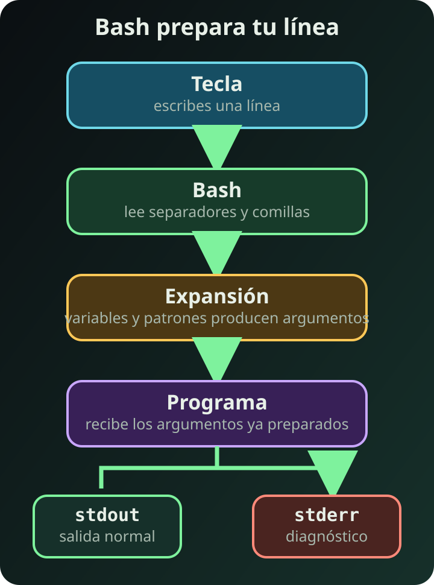

# Bash scripting

## Meta

Entender cómo Bash transforma una línea antes de ejecutarla y convertir pasos repetidos en un script breve que recibe una ruta y produce un reporte.

## Las tres estaciones

| Estación | Tiempo | Terminas cuando… |
|---|---:|---|
| 4. [[como-lee-bash|Cómo lee Bash]] | 15 min | puedes anticipar cómo Bash separa y expande los argumentos. |
| 5. [[variables-comillas-y-salida|Variables, comillas y salida]] | 15 min | eliges comillas y variables sin perder rutas ni texto. |
| 6. [[de-pasos-a-script|De pasos a script]] | 15 min | ejecutas y depuras un script que valida una carpeta y escribe un reporte. |

El script vive en `~/fdd/terminal-lab`, tu espacio local de práctica; no necesita un repositorio.

## Del comando a sus salidas

**Lectura visual:** Bash no entrega una línea al programa sin cambios. Primero interpreta separadores y comillas, expande variables o patrones y después inicia el programa; por eso conviene predecir los argumentos antes de ejecutar una acción.
