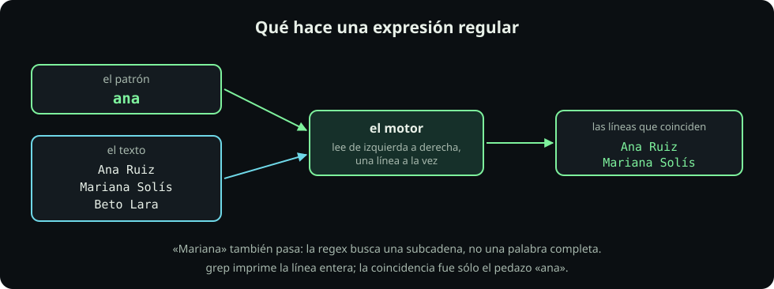

# Qué es y de dónde salió

**Página 1 de 6** · 10 min

Meta: tener el laboratorio en pie y haber corrido tu primer `grep`.

::: figure {#rx-que-es title="Qué hace una expresión regular"}

:::

## En corto

- Una regex describe **un conjunto de cadenas**; el motor decide si una línea contiene alguna de ellas.
- **Una cadena literal ya es una regex válida.** No hay que aprender símbolos para empezar.
- `grep` imprime la **línea completa**; la coincidencia pudo ser sólo un pedazo.

## Misión 1: arma el laboratorio

**Haz:** este bloque crea la carpeta y los tres archivos con los que vas a trabajar las seis páginas. Las comillas en `<<'EOF'` son importantes: le dicen a Bash que **no** expanda nada del texto de adentro.

```bash
mkdir -p ~/fdd/regex-lab && cd ~/fdd/regex-lab
cat > contactos.txt <<'EOF'
Ana Ruiz <ana@itam.mx> 55 1234 5678
Mariana Solís <mariana.solis@itam.mx> 55-8765-4321
Beto Lara <BETO@ITAM.MX> +52 55 2233 4455
Sofía Muñoz <sofia+tareas@itam.mx> 5511223344
Raúl Díaz <raul@@itam.mx> 55 0000 1111
Nadia Ortiz <nadia@correo> 55 4444 3333
Ana Ruiz <ana@itam.mx.> 55 1234 5678
(sin nombre) <@itam.mx> 55 9999 0000
Equipo 3: Ana Ruiz <ana@itam.mx> y Beto Lara <beto@itam.mx>
Contacto de respaldo: soporte@itam.mx sin corchetes
EOF
cat > bitacora.log <<'EOF'
2026-09-01 19:04:12 INFO  modulo=carga    filas=1200
2026-09-01 19:05:03 WARN  modulo=carga    filas=0 aviso=archivo vacio
2026-09-01 19:05:44 ERROR modulo=carga    codigo=500 detalle=timeout
2026-09-01 19:06:10 INFO  modulo=limpieza filas=1180
2026-09-01 19:07:31 ERROR modulo=limpieza codigo=422 detalle=el el archivo trae dos encabezados
2026-09-01 19:08:02 INFO  modulo=reporte  filas=1180
2026-09-02 07:15:09 WARN  modulo=reporte  aviso=corrida fuera de horario
2026-09-02 07:15:44 ERROR modulo=carga    codigo=500 detalle=timeout
linea sin formato que se colo en la bitacora
2026-09-02 07:20:00 INFO  modulo=reporte  filas=1180
EOF
cat > precios.csv <<'EOF'
producto,categoria,precio
teclado,accesorios,890
monitor,pantallas,4500
"cable, 2 metros",accesorios,120
mouse,accesorios,N/A
laptop,computo,18990
webcam,accesorios,$750
disco,almacenamiento,1290
EOF
ls -l
```

**Deberías ver:** tres archivos. Si `ls -l` muestra otra cosa, corre `pwd` antes de seguir.

**Pausa:** esos archivos están **sucios a propósito**. Hay correos con dos arrobas, un teléfono sin espacios, una línea sin formato y una coma dentro de comillas. Cada una va a aparecer más adelante como un caso que rompe un patrón ingenuo.

## Misión 2: tu primer grep

**Haz:**

```bash
cd ~/fdd/regex-lab
grep 'Ana' contactos.txt
```

**Deberías ver:** tres líneas — las dos de Ana Ruiz y la del Equipo 3.

**Pausa:** el patrón `Ana` no lleva ningún símbolo especial. Una cadena literal **ya es** una expresión regular: la más simple que existe.

Ahora prueba con minúscula:

```bash
grep 'ana' contactos.txt
```

Aparece **Mariana**, y desaparecen las que empiezan con `Ana` mayúscula. Dos cosas de golpe: `grep` distingue mayúsculas, y busca la cadena **en cualquier parte de la línea**, no como palabra suelta. Las dos se arreglan más adelante; por ahora sólo hay que verlas.

::: problem {#rx-p1-subcadena title="Predice antes de correr"}
¿Qué crees que devuelve `grep 'Sol' contactos.txt` y por qué?
:::

::: hint {of="rx-p1-subcadena"}
`Sol` no es una palabra completa en ninguna línea. Búscala como pedazo.
:::

::: answer {of="rx-p1-subcadena"}
Devuelve la línea de **Mariana Solís**, porque `Solís` contiene la subcadena `Sol`. La regex no sabe qué es una palabra: sólo compara caracteres consecutivos. Que la coincidencia caiga en medio de otra palabra es la fuente número uno de sorpresas, y por eso la página siguiente empieza justo ahí.
:::

## De dónde salió todo esto

No es una herramienta nueva. Es una idea de teoría de autómatas que llegó a la terminal y se quedó.

| Año | Quién | Qué aportó |
|---:|---|---|
| 1951 | Stephen Kleene | Formaliza los *eventos regulares* sobre autómatas finitos. De ahí viene la estrella `*`, que hoy se llama *cerradura de Kleene*. |
| 1968 | Ken Thompson | Publica un algoritmo de búsqueda por regex y lo mete en el editor `ed` de Unix. |
| ~1973 | Unix | El comando de `ed` para «imprime globalmente las líneas que casen» se escribía `g/re/p`. Ese comando se volvió un programa: **grep**. |
| 1992 | POSIX | Estandariza **dos** dialectos: BRE (básico) y ERE (extendido). Por eso `grep` y `grep -E` no entienden lo mismo. |
| 1987 | Larry Wall | Perl agrega la taquigrafía `\d`, `\w`, `\s`. En 1997 PCRE la lleva a todos los demás lenguajes. |

Dos consecuencias prácticas de esa historia, que vas a sentir esta misma clase: **hay más de un dialecto** (página 3) y **la taquigrafía cómoda no es la portátil** (página 4).

> [!NOTE]
> **Si sólo recuerdas una cosa:** `grep patrón archivo` imprime las líneas donde **encontró** el patrón; la coincidencia pudo haber sido sólo un pedazo de la línea.

## Cierre

Ya tienes el laboratorio y ya corriste un `grep`. Continúa con [[leer-izquierda-derecha|Leer de izquierda a derecha]], donde vas a ver **cómo** el motor recorre el texto.
