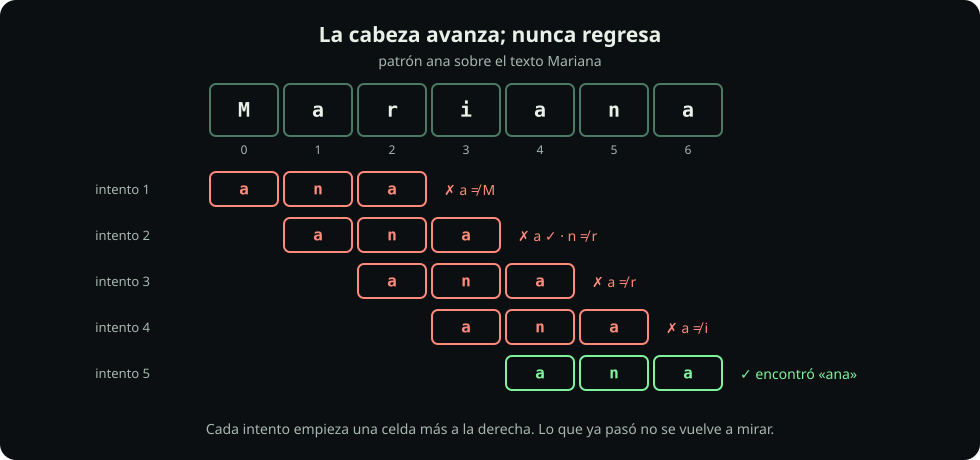
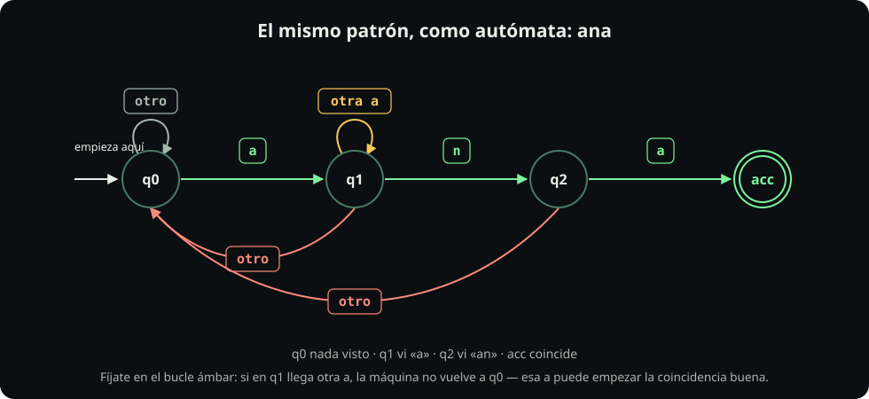

# Leer de izquierda a derecha

**Página 2 de 7** · 15 min

Meta: predecir qué encuentra un patrón antes de ejecutarlo.

::: figure {#rx-cabeza title="La cabeza avanza; nunca regresa"}

:::

## En corto

- El motor intenta desde la posición 0. Si falla, **avanza una posición** y vuelve a intentar desde cero.
- Cuando encuentra una coincidencia, **sigue desde donde terminó**: no vuelve a mirar lo que ya consumió.
- `grep -o` imprime **lo que encontró**, no la línea. Es la herramienta para ver qué está pasando.

## Prepara

```bash
mkdir -p ~/fdd/regex-lab && cd ~/fdd/regex-lab
printf '%s\n' 'Mariana' 'Ana' 'aaaa' '3.14' '3x14' > cinta.txt
cat cinta.txt
```

## Misión 1: mira la coincidencia, no la línea

**Haz:**

```bash
grep    'ana' cinta.txt
grep -o 'ana' cinta.txt
```

**Deberías ver:** la primera devuelve `Mariana` (la línea entera). La segunda devuelve `ana` (sólo el pedazo).

**Pausa:** esa diferencia es la que confunde a todo el mundo al principio. `grep` **decide por línea** pero **casa por subcadena**. Usa `-o` cada vez que no entiendas por qué una línea pasó.

## Misión 2: la cabeza no regresa

**Haz:**

```bash
grep -o 'aa' cinta.txt
grep -o 'aa' cinta.txt | wc -l
```

**Deberías ver:** dos coincidencias de `aa` sobre la línea `aaaa`, no tres. (`wc -l` cuenta las coincidencias; `grep -c` **no** sirve aquí, porque cuenta líneas y `aaaa` es una sola.)

En `aaaa` hay tres lugares donde empieza un `aa`: posiciones 0, 1 y 2. El motor encuentra el de la posición 0, **consume esos dos caracteres** y reanuda en la posición 2, donde encuentra el segundo. La posición 1 nunca se prueba porque ya quedó atrás.

::: table {#rx-traza-aaaa title="Por qué `aa` sobre `aaaa` da dos coincidencias y no tres"}

| Posición de la cabeza | Qué hace | Siguiente posición |
|---:|---|---:|
| 0 | casa `aa` → coincidencia 1 | 2 |
| 2 | casa `aa` → coincidencia 2 | 4 |
| 4 | fin de línea, se detiene | — |
:::

**Pausa:** predice el resultado de `grep -o 'aaa' cinta.txt` antes de correrlo. ¿Una coincidencia o dos?

## Misión 3: el punto casa cualquier cosa

`.` significa **un carácter cualquiera** (menos el salto de línea). Es el primer metacarácter.

**Haz:**

```bash
grep -o '3.14' cinta.txt
grep -o '3\.14' cinta.txt
```

**Deberías ver:** la primera encuentra **dos** cosas, `3.14` y `3x14`. La segunda encuentra sólo `3.14`.

La barra invertida **escapa** el punto: le quita su significado especial y lo vuelve un punto literal. Esta es la regla general — `\` delante de un metacarácter significa «este carácter, tal cual».

::: definition {#rx-def-metacaracter title="Metacarácter"}
Un carácter que la regex **no** interpreta literalmente, sino como una instrucción. Son estos trece:

```text
.  ^  $  [  ]  (  )  {  }  *  +  ?  |
```

Para buscar cualquiera de ellos tal cual, se escapa con `\`. Cualquier otro carácter es literal por sí solo y **no** hace falta escaparlo: `\` delante de algo que no es metacarácter no significa «literal», significa «lo que decida el motor». En la página 5 verás qué caro sale eso.
:::

## Misión 4: anclas

`^` significa «aquí empieza la línea» y `$` significa «aquí termina». Ninguna de las dos se lleva un carácter: **marcan una posición**.

Esa diferencia parte en dos todo lo que puede ir en un patrón, y conviene fijarla desde ya:

| | Qué hace | Ejemplos |
|---|---|---|
| **Consume** | se lleva caracteres del texto | `a`, `.`, `[0-9]` |
| **No consume** | sólo exige algo de la posición | `^`, `$`, y `\b` de la página 5 |

La página siguiente le pone nombre a la primera columna.

**Haz:**

```bash
grep -o 'ana'   cinta.txt
grep -o '^ana'  cinta.txt
grep -o '^Ana$' cinta.txt
```

**Deberías ver:** la primera encuentra `ana` dentro de `Mariana`. La segunda no encuentra nada, porque ninguna línea **empieza** con `ana`. La tercera encuentra `Ana`, la única línea que es exactamente eso.

**Pausa:** `^…$` es la forma de pasar de «lo contiene» a «es exactamente». Vas a usarlo cada vez que quieras validar en lugar de buscar.

::: problem {#rx-p2-anclaje title="¿Cuál devuelve más líneas?"}
Sin ejecutarlos, ordena estos tres de más a menos coincidencias sobre `contactos.txt`:

```bash
grep -c 'Ana'    contactos.txt
grep -c '^Ana'   contactos.txt
grep -c '^Ana.*$' contactos.txt
```
:::

::: hint {of="rx-p2-anclaje"}
Fíjate en cuál exige que la línea **empiece** con el patrón, y en si `.*` agrega alguna restricción o ninguna.
:::

::: answer {of="rx-p2-anclaje"}
`'Ana'` devuelve más (3): lo encuentra en cualquier parte, incluida la línea del Equipo 3, donde `Ana Ruiz` va a media línea. Los otros dos devuelven lo mismo (2): sólo las líneas que **empiezan** con `Ana`. `.*$` no agrega nada — «cualquier cosa, cero o más veces, hasta el final» es una condición que toda línea cumple. Un patrón que no descarta nada es un patrón que sobra.
:::

## El mismo patrón, dibujado

Un patrón es una máquina de estados. `ana` son cuatro estados y las flechas dicen qué carácter mueve la máquina de uno a otro.

::: figure {#rx-automata-ana title="El autómata que reconoce `ana`"}

:::

**Lectura visual:** el bucle ámbar es el detalle fino. Si estás en q1 (ya viste una `a`) y llega **otra** `a`, la máquina **no** vuelve al principio: esa nueva `a` puede ser el inicio de la coincidencia buena. Compruébalo con `printf '%s\n' 'aana' | grep -o 'ana'`.

> [!NOTE]
> **Si sólo recuerdas una cosa:** Cuando un patrón encuentre de más o de menos, corre `grep -o` y pregúntate desde qué posición empezó la cabeza.

## Cierre

Ya sabes cómo recorre el motor una línea y tienes `.`, `^`, `$` y el escape. Continúa con [[piezas-de-un-patron|Las piezas de un patrón]], donde el patrón deja de ser una fila de caracteres y pasa a ser una fila de piezas.
