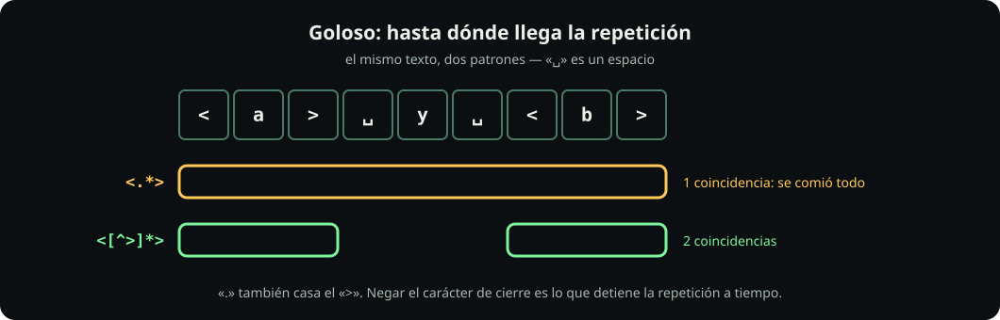

# Clases y repetición

**Página 3 de 6** · 15 min

Meta: escribir un patrón que acepte varias formas del mismo dato.

::: figure {#rx-cuantificadores title="Los tres cuantificadores, dibujados"}

:::

## En corto

- `[…]` es **un** carácter, elegido de un conjunto. `[abc]` casa una `a`, una `b` o una `c`.
- `?` `*` `+` `{n,m}` dicen **cuántas veces** se repite lo que tienen justo a la izquierda.
- A partir de aquí, **siempre `grep -E`**. La primera misión te muestra por qué.

## Prepara

```bash
mkdir -p ~/fdd/regex-lab && cd ~/fdd/regex-lab
printf '%s\n' 'color' 'colour' 'gato' 'gaaato' 'gto' '55 1234 5678' '55-8765-4321' > formas.txt
cat formas.txt
```

## Misión 1: la trampa de los dos dialectos

**Haz:** el mismo patrón, con y sin `-E`.

```bash
grep    'colou?r' formas.txt
grep -E 'colou?r' formas.txt
```

**Deberías ver:** la primera no encuentra nada; la segunda encuentra `color` y `colour`.

Sin `-E`, `grep` habla **BRE**, el dialecto de 1992, donde `?` es un carácter literal y hay que escribirlo `\?`. Con `-E` habla **ERE**, donde `? + { } ( ) |` funcionan como esperas.

En BRE hay que escribir `colou\?r`, `ga\+to`, `\(ab\)`. En ERE, `colou?r`, `ga+to`, `(ab)`.

**Regla de la unidad:** usa `grep -E` siempre. Cuando encuentres en internet un patrón lleno de barras invertidas raras, ya sabes que está escrito en BRE.

## Misión 2: los tres cuantificadores

**Haz:**

```bash
grep -E 'ga?to'   formas.txt
grep -E 'ga*to'   formas.txt
grep -E 'ga+to'   formas.txt
grep -E 'ga{2,3}to' formas.txt
```

**Deberías ver:**

| Patrón | Qué acepta | Encuentra en el archivo |
|---|---|---|
| `ga?to` | cero o una `a` | `gto`, `gato` |
| `ga*to` | cero o más | `gto`, `gato`, `gaaato` |
| `ga+to` | una o más | `gato`, `gaaato` |
| `ga{2,3}to` | entre dos y tres | `gaaato` |

**Pausa:** `*` es la *cerradura de Kleene* de la página 1: la misma idea de 1951, escrita con un asterisco.

## Misión 3: el cuantificador aplica a **un** elemento

**Haz:**

```bash
printf '%s\n' 'ab' 'abbb' 'ababab' > repes.txt
grep -E '^ab*$'   repes.txt
grep -E '^(ab)*$' repes.txt
```

**Deberías ver:** `ab*` encuentra `ab` y `abbb` — repite **la b**. `(ab)*` encuentra `ab` y `ababab` — repite **el grupo**.

**Pausa:** el cuantificador se agarra de lo que tiene inmediatamente a la izquierda: un carácter, una clase o un grupo entre paréntesis. Nada más.

## Misión 4: clases de caracteres

`[…]` casa **un solo** carácter de los que estén dentro. Dentro de los corchetes casi nada es especial.

**Haz:**

```bash
grep -E '^[0-9]{2}[ -][0-9]{4}[ -][0-9]{4}$' formas.txt
grep -E '^[^0-9]+$' formas.txt
```

**Deberías ver:** la primera encuentra los dos teléfonos, tanto el de espacios como el de guiones. La segunda encuentra las líneas **sin ningún dígito**.

Cuatro cosas que conviene saber de los corchetes: `[a-z]` es un rango; un `^` como **primer** carácter de adentro niega todo el conjunto; `[.]` es un punto literal sin escapar; y `[a-]` termina en un guion literal. En cualquier otra posición, el `^` es un acento circunflejo literal.

## Misión 5: goloso

Este es el error práctico más común. `*` y `+` toman **todo lo que pueden**.

::: figure {#rx-goloso title="Hasta dónde llega la repetición"}

:::

**Haz:** sobre la línea del Equipo 3, que tiene **dos** correos entre corchetes angulares.

```bash
cd ~/fdd/regex-lab
grep -Eo '<.*>'    contactos.txt | tail -2
grep -Eo '<[^>]*>' contactos.txt | tail -3
```

**Deberías ver:** el patrón goloso devuelve, en la línea del Equipo 3, **una** coincidencia gigante que va del primer `<` al último `>` con todo el texto intermedio adentro. El patrón acotado devuelve **dos**, una por correo.

La razón es que `.` también casa el `>`, así que `.*` se lo pasa de largo y sigue hasta el último. La clase negada no puede: se detiene en el primer `>` que aparece.

```bash
# goloso: llega hasta el último cierre
grep -Eo '<.*>' contactos.txt
# acotado: se detiene en el primer cierre
grep -Eo '<[^>]*>' contactos.txt
```

::: problem {#rx-p3-goloso title="Arregla el patrón"}
Quieres extraer sólo el nombre entre paréntesis de `(sin nombre)`. ¿Por qué `\(.*\)` es mala idea en un archivo con varias líneas con paréntesis, y cuál sería la versión acotada?
:::

::: hint {of="rx-p3-goloso"}
Aplica la misma receta del corchete angular, cambiando el carácter de cierre.
:::

::: answer {of="rx-p3-goloso"}
Porque `.*` casa también el paréntesis de cierre, así que en una línea con dos pares de paréntesis se comería todo lo que hay entre el primer `(` y el último `)`. La versión acotada niega el carácter de cierre:

```bash
grep -Eo '\([^)]*\)' contactos.txt
```

La receta se generaliza — **cuando repitas hasta un delimitador, niega ese delimitador en vez de usar el punto**.
:::

> [!NOTE]
> **Si sólo recuerdas una cosa:** `.*` casi nunca es lo que quieres. Casi siempre quieres una clase negada del carácter en el que la repetición debería detenerse.

## Cierre

Ya puedes describir un dato que viene en varias formas. Continúa con [[taquigrafia-perl|La taquigrafía de Perl]], que abrevia las clases que más se repiten.
