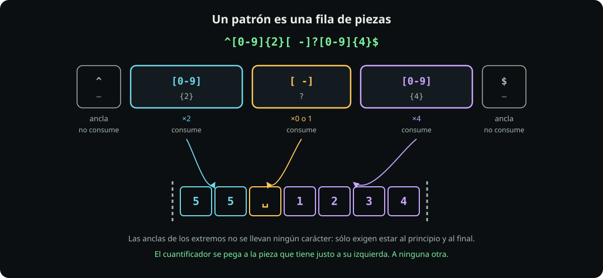
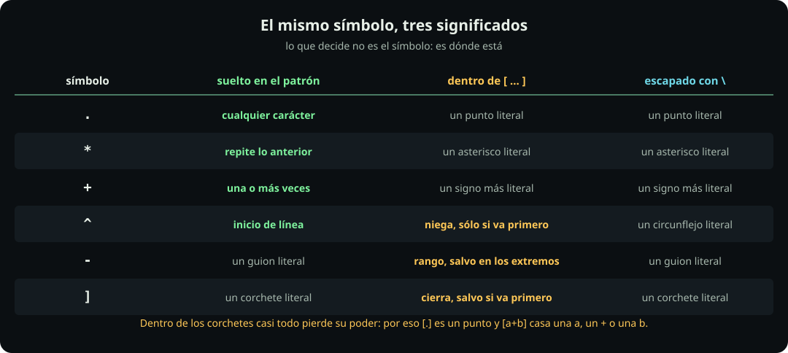

# Las piezas de un patrón

**Página 3 de 7** · 15 min

Meta: partir cualquier patrón en sus piezas y saber qué significa cada símbolo.

::: figure {#rx-piezas title="Un patrón es una fila de piezas"}

:::

## En corto

- Un patrón es **una fila de piezas**, una tras otra. Ponerlas seguidas significa «y luego».
- Una **pieza** se lleva caracteres; una **ancla** sólo mira dónde estás y no se lleva nada.
- El significado de un símbolo depende de **dónde** esté: suelto, dentro de corchetes o escapado.

## Prepara

```bash
mkdir -p ~/fdd/regex-lab && cd ~/fdd/regex-lab
printf '%s\n' 'a+b' 'a.b' 'a]b' 'a-b' 'a*b' 'a^b' > simbolos.txt
cat simbolos.txt
```

## La distinción que ordena todo el resto

::: definition {#rx-def-pieza title="Pieza y ancla"}
Una **pieza** es la unidad más pequeña que el motor puede casar: se lleva uno o más caracteres del texto. Hay cuatro clases de pieza y ya conoces dos:

| Pieza | Casa | Ejemplo |
|---|---|---|
| un carácter literal | ese carácter | `a` |
| el punto | cualquier carácter | `.` |
| una clase entre corchetes | uno de los que estén dentro | `[abc]` |
| un grupo entre paréntesis | lo que haya dentro, como un bloque | `(ab)` |

Una **ancla** no se lleva nada: sólo exige que la posición cumpla una condición. Ya viste `^` y `$`; en la página 5 aparece `\b`.

Toda la sintaxis que falta se cuelga de aquí: **los cuantificadores actúan sobre una pieza, y las anclas no admiten cuantificador** porque no hay nada que repetir.
:::

## Misión 1: poner piezas seguidas

**Haz:**

```bash
printf '%s\n' 'ab' 'ba' 'axb' | grep -Eo 'ab'
```

**Deberías ver:** una sola coincidencia, `ab`.

El patrón `ab` no es «una cosa»: son **dos piezas** —una `a` y una `b`— y ponerlas juntas significa «una `a` **y luego** una `b`, sin nada en medio». Por eso `ba` no casa (orden distinto) y `axb` tampoco (hay algo en medio). A eso se le llama **concatenación**, y es la operación más básica del lenguaje.

**Pausa:** con eso ya puedes leer `ana` como tres piezas y `3\.14` como cuatro.

## Misión 2: una clase es **una** pieza

`[…]` casa **un solo** carácter, elegido del conjunto de adentro. El conjunto puede ser largo; la pieza sigue siendo una.

**Haz:**

```bash
printf '%s\n' 'a' 'b' 'ab' 'z' | grep -E '^[abc]$'
```

**Deberías ver:** `a` y `b`, pero **no** `ab`. La línea `ab` tiene dos caracteres y la pieza sólo se lleva uno.

| Escribes | Significa |
|---|---|
| `[abc]` | uno de esos tres |
| `[a-z]` | un rango: de la `a` a la `z` |
| `[0-9a-f]` | dos rangos en la misma pieza |
| `[abc]` con `^` al principio | uno que **no** esté en el conjunto |

## Misión 3: el contexto manda

::: figure {#rx-contexto title="El mismo símbolo, tres significados"}

:::

Esta es la parte que más confunde y la que más rinde entenderla: **dentro de los corchetes casi ningún símbolo conserva su poder.**

**Haz:**

```bash
grep -Eo '[a+b]' simbolos.txt
grep -Eo '[.]'   simbolos.txt
grep -Eo '[]]'   simbolos.txt
grep -Eo '[a-]'  simbolos.txt
```

**Deberías ver:** el primero encuentra `a`, `+` y `b` — **el `+` no cuantifica nada ahí adentro**, es un signo de más literal. El segundo encuentra el punto, sin escaparlo. El tercero encuentra el corchete de cierre. El cuarto encuentra las `a` y el guion.

| Adentro | Regla |
|---|---|
| `+` `*` `?` `.` `(` `)` | pierden su poder: son literales |
| `^` | niega, **sólo** si es el primer carácter |
| `-` | rango entre dos caracteres; literal al principio o al final |
| `]` | va **primero** para ser literal: `[]]` |

**Pausa:** compara `a+` con `[a+]`. El primero es una pieza con cuantificador; el segundo es **una** pieza que casa una `a` o un `+`.

## La barra invertida no siempre da un literal

`\` delante de un metacarácter le quita su poder: `\.` es un punto. Pero delante de algo que **no** es metacarácter, el resultado lo decide el motor, no la regla.

> [!WARNING]
> `\d` es exactamente ese caso: no es «una `d` escapada» en todos lados. En `grep -E` busca una `d` literal; en Python o JavaScript busca un dígito. Escapa sólo lo que de verdad sea metacarácter.

## Dos dialectos, una regla

Antes de seguir, un detalle de herramienta que muerde hoy mismo:

```bash
grep    'a+b' simbolos.txt
grep -E 'a+b' simbolos.txt
```

**Deberías ver:** el primero encuentra la línea `a+b`, y el segundo **no encuentra nada**. Sin `-E`, `grep` habla **BRE**, el dialecto de 1992, donde `+ ? { } ( ) |` son literales y hay que escribirlos `\+`: por eso buscó un signo de más de verdad. Con `-E` habla **ERE**, donde `a+b` pide «una o más `a` y luego una `b`», que ninguna línea tiene. **Regla de la unidad: usa `grep -E` siempre.** Cuando veas en internet un patrón lleno de barras invertidas raras, ya sabes que está escrito en BRE.

::: problem {#rx-p3-contexto title="Tres corchetes, tres resultados"}
Sin ejecutarlos, di qué encuentra cada uno sobre `simbolos.txt`:

```bash
grep -Eo '[a*b]' simbolos.txt
grep -Eo 'a*b'   simbolos.txt
grep -Eo '[a^b]' simbolos.txt
```
:::

::: hint {of="rx-p3-contexto"}
En el primero y el tercero, el símbolo está **dentro** de los corchetes. En el segundo, suelto. Y el `^` del tercero no va en primera posición.
:::

::: answer {of="rx-p3-contexto"}
El primero casa una `a`, un `*` o una `b`, uno a la vez: el `*` adentro es literal, así que en la línea `a*b` encuentra los tres caracteres por separado. El segundo es otra cosa: `a*` es una pieza con cuantificador —cero o más `a`— seguida de una `b`, y como ninguna línea tiene una `a` pegada a una `b`, el `a*` casa **cero veces** y sólo queda la `b`: seis `b` sueltas, una por línea. El tercero casa `a`, `^` o `b`: el `^` **no** niega porque no es el primer carácter de adentro. Tres patrones que se parecen y no tienen nada que ver.
:::

> [!NOTE]
> **Si sólo recuerdas una cosa:** antes de leer un patrón, pártelo en piezas. Casi todas las dudas se disuelven al ver dónde empieza y dónde termina cada una.

## Cierre

Ya sabes qué es una pieza y qué significa cada símbolo según dónde esté. Continúa con [[cuantas-veces|Cuántas veces]], que sólo añade una cosa: cuántas veces se repite cada pieza.
