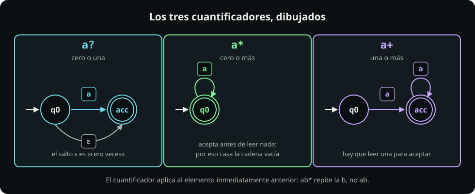
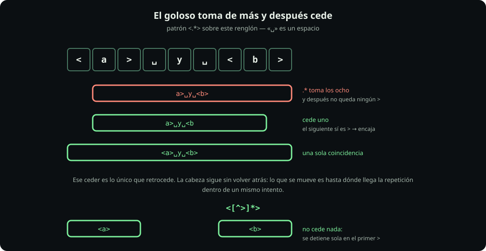

# Cuántas veces

**Página 4 de 7** · 15 min

Meta: saber a qué se pega un cuantificador y hasta dónde llega.

::: figure {#rx-cuantificadores title="Los tres cuantificadores, dibujados"}

:::

## En corto

- Los cuatro cuantificadores son **uno solo**: un rango `{mínimo, máximo}` de repeticiones.
- «Cero veces» significa que la pieza puede **no aparecer**: eso es `ε`, la cadena vacía.
- La repetición toma todo lo que puede y después **cede** hasta que el resto del patrón encaja.

## Misión 1: los cuatro son el mismo

`{n,m}` es la forma general: «al menos `n` veces, como mucho `m`». Los otros tres son atajos suyos.

| Escribes | Es realmente | mínimo | máximo |
|---|---|---:|---:|
| `?` | `{0,1}` | 0 | 1 |
| `*` | `{0,}` | 0 | sin límite |
| `+` | `{1,}` | 1 | sin límite |
| `{2,4}` | `{2,4}` | 2 | 4 |

**Haz:** las mismas tres cadenas contra el atajo y contra su rango.

```bash
printf '%s\n' 'a' 'aa' 'aaa' | grep -nE '^a?$'
printf '%s\n' 'a' 'aa' 'aaa' | grep -nE '^a{0,1}$'
printf '%s\n' 'a' 'aa' 'aaa' | grep -nE '^a+$'
printf '%s\n' 'a' 'aa' 'aaa' | grep -nE '^a{1,}$'
```

**Deberías ver:** los dos primeros pasan **sólo la línea 1**; los dos últimos pasan **las tres**. Cada atajo se comporta exactamente igual que su rango.

Y para ver el otro extremo del rango, prueba con un techo:

```bash
printf '%s\n' 'a' 'aa' 'aaa' 'aaaa' | grep -nE '^a{2,3}$'
```

Pasan la 2 y la 3. Ni una `a` sola ni cuatro: el rango tiene mínimo **y** máximo.

**Pausa:** `*` es la *cerradura de Kleene* de la página 1 — la idea de 1951, escrita con un asterisco. Ahora ya sabes que es sólo el rango «de cero a lo que sea».

## Misión 2: a qué pieza se pega

Un cuantificador actúa sobre **la pieza que tiene inmediatamente a su izquierda**. A ninguna otra.

**Haz:** tres patrones que se escriben casi igual, sobre las mismas tres cadenas.

```bash
printf '%s\n' 'ab' 'abbb' 'ababab' | grep -nE '^ab*$'
printf '%s\n' 'ab' 'abbb' 'ababab' | grep -nE '^(ab)*$'
printf '%s\n' 'ab' 'abbb' 'ababab' | grep -nE '^[ab]*$'
```

**Deberías ver:** el primero pasa 1 y 2, el segundo pasa 1 y 3, y el tercero pasa **las tres**. Tres respuestas distintas para un cambio de dos caracteres.

Como una clase y un grupo son **una** pieza, el cuantificador se aplica a todo el conjunto:

| Patrón | La pieza es | Repite |
|---|---|---|
| `ab*` | la `b` | sólo la `b` |
| `[ab]*` | la clase | una `a` **o** una `b`, en cualquier orden |
| `(ab)*` | el grupo | el bloque `ab` completo |

**Pausa:** los tres se escriben casi igual y no casan lo mismo. Compruébalo con `printf '%s\n' 'baba' | grep -Eo '[ab]*'` y luego con `(ab)*`.

## Misión 3: qué significa «cero veces»

::: definition {#rx-def-epsilon title="ε, la cadena vacía"}
`ε` (épsilon) es el nombre de **la cadena de longitud cero**: un texto sin ningún carácter. No es un espacio ni algo que puedas teclear — es la ausencia de caracteres.

En un autómata, un **salto ε** es una flecha que la máquina recorre **sin leer nada de la cinta**. Eso es literalmente lo que significa «cero veces»: existe un camino hasta la aceptación que no consume ningún carácter. En el dibujo de arriba, el autómata de `a?` tiene ese salto, y el de `a*` ya acepta en su estado inicial.

**Consecuencia:** una pieza cuyo mínimo es cero puede casar **en cualquier posición**, incluso donde no hay nada.
:::

**Haz:** fíjate en que la segunda cadena está **vacía**.

```bash
printf '%s\n' 'bbb' '' 'aaa' | grep -nE '^a*$'
printf '%s\n' 'uno' 'dos' 'tres' | grep -cE 'x*'
printf '%s\n' 'uno' 'dos' 'tres' | grep -cE 'x+'
```

**Deberías ver:** el primero pasa la línea 2 —**la vacía**— y la 3, pero no `bbb`. El segundo devuelve `3`: **las tres líneas**, aunque no haya una sola `x`. El tercero devuelve `0`.

Ese `3` es la prueba de que `ε` no es una curiosidad teórica. `x*` pide «cero o más `x`», y cero `x` ocurre en todas partes: el patrón se satisface sin leer nada. `x+`, con mínimo uno, sí exige algo. Un patrón cuyo mínimo es cero **no descarta nada**.

**Pausa:** por eso `.*$` al final de un patrón casi siempre sobra, como viste en la página 2.

## Misión 4: hasta dónde llega la repetición

::: figure {#rx-backtracking title="El goloso toma de más y después cede"}

:::

Un cuantificador es **goloso**: primero intenta llevarse todo lo que pueda, y sólo si el resto del patrón no encaja va **cediendo** un carácter a la vez.

**Haz:** primero la cadena exacta del dibujo, y después el archivo de verdad.

```bash
printf '<a> y <b>\n' | grep -Eo '<.*>'
printf '<a> y <b>\n' | grep -Eo '<[^>]*>'
cd ~/fdd/regex-lab && grep -Eo '<.*>' contactos.txt | tail -1
```

**Deberías ver:** el goloso devuelve **una** coincidencia, `<a> y <b>` entera. La clase negada devuelve **dos**, `<a>` y `<b>`. Y en `contactos.txt` pasa exactamente lo mismo, con dos correos en vez de dos letras.

> [!WARNING]
> Esto **no** contradice la página 2. Ahí lo que no retrocede es **dónde empieza** el intento: una posición descartada no se reintenta. Aquí lo que se mueve es **hasta dónde llega la repetición dentro de un mismo intento**. Son dos cosas distintas y sólo la segunda cede terreno.

`.` también casa el `>`, así que `.*` se lo pasa de largo, llega al final, y retrocede hasta encontrar el último `>`. Una clase que niega el `>` no puede pasarlo: se detiene sola, sin vaivén.

::: problem {#rx-p4-cero title="¿Por qué cinco y no cero?"}
Ninguna de esas tres cadenas contiene una `x`. ¿Por qué `grep -cE 'x*'` devuelve `3` y no `0`? ¿Y qué patrón habrías querido escribir?
:::

::: hint {of="rx-p4-cero"}
Traduce `x*` a su rango: `{0,}`. ¿Qué exige, como mínimo, ese patrón?
:::

::: answer {of="rx-p4-cero"}
Porque `x*` es `x{0,}` y su mínimo es **cero**: el patrón se satisface sin leer nada, así que casa en la posición 0 de cualquier línea. No pide una `x`; pide «cero o más», y cero siempre se cumple. El patrón que querías es `x+`, con mínimo uno, que devuelve `0`. La regla general: **un cuantificador de mínimo cero nunca puede, por sí solo, descartar una línea** — necesita algo obligatorio a su lado.
:::

> [!NOTE]
> **Si sólo recuerdas una cosa:** traduce todo cuantificador a su rango `{mínimo, máximo}`. Si el mínimo es cero, esa pieza no está filtrando nada.

## Cierre

Ya sabes cuántas veces se repite una pieza y hasta dónde llega. Continúa con [[taquigrafia-perl|La taquigrafía de Perl]], que abrevia las clases más frecuentes.
