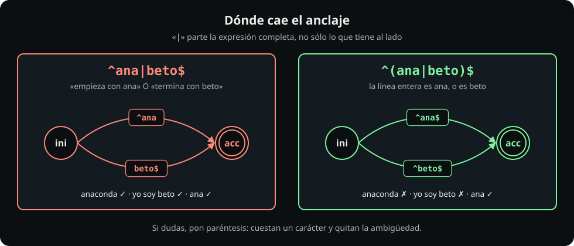
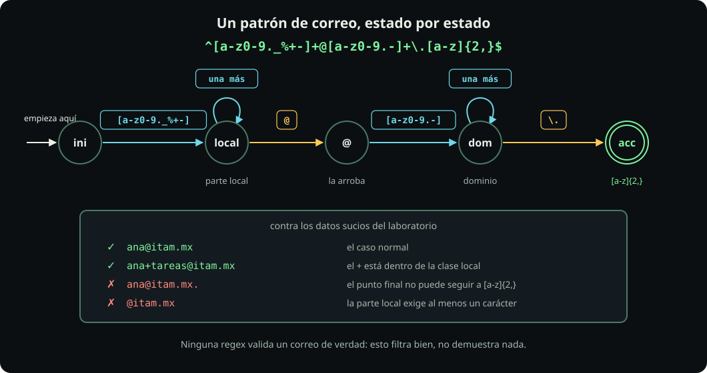

# Grupos y captura

**Página 5 de 6** · 15 min

Meta: extraer un pedazo de una línea y reescribirlo.

::: figure {#rx-alternancia title="Dónde cae el anclaje"}

:::

## En corto

- `(…)` agrupa: hace que un cuantificador o una alternancia apliquen a **todo el pedazo**.
- La alternancia parte **la expresión completa**, no sólo lo que tiene al lado. Los paréntesis la acotan.
- Lo que capturaste con `(…)` se recupera después como `\1`, `\2`, `\3`.

## Prepara

```bash
mkdir -p ~/fdd/regex-lab && cd ~/fdd/regex-lab
printf '%s\n' 'ana' 'anaconda' 'beto' 'yo soy beto' > nombres.txt
cat nombres.txt
```

## Misión 1: la trampa de precedencia

**Haz:**

```bash
grep -E '^ana|beto$'   nombres.txt
grep -E '^(ana|beto)$' nombres.txt
```

**Deberías ver:** el primero devuelve **las cuatro** líneas. El segundo devuelve **dos**, `ana` y `beto`.

La alternancia tiene la precedencia más baja de todas: parte la expresión entera. `^ana|beto$` se lee como «(`^ana`) o (`beto$`)», es decir «empieza con ana **o** termina con beto» — y las cuatro líneas cumplen una de las dos. Los paréntesis cambian el reparto: `^(ana|beto)$` es «la línea completa es `ana` o es `beto`».

**Pausa:** este es el bug más caro de la unidad, porque **no falla: devuelve de más**. Un filtro que deja pasar todo se ve igual que un filtro que funciona.

## Misión 2: agrupar para repetir

Ya lo viste en la página 3; ahora con nombre.

```bash
printf '%s\n' 'ab' 'abbb' 'ababab' > repes.txt
grep -E '^(ab)+$' repes.txt
```

`(ab)+` repite el grupo entero: encuentra `ab` y `ababab`, no `abbb`. El paréntesis convierte varios caracteres en **una sola pieza** para el cuantificador que viene después.

## Misión 3: capturar y volver a usar

Cada `(…)` **recuerda** lo que casó. Ese texto se recupera dentro del mismo patrón como `\1`.

**Haz:** busca una palabra repetida en la bitácora.

```bash
grep -Eo '\b(\w+) \1\b' bitacora.log
```

**Deberías ver:** `el el` — un error de dedo que hay escondido en una línea de ERROR.

Léelo de izquierda a derecha: frontera de palabra, captura una palabra, un espacio, **exactamente lo que capturaste**, frontera. Sin la captura habría que enumerar todas las palabras posibles; con ella, el patrón dice «lo mismo otra vez».

**Pausa:** las retro-referencias en ERE son una extensión de GNU, no parte del estándar POSIX. Funcionan en Linux y en macOS reciente, pero no des por hecho que están en cualquier herramienta.

## Misión 4: reescribir con `sed`

Aquí es donde la captura paga. `sed -E 's/BUSCA/REEMPLAZA/'` sustituye, y en el reemplazo puedes usar los grupos.

**Haz:** quédate sólo con el dominio de cada correo.

```bash
grep -Eo '<[^>]+>' contactos.txt | head -3
grep -Eo '<[^>]+>' contactos.txt | head -3 | sed -E 's/<([^@]+)@([^>]+)>/\2/'
```

**Deberías ver:** primero los tres correos entre corchetes angulares; después `itam.mx`, `itam.mx` e `ITAM.MX`. `sed` reemplazó, no normalizó: las mayúsculas siguen ahí. Arreglar eso es trabajo de la página siguiente.

| Pieza | Qué hace |
|---|---|
| `s/` | inicia una sustitución |
| el patrón de en medio | grupo 1 antes de la arroba, grupo 2 después |
| `/\2/` | el reemplazo: quédate sólo con el grupo 2 |

**Pausa:** `sed` es un programa distinto de `grep`, pero habla el mismo dialecto con `-E`. Todo lo que aprendiste sirve igual.

## Misión 5: el patrón de correo, estado por estado

::: figure {#rx-automata-email title="Un patrón de correo, estado por estado"}

:::

Se construye sumando **un estado a la vez**. Corre cada línea y mira cuántas coincidencias más aparecen:

```bash
grep -Eoi '[a-z0-9._%+-]+'                              contactos.txt | head -3
grep -Eoi '[a-z0-9._%+-]+@'                             contactos.txt | head -3
grep -Eoi '[a-z0-9._%+-]+@[a-z0-9.-]+'                  contactos.txt | head -3
grep -Eoi '[a-z0-9._%+-]+@[a-z0-9.-]+\.[a-z]{2,}'       contactos.txt
```

**Deberías ver** que cada línea filtra más que la anterior. La última devuelve ocho correos y deja fuera tres casos sucios:

| Línea del archivo | Resultado | Por qué |
|---|---|---|
| `raul@@itam.mx` | rechazado | después de la arroba hace falta un carácter de dominio, y otra arroba no lo es |
| `<@itam.mx>` | rechazado | la parte local exige **al menos uno** |
| `<nadia@correo>` | rechazado | falta el punto y la terminación de dos letras |
| `<ana@itam.mx.>` | aceptado a medias | casa `ana@itam.mx` e **ignora** el punto final |

Ese último caso es la lección: **sin anclajes el patrón extrae, no valida**. Para validar tendría que ser `^…$`, y entonces la línea completa tendría que ser el correo.

> [!WARNING]
> Ninguna expresión regular valida un correo de verdad. La especificación (RFC 5322) permite formas que este patrón rechaza y que casi ningún sistema acepta. Un patrón así sirve para **encontrar candidatos**, no para demostrar que una dirección existe. Lo único que demuestra que un correo funciona es mandarle un mensaje.

::: problem {#rx-p5-anclado title="Extraer contra validar"}
¿Qué devuelve `grep -Ec '^[a-z0-9._%+-]+@[a-z0-9.-]+\.[a-z]{2,}$' contactos.txt` y por qué es distinto de la versión sin `^` y `$`?
:::

::: hint {of="rx-p5-anclado"}
Fíjate en cómo empiezan las líneas del archivo: ¿alguna es **sólo** un correo?
:::

::: answer {of="rx-p5-anclado"}
Devuelve `0`. Ninguna línea del archivo es exclusivamente un correo: todas traen nombre, corchetes angulares o teléfono alrededor. Anclado, el patrón pregunta «¿esta línea **es** un correo?»; sin anclar, pregunta «¿esta línea **contiene** algo con forma de correo?». Son dos preguntas distintas y el mismo patrón responde una u otra según los anclajes. Para validar una lista de correos, primero hay que extraerlos a un archivo de una dirección por línea — que es justo lo que hace la página siguiente.
:::

> [!NOTE]
> **Si sólo recuerdas una cosa:** Si un patrón con alternancia devuelve de más, casi siempre le faltan paréntesis alrededor del `|`.

## Cierre

Ya puedes extraer y reescribir. Continúa con [[grep-awk-en-serio|grep, history y awk]] para armar una limpieza completa.
