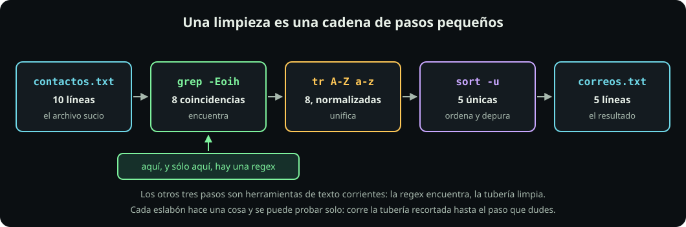

# grep, history y awk

**Página 7 de 7** · 15 min

Meta: convertir lo aprendido en una tubería que limpia un archivo de verdad.

::: figure {#rx-tuberia title="Una limpieza es una cadena de pasos pequeños"}

:::

## En corto

- **Comillas simples siempre.** Bash expande `*`, `$` y `?` antes de que `grep` los vea.
- Media docena de banderas cubren casi todo el uso diario. El resto se consulta.
- Una regex encuentra y filtra. **No es un parser**: no la uses para CSV, HTML ni JSON.

## La tarjeta de peligro, primero

::: definition {#rx-def-comillas title="Por qué las comillas simples"}
Bash procesa tu línea **antes** de llamar a `grep`. Sin comillas, `grep -E ^ana.*$ archivo` puede convertirse en otra cosa: `*` se expande a los nombres de archivo de la carpeta y `$a` a una variable vacía. Con comillas simples, Bash entrega el patrón intacto — es el mecanismo de [[como-lee-bash|Cómo lee Bash]]. Compruébalo: `printf '<%s>\n' -- *` imprime tus archivos y `printf '<%s>\n' -- '*'` imprime un asterisco, que es el que `grep` necesita recibir.
:::

## Misión 1: las banderas que sí usarás

Seis cubren casi todo; la lista completa está en [[chuleta-regex|la chuleta]].

| Bandera | Qué hace |
|---|---|
| `-E` | dialecto extendido — siempre |
| `-o` | imprime la coincidencia, no la línea |
| `-i` | ignora mayúsculas |
| `-v` | invierte: deja pasar lo que **no** casa |
| `-c` | cuenta **líneas**, no coincidencias |
| `-F` | texto literal, sin interpretar nada |

**Haz:**

```bash
mkdir -p ~/fdd/regex-lab && cd ~/fdd/regex-lab
grep -c 'ERROR' bitacora.log
grep -n 'ERROR' bitacora.log
grep -v 'INFO'  bitacora.log | grep -c 'modulo'
grep -E '$750'  precios.csv
grep -F '$750'  precios.csv
```

**Deberías ver:** `3`; sus tres números de línea; `5`; después **nada**; y por último la línea de la webcam.

Compruébalo aislado, sin archivo de por medio:

```bash
printf '%s\n' 'cuesta $750' | grep -E '$750'
printf '%s\n' 'cuesta $750' | grep -F '$750'
```

**Pausa:** en ERE el `$` es un anclaje de fin de línea **en cualquier posición del patrón**, así que `-E '$750'` pide «fin de línea, y luego 750»: imposible. `-F` apaga toda interpretación y busca el texto tal cual. **`-F` es la escotilla de emergencia**: cuando el dato que buscas trae metacaracteres y no quieres escaparlos uno por uno. La otra salida es escaparlo: `grep -E '\$750'` también funciona.

## Misión 2: tu propio historial

`history` produce texto, y todo lo de esta unidad aplica.

```bash
history | grep -E ' (grep|sed|awk) '
history | grep -E '^\s*[0-9]+\s+cd\b'
```

La primera recupera dónde usaste cada herramienta. La segunda aprovecha la forma del propio historial —número, espacios, comando— para descartar las líneas donde `cd` aparece a media línea.

**Pausa:** el resultado incluye tu propia búsqueda, porque el historial ya la guardó. No es una segunda ejecución: es texto.

## Misión 3: una limpieza completa

Esto es lo que en la práctica pide alguien cuando dice «sácame los correos de este archivo».

**Haz:**

```bash
cd ~/fdd/regex-lab
grep -Eoih '[a-z0-9._%+-]+@[a-z0-9.-]+\.[a-z]{2,}' contactos.txt \
  | tr 'A-Z' 'a-z' \
  | sort -u \
  > correos.txt
cat correos.txt
wc -l correos.txt
```

**Deberías ver:** cinco direcciones únicas, todas en minúsculas.

De ocho coincidencias quedaron cinco: las tres que se fueron eran el mismo correo escrito distinto. **La regex encontró; la tubería limpió** — ese reparto es el patrón general. Guárdala como script y ya tienes una herramienta, con lo de [[de-pasos-a-script|De pasos a script]].

## Misión 4: `awk`, en dos ejemplos

`awk` es *grep que además parte la línea en columnas*. Un programa de `awk` es `patrón { acción }`: si el patrón casa, corre la acción.

**Haz:**

```bash
awk '/ERROR/ {print $1, $2, $5}' bitacora.log
awk -F, '$3 ~ /^[0-9]+$/ {s += $3} END {print s}' precios.csv
```

**Deberías ver:** las tres líneas de ERROR reducidas a fecha, hora y código; y después la suma `25670`.

`$1`, `$2`… son las columnas, `-F,` fija el separador, `~` es «casa con esta regex» y `END` corre una vez al final. `awk` usa ERE, igual que `grep -E`, y **tampoco conoce `\d`**.

## Dónde deja de servir

Esa suma de `25670` está **mal**, y el archivo te lo advirtió desde la página 1.

**Haz:**

```bash
awk -F, '{print NR": "$3}' precios.csv
```

**Deberías ver** que en la fila de `"cable, 2 metros"` la tercera columna no es `120`: es `accesorios`. La coma que está **dentro** de las comillas partió la línea en un campo de más y recorrió todo. La suma se saltó esos 120 pesos sin decir nada.

::: problem {#rx-p6-csv title="¿Se arregla con una regex mejor?"}
¿Podrías escribir un patrón que reconozca campos CSV respetando las comillas? ¿Y deberías?
:::

::: hint {of="rx-p6-csv"}
Piensa en un campo entrecomillado que además contenga comillas escapadas adentro, y en un campo con un salto de línea.
:::

::: answer {of="rx-p6-csv"}
Para el caso simple, sí: existen patrones que manejan comillas. Pero el CSV real permite comillas escapadas dentro de un campo entrecomillado y saltos de línea dentro de un campo, y ahí la regex se vuelve ilegible y sigue quedándose corta. El problema de fondo es que una expresión regular describe un lenguaje **regular**, y las estructuras anidadas —comillas dentro de comillas, etiquetas dentro de etiquetas, llaves dentro de llaves— no lo son. Por eso hay parsers de CSV, de HTML y de JSON: hacen lo que una regex no puede. Usa la regex para **encontrar** dentro de un campo que ya extrajo un parser, no para separar los campos.
:::

## Un último caso que sí vas a sufrir

Un archivo que vino de Windows termina cada línea con `\r\n`, y ese `\r` invisible queda **antes** del fin de línea: `$` deja de casar donde crees.

```bash
printf 'ok\r\nok\n' > crlf.txt
grep -Ec 'ok$' crlf.txt
cat -A crlf.txt
```

Cuenta `1`, no `2`: `cat -A` muestra el `^M` culpable y `tr -d '\r' < crlf.txt` lo quita.

> [!NOTE]
> **Si sólo recuerdas una cosa:** Cuando un patrón correcto no encuentre nada, sospecha primero de lo invisible: comillas que se comió Bash, un `\r` al final, o un locale distinto.

## Cierre

Ya tienes las seis piezas. La referencia completa está en [[chuleta-regex|la chuleta]]: consúltala, no la memorices.
