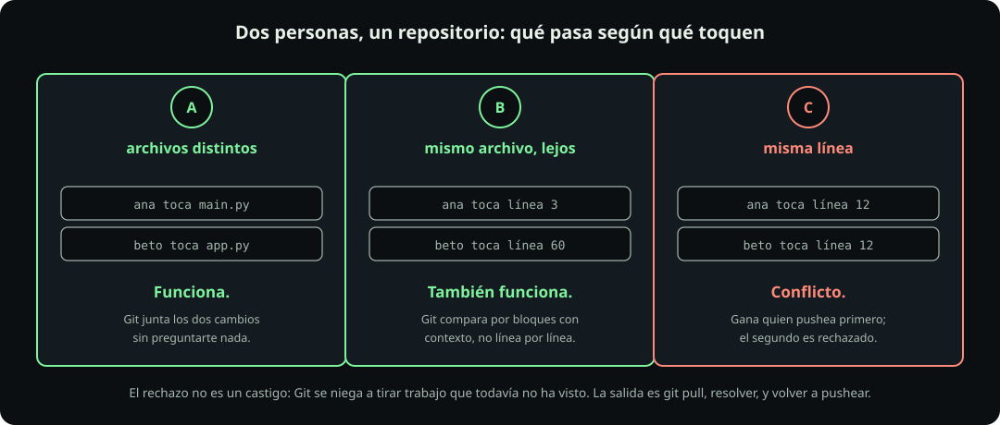

# Dos personas, un archivo

**Página 10 de 12** · 12 min

Meta: predecir qué va a pasar antes de que pase, para que la regla de la página siguiente tenga sentido.

::: figure {#git-race title="Dos personas, un repositorio"}

:::

## En corto

- Que dos personas toquen el mismo archivo **no** es automáticamente un problema.
- Git compara por bloques con contexto, no archivo por archivo.
- Cuando sí choca, gana quien hizo push primero. Al segundo lo rechazan.
- El rechazo protege trabajo. Las dos formas de "arreglarlo" que se le ocurren a todo el mundo son destructivas.

## El experimento

Ana y Beto clonan el mismo repositorio a la misma hora. Los dos se ponen a trabajar sin hablarse. Piensa qué va a pasar en cada caso antes de leer la respuesta.

### Escenario A: archivos distintos

Ana edita `main.py`. Beto edita `app.py`. Los dos hacen commit y push.

**Funciona sin fricción.** El segundo push entra sin que nadie note nada. Git ve que los cambios tocan objetos distintos y los junta solo.

### Escenario B: mismo archivo, líneas lejanas

Los dos editan `main.py`. Ana toca la línea 3 y Beto la línea 60.

**También funciona**, y esto sorprende a mucha gente. Git no razona en términos de "este archivo está ocupado". Compara **bloques de líneas con su contexto alrededor**, y dos bloques separados por cincuenta líneas son cambios independientes.

Beto, que pushea segundo, sí va a tener que hacer `git pull` antes, porque su copia está atrasada. Pero el merge ocurre solo y sin preguntarle nada.

Con una advertencia honesta: **"líneas distintas" no basta, tienen que estar suficientemente separadas.** Si Ana toca la línea 12 y Beto la 13, Git las ve dentro del mismo bloque y sí conflictúa. No hay un número mágico; depende del contexto que Git tome alrededor de cada cambio.

### Escenario C: la misma línea

Los dos editan la línea 12 de `main.py`, cada uno de una forma.

**Conflicto.** Y aquí está lo importante: el conflicto no le pasa a los dos. Le pasa al segundo.

## Quién gana

Ana pushea primero y entra sin problema. Beto pushea después y recibe algo así:

```text
! [rejected]        main -> main (fetch first)
error: failed to push some refs to 'github.com:...'
hint: Updates were rejected because the remote contains work that you do
hint: not have locally.
```

El mensaje varía según el caso exacto. El que sale cuando ya hiciste `fetch` y sigues atrasado dice `(non-fast-forward)` en vez de `(fetch first)`. Los dos significan lo mismo para ti.

**Ese rechazo no es un castigo.** Git se está negando a tirar trabajo que todavía no ha visto. Si aceptara el push de Beto tal cual, el commit de Ana desaparecería y nadie se enteraría.

La salida correcta son tres pasos:

```bash
git pull
# si hay conflicto: resuélvelo como en la página 8, con git add y git commit
git push
```

Y ya. En el escenario B eso ocurre sin que Beto tenga que hacer nada más que el `pull`. En el C tiene que decidir qué línea se queda, exactamente como practicaste.


## Las dos salidas equivocadas

Cuando alguien ve `rejected` por primera vez, se le ocurren dos cosas. Las dos hacen daño.

::: table {#git-salidas-malas title="Lo que no hay que hacer"}

| La idea | Qué pasa de verdad |
|---|---|
| `git push --force` | Impone tu versión y **borra el commit de Ana**. Ella lo va a descubrir días después, cuando su trabajo ya no esté |
| Borrar la carpeta y clonar de nuevo | Pierdes tus commits locales, tu stash y tu reflog. Y sigues sin resolver el conflicto |

:::

La segunda es la más común, porque parece inocente: "empiezo de cero y ya". No es de cero, es sin tu trabajo.

> [!WARNING]
> Si alguna vez ves a alguien recomendar `--force` para salir de un `rejected`, desconfía. Es la respuesta correcta a un problema muy distinto y muy raro, y nunca a este.

## La lección que se convierte en regla

De los tres escenarios sale una conclusión práctica: **el conflicto sólo aparece cuando dos personas tocan las mismas líneas.**

Así que hay una forma de que en un grupo de treinta personas eso no ocurra nunca: que cada quien trabaje en archivos que sólo son suyos.

Ésa es la razón real de la regla de la página siguiente, y no una burocracia inventada. Cuando cada persona tiene su propia carpeta, todos los escenarios se vuelven el A, y treinta pull requests simultáneos se mergean sin que nadie tenga que resolver nada.

::: problem {#git-p10-rechazo title="Sólo agregué un archivo nuevo"}
Beto agregó un archivo que no existía antes, `notas-beto.md`, hizo commit y push. Le respondieron con `! [rejected] main -> main (fetch first)`.

Está desconcertado: nadie más pudo haber tocado un archivo que él acaba de crear. ¿Por qué lo rechazaron y qué hace?
:::

::: hint {of="git-p10-rechazo"}
El rechazo no habla de archivos. Habla de la posición de la rama.
:::

::: answer {of="git-p10-rechazo"}
El rechazo **no tiene nada que ver con su archivo**. Git no compara archivo por archivo al decidir si acepta un push: compara la **historia**.

Beto commiteó encima del estado que su copia tenía cuando clonó. Mientras tanto Ana subió commits que él no tiene. Entonces la rama de Beto no es una continuación de la que está en el servidor: es una línea paralela. Aceptarla obligaría a descartar los commits de Ana.

Por eso el mensaje dice `fetch first`. Git no está juzgando el contenido, está diciendo que su copia está atrasada.

Beto hace `git pull`, que baja los commits de Ana y los junta con el suyo. Como el archivo es nuevo y nadie más lo tocó, el merge ocurre solo. Después `git push` entra sin problema.

Moraleja: **un push rechazado casi nunca significa conflicto.** Casi siempre significa que estás atrasado, y `git pull` lo resuelve.
:::

> [!NOTE]
> **Si sólo recuerdas una cosa:** `rejected` quiere decir que estás atrasado, no que hiciste algo mal. La respuesta es `git pull`, nunca `--force`.

## Cierre

Ya sabes por qué existe la regla. En [[el-flujo-del-curso|El flujo del curso]] la vas a aplicar.
