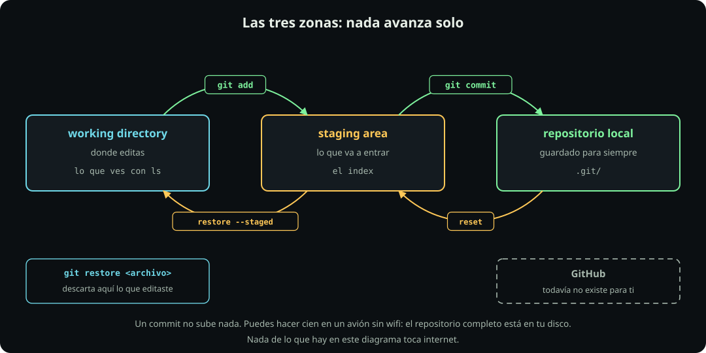

# Tu primer repositorio

**Git · página 2 de 7** · 30 min

Meta: hacer tres commits en un repositorio que puedes romper sin consecuencias, y entender por qué existe el staging area.

::: figure {#git-tres-zonas title="Las tres zonas: nada avanza solo"}

:::

## En corto

- Vas a trabajar en `~/fdd/git-lab`, un repositorio de juguete que existe para romperse.
- Git tiene **tres zonas**, no una. Un archivo editado no está guardado hasta que pasa por las dos puertas.
- `git status` es el comando que más vas a correr en tu vida. Se corre antes y después de todo.
- Nada de esta página toca internet.

## Antes de empezar

Comprueba tu versión. Necesitas 2.23 o más nueva, de 2019, porque usamos `git switch` y `git restore`:

```bash
git --version
```

> [!WARNING]
> Nunca corras `git init` dentro de tu carpeta personal ni dentro de `~/fdd/fdd_o26`. Lo primero convierte toda tu casa en un repositorio y es un desastre difícil de notar; lo segundo mete un repositorio dentro de otro. Si te pasa, se arregla borrando la carpeta `.git` que se creó de más.

## Paso 1: crea el laboratorio

**Haz:**

```bash
mkdir -p ~/fdd/git-lab && cd ~/fdd/git-lab
git init
ls -a
```

**Deberías ver** un mensaje de repositorio vacío inicializado, y en `ls -a` una carpeta `.git`.

Esa carpeta **es** el repositorio. Todo lo demás que veas aquí es tu copia de trabajo. Si borras `.git`, se va la historia completa y te quedan los archivos sueltos, como si nunca hubieras versionado nada.

**Pausa:** para reempezar de cero en cualquier momento de esta página: `cd ~/fdd && rm -rf git-lab` y vuelves a este paso. Es un laboratorio, no un proyecto.

## Paso 2: el primer archivo, y la primera sorpresa

**Haz:**

```bash
echo "hola" > saludo.txt
git status
```

**Deberías ver** que `saludo.txt` aparece bajo `Untracked files`, en rojo, y una línea que dice `nothing added to commit but untracked files present`.

Léela con calma, porque es la primera de las tres secciones de `git status` y la vas a ver mil veces:

::: table {#git-status-secciones title="Las tres secciones de git status"}

| Sección | Qué significa | Color |
|---|---|---|
| `Untracked files` | Git ve el archivo pero nunca lo ha guardado. No sabe nada de él | Rojo |
| `Changes not staged for commit` | Ya lo conoce, y lo cambiaste desde el último commit | Rojo |
| `Changes to be committed` | Está apartado, listo para entrar en el próximo commit | Verde |

:::

Un archivo puede estar en dos secciones a la vez. Eso confunde al principio y tiene una explicación exacta, que llega en el paso 5.

## Paso 3: las dos puertas

**Haz:**

```bash
git add saludo.txt
git status
git commit -m "agrego el saludo"
git status
```

**Deberías ver** que después del `add` el archivo pasó a `Changes to be committed`, en verde, y que después del `commit` `git status` dice `nothing to commit, working tree clean`.

Acabas de cruzar las dos puertas del diagrama:

- **`git add`** mueve del *working directory* al *staging area*. Es decir: "esto sí va a entrar".
- **`git commit`** toma todo lo que está en el staging area y lo guarda como un punto en la historia.

El commit **no subió nada a ningún lado**. Está en tu disco, en `.git`. Podrías hacer esto en un avión sin wifi.

## Paso 4: mira la historia

**Haz:**

```bash
git log
git log --oneline
```

**Deberías ver** tu commit con un identificador largo de cuarenta caracteres, tu nombre, la fecha y el mensaje. `--oneline` muestra lo mismo abreviado a siete caracteres.

En la salida aparece `HEAD -> main`. Dos palabras que vale la pena fijar ahora:

- **`main`** es el nombre de la línea de trabajo en la que estás. En la página 8 vas a crear otras.
- **`HEAD`** es el señalador de "aquí estoy parado". Casi siempre apunta a la punta de la línea actual.

También se escribe **`HEAD~1`**, que significa "un commit antes de donde estoy", `HEAD~2` dos antes, y así. Lo vas a necesitar en la página 7.

## Paso 5: por qué existe el staging area

Aquí está la razón de ser de esa zona intermedia, y la única forma de entenderla es con un caso.

**Haz:** simula lo que pasa siempre en la vida real. Arreglas una cosa y de paso tocas otra:

```bash
echo "adiós" > despedida.txt
echo "hola, qué tal" > saludo.txt
git status
```

**Deberías ver** dos cosas distintas: `despedida.txt` como untracked, y `saludo.txt` como modificado. Son dos cambios sin relación entre sí, mezclados en tu carpeta.

Si Git no tuviera staging area, tu única opción sería guardar los dos juntos en un commit que diría "varias cosas". Con staging area puedes separarlos:

```bash
git add saludo.txt
git commit -m "mejoro el saludo"
git add despedida.txt
git commit -m "agrego la despedida"
git log --oneline
```

**Deberías ver** tres commits, cada uno con una idea. Esa es toda la utilidad del staging area: **elegir qué entra en cada commit**, en vez de guardar de golpe lo que haya.

## Paso 6: los dos diff

Hay dos preguntas distintas y un comando para cada una.

**Haz:**

```bash
echo "hola, qué tal, cómo estás" > saludo.txt
git diff
git add saludo.txt
git diff
git diff --staged
```

**Deberías ver** que el primer `git diff` muestra tu cambio; que después del `add` el mismo comando no muestra nada; y que `git diff --staged` sí lo muestra.

No es un error, es la definición:

- `git diff` compara **el working directory contra el staging area**. Responde: qué he tocado que todavía no aparté.
- `git diff --staged` compara **el staging area contra el último commit**. Responde: qué va a entrar si commiteo ahora.

Cuando un archivo aparece en las dos secciones de `git status` a la vez, es porque lo agregaste y lo volviste a editar después. Lo que se guarda es lo que estaba en el staging area cuando corriste `add`, no lo que está en el disco.

**Haz:** limpia antes de seguir.

```bash
git commit -m "extiendo el saludo"
git status
```

## Mensajes de commit

Un commit sin mensaje útil es un commit que no puedes encontrar dentro de seis meses.

::: table {#git-mensajes title="El mensaje dice qué cambió y por qué"}

| En vez de | Escribe |
|---|---|
| `cambios` | `corrijo la ruta del archivo de entrada` |
| `fix` | `evito que el script truene si falta la columna fecha` |
| `asdf` | `agrego la despedida` |
| `actualización` | `subo el límite de reintentos de 3 a 5` |

:::

::: problem {#git-p4-staging title="¿Cuál versión se guardó?"}
Corres esta secuencia:

```bash
echo "versión A" > nota.txt
git add nota.txt
echo "versión B" > nota.txt
git commit -m "agrego la nota"
```

¿Qué dice `nota.txt` dentro del commit, y qué dice el archivo en tu disco?
:::

::: hint {of="git-p4-staging"}
`git commit` no mira tu carpeta. Mira una sola de las tres zonas. ¿Cuál?
:::

::: answer {of="git-p4-staging"}
Dentro del commit quedó **versión A**. En el disco tienes **versión B**.

`git add` copió el contenido al staging area en el momento en que lo corriste, con "versión A" adentro. Editar el archivo después no actualiza el staging area: son zonas distintas. Y `git commit` guarda lo que hay en el staging area, no lo que hay en tu carpeta.

Por eso, si corres `git status` justo después, `nota.txt` aparece otra vez como modificado: tu disco y tu último commit ya no coinciden.

Esta es la razón práctica del hábito de correr `git status` **antes** de commitear. Es el único comando que te dice qué vas a guardar de verdad.
:::

> [!NOTE]
> **Si sólo recuerdas una cosa:** `git add` decide **qué** entra y `git commit` lo guarda. Entre los dos siempre cabe un `git status`.

## Cierre

Tienes tres commits y sabes moverte entre las zonas. Ahora, en [[que-guarda-un-commit|Qué guarda un commit]], vas a abrir uno de esos commits para ver qué hay adentro.
