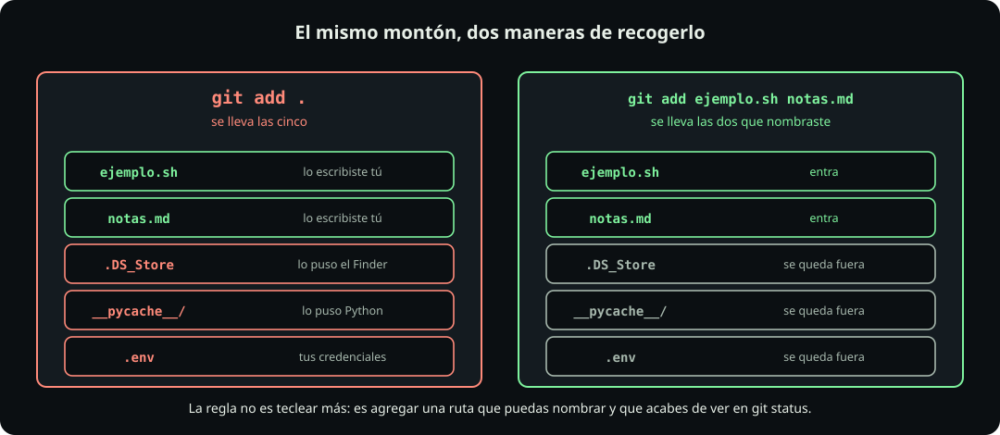

# Lo que no se sube

**Git · página 4 de 7** · 12 min

Meta: que nunca subas un archivo que no miraste, y que sepas qué hacer cuando ya lo hiciste.

::: figure {#git-lo-que-no-se-sube title="El mismo montón, dos maneras de recogerlo"}

:::

## En corto

- Tu sistema operativo escribe archivos en tus carpetas sin avisarte. Van a acabar en tus commits si no haces nada.
- La regla no es teclear más: es **agregar una ruta que puedas nombrar y que acabes de ver en `git status`**.
- El `.gitignore` es una lista de patrones, no de nombres, y tiene dos reglas que sorprenden.
- Una credencial subida está comprometida aunque la borres después.

## Lo que escribe tu máquina sin decirte

Estos archivos aparecen solos. Ninguno lo escribiste tú:

::: table {#git-basura title="Basura que genera tu entorno"}

| Archivo o carpeta | Quién lo pone | Para qué |
|---|---|---|
| `.DS_Store` | El Finder de macOS, en **cada carpeta que abres** | Recordar posición de iconos y modo de vista |
| `__pycache__/` | Python, al importar un módulo | Guardar el bytecode ya compilado |
| `.ipynb_checkpoints/` | Jupyter | Autoguardado de notebooks |
| `node_modules/` | npm | Miles de archivos de dependencias |
| `.env` | Tú, y ahí está el problema | Contraseñas, tokens, llaves de API |
| `Zone.Identifier` | Windows, al copiar desde el navegador | Marcar que el archivo vino de internet |

:::

El caso de macOS es el más silencioso: basta con **abrir** la carpeta en el Finder para que aparezca un `.DS_Store`. No lo ves porque empieza con punto, y `ls` normal no lo muestra. `ls -a` sí.

## Por qué `git add .` es la peor costumbre

El punto significa "todo lo que hay aquí abajo". No selecciona: barre.

**Haz:** compruébalo en el laboratorio.

```bash
cd ~/fdd/git-lab
mkdir -p __pycache__ && touch __pycache__/basura.pyc
printf 'TOKEN=secreto123\n' > .env
touch .DS_Store
git status --short
```

**Deberías ver** cuatro o cinco entradas, entre ellas tu `.env`. Si ahora corrieras `git add .`, las subirías todas.

La respuesta habitual de un curso es prohibirlo, y es una respuesta mala, porque el día que tengas ocho archivos vas a escribir `git add .` de todas formas. La regla útil es otra:

> **Agrega una ruta que puedas nombrar y que acabes de ver en `git status`.**

Eso deja fuera `git add .`, que se dispara desde donde estés parado e incluye lo que nunca miraste. Y deja dentro cosas legítimas como `git add estudiantes/tu-login/07_git`, que es una ruta concreta, acotada y que acabas de revisar. La diferencia no es cuántos archivos, es si sabes cuáles.

## El `.gitignore`

Un archivo de texto con un patrón por línea. Lo que coincida deja de aparecer en `git status` y no se puede agregar por accidente.

**Haz:**

```bash
cd ~/fdd/git-lab
cat > .gitignore <<'FIN'
.DS_Store
__pycache__/
*.pyc
.env
FIN
git status --short
```

**Deberías ver** que la lista se vació y sólo queda `.gitignore` como untracked. Los otros siguen en tu disco; Git dejó de mirarlos.

**Haz:** agrégalo, porque el `.gitignore` sí se versiona. Es parte del proyecto y sirve a todo el equipo:

```bash
git add .gitignore
git commit -m "ignoro la basura del sistema y las credenciales"
```

Sobre los patrones: son **globs**, no expresiones regulares. `*` significa cualquier cosa dentro de un nombre, `datos/` con barra final significa una carpeta, y una línea que empieza con `!` es una excepción.

::: table {#git-gitignore-patrones title="Patrones de uso diario"}

| Patrón | Qué ignora |
|---|---|
| `*.csv` | Cualquier archivo terminado en `.csv`, a cualquier profundidad |
| `datos/` | La carpeta `datos` completa |
| `/datos/` | Sólo la carpeta `datos` de la raíz del repositorio |
| `.env` | El archivo, esté donde esté |
| `*.log` | Todos los logs |

:::

## Las dos reglas que sorprenden

**Primera: el `.gitignore` no aplica a archivos ya rastreados.** Si un archivo ya entró en un commit, ignorarlo después no hace nada. Git ya lo conoce y le sigue la pista.

**Haz:** provoca el caso.

```bash
printf 'CLAVE=abc\n' > config.txt
git add config.txt && git commit -m "agrego config"
echo "config.txt" >> .gitignore
echo "CLAVE=xyz" > config.txt
git status --short
```

**Deberías ver** `config.txt` como modificado, a pesar de estar en el `.gitignore`. Eso es lo esperado, no un error.

Para sacarlo de verdad:

```bash
git rm --cached config.txt
git commit -m "dejo de rastrear config.txt"
git status --short
```

`git rm --cached` lo quita del repositorio **pero lo deja en tu disco**. Sin `--cached` te lo borraría de verdad.

**Segunda: no puedes desiginorar algo dentro de una carpeta ignorada.** Si ignoraste `datos/`, una excepción como `!datos/importante.csv` no funciona, porque Git ni siquiera entra a mirar dentro de una carpeta descartada. Hay que ignorar el contenido y no la carpeta.

## Credenciales: el caso que no se arregla

Todo lo anterior aplica al `.env` con una diferencia importante.

::: table {#git-credenciales title="Depende de hasta dónde llegó"}

| Dónde está | Qué hacer |
|---|---|
| Sólo en el staging area | `git restore --staged .env` y lo agregas al `.gitignore`. No pasó nada |
| Ya en un commit local | `git rm --cached .env`, commiteas, y lo agregas al `.gitignore` |
| Ya con push a GitHub | Lo mismo, **y además rota la credencial** |

:::

El último caso es el que importa. `git rm --cached` la quita de los commits futuros, **no de la historia**: quien clone el repositorio puede recuperarla con `git log`. Una credencial que llegó a un repositorio público se considera comprometida desde ese momento, aunque el archivo ya no esté. La única respuesta real es invalidarla y generar otra.

> [!WARNING]
> No uses `git commit --amend` para esto, aunque lo veas recomendado. Reescribe la historia, y si ya hiciste push crea problemas peores que el original. `git rm --cached` más un commit nuevo es honesto y seguro.

## Un detalle del repositorio del curso

El `.gitignore` de `fdd_o26` ya ignora, entre otros, `venv/`, `env/`, `build/`, `lib/`, `*.log` y `.env`. Si algún día trabajas dentro de tu carpeta y creas algo con uno de esos nombres, **va a desaparecer de `git status` sin avisarte** y no se va a entregar.

Es exactamente el problema que enseña esta página, y le pasa a alguien cada semestre. Si un archivo tuyo no aparece en `git status`, la primera sospecha es el `.gitignore`. Se comprueba así:

```bash
git check-ignore -v <archivo>
```

Te dice qué línea de qué `.gitignore` lo está ignorando, o no responde nada si no lo está.

::: problem {#git-p6-ignorado title="Lo agregué al gitignore y sigue ahí"}
Un compañero agrega `datos.csv` al `.gitignore`, corre `git status`, y el archivo sigue apareciendo como modificado. Jura que escribió bien el nombre. ¿Qué pasó y con qué comando lo confirmas?
:::

::: hint {of="git-p6-ignorado"}
El `.gitignore` decide qué archivos **empieza** a mirar Git. ¿Qué pasa con los que ya venía mirando?
:::

::: answer {of="git-p6-ignorado"}
`datos.csv` **ya estaba rastreado**: entró en algún commit anterior. El `.gitignore` sólo evita que Git empiece a seguir archivos nuevos; sobre los que ya conoce no tiene efecto.

Se confirma con `git check-ignore -v datos.csv`, que va a mostrar la regla que sí coincide, demostrando que el patrón está bien escrito y que el problema es otro.

Se arregla con `git rm --cached datos.csv` y un commit. El archivo se queda en su disco y Git deja de seguirlo.

Y si `datos.csv` pesaba mucho o tenía datos sensibles, dejar de rastrearlo no lo borra de la historia: sigue en los commits viejos y en el repositorio de todos los que clonaron.
:::

> [!NOTE]
> **Si sólo recuerdas una cosa:** antes de cada `git add`, corre `git status` y lee la lista. Si hay algo que no reconoces, no lo agregues todavía.

## Cierre

Ya sabes qué mantener fuera. Ahora, en [[deshacer-en-git|Deshacer]], vas a aprender a sacar lo que sí entró.
