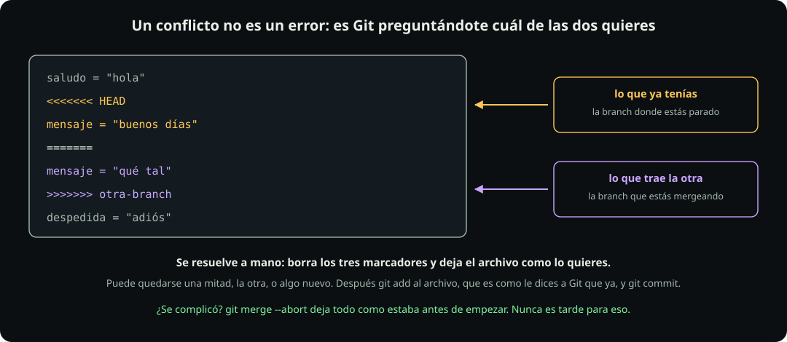

# Branches y merge

**Git · página 6 de 6** · 25 min

Meta: provocarte un conflicto a propósito y resolverlo, para que el día que llegue solo no te asuste.

::: figure {#git-branches title="Una branch no copia archivos"}

:::

## En corto

- Una branch **no es una copia de tus archivos**: es una etiqueta que apunta a un commit.
- Por eso crear una es instantáneo, aunque el proyecto pese gigabytes.
- Mergear junta dos líneas. A veces es trivial y a veces hay conflicto.
- Un conflicto no es un error: es Git diciendo que no puede decidir por ti.

## Qué es realmente una branch

**Haz:**

```bash
cd ~/fdd/git-lab
git branch
cat .git/refs/heads/main
```

**Deberías ver** una sola rama, `main`, con un asterisco, y después **cuarenta caracteres y un salto de línea**.

Eso es toda la branch. Un archivo de 41 bytes con el hash del commit al que apunta. No hay copias de nada. Cuando haces un commit, Git escribe el hash nuevo en ese archivo y la etiqueta avanza.

De ahí sale algo que sorprende viniendo de otras herramientas: **crear una branch no cuesta nada.** Ni tiempo ni espacio. Por eso la costumbre en Git es crear muchas y desecharlas.

Y `HEAD` es la etiqueta que dice en cuál estás parado:

```bash
cat .git/HEAD
```

**Deberías ver** `ref: refs/heads/main`. Cambiar de branch es, esencialmente, cambiar esa línea.

## Paso 1: crea una y muévete

**Haz:**

```bash
git switch -c experimento
git branch
echo "una idea" > idea.txt
git add idea.txt
git commit -m "pruebo una idea"
git log --oneline
```

**Deberías ver** que `git branch` marca `experimento` con el asterisco, y que el commit nuevo aparece en el log.

**Haz:** vuelve a `main` y mira qué pasa con el archivo.

```bash
git switch main
ls
git log --oneline
```

**Deberías ver** que **`idea.txt` desapareció** de la carpeta y que el log ya no muestra ese commit.

No se perdió nada. Git reescribió tu carpeta para que coincida con lo que hay en `main`. El commit sigue existiendo, colgando de la etiqueta `experimento`.

::: table {#git-branch-comandos title="Los cuatro comandos de branch"}

| Quiero | Comando |
|---|---|
| Ver en cuál estoy | `git branch` |
| Crear una y saltar a ella | `git switch -c <nombre>` |
| Saltar a una que ya existe | `git switch <nombre>` |
| Borrar una ya mergeada | `git branch -d <nombre>` |

:::

En tutoriales viejos vas a ver `git checkout -b` en vez de `git switch -c`. Hacen lo mismo aquí. `checkout` es un comando antiguo que hace demasiadas cosas distintas, y en 2019 Git lo partió en dos: `switch` para ramas y `restore` para archivos. Usa los nuevos.

> [!TIP]
> Si intentas cambiar de branch con trabajo sin commitear, a veces Git te deja y se lo lleva consigo, y a veces se niega con `Your local changes would be overwritten`. Depende de si ese archivo difiere entre las dos ramas. Cuando se niegue, tienes las dos salidas de la página anterior: commitea, o haz `git stash`.

## Paso 2: el merge fácil

**Haz:**

```bash
git merge experimento
ls
git log --oneline
```

**Deberías ver** el mensaje `Fast-forward` y que `idea.txt` reapareció.

**Fast-forward** significa que `main` no se había movido desde que naciste la rama, así que no hubo nada que combinar: Git sólo deslizó la etiqueta hacia adelante. Es el caso ideal.

**Haz:** limpia la rama, que ya cumplió.

```bash
git branch -d experimento
git branch
```

## Paso 3: provócate un conflicto

Aquí está la parte que importa. Vas a crear el choque a propósito, en tu laboratorio, donde no hay nada que perder.

**Haz:** primero una rama que cambia una línea.

```bash
printf 'saludo = "hola"\nmensaje = "buenos días"\ndespedida = "adiós"\n' > texto.txt
git add texto.txt && git commit -m "agrego el texto base"
git switch -c version-formal
printf 'saludo = "hola"\nmensaje = "buenas tardes, estimado"\ndespedida = "adiós"\n' > texto.txt
git commit -am "uso un tono formal"
```

**Haz:** ahora vuelve a `main` y cambia **la misma línea** de otra forma.

```bash
git switch main
printf 'saludo = "hola"\nmensaje = "qué tal"\ndespedida = "adiós"\n' > texto.txt
git commit -am "uso un tono casual"
git merge version-formal
```

**Deberías ver:**

```text
Auto-merging texto.txt
CONFLICT (content): Merge conflict in texto.txt
Automatic merge failed; fix conflicts and then commit the result.
```

**Eso es un éxito.** Provocaste exactamente lo que querías.

## Paso 4: léelo

::: figure {#git-conflicto title="Un conflicto no es un error"}

:::

**Haz:**

```bash
git status
cat texto.txt
```

**Deberías ver** que `git status` lista `both modified: texto.txt` y que el archivo ahora dice:

```text
saludo = "hola"
<<<<<<< HEAD
mensaje = "qué tal"
=======
mensaje = "buenas tardes, estimado"
>>>>>>> version-formal
despedida = "adiós"
```

Git escribió las dos versiones dentro del archivo y las separó con tres marcadores:

- Entre `<<<<<<< HEAD` y `=======` está **lo que ya tenías**, la branch donde estás parado.
- Entre `=======` y `>>>>>>>` está **lo que trae la otra branch**, cuyo nombre aparece al final.

Fíjate en lo que Git **sí** resolvió solo: las líneas de saludo y despedida no aparecen por ningún lado, porque eran idénticas en las dos ramas. El conflicto es sólo la línea donde las dos versiones no coinciden.

## Paso 5: resuélvelo

Resolver significa dejar el archivo como lo quieres, **sin marcadores**. Puede quedarse una mitad, la otra, o algo nuevo que escribas tú.

**Haz:**

```bash
printf 'saludo = "hola"\nmensaje = "buenas tardes"\ndespedida = "adiós"\n' > texto.txt
git add texto.txt
git status
git commit -m "resuelvo el conflicto del mensaje"
git log --oneline
```

**Deberías ver** que después del `add` el estado cambia a `All conflicts fixed but you are still merging`, y que el commit final aparece en el log.

Ahí `git add` significa algo distinto de lo habitual: es cómo le dices a Git **"ya lo revisé, esta versión es la buena"**. Por eso el conflicto se cierra con el mismo comando que usas para todo lo demás.

Este merge sí creó un commit nuevo, con **dos padres**, porque las dos líneas habían avanzado por separado. Y Git te abrió un editor para el mensaje, o lo habría hecho si no le hubieras pasado `-m`.

> [!TIP]
> Si el editor que se abre es `vim` y no sabes salir: escribe `:wq` y presiona Enter. Para evitarlo de una vez, `git config --global core.editor nano` deja uno más simple, donde se guarda con `Ctrl+O` y se sale con `Ctrl+X`.

## La salida de emergencia

**Haz:** provoca otro conflicto y esta vez no lo resuelvas.

```bash
git switch -c otra-version
printf 'saludo = "qué onda"\nmensaje = "buenas tardes"\ndespedida = "adiós"\n' > texto.txt
git commit -am "cambio el saludo"
git switch main
printf 'saludo = "buenos días"\nmensaje = "buenas tardes"\ndespedida = "adiós"\n' > texto.txt
git commit -am "cambio el saludo de otra forma"
git merge otra-version
git merge --abort
git status
cat texto.txt
```

**Deberías ver** que después de `--abort` todo volvió exactamente a como estaba antes de intentar el merge: sin marcadores, sin conflicto, el árbol limpio.

`git merge --abort` es la salida que nadie te dice y que siempre está disponible mientras no hayas commiteado. Si un conflicto se te complicó, no hace falta pelear con él: abortas, respiras, y vuelves a intentarlo con calma.

::: problem {#git-p8-branch title="Cambié de branch y mi archivo cambió solo"}
Estás en `main`, creas `git switch -c prueba`, editas `notas.md` y commiteas. Después haces `git switch main` y abres `notas.md`: tu texto no está.

¿Se perdió? ¿Dónde está? ¿Y qué habría pasado si en lugar de commitear hubieras dejado el cambio sin guardar?
:::

::: hint {of="git-p8-branch"}
Una branch es una etiqueta que apunta a un commit, y tu carpeta muestra lo que hay en la etiqueta donde estás parado. Piensa en qué pasa con un cambio que no pertenece a ninguna etiqueta todavía.
:::

::: answer {of="git-p8-branch"}
**No se perdió.** Tu commit está colgando de la etiqueta `prueba`. Al saltar a `main`, Git reescribió tu carpeta para que coincida con lo que `main` tiene, y `main` no conoce ese commit. Con `git switch prueba` reaparece, y con `git merge prueba` desde `main` te lo traes.

Si el cambio **no estaba commiteado**, la respuesta es distinta y depende: como el cambio no pertenece a ninguna rama, Git intenta llevárselo consigo al cambiar de branch. Si `notas.md` es igual en las dos ramas, funciona y tu edición te sigue. Si el archivo difiere entre las dos, Git se niega con `Your local changes to the following files would be overwritten by checkout`, porque tendría que pisar tu trabajo.

Ese rechazo es una protección, no un obstáculo. Las dos salidas son commitear antes de saltar, o `git stash` si el trabajo no está listo para un commit.
:::

> [!NOTE]
> **Si sólo recuerdas una cosa:** una branch es una etiqueta, no una copia. Y mientras no commitees el merge, `git merge --abort` siempre te devuelve al punto de partida.

## Cierre

Con esto **termina la sección de Git**. Ya sabes commitear, ramificar, mergear y resolver un conflicto, y no has tocado internet ni una vez.

Sigue con [[seccion-github|GitHub]], donde por fin aparece la red.
