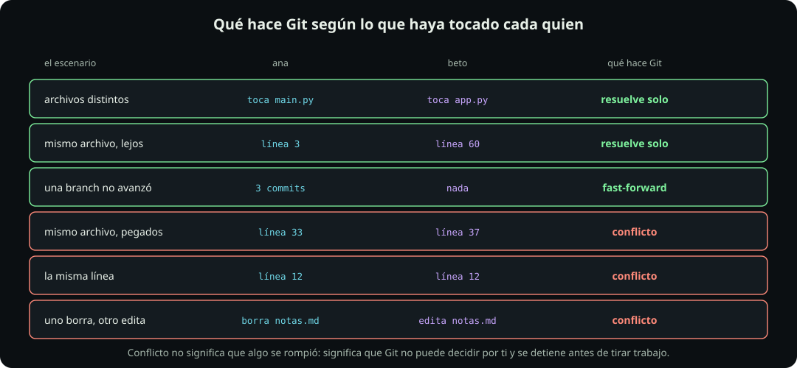
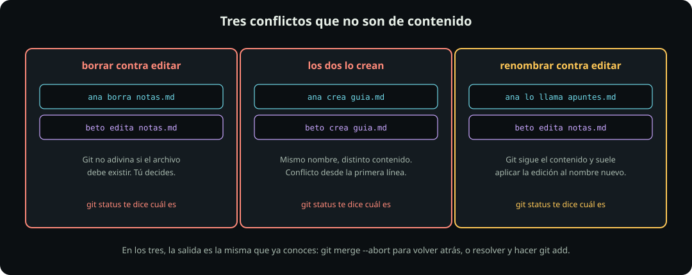

# Cuando dos avanzan a la vez

**Git · página 7 de 7** · 15 min

Meta: poder predecir, antes de correr `git merge`, si va a salir solo o va a haber conflicto.

## En corto

- Git **no compara tu versión contra la otra**. Compara las dos contra el ancestro común.
- Esa sola regla explica todos los casos, incluidos los que sorprenden.
- Tocar el mismo archivo no basta para que haya conflicto. Tocar la misma **zona**, sí.
- Hay tres conflictos que no son de contenido y confunden la primera vez.

Todo esto pasa **dentro de tu máquina**, entre dos branches. Nadie más tiene que estar involucrado. Lo que ocurre cuando además hay otra persona con su propia copia lo verás en [[dos-personas-un-archivo|Dos personas, un archivo]], ya en la sección de GitHub.

## El mecanismo: tres vías, no dos

Ésta es la idea que hay que entender, y de ella se derivan todas las demás.

::: figure {#git-tres-vias title="Git compara las dos versiones contra el ancestro"}

:::

Cuando mergeas, Git busca primero el **ancestro común**: el último commit que las dos branches compartían. Después hace dos comparaciones, no una:

- Qué cambió **tu** versión respecto de la base.
- Qué cambió **la otra** versión respecto de la base.

Y aplica una regla única: si una zona la cambió **un solo lado**, se toma ese cambio sin preguntar. Si la cambiaron **los dos**, Git se detiene y te la deja a ti.

Por eso una línea que nadie tocó sobrevive intacta, y por eso los cambios de la otra branch aparecen en tu resultado aunque tú no hayas hecho nada con ellos.

## Por qué "líneas distintas" no basta

Aquí está la parte que casi todo el mundo aprende por las malas.

::: figure {#git-hunks title="Git compara bloques, no líneas sueltas"}

:::

Git no razona línea por línea. Agrupa cada cambio en un **bloque** que incluye unas líneas de contexto alrededor, para poder ubicarlo aunque el archivo se haya movido.

Si los bloques de los dos lados no se tocan, el merge sale solo. Si se traslapan, hay conflicto **aunque las líneas editadas sean distintas**.

No hay un número mágico de líneas de separación. Depende de cuánto contexto tome Git en cada caso, así que la regla práctica es: mientras más cerca trabajen dos personas del mismo lugar, más probable es el conflicto.

## Todos los casos en una tabla

::: figure {#git-paralelo-matriz title="Qué hace Git según lo que haya tocado cada quien"}

:::

Vale la pena leer la tabla en dos mitades. **Las tres primeras filas son el caso normal**, y son la mayoría del trabajo real: Git resuelve y ni te enteras. Las tres últimas son donde te toca decidir.

Fíjate en la tercera fila, la del fast-forward: si una de las dos branches no avanzó, no hay nada que combinar. Git sólo mueve la etiqueta. Es el caso más común de todos y por eso casi nunca ves un merge commit al principio.

## Los tres conflictos que no son de contenido

::: figure {#git-paralelo-raros title="Tres conflictos que no son de contenido"}

:::

Los conflictos de contenido traen marcadores dentro del archivo y ya sabes resolverlos. Estos tres no, y por eso desconciertan:

- **Borrar contra editar.** Uno borró el archivo, el otro lo mejoró. Git no puede adivinar si debe existir. La decisión es tuya, y se ejecuta con `git rm` o con `git add`, según lo que elijas.
- **Los dos lo crean.** Mismo nombre, contenido distinto, y sin ancestro común contra el cual comparar. Conflicto desde la primera línea.
- **Renombrar contra editar.** Git sigue el contenido y no el nombre, así que normalmente hace lo correcto: aplica la edición sobre el archivo renombrado. Cuando el archivo cambió demasiado, deja de reconocerlo y sí conflictúa.

En los tres, `git status` te dice exactamente cuál es, y las salidas son las mismas de la página anterior: resolver y `git add`, o `git merge --abort` para volver atrás.

## La consecuencia práctica

De todo esto sale una conclusión que va a explicar una regla del curso más adelante: **el conflicto no depende de cuánta gente haya, sino de cuánto se toquen.**

Dos personas trabajando en archivos separados no conflictúan nunca, aunque sean cien. Dos personas editando el mismo párrafo conflictúan siempre, aunque sean sólo dos.

::: problem {#git-p13-paralelo title="Predice el resultado"}
Dos branches salieron del mismo commit. En `analisis.py`, que tiene 200 líneas:

- En la branch `limpieza` alguien borró las líneas 40 a 45 y no tocó nada más.
- En la branch `reporte` alguien agregó tres líneas al final del archivo, después de la 200, y cambió la línea 42.

¿Cuántas zonas en conflicto va a reportar Git, y por qué?
:::

::: hint {of="git-p13-paralelo"}
Ve cambio por cambio y pregúntate, para cada uno, si el otro lado tocó esa misma zona respecto de la base. Son tres cambios en total, no dos.
:::

::: answer {of="git-p13-paralelo"}
**Una sola zona en conflicto.**

Hay tres cambios y hay que evaluarlos por separado:

El borrado de las líneas 40 a 45 y la edición de la línea 42 **son la misma zona**. Un lado dice que ese texto ya no existe y el otro dice cómo debería quedar. Git no puede aplicar los dos, así que ahí sí se detiene.

Las tres líneas agregadas al final están a 155 líneas de distancia. Ningún bloque de contexto llega hasta allá, y del otro lado nadie tocó el final del archivo. Git las aplica sin preguntar.

Y el resto del archivo, las líneas que nadie modificó, pasan intactas.

El detalle que hace interesante este caso es que la línea 42 no fue "editada contra editada": fue **editada contra borrada**. Es uno de los casos raros de la figura anterior, sólo que dentro de un archivo en vez de sobre el archivo entero. Git lo marca igual, y la decisión es la misma: o el texto se queda con la edición, o se va.
:::

> [!NOTE]
> **Si sólo recuerdas una cosa:** Git compara los dos lados contra el ancestro. Un cambio de un solo lado se aplica solo; un cambio de los dos lados te lo pregunta.

## Cierre

Con esto **termina la sección de Git**. Ya sabes commitear, deshacer, ramificar, mergear y predecir un conflicto, y no has tocado internet ni una vez.

Sigue con [[seccion-github|GitHub]], donde por fin aparece la red.
