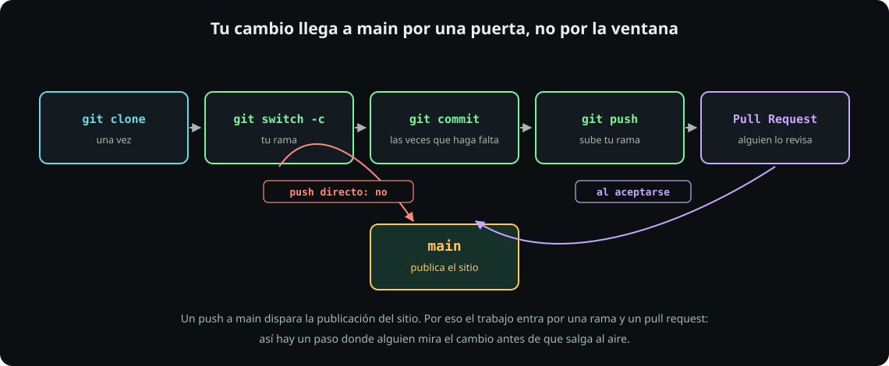

# Clonar y trabajar

**Hoja 2 de 2** · 20 min

Meta: tener el repositorio del curso en tu disco y saber cómo entra un cambio.

::: figure {#git-flujo title="Tu trabajo vive en tu rama"}

:::

## En corto

- `git clone` se corre **una vez**; después ya sólo entras a la carpeta.
- Cada commit lleva tu nombre y tu correo: configúralos antes del primero.
- **A `main` no se empuja directo.** Un push a `main` publica el sitio del curso.

## Paso 1: quién eres

Git firma cada commit con un nombre y un correo. Si no los pones, o los pone mal o se niega a trabajar.

**Haz:** usa el mismo correo de tu cuenta de GitHub, para que los commits se asocien a tu perfil.

```bash
git config --global user.name  "Tu Nombre"
git config --global user.email "tu-correo@ejemplo.com"
git config --global init.defaultBranch main
git config --global pull.rebase false
git config --global --list
```

**Deberías ver** las cuatro líneas que acabas de poner. `--global` significa «para todos los repositorios de esta computadora»: se hace una vez en la vida de la máquina.

## Paso 2: clona el repositorio

**Haz:**

```bash
mkdir -p ~/fdd && cd ~/fdd
git clone git@github.com:raya-lucaria/fdd_o26.git
cd fdd_o26
git remote -v
git log --oneline -5
```

**Deberías ver** el clonado bajando objetos, después dos líneas de `remote -v` que terminan en `fdd_o26.git`, y los últimos cinco commits del curso.

Si prefieres no usar SSH, `git clone https://github.com/raya-lucaria/fdd_o26.git` también funciona para **leer**, porque el repositorio es público. Pero para subir te va a pedir un token cada vez. Por eso hicimos la llave.

**Pausa:** ya tienes el curso completo en tu disco. `ls` te muestra `course/`, `tools/`, `skins/`. Todo el sitio que has estado leyendo sale de ahí.

## Paso 3: tu primera rama

Este repositorio no es un ejercicio: **cada commit que llega a `main` publica el sitio del curso**. Por eso nadie trabaja sobre `main` — cada cosa que hagas vive en una rama tuya.

**Haz:** crea la rama, deja un archivo con tu nombre de usuario dentro y súbela.

```bash
cd ~/fdd/fdd_o26
git switch main
git pull
git switch -c hola-TU-USUARIO
mkdir -p saludos
printf 'Hola, soy TU-USUARIO.\n' > saludos/TU-USUARIO.md
git add saludos/TU-USUARIO.md
git status
git commit -m "saludo de TU-USUARIO"
git push -u origin hola-TU-USUARIO
```

Cambia `TU-USUARIO` por tu nombre de usuario de GitHub en las cinco líneas donde aparece. `git status` antes del commit no es opcional: es la costumbre que evita subir lo que no querías.

**Deberías ver**, al final, que GitHub confirma la rama creada. Ahí se queda. **Cómo se incorpora tu rama a `main` lo vemos más adelante** — por ahora, subirla es todo.

> [!WARNING]
> El `push` sólo funciona si ya tienes acceso de escritura al repositorio, y eso lo doy yo a partir de tu nombre de usuario. Si te responde `Permission denied` o `403`, **no** es un error tuyo: significa que todavía no te he dado acceso. Todo lo demás —clonar, la rama, el commit— sí lo puedes dejar hecho desde ya.

| Comando | Qué hace |
|---|---|
| `git status` | qué cambió y qué está por confirmarse. Úsalo **antes** de cada commit |
| `git switch -c nombre` | crea una rama y se cambia a ella |
| `git switch main` | vuelve a la rama principal |
| `git pull` | trae lo que otros subieron |
| `git log --oneline -5` | los últimos cinco commits |

> [!WARNING]
> Antes de empezar algo nuevo: `git switch main` y `git pull`. Ramificar desde una copia vieja es la causa número uno de conflictos que no tenían por qué existir.

## Paso 4: qué pasa cuando formatees la computadora

Esta es la pregunta que casi nadie hace a tiempo.

Tu llave privada **no se respalda y no se recupera**. Vive en `~/.ssh/` y si borras el disco, se va con él. Y está bien: no es un documento, es una credencial.

| Situación | Qué haces |
|---|---|
| Formateaste, o estrenas computadora | Repites la [[cuenta-y-llave|hoja 1]]: generas un par nuevo y lo agregas a la misma cuenta. Toma dos minutos. |
| Trabajas en dos máquinas | Una llave **por máquina**, las dos en la misma cuenta. Nunca copies la privada de una a otra. |
| Perdiste una laptop | Entra a GitHub y borra esa llave de Settings. Lo que estaba en `main` sigue en GitHub, intacto. |

Tu trabajo no vive en la llave: vive en GitHub. Mientras hayas hecho `push`, formatear no te quita nada.

::: problem {#git-p2-main title="Ya hiciste el commit en main"}
Editaste un archivo y hiciste `git commit` sin crear rama, así que el commit quedó en tu `main` local. Todavía **no** has hecho `push`. ¿Cómo lo mueves a una rama?
:::

::: hint {of="git-p2-main"}
Una rama es sólo una etiqueta que apunta a un commit. Puedes crear la etiqueta aquí y después mover `main` hacia atrás.
:::

::: answer {of="git-p2-main"}
Crea la rama desde donde estás, que ya incluye tu commit, y después regresa `main` al punto en el que estaba GitHub:

```bash
git switch -c mi-rama
git switch main
git reset --hard origin/main
git switch mi-rama
```

Tu commit sigue en `mi-rama` y `main` vuelve a estar igual que el del servidor. Como no habías hecho `push`, nadie más lo vio nunca.

`git reset --hard` **borra** los cambios sin confirmar de la rama en la que estés, así que aquí funciona porque el commit ya está guardado en `mi-rama`. Corre `git status` antes, siempre.
:::

> [!NOTE]
> **Si sólo recuerdas una cosa:** `git switch main && git pull` antes de empezar, y una rama nueva por cada cosa que hagas.

## Cierre

Ya tienes el repositorio, tu identidad configurada y el camino por el que entra un cambio. No hay nada que subir: la unidad se da por terminada cuando `ssh -T` te saluda, `git remote -v` apunta a `fdd_o26.git` y `git log` te lista los commits del curso. Llega a clase con tu nombre de usuario de GitHub a la mano.
