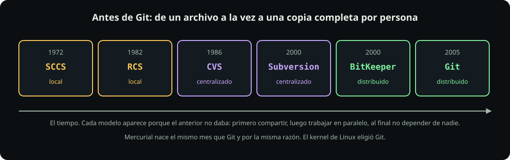

# De dónde viene Git

**Página 3 de 12** · 8 min

Meta: entender qué problema resuelve Git, para que los comandos de las próximas páginas no parezcan arbitrarios.

::: figure {#git-linea-del-tiempo title="Treinta años buscando lo mismo"}

:::

## En corto

- Ya clonaste de GitHub, así que la siguiente frase suena rara: **Git no sabe qué es internet.** Hoy la vas a creer a medias y el martes la vas a entender.
- Git existe porque en 2005 el kernel de Linux se quedó de golpe sin herramienta para versionar.
- Antes de Git, o trabajabas solo, o dependías de un servidor. Git fue el primero libre en no necesitar ninguna de las dos cosas.
- Hoy lo usa el 93 % de quienes programan. No es una opción entre varias.

## El problema, en abril de 2005

Desde 2002 el kernel de Linux se versionaba con **BitKeeper**, una herramienta propietaria que su empresa regalaba a proyectos libres con una condición: mientras la usaras, no podías trabajar en una herramienta que le compitiera.

En 2005 Andrew Tridgell, el autor de Samba, escribió un cliente libre capaz de leer repositorios de BitKeeper. Él sostuvo que sólo se había conectado al servidor y había escrito `help`. La empresa lo llamó ingeniería inversa y anunció el fin de la licencia gratuita.

No fue de un día para otro. El anuncio fue el 5 de abril y el corte era en julio. Torvalds tenía tres meses de margen y decidió no gastarlos: el 3 de abril ya estaba escribiendo Git, y el **7 de abril Git ya se guardaba a sí mismo**. En junio el kernel entero se versionaba con él.

El primer commit del proyecto sigue ahí, y su mensaje dice:

```text
Initial revision of "git", the information manager from hell
```

Sobre el nombre, Torvalds le dijo a Computerworld ese mismo mes: *"I'm an egotistical bastard, so I name all my projects after myself. First Linux, now git."* En inglés británico, `git` es un insulto suave.


## Lo que había antes, y por qué no bastaba

::: table {#git-antes title="Cada modelo aparece porque el anterior no daba"}

| Año | Sistema | Modelo | El problema que dejaba abierto |
|---|---|---|---|
| 1972 | SCCS | Local, un archivo, con candado | Mientras tú lo editas, nadie más puede |
| 1982 | RCS | Local, un archivo, con candado | Ni red, ni guardar varios archivos como una sola unidad |
| 1986 | CVS | Centralizado | Un guardado podía quedar a medias; no entendía los renombrados |
| 2000 | Subversion | Centralizado | Cada operación exige hablar con el servidor, y mergear duele |
| 2000 | BitKeeper | Distribuido, propietario | Técnicamente bien. El problema era la licencia |
| 2005 | Git y Mercurial | Distribuido, libre | |

:::

La palabra que importa de esa tabla es **distribuido**. En un sistema centralizado el servidor tiene la historia y tú tienes una copia de trabajo: sin red no hay historia, y si el servidor se pierde, se perdió todo. En uno distribuido cada quien tiene el proyecto completo, con toda su historia, en su disco.

Mercurial nació el mismo mes que Git y por la misma razón. El kernel eligió Git.

## Los tres requisitos

Torvalds pidió tres cosas, y las tres explican decisiones que vas a ver en las próximas páginas:

1. **Distribuido.** Que puedas trabajar sin pedirle permiso a nadie.
2. **Rápido.** Su referencia era aplicar un parche en menos de tres segundos.
3. **Íntegro.** En sus palabras, si no puedes garantizar que lo que metes sale exactamente igual, no vale la pena. De ahí sale el hash de la página siguiente.

## Dónde está hoy

- **93 %** de quienes programan usan Git, según la encuesta de Stack Overflow de 2022. Es el último año en que se preguntó, porque dejó de ser una pregunta interesante.
- **180 millones** de personas y **986 millones** de commits empujados en GitHub durante 2025.
- El repositorio de Windows pesaba unos **300 GB** en 2017, cuando Microsoft tuvo que inventar tecnología extra para que Git lo aguantara.

Epílogo: BitKeeper se liberó con licencia Apache en 2016, once años tarde.

::: problem {#git-p3-centralizado title="Por qué no le servía un servidor central"}
El kernel de Linux recibe parches de miles de personas repartidas por el mundo, muchas sin relación entre sí ni permiso para escribir en ningún lado central. Da dos razones concretas por las que un sistema centralizado como Subversion no le sirve a un proyecto así.
:::

::: hint {of="git-p3-centralizado"}
Piensa en quién tiene permiso de escritura y en qué pasa cuando alguien quiere proponer algo sin tenerlo. Y piensa en qué se necesita para simplemente leer la historia.
:::

::: answer {of="git-p3-centralizado"}
Primero, **el permiso de escritura no escala**. En un servidor central, para guardar tu trabajo necesitas que alguien te dé acceso. Con miles de colaboradores ocasionales, o le das acceso de escritura a gente que no conoces, o no pueden aportar nada. En un sistema distribuido cada quien guarda en su propia copia y después propone; el permiso sólo hace falta al final.

Segundo, **todo depende de un solo punto**. Si el servidor está caído, lento o al otro lado del planeta, no puedes ni consultar la historia. Con Git la historia completa está en tu disco: `git log` funciona sin red.

Hay una tercera razón que Torvalds mencionaba mucho: la velocidad. Cuando cada operación cuesta un viaje al servidor, dejas de usarla, y una herramienta que no usas no te sirve.
:::

> [!NOTE]
> **Si sólo recuerdas una cosa:** Git es distribuido. Tu copia no es un reflejo del servidor, es el proyecto entero con toda su historia.

## Cierre

Ya sabes qué problema resuelve. Ahora vas a construir uno desde cero en [[tu-primer-repositorio|Tu primer repositorio]], sin conexión y sin GitHub.
