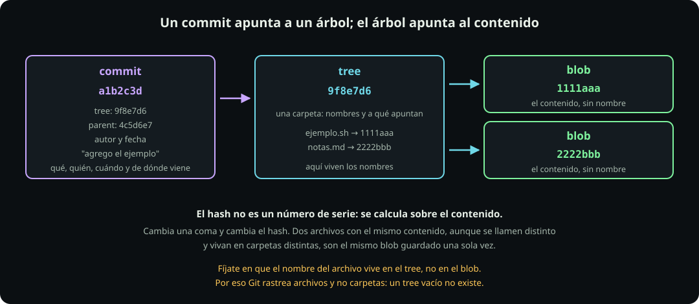

# Qué guarda un commit

**Página 5 de 12** · 12 min

Meta: entender qué es ese identificador de cuarenta caracteres, para que deje de ser magia.

::: figure {#git-objetos title="Un commit apunta a un árbol; el árbol apunta al contenido"}

:::

## En corto

- Un commit guarda **una foto completa** del proyecto, no una lista de diferencias.
- Hay tres tipos de objeto: **blob** es contenido, **tree** es una carpeta, **commit** es una foto con fecha y autor.
- El hash no es un número de serie: **se calcula sobre el contenido**. Mismo contenido, mismo hash.
- De ahí sale un hecho que confunde a todos: Git rastrea archivos, no carpetas.

## Una foto, no una lista de cambios

La intuición natural es que un sistema de versiones guarda diferencias: "en el commit 3 cambió la línea 12". Git no funciona así. **Cada commit apunta a una foto completa del proyecto en ese instante.**

Suena derrochador y no lo es, por la razón que verás en un minuto: si un archivo no cambió entre dos commits, los dos apuntan al mismo objeto. No se copia nada.

> [!NOTE]
> Una honestidad que vale la pena: al empaquetar el repositorio para ahorrar espacio, Git **sí** guarda diferencias internamente. Pero eso es compresión, no el modelo. Cuando razonas sobre Git, razona con fotos completas.

## Ábrelo con las manos

Sigue en `~/fdd/git-lab`.

**Haz:**

```bash
cd ~/fdd/git-lab
git log --oneline
git cat-file -p HEAD
```

**Deberías ver** algo así, con tus propios identificadores:

```text
tree 9f8e7d6c5b4a39281706f5e4d3c2b1a098765432
parent 4c5d6e7f8a9b0c1d2e3f4a5b6c7d8e9f0a1b2c3d
author Tu Nombre <tu-correo@ejemplo.com> 1757000000 -0600
committer Tu Nombre <tu-correo@ejemplo.com> 1757000000 -0600

extiendo el saludo
```

Eso es **un commit por dentro**, y son cinco cosas: a qué árbol apunta, de qué commit viene, quién lo escribió, cuándo, y el mensaje. Nada más. Ni siquiera contiene los archivos.

**Haz:** sigue el hilo hacia el árbol. Copia el hash que te salió después de `tree` y pégalo:

```bash
git cat-file -p HEAD^{tree}
```

**Deberías ver** una lista con una línea por archivo: permisos, tipo, hash y nombre.

Ahí están los nombres de tus archivos. **En el árbol, no en el contenido.** Guarda ese dato, porque explica lo del final de la página.

**Haz:** un paso más, hasta el contenido:

```bash
git cat-file -p $(git rev-parse HEAD:saludo.txt)
```

**Deberías ver** el texto de tu archivo, tal cual. Eso es un blob: contenido puro, sin nombre y sin fecha.

::: table {#git-tres-objetos title="Los tres objetos"}

| Objeto | Qué guarda | Qué no guarda |
|---|---|---|
| `blob` | El contenido de un archivo | Su nombre, su ruta, su fecha |
| `tree` | Una carpeta: nombres y a qué apuntan | El contenido |
| `commit` | Un árbol raíz, su padre, autor, fecha, mensaje | Los archivos |

:::

## El hash es la dirección, no el folio

Los cuarenta caracteres son un **SHA-1**, y se calculan a partir del contenido del objeto. No es un contador ni una fecha disfrazada.

**Haz:** compruébalo. Este comando calcula el hash de un texto sin guardar nada:

```bash
printf 'hola\n' | git hash-object --stdin
printf 'hola\n' | git hash-object --stdin
printf 'hola.\n' | git hash-object --stdin
```

**Deberías ver** que las dos primeras líneas dan **exactamente el mismo** hash, y que la tercera, con un punto de diferencia, da uno completamente distinto.

De ahí salen dos consecuencias:

1. **Integridad.** Si un byte del repositorio se corrompe, el hash deja de coincidir y Git lo nota. Era el tercer requisito de Torvalds.
2. **No se duplica nada.** Dos archivos con el mismo contenido, aunque se llamen distinto y vivan en carpetas distintas, son **el mismo blob**, guardado una sola vez.

Por eso se dice que Git es un almacén direccionado por contenido. En el libro *Pro Git* la frase es que Git es, en el fondo, un sistema de archivos direccionado por contenido con una interfaz de control de versiones encima.

Una nota de actualidad: SHA-1 tiene debilidades conocidas desde 2017, y Git trae desde 2020 soporte experimental de SHA-256. La transición sigue incompleta y no te va a tocar en este curso.

## Por qué Git no ve tus carpetas

Ya tienes todo para deducirlo. Los nombres viven en los `tree`, y un `tree` es una lista de lo que hay adentro. **Una carpeta vacía es una lista vacía, así que no hay nada que guardar.**

**Haz:**

```bash
mkdir vacia
git status
```

**Deberías ver** `nothing to commit, working tree clean`. Git no miente ni se equivoca: para él esa carpeta no existe, porque no hay ningún archivo que registrar.

La solución de la comunidad es poner dentro un archivo cualquiera. Por convención se llama `.gitkeep`:

```bash
touch vacia/.gitkeep
git status
```

**Deberías ver** que ahora sí aparece `vacia/` como untracked.

`.gitkeep` **no es una función de Git**. Git no conoce ese nombre ni le da trato especial: es un archivo vacío como cualquier otro, y funciona porque existir es suficiente. Podría llamarse `pon-algo-aqui.txt` y daría igual. Se usa `.gitkeep` porque todo el mundo lo entiende.

Esto va a importar en la página 11, cuando tengas que crear tu carpeta de entregas antes de tener algo que poner en ella.

::: problem {#git-p5-blob title="Dos archivos, un contenido"}
En un repositorio nuevo creas `notas/uno.txt` y `borradores/dos.txt`, y los dos tienen exactamente el mismo texto adentro. Haces `git add` de los dos y commiteas.

¿Cuántos blobs guardó Git? ¿Y cuántos trees?
:::

::: hint {of="git-p5-blob"}
El blob no sabe cómo se llama el archivo. Los nombres y las rutas viven en otra parte.
:::

::: answer {of="git-p5-blob"}
**Un solo blob.** El hash sale del contenido, y el contenido es idéntico, así que los dos archivos son el mismo objeto guardado una vez. Que se llamen distinto no cambia nada, porque el blob no guarda el nombre.

**Tres trees.** Uno para `notas/`, uno para `borradores/`, y el árbol raíz que los contiene a los dos. Cada uno de los dos trees de carpeta apunta al mismo blob, con un nombre distinto.

Esa es la diferencia práctica entre las dos capas: el contenido se guarda una vez, y los nombres son punteros hacia él.
:::

> [!NOTE]
> **Si sólo recuerdas una cosa:** el hash sale del contenido. Cambia una coma y cambia el hash; no cambies nada y es el mismo objeto.

## Cierre

Ya sabes qué hay dentro de un commit. Ahora, en [[lo-que-no-se-sube|Lo que no se sube]], vas a ver qué **no** debe llegar nunca a uno.
