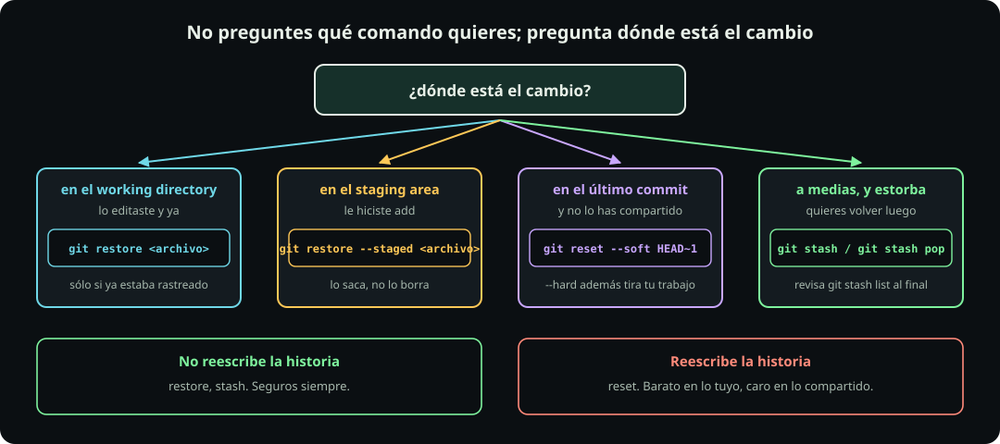

# Deshacer

**Página 7 de 12** · 20 min

Meta: que cuando algo salga mal sepas en qué zona estás parado, porque eso determina el comando.

::: figure {#git-deshacer title="No preguntes qué comando quieres; pregunta dónde está el cambio"}

:::

## En corto

- La pregunta nunca es "qué comando deshace esto". Es **dónde está el cambio**.
- `restore` trabaja sobre archivos. `reset` mueve la punta de la historia. `stash` guarda para después.
- Hay una línea que divide todo: **lo que reescribe la historia y lo que no.**
- Casi nada se pierde de verdad, y hay un comando que lo demuestra.

## La tabla

Todo lo demás de esta página es explicación de esta tabla.

::: table {#git-deshacer-tabla title="Dónde está el cambio decide el comando"}

| Dónde está | Qué quieres | Comando |
|---|---|---|
| Working directory, archivo ya rastreado | Descartar lo que editaste | `git restore <archivo>` |
| Staging area | Sacarlo de ahí sin perderlo | `git restore --staged <archivo>` |
| El último commit, que no es un merge | Deshacerlo y conservar los cambios | `git reset --soft HEAD~1` |
| El último commit, que no es un merge | Deshacerlo y tirar los cambios | `git reset --hard HEAD~1` |
| Estorba, pero lo quieres después | Guardarlo aparte | `git stash`, y luego `git stash pop` |

:::

## Paso 1: descartar lo que editaste

**Haz:**

```bash
cd ~/fdd/git-lab
echo "esto fue un error" > saludo.txt
git status --short
git restore saludo.txt
cat saludo.txt
```

**Deberías ver** que el archivo volvió a su contenido del último commit y que `git status` está limpio.

Dos advertencias que valen más que el comando:

`git restore` **no se puede deshacer**. Lo que descartas no estaba en ningún commit, así que no hay dónde buscarlo. Es el único comando de esta página que borra de verdad.

Y `git restore` **sólo funciona sobre archivos que Git ya conoce**. Con uno untracked responde `did not match any file(s) known to git`. Para esos existe `git clean`, que no vamos a usar en este curso: borra sin red de seguridad y no lo necesitas.

## Paso 2: sacar algo del staging area

**Haz:**

```bash
echo "cambio bueno" > saludo.txt
echo "cambio que no quería" > despedida.txt
git add saludo.txt despedida.txt
git status --short
git restore --staged despedida.txt
git status --short
```

**Deberías ver** que `despedida.txt` pasó de verde a rojo: salió del staging area **pero tu edición sigue ahí**. Sólo cambió de zona.

Es el comando que más se usa después de un `git add` demasiado entusiasta, y es completamente seguro.

**Haz:** deja el laboratorio limpio antes de seguir.

```bash
git restore despedida.txt
git commit -am "cambio bueno"
```

## Paso 3: deshacer el último commit

`reset` no toca archivos: **mueve la etiqueta de dónde está la punta de tu historia.** Lo que cambia entre sus modos es qué pasa con tu trabajo.

**Haz:**

```bash
echo "algo a medias" > borrador.txt
git add borrador.txt
git commit -m "commit prematuro"
git log --oneline
git reset --soft HEAD~1
git status --short
git log --oneline
```

**Deberías ver** que el commit desapareció del log, y que `borrador.txt` sigue en verde, en el staging area. `--soft` deshizo el commit y no tocó nada más. Es lo que quieres el 90 % de las veces.

::: table {#git-reset-modos title="Los tres modos de reset"}

| Modo | El commit | El staging area | Tus archivos |
|---|---|---|---|
| `--soft` | Se deshace | Intacto | Intactos |
| `--mixed`, el que corre por omisión | Se deshace | Se vacía | Intactos |
| `--hard` | Se deshace | Se vacía | **Se pierden** |

:::

> [!WARNING]
> `git reset --hard` no sólo tira el commit: también descarta lo que tuvieras sin guardar en ese momento. El commit se puede recuperar con el truco del paso 5; tus ediciones sin commitear, no.

Dos casos donde `HEAD~1` no hace lo que esperas:

- **En el primer commit** no hay padre, y Git responde `fatal: ambiguous argument 'HEAD~1': unknown revision`. No está roto: no hay nada antes.
- **Sobre un merge commit**, `HEAD~1` es sólo el primer padre, así que estarías descartando la rama entera que mergeaste. Por eso la tabla dice "que no es un merge".

**Haz:** recupera el estado.

```bash
git restore --staged borrador.txt && rm borrador.txt
```

## Paso 4: guardar para después

El caso real: estás a media edición y te piden mirar otra cosa. No quieres commitear algo a medias, pero tampoco perderlo.

**Haz:**

```bash
echo "trabajo a medias" > saludo.txt
git stash
git status --short
cat saludo.txt
```

**Deberías ver** que `git status` está limpio y que `saludo.txt` volvió a su versión del último commit. Tu trabajo no se perdió: está apartado en una pila.

**Haz:** recupéralo.

```bash
git stash list
git stash pop
cat saludo.txt
git restore saludo.txt
```

**Deberías ver** tu texto de vuelta, y que `git stash list` ya no lo muestra.

> [!WARNING]
> Si `git stash pop` encuentra un conflicto, **no borra el stash**. Deja los marcadores en el archivo y la entrada sigue en la pila. Si resuelves y sigues sin mirar, un `pop` posterior vuelve a aplicar lo mismo y acabas con el trabajo duplicado. Después de resolver un conflicto de stash, corre `git stash list`, y si la entrada sigue ahí, quítala con `git stash drop`.

## Paso 5: la red de seguridad

**Haz:**

```bash
git reflog
```

**Deberías ver** una lista de todo lo que ha hecho `HEAD` en este repositorio: cada commit, cada reset, cada cambio de rama, con su hash.

Ahí están los commits que "perdiste" con `reset`. Se recuperan apuntando de vuelta a su hash. Con eso, un `reset --hard` sobre un commit deja de ser una catástrofe.

Dos límites que conviene saber:

- Las entradas que quedan inalcanzables se conservan **unos 30 días**, no para siempre.
- **El reflog es local y es de este repositorio.** Si borras la carpeta y vuelves a clonar, se va con ella. Esto importa más de lo que parece, porque "borrar todo y clonar de nuevo" es justo lo que la gente hace cuando entra en pánico.


## La línea que divide

::: table {#git-historia-linea title="Reescribir o no reescribir"}

| No reescriben la historia | Reescriben la historia |
|---|---|
| `restore`, `stash`, `add`, `commit` | `reset`, `commit --amend` |
| Seguros siempre | Baratos en lo tuyo, caros en lo compartido |

:::

Mientras trabajes solo en una rama que nadie más usa, reescribir no tiene consecuencias. En el momento en que algo se comparte, cambia todo: reescribir lo que otros ya tienen les rompe su copia.

Como en esta clase todavía no has compartido nada, ninguno de estos comandos te puede meter en problemas. La conversación sobre historia compartida, y sobre por qué `push --force` tiene tan mala fama, llega en [[git-no-es-github|Git no es GitHub]].

::: problem {#git-p7-reset title="Se me fue un commit con reset --hard"}
Trabajaste toda la tarde, hiciste un commit, y después corriste `git reset --hard HEAD~1` por equivocación. `git log` ya no lo muestra.

¿Está perdido? ¿Qué haces? Y si además tenías cambios sin commitear, ¿también se recuperan?
:::

::: hint {of="git-p7-reset"}
`reset` mueve una etiqueta. El objeto al que apuntaba sigue existiendo un tiempo, y hay un comando que lista todo lo que la etiqueta ha tocado.
:::

::: answer {of="git-p7-reset"}
**El commit no está perdido.** `reset` sólo movió la punta de la rama; el commit sigue guardado, únicamente dejó de ser alcanzable desde `main`.

Se recupera así: corres `git reflog`, buscas la línea del commit por su mensaje, copias su hash, y vuelves con `git reset --hard <ese hash>`. Si no quieres arriesgarte a otro `--hard`, `git switch -c rescate <ese hash>` crea una rama nueva ahí y no toca nada más.

**Los cambios sin commitear sí se perdieron.** Esa es la diferencia importante: el reflog guarda commits, y lo que nunca llegó a ser un commit no está en ninguna parte. Es la razón real por la que conviene commitear seguido, aunque sea en tu propia rama.

Y ojo con el plazo: los objetos inalcanzables viven unos 30 días. El reflog es una red de seguridad, no un respaldo.
:::

> [!NOTE]
> **Si sólo recuerdas una cosa:** antes de deshacer, corre `git status` y ubica en qué zona está el cambio. El comando sale solo de ahí.

## Cierre

Con esto termina la parte de Git que funciona sin conexión. En [[branches-y-merge|Branches y merge]] empieza la segunda clase, y el primer tema es cómo trabajar en varias líneas a la vez.
