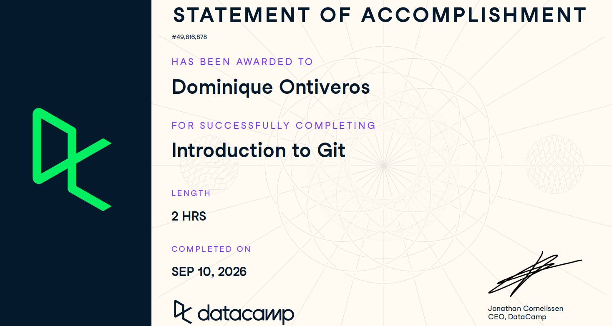
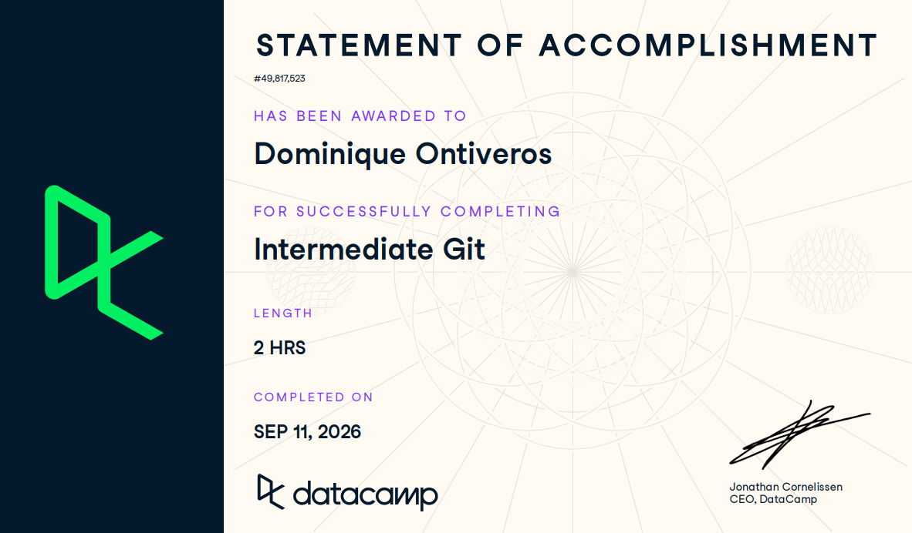

# Certificaciones de Git

Llena este archivo en **tu copia**, dentro de `estudiantes/<tu-login>/github/`.

## Quién soy

- Nombre: Dominique Ont Arriaga
- Usuario de GitHub: Domdimad0m
- Correo con el que entraste a DataCamp: dontive1@itam.mx

## Introduction to Git

Se llena en la **primera** entrega.

Fecha en que lo terminaste: 9/10/2026

## Intermediate Git

Se llena en la **segunda** entrega.

Fecha en que lo terminaste: 9/11/2026

## Una cosa que aprendiste y no sabías

Se llena en la **segunda** entrega, cuando ya hiciste los dos cursos.

Dos o tres líneas. Algo concreto que salió en alguno de los dos cursos y que
no habías visto en clase, o que en clase entendiste a medias y ahí se te
acomodó. Si sientes que no aprendiste nada nuevo, dilo y explica qué parte de
los cursos te pareció repetida.

No había visto los comandos de diff ni sus múltiples funcionalidades así como también la interpretación de los resultados que mandaba la terminal al ejecutar las instrucciones. tampoco el comando de init o git switch o git branch que apenas lo vimos en la última clase pero era nuevo para mi antes de hacer el curso. Algo que había entendido a medias en clase era el uso y la interpretación del remote y porque verificabamos constantemente con git remote -v o porque habían remotes para fetch y push. 

