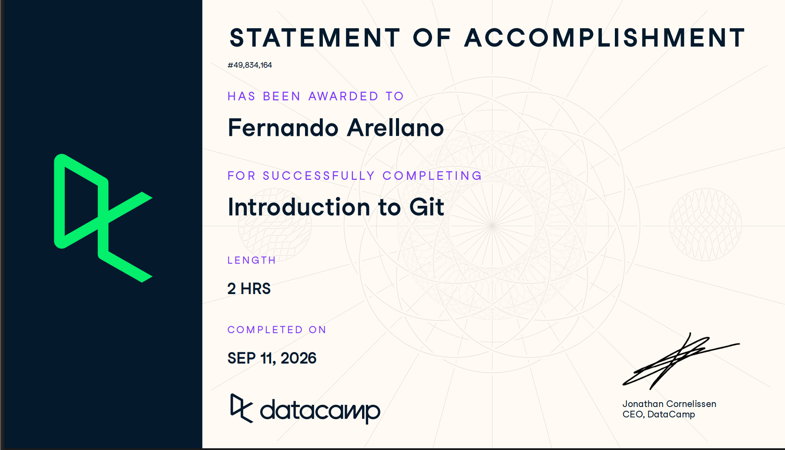
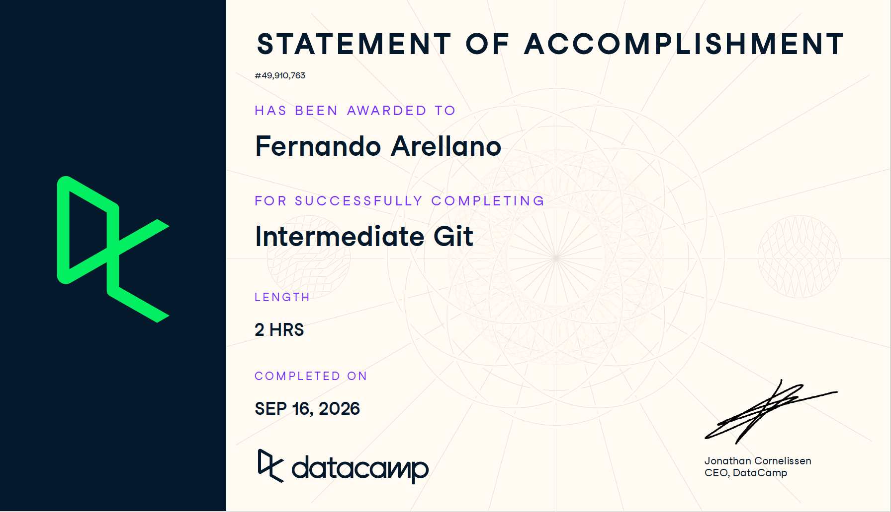

# Certificaciones de Git

Llena este archivo en **tu copia**, dentro de `estudiantes/<tu-login>/github/`.

## Quién soy

- Nombre:Fernando Arellano González
- Usuario de GitHub:FerArGo56
- Correo con el que entraste a DataCamp:farell13@itam.mx

## Introduction to Git

Fecha en que lo terminaste:10 de septiembre de 2026

## Intermediate Git

Fecha en que lo terminaste:

## Una cosa que aprendiste y no sabías
En la introduccion aprendi sobre como ver de manera clara los git status para moverme más rapido sobre git 
Dos o tres líneas. Algo concreto que salió en alguno de los dos cursos y que
no habías visto en clase, o que en clase entendiste a medias y ahí se te
acomodó. Si sientes que no aprendiste nada nuevo, dilo y explica qué parte de
los cursos te pareció repetida.

