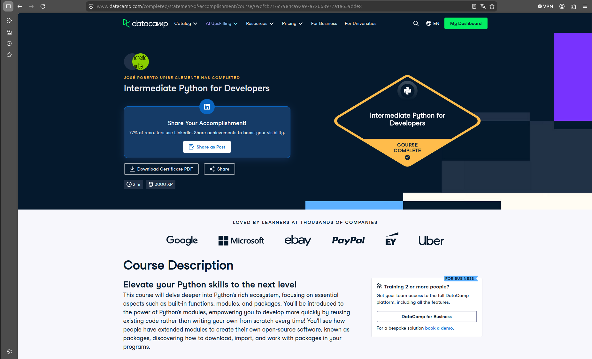

# Certificado: Intermediate Python for Developers

Llena este archivo en **tu copia**, dentro de `estudiantes/<tu-login>/09_python/por_dentro/`.

## Quién soy

- Usuario de GitHub: RobertoUribeClemente
- Usuario de DataCamp: José Roberto

El repositorio es público: no escribas aquí tu nombre completo ni tu correo.

## Intermediate Python for Developers

Fecha en que lo terminaste (AAAA-MM-DD): 2026-10-07

URL del Statement of Accomplishment: https://www.datacamp.com/completed/statement-of-accomplishment/course/09dfcb216c7984ca92a97a72668977a1a659dde8

## Una cosa que aprendiste y no sabías

Dos o tres líneas: algo concreto del curso que no sabías, o que tenías a medias
y ahí se te acomodó.

Una cosa que no sabía que se podía hacer en Python fue hacer definición de funciones tipo def function(inserte_parametro),
esto con el propósito de hacer cualquier tipo de función en Python. Entre más específica sea la declaración, mejor.
