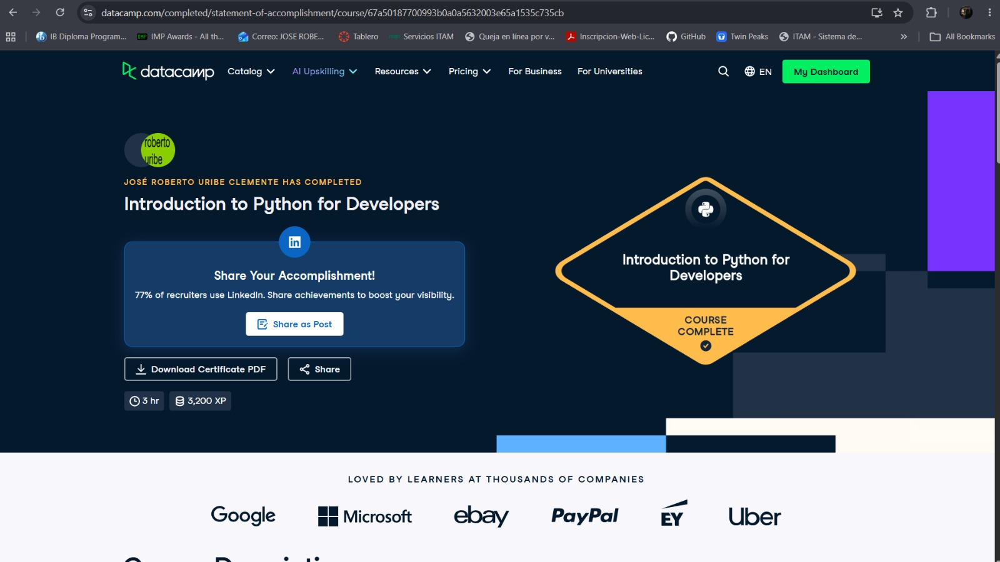

# Certificaciones de Python

Llena este archivo en **tu copia**, dentro de `estudiantes/<tu-login>/python/`.

## Quién soy

- Usuario de GitHub: RobertoUribeClemente
- Usuario de DataCamp: José Roberto

El repositorio es público: no escribas aquí tu nombre completo ni tu correo.

## Introduction to Python for Developers

Fecha en que lo terminaste (AAAA-MM-DD): 2026-10-06

URL del Statement of Accomplishment: https://www.datacamp.com/completed/statement-of-accomplishment/course/67a50187700993b0a0a5632003e65a1535c735cb

## Una cosa que aprendiste y no sabías

Se llena en esta entrega. Dos o tres líneas: algo concreto del curso que no
sabías, o que tenías a medias y ahí se te acomodó.

Algo que no sabía del curso fue hacer el multi-line strings en Python, ya que pensaba que, como en Java, para
hacer eso, habíamos que hacer esto: nombre_del_string = nombre_del_string.append("\ln nueva linea") mientras que
se hacía nombre_del_string += "\ln Nueva linea"

