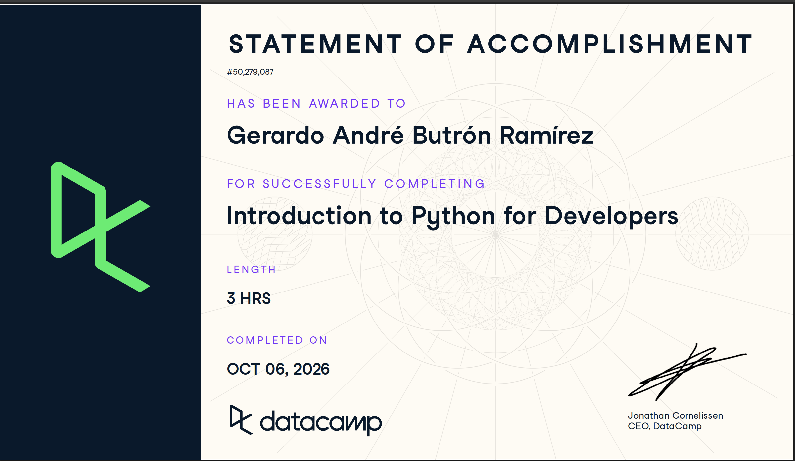

# Certificaciones de Python

## Quién soy

- Usuario de GitHub: butronand-png
- Usuario de DataCamp: sin usuario visible en DataCamp, cuenta del grupo ITAM

## Introduction to Python for Developers

Fecha en que lo terminaste (AAAA-MM-DD): 2026-10-06

URL del Statement of Accomplishment: https://www.datacamp.com/statement-of-accomplishment/course/4bc718de4ea3864f0d605c5af2a28b2339dae5ad

## Una cosa que aprendiste y no sabías

Que un `for` sobre un diccionario recorre sólo las llaves. Para tener llave y valor en cada vuelta se usa `.items()` y se desempaca en dos variables, como en `for ingrediente, cantidad in receta.items()`, en vez de recorrer las llaves y volver a indexar el diccionario.
