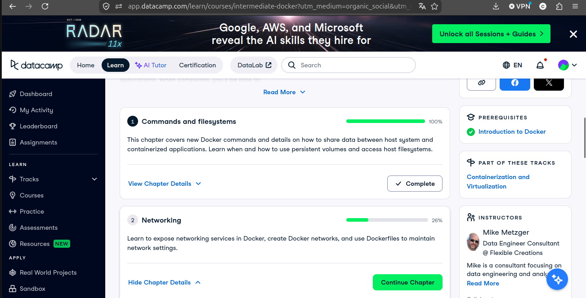
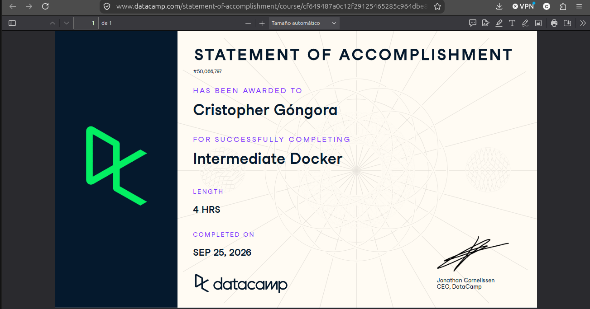

# Certificaciones de Docker

Llena este archivo en **tu copia**, dentro de `estudiantes/<tu-login>/docker/`.

Son **dos** cursos de Docker en DataCamp, no tres. El segundo se entrega en dos
partes, por eso hay tres secciones.

## Quién soy

- Nombre: Cristopher
- Usuario de GitHub: cristoredentor
- Correo con el que entraste a DataCamp: cgongor1@itam.mx

## Introduction to Docker

Se llena en la **primera** entrega.

Fecha en que lo terminaste: 2026-09-22

URL del Statement of Accomplishment: https://www.datacamp.com/statement-of-accomplishment/course/9afec54ff22ef4977152c734c1652502fe2315d3?raw=1

## Intermediate Docker · capítulos 1 y 2

Se llena en la **segunda** entrega. El curso no está terminado todavía, así que
**no hay certificado**: la captura que sirve es la página del curso con sus
cuatro capítulos, donde se vean los dos primeros al 100 % y tu nombre.

Fecha: 2026/09/24

## Intermediate Docker · capítulos 3 y 4

Se llena en la **tercera** entrega, cuando el curso ya está completo.

Fecha: 2026-09-24

URL del Statement of Accomplishment: https://www.datacamp.com/completed/statement-of-accomplishment/course/cf649487a0c12f29125465285c964dbe8c274bfc?utm_medium=organic_social&utm_campaign=sharewidget&utm_content=soa

## Una cosa que aprendiste y no sabías

Se llena en la **tercera** entrega. Dos o tres líneas. Algo concreto de alguno
de los dos cursos que no habías visto en clase, o que en clase entendiste a
medias y ahí se te acomodó.

Me gustó mucho el tema de las redes en Docker y cómo se combinan el multi-stage build con las imágenes multiplataforma (multi-arch). 
El multi-stage build nos permite mantener las imágenes ligeras al separar la etapa de compilación de la etapa final de ejecución,
mientras que el soporte multiplataforma nos permite construir una misma imagen para distintas arquitecturas (por ejemplo, amd64 y arm64),
lo cual es clave si queremos que una aplicación funcione tanto en diferentes tipos de procesador o arquitectura.
Entender estos conceptos es fundamental para el desarrollo de soluciones web escalables y portables, ya que nos obligan a diseñar nuestra
imagen pensando en cómo y dónde se va a ejecutar, no solo en que funcione localmente.
