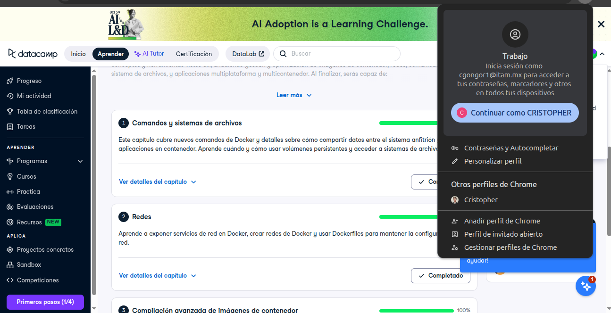
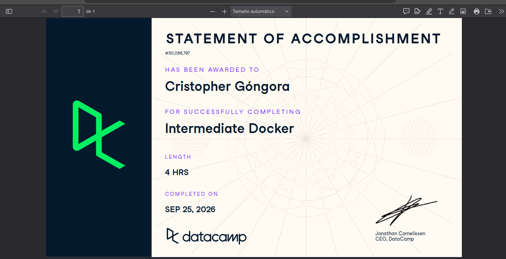

# Certificaciones de Docker

Llena este archivo en **tu copia**, dentro de `estudiantes/<tu-login>/docker/`.

Son **dos** cursos de Docker en DataCamp, no tres. El segundo se entrega en dos
partes, por eso hay tres secciones.

## Quién soy

- Nombre: Cristopher
- Usuario de GitHub: cristoredentor
- Correo con el que entraste a DataCamp: cgongor1@itam.mx

## Introduction to Docker

Se llena en la **primera** entrega.

Fecha en que lo terminaste: 2026-09-22

URL del Statement of Accomplishment: https://www.datacamp.com/statement-of-accomplishment/course/9afec54ff22ef4977152c734c1652502fe2315d3?raw=1

## Intermediate Docker · capítulos 1 y 2

Se llena en la **segunda** entrega. El curso no está terminado todavía, así que
**no hay certificado**: la captura que sirve es la página del curso con sus
cuatro capítulos, donde se vean los dos primeros al 100 % y tu nombre.

Fecha:

## Intermediate Docker · capítulos 3 y 4

Se llena en la **tercera** entrega, cuando el curso ya está completo.

Fecha: 2026-09-25

URL del Statement of Accomplishment: https://www.datacamp.com/statement-of-accomplishment/course/cf649487a0c12f29125465285c964dbe8c274bfc?raw=1

## Una cosa que aprendiste y no sabías

Se llena en la **tercera** entrega. Dos o tres líneas. Algo concreto de alguno
de los dos cursos que no habías visto en clase, o que en clase entendiste a
medias y ahí se te acomodó.

En este curso reforcé conceptos que me habían quedado a medias, como el uso de volúmenes para persistir datos más allá del ciclo de vida de un contenedor.
También entendí cómo funcionan las redes de Docker, que permiten que los contenedores se comuniquen entre sí por nombre de servicio, y cómo Docker Compose
permite definir y levantar varios contenedores (por ejemplo, una base de datos y una aplicación) desde un solo archivo YAML.
