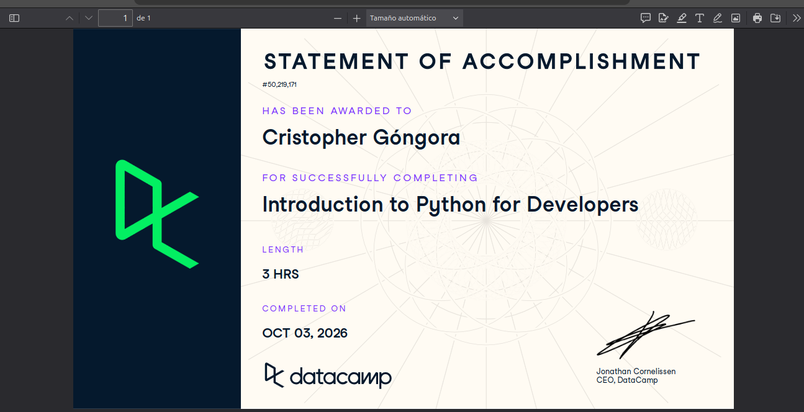

# Certificaciones de Python

Llena este archivo en **tu copia**, dentro de `estudiantes/<tu-login>/python/`.

## Quién soy

- Usuario de GitHub: cristoredentor
- Usuario de DataCamp: cristophergongs

El repositorio es público: no escribas aquí tu nombre completo ni tu correo.

## Introduction to Python for Developers

Fecha en que lo terminaste (2026-10-03)

URL del Statement of Accomplishment: https://www.datacamp.com/completed/statement-of-accomplishment/course/f63e79ef9f4163ecf58414de23dc47522be5cbeb?utm_medium=organic_social&utm_campaign=sharewidget&utm_content=soa

## Una cosa que aprendiste y no sabías

Se llena en esta entrega. Dos o tres líneas: algo concreto del curso que no
sabías, o que tenías a medias y ahí se te acomodó.

De este curso me llevo la manera en la que python te permite recorrer las listas o arreglos y aparte hacer subconjuntos de las mismas.
Con eso me refiero por ejemplo a la capacidad de recorrer la lista de dos en dos o que solo te regrese el último elemento, funciones que 
para hacerlas en otros lenguajes de programación tendrías que hacer tus propios métodos. 
