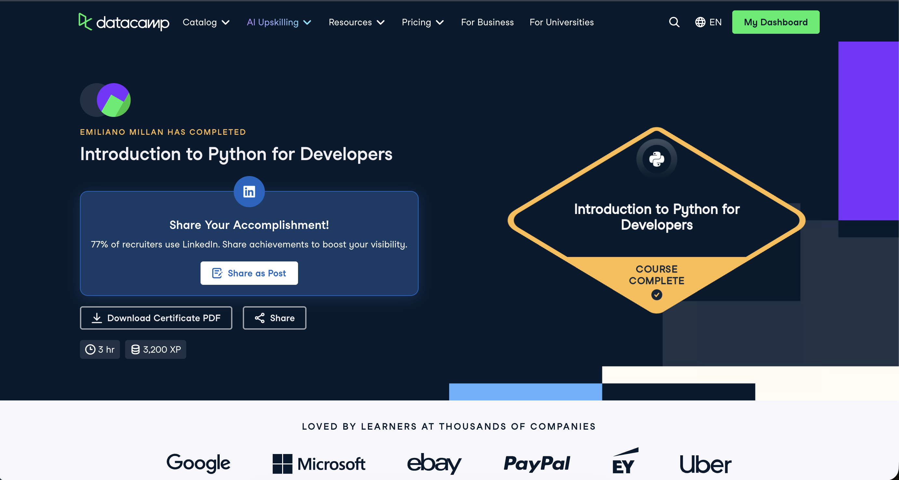

# Certificaciones de Python

Llena este archivo en **tu copia**, dentro de `estudiantes/<tu-login>/python/`.

## Quién soy

- Usuario de GitHub: emilianomillan
- Usuario de DataCamp: Emiliano

El repositorio es público: no escribas aquí tu nombre completo ni tu correo.

## Introduction to Python for Developers

Fecha en que lo terminaste (AAAA-MM-DD): 2026-10-06

URL del Statement of Accomplishment: https://www.datacamp.com/completed/statement-of-accomplishment/course/736c4a8e275fb55eec65fd44a3a26fb59c98610c

## Una cosa que aprendiste y no sabías

Ya había hecho este curso antes y tengo bases sólidas de Java, pero volver a hacerlo me permitió reforzar qué es un conjunto (set). No los usaba comúnmente y todo lo hacía con listas.
