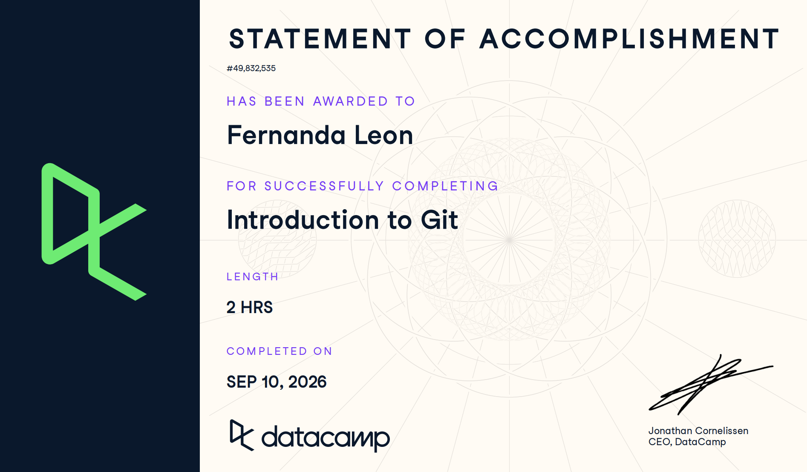

# Certificaciones de Git

Llena este archivo en **tu copia**, dentro de `estudiantes/<tu-login>/github/`.

## Quién soy

- Nombre: María Fernanda León Hernández
- Usuario de GitHub: fernandalh25
- Correo con el que entraste a DataCamp: mleonhe1@itam.mx

## Introduction to Git

Fecha en que lo terminaste: 20 septiembre 2025

## Intermediate Git

Fecha en que lo terminaste:

## Una cosa que aprendiste y no sabías

Dos o tres líneas. Algo concreto que salió en alguno de los dos cursos y que
no habías visto en clase, o que en clase entendiste a medias y ahí se te
acomodó. Si sientes que no aprendiste nada nuevo, dilo y explica qué parte de
los cursos te pareció repetida.

