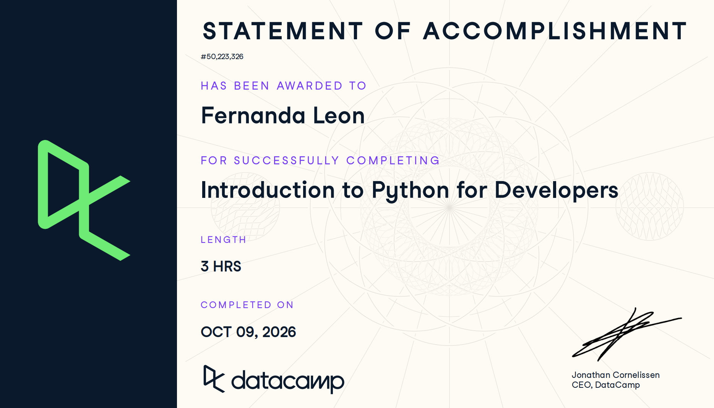

# Certificaciones de Python

Llena este archivo en **tu copia**, dentro de `estudiantes/<tu-login>/python/`.

## Quién soy

- Usuario de GitHub: fernandalh25
- Usuario de DataCamp: Fernanda Leon

El repositorio es público: no escribas aquí tu nombre completo ni tu correo.

## Introduction to Python for Developers

Fecha en que lo terminaste (AAAA-MM-DD): 2026-10-09

URL del Statement of Accomplishment: https://www.datacamp.com/completed/statement-of-accomplishment/course/4b49dedff1f27bbe891ce2506d29230e06d3db00?utm_medium=organic_social&utm_campaign=sharewidget&utm_content=soa

## Una cosa que aprendiste y no sabías

Se llena en esta entrega. Dos o tres líneas: algo concreto del curso que no
sabías, o que tenías a medias y ahí se te acomodó.
Como sólo había programado en Java, el curso me enseñó la sintaxis de los ciclos y como recorrer listas y diccionarios.
