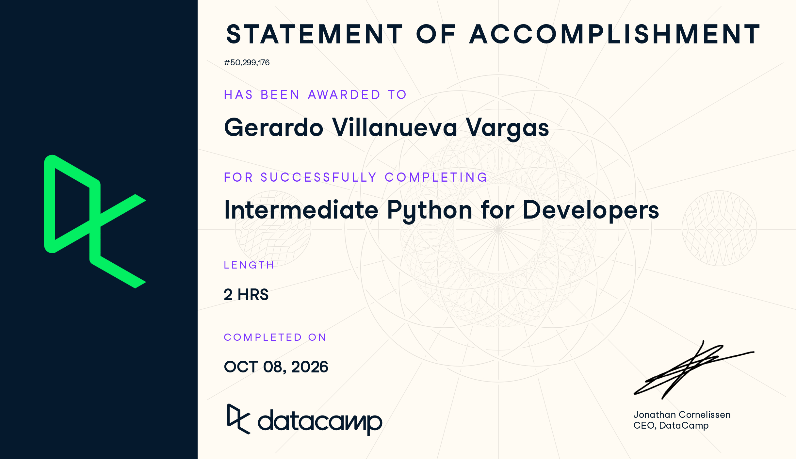

# Certificado: Intermediate Python for Developers

Llena este archivo en **tu copia**, dentro de `estudiantes/<tu-login>/09_python/por_dentro/`.

## Quién soy

- Usuario de GitHub:geraVillV
- Usuario de DataCamp: Gerardo

El repositorio es público: no escribas aquí tu nombre completo ni tu correo.

## Intermediate Python for Developers

Fecha en que lo terminaste (AAAA-MM-DD): 2026-10-08

URL del Statement of Accomplishment: https://www.datacamp.com/completed/statement-of-accomplishment/course/20e91b929f4ab26c7de42ecc7806c25bc6d4a29a

## Una cosa que aprendiste y no sabías

Dos o tres líneas: algo concreto del curso que no sabías, o que tenías a medias
y ahí se te acomodó.
Algo que nunca habia entendido bien desde Razonamiento Algoritmico era lo de lambda, no veia la utilidad de usarla y tampoco entendia su sintaxis, por lo que simplemente no lo usaba. Ahora ya me quedo claro el concepto. Tambien algo que no habia visto en python era lo de TypeError.
