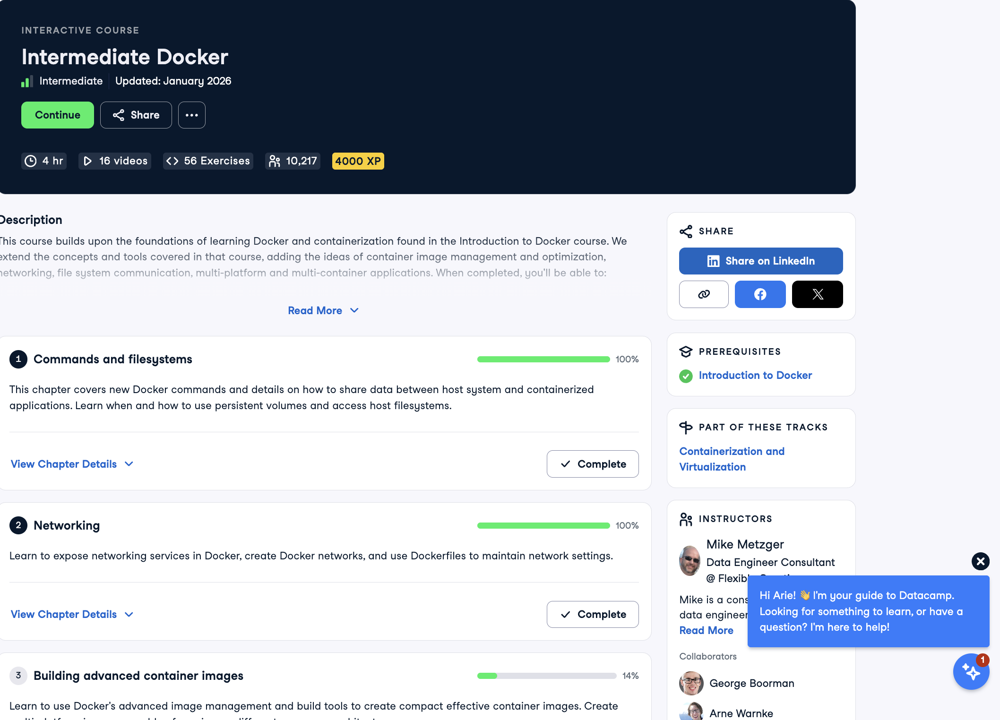

# Certificaciones de Docker

Llena este archivo en **tu copia**, dentro de `estudiantes/<tu-login>/docker/`.

Son **dos** cursos de Docker en DataCamp, no tres. El segundo se entrega en dos
partes, por eso hay tres secciones.

## Quién soy

- Nombre: Arié Goldzweig
- Usuario de GitHub:goldzweigarie-bit
- Correo con el que entraste a DataCamp: agoldzwe@itam.mx

## Introduction to Docker

Se llena en la **primera** entrega.

Fecha en que lo terminaste: 22/09/2026

URL del Statement of Accomplishment: https://www.datacamp.com/statement-of-accomplishment/course/415add39089b7d71d52fb3d900e8845a795a7ffb?raw=1

## Intermediate Docker · capítulos 1 y 2

Se llena en la **segunda** entrega. El curso no está terminado todavía, así que
**no hay certificado**: la captura que sirve es la página del curso con sus
cuatro capítulos, donde se vean los dos primeros al 100 % y tu nombre.

Fecha: 24/10/2026

## Intermediate Docker · capítulos 3 y 4

Se llena en la **tercera** entrega, cuando el curso ya está completo.

Fecha: 29/09/2026

URL del Statement of Accomplishment: https://www.datacamp.com/completed/statement-of-accomplishment/course/aba21b6646ca34450f6a22e09c6c6f2dcf1a154d?utm_medium=organic_social&utm_campaign=sharewidget&utm_content=soa 

## Una cosa que aprendiste y no sabías

Se llena en la **tercera** entrega. Dos o tres líneas. Algo concreto de alguno
de los dos cursos que no habías visto en clase, o que en clase entendiste a
medias y ahí se te acomodó.

Yo aprendí lo que eran las dependencias. Se me hizo muy interesante como se define el orden de los recursos y como esos recursos pueden requerir otros recursos. También aprendí como definir esas dependencias.Por otro lado no sabía que en un dockerfile multi-stage podía usar COPY --from builder para traer solo el binario compilado de una etapa a otra descartando todo el código fuente y las herramientas de compilación, haciendo el tamaño final de la imagen mucha más chica. 
