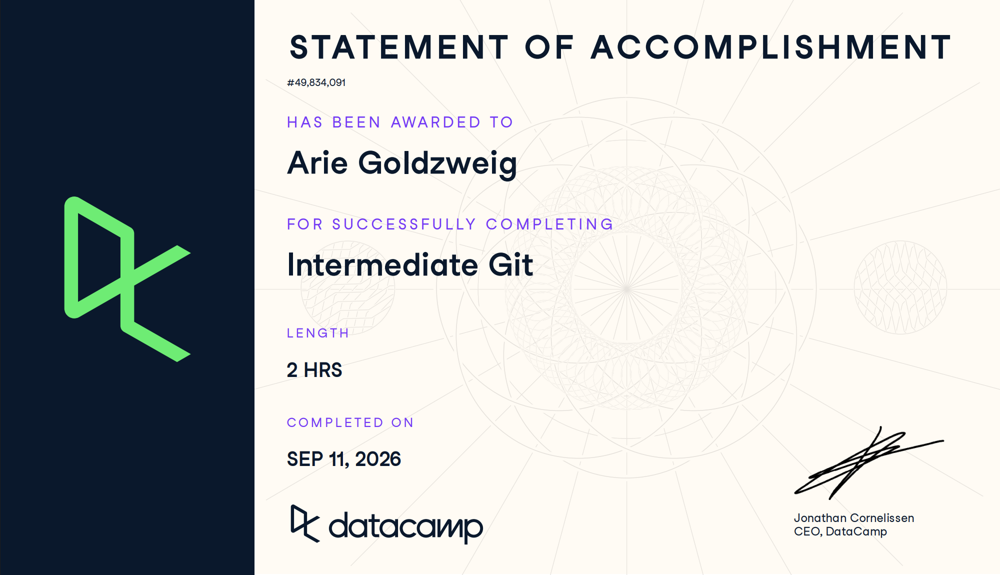

# Certificaciones de Git

Llena este archivo en **tu copia**, dentro de `estudiantes/<tu-login>/github/`.

## Quién soy

- Nombre:Arié Goldzweig
- Usuario de GitHub:goldzweigarie-bit
- Correo con el que entraste a DataCamp: agoldzwe@itam.mx

## Introduction to Git

Se llena en la **primera** entrega.

Fecha en que lo terminaste: 10/09/2026

## Intermediate Git

Se llena en la **segunda** entrega.

Fecha en que lo terminaste: 10/09/2026

## Una cosa que aprendiste y no sabías

Aprendí la diferencia exacta entre git reset y git revert. No sabía que revert es la forma segura de deshacer cambios en ramas compartidas porque crea un nuevo commit, mientras que reset reescribe el historial y puede romper el trabajo de otros si ya se hizo push.
