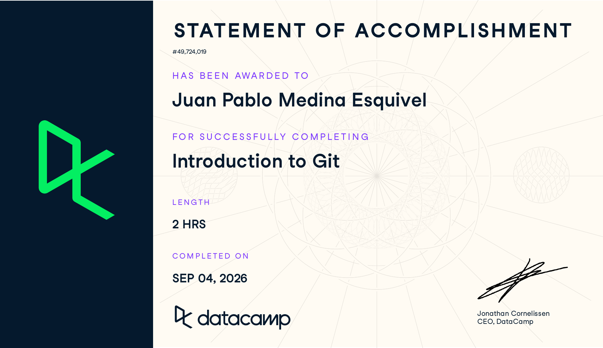

# Certificaciones de Git

Llena este archivo en **tu copia**, dentro de `estudiantes/<tu-login>/github/`.

## Quién soy

- Nombre: Juan Pablo Medina Esquivel
- Usuario de GitHub: jpmedinae
- Correo con el que entraste a DataCamp: jpmedinae@gmail.com

## Introduction to Git

Se llena en la **primera** entrega.

Fecha en que lo terminaste: 05/09/2026

## Intermediate Git

Se llena en la **segunda** entrega.

Fecha en que lo terminaste:

## Una cosa que aprendiste y no sabías

Se llena en la **segunda** entrega, cuando ya hiciste los dos cursos.

Dos o tres líneas. Algo concreto que salió en alguno de los dos cursos y que
no habías visto en clase, o que en clase entendiste a medias y ahí se te
acomodó. Si sientes que no aprendiste nada nuevo, dilo y explica qué parte de
los cursos te pareció repetida.

