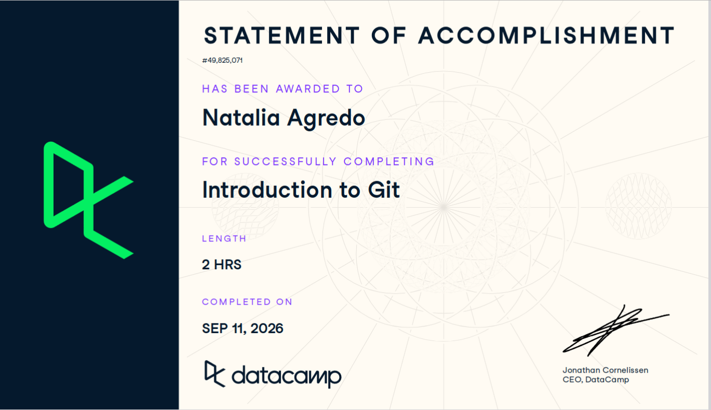
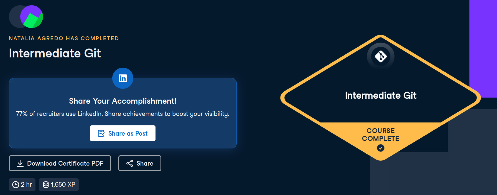

# Certificaciones de Git

Llena este archivo en **tu copia**, dentro de `estudiantes/<tu-login>/github/`.

## Quién soy

- Nombre: Natalia Agredo Lopez
- Usuario de GitHub: nat-aglo
- Correo con el que entraste a DataCamp: natalia.agredo@itam.mx

## Introduction to Git

Se llena en la **primera** entrega.

Fecha en que lo terminaste: 10/septiembre/2026

## Intermediate Git

Se llena en la **segunda** entrega.

Fecha en que lo terminaste: 17/septiembre/2026

## Una cosa que aprendiste y no sabías

Se llena en la **segunda** entrega, cuando ya hiciste los dos cursos.

Dos o tres líneas. Algo concreto que salió en alguno de los dos cursos y que
no habías visto en clase, o que en clase entendiste a medias y ahí se te
acomodó. Si sientes que no aprendiste nada nuevo, dilo y explica qué parte de
los cursos te pareció repetida.

Me ayudo para entender lo que nos aprendimos de memoria, en especifico la sección A (para estar al día)pues no entendía bien 
las llamadas de upstream y origin y las de push y pull. Ejemplos: git fetch upstream dice upstream porque de ahi quieres actualizar tu repo, y
git push origin main por que quieres subir lo nuevo a origin (nuestro repo) desde main.

